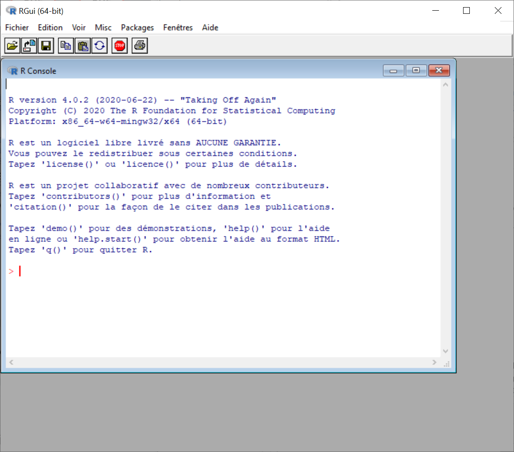
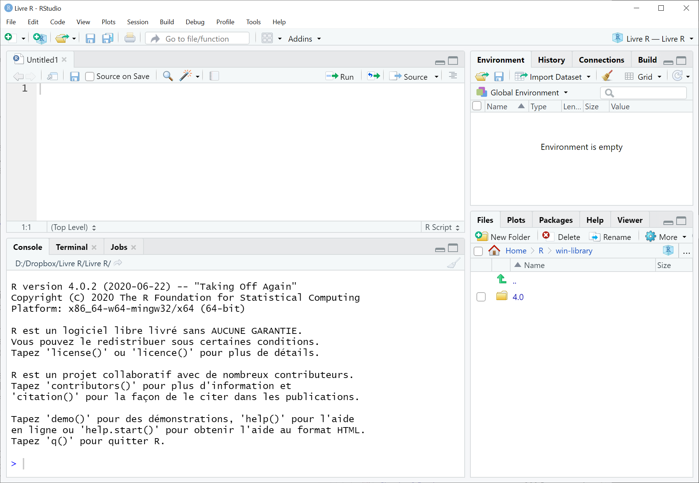

# (PART) Rudiments {-}

# Commencer

Dans cette section, le logiciel **R** sera brièvement décrit ainsi qu'une justification, plus spécifiquement ces avantages, en plus de pointer quelques options complémentaires (**R**Studio) pour son utilisation. Par la suite, les étapes pour installer et commencer avec les logiciels **R** et **R**Studio sont présentées.

## **R**?

**R** [@R-base] est un logiciel de programmation statistique libre-accès et un environnement pour la computation statistique et l'affichage graphique. Il s'agit d'un projet GNU qui est similaire au langage et à l'environnement S, développés aux Laboratoires Bell (anciennement AT\&T, aujourd'hui Lucent Technologies) par John Chambers. Créé par **R**oss Ihaka et **R**obert Gentleman, **R** fournit une grande variété de techniques statistiques (modélisation linéaire et non linéaire, analyses statistiques classiques, analyse de séries chronologiques, classification) et graphiques, et est hautement extensible. 

**R** est un logiciel basé sur la syntaxe plutôt qu'une approche pointer-et-cliquer (*point-and-click*) comme les logiciels traditionnels. Il peut être plus effrayant ou apparaître trop complexe pour un nouvel utilisateur, mais une fois apprivoisée, cette bête démontre un bien meilleur potentiel que ce soit en automatisation, en personnalisation, en production de figure de haute qualité, etc. **R** a l'avantage de mettre en plein contrôle ses utilisateurs. Bref, c'est une créature qu'il vaut la peine de maîtriser.

## Pourquoi **R**?

Les logiciels traditionnelles suspendent trop souvent la réflexion critique. Ils sont dociles. L'usager clique sur les bonnes options et obtient les résultats désirés (espérons-le!). En échange d'une expérience "simple et intuitive", ils compromettent l'épanouissement de l'utilisateur et cloîtrent l'analyse statistique dans une boîte noire, comme un programme dont le fonctionnement ne peut être connu. Sont évacuées toutes connaissances des analyses, seules les entrées et les sorties sont pertinentes.

En se limitant à ces logiciels, les utilisateurs sont également à la merci des compagnies qui les distribuent. Par exemple, elles maintiennent des prix exorbitants pour des licences annuelles, malgré le faible soutien technique, la désuétude ou le manque de mises à jour, la présence de bogues informatiques. Ces problèmes sont monnaie courante bien que la licence ne soit pas de la petite monnaie.

Contrairement aux logiciels traditionnels, **R** permet de réaliser les analyses, mais aussi de les programmer soi-même, de générer des données propres à un modèle, de rester à jour sur les nouvelles tendances et les découvertes en méthodologie de la recherche, de partager aisément les connaissances et la reproduction d'analyses sophistiquées, et tout cela, gratuitement. Évidemment, cela n'est possible que par l'immense communauté derrière le logiciel.

**R** est complètement gratuit. Il est le logiciel le plus utilisé parmi les scientifiques de sciences de données, statisticiens, etc. Il est l'exemple ultime d'une plateforme communautaire qui fait mieux que les compétiteurs commerciaux. De plus en plus de personnes migrent vers **R**, mais peu de ses utilisateurs quittent le logiciel vers un autre. Et plus de personnes se joignent à la communauté, plus il y a de documentation, d'aide, de soutien, que ce soit sous forme de livres, de vidéos, d'article, d'ateliers, de formations. L'expérience **R** devient de plus en plus accessible aux nouveaux immigrants. Comme le code source est ouvert, ses utilisateurs collaborent à la création de modules augmentant ses capacités qui permettent de résoudre des problèmes de plus en plus sophistiqués (et pas juste en statistiques!). Ces modules sont également gratuits et il y en a littéralement des milliers.

L'avantage de maîtriser **R**, plus spécifiquement de l'utilisation de syntaxe, pour l'expérimentateur est de rendre l'analyse statistique facilement *transmissible* entre expérimentateur (facilite grandement la collaboration), *reproductible* (vérification et collaboration), *répétable* (pour de nouvelles données ou expériences), et *ajustable* (pour de nouveaux scénarios). Quelqu'un d'autre peut jeter un coup d'oeil à l'analyse réalisée et voir exactement ce qui s'est produit, tant dans la gestion du jeu de données que l'analyse et la génération de graphiques. L'analyse peut être reproduite par les pairs, voire répéter si des données supplémentaires ont été recueillies ou si une nouvelle expérience a été réalisée.

Même si **R** est un langage de programmation et que cela peut en intimider plus d'un, il est relativement intuitif à apprendre et assez simple d'utilisation dans la mesure où les ressources appropriées pour apprendre sont accessibles à l'utilisateur. L'apprentissage de la programmation, même si ce n'est pas en **R**, permet de mieux comprendre le fonctionnement des ordinateurs en plus de reconsidérer le dogmatisme de tout-puissant "algorithmes". Il permettra aussi à l'utilisateur lorsqu'il saura suffisamment maîtriser la bête à créer lui-même la syntaxe qu'il lui permettra de résoudre les problèmes sur lesquels il s'intéresse.

Enfin, **R** possède un incroyable moteur pour la visualisation de données et de capacités graphiques. Aucun autre logiciel ne lui arrive à la cheville.

## Installer **R**
**R** est compatible pour Windows, Mac et Linux. Pour télécharger le logiciel, il faut se rendre sur le site <http://www.r-project.org> et sélectionner les hyperliens "download R" ou "CRAN mirror". Il faut ensuite choisir un *mirror* de son pays d'origine. Par la suite, la page permet de choisir la version appropriée à son système d'exploitation. Il faut alors suivre les indications.

Il est principalement utilisé en anglais bien qu'on peut le définir en français. La plupart de l'aide sera également en anglais surtout celle pour les analyses avancées. Toutefois, il y a beaucoup de ressources accessibles en ligne en français en ce qui a attrait à l'initiation à **R**.

### **R**Studio
Bien que **R** puisse être utilisé seul, son aspect rudimentaire pourra en inquiéter plus d'un. Le logiciel **R**Studio permet une utilisation plus fluide et intuitive pour les usagers ayant peu ou pas d'expériences en programmation. **R**Studio est un environnement de développement intégré (IDE pour *integrated development environment*) pour R. Il comprend une console, un éditeur de mise en évidence de la syntaxe qui prend en charge l'exécution directe du code, ainsi que des outils de traçage, d'historique, de débogage et de gestion de l'espace de travail. Le logiciel est gratuit et libre-accès pour une utilisation personnelle. Il comporte aussi une version commerciale qui nécessite un certain déboursement de fonds.

Pour télécharger le logiciel, il faut se rendre sur le site <http:rstudio.com> et naviguez jusqu'au téléchargement du logiciel, ou aller spécifiquement sur <https://www.rstudio.com/products/rstudio/download/#download>, où il sera possible de télécharger la version gratuite de **R**Studio. **R**Studio est uniquement disponible en anglais.


#### Les avantages de **R**Studio

L'avantage de **R**Studio, comparativement à l'utilisation de **R**, est d'offrir une gestion de la console, du script, de l'environnement des variables et des documents externes en une seule interface (et beaucoup d'autres avantages!). En plus de la console (ce que **R** fournit), **R**Studio permet l'édition de syntaxe qui pourra être commandée ligne par ligne en utilisant **CTRL + Enter** (Windows) ou **CMD + Enter** (MacOS), ce qui pourra s'avérer fort utile lors de la programmation de fonction ou d'analyses de données. **R**Studio affiche également les variables en mémoire dans le menu *Global Environment*, ce qui permet de suivre l'état de la programmation. Enfin, **R**Studio affiche dans un quatrième menu les fichiers dans le directoire des fichiers **R** ce qui permet de voir notamment les jeux de données, mais aussi d'autres fonctions ou scripts. C'est également à cet endroit où l'aide (*help*) sera fournie et les figures (*plot*) affichées.

Tout le contenu du présent ouvrage pourra être réalisé avec **R** ou avec **R**Studio, toutefois l'usage de ce dernier sera plus agréable aux lecteurs.

Oh! Une autre avantage de **R**studio est qu'il peut être utiliser comme un éditeur de texte. D'ailleurs, cet ouvrage est complètement rédigé avec **R**Studio (avec les packages `Rmarkdown` et `bookdown`).

### Autres options

Il existe plusieurs interfaces utilisateurs graphiques (GUI pour *Graphical User Interface*) pour **R** comme *R Commander* (certainement l'option la plus connue en sciences humaines et sociales) ou *JASP*, mais aussi plusieurs autres. Ces deux options sont gratuites et libre-accès. Il existe aussi d'autres options payantes. Ces logiciels visent l'utilisation de **R** par une approche pointer-et-cliquer (*point-and-click*) au travers les analyses plutôt que de recourir à la syntaxe. Ces options plus intuitives pour l'utilisateur sans expérience en programmation auront parfois des effets limitatifs pour des analyses plus avancées et ont comme effet indésirable de promouvoir la boîte noire statistique.

## Démarrer **R** ou **R**Studio

À l'ouverture de **R**, illustrée à la Figure \@ref(fig:ConsoleR), le logiciel présente la console, une interface très rudimentaire (et assez déstabilisante pour un logiciel pourtant si promu). Une fois le logiciel ouvert, l'application offre une invitation discrète à écrire des commandes. Le symbole `>` au bas de la console est une invite (*prompt*) indiquant où taper les commandes. C'est à cette ligne de commande que les expressions seront immédiatement évaluées.

```{r ConsoleR, fig.cap="Ouverture (effrayante!) de la console R",echo=FALSE, out.width="75%", fig.align="center"}

```

À titre d'exemple, la console peut être utilisée comme une calculatrice glorifiée.

```{r}
2 + 2
```

Plusieurs nouveaux utilisateurs se limitent à ouvrir **R** y faire quelques calculs, puis le referme et ne l'ouvre plus jamais. Ce livre tentera d'emmener le lecteur un peu plus loin.

Dans la Figure \@ref(fig:ConsoleR), **R** est défini en français. Cela n'a pour effet que de modifier le menu déroulant ("Fichier, Edition, etc.") au sommet du logiciel et les différentes options de ce menu. Le fonctionnement reste le même (les fonctions ne sont pas traduites, par exemple).

La console **R** n'étant pas un éditeur de texte, il faudra enregistrer la syntaxe utilisée lors d'une séance pour la conserver. Le logiciel offre une option d'écriture de script intégré, mais n'est pas lié directement à la console. Il faudra donc se résoudre à abuser du copier-coller ou à sourcer le script (tâche plus ardue pour les nouveaux utilisateurs). Plusieurs éditeurs de texte sont utiles ou même construits pour directement travailler avec **R**, le plus connu étant certainement **R**Studio, déjà mentionné. L'environnement intégré sera beaucoup plus fonctionnel.

La Figure \@ref(fig:ConsoleRStudio), montre l'interface de **R**Studio, déjà un peu moins intimidante que celle de **R**. À l'ouverture de **R**Studio, quatre types de fenêtres sont disponibles : la console (cadran inférieur gauche), les scripts (cadran supérieur gauche), l'environnement (cadran supérieur droit) et l'affichage (cadran inférieur droit). L'emplacement de ces cadrans peut être modifié selon les désirs de l'utilisateur.  

```{r ConsoleRStudio, fig.cap="Ouverture (moins effrayante) de **R**Studio",echo=FALSE, out.width="75%", fig.align="center"}

```

La console **R**Studio est identique à la console usuelle retrouvée avec **R**. Elle sert les mêmes fonctions.

Le script est un éditeur de texte dans lequel de la syntaxe sera rédigée, sauvegardée, manipulée, et tester. S'il n'est pas ouvert ou s'il faut ouvrir un script supplémentaire, il faut procéder par le menu déroulant *File > New File > R Script* ou bien **CTRL** + **Shift** + **N**. Il peut y avoir plusieurs scripts ouverts simultanément.

L'environnement global permet de connaître les variables et fonctions maison en mémoire vive. L'onglet *History* montre les dernières lignes de code commandées (non affichées dans la figure - il suffit de cliquer sur l'onglet à côté de *Environment*). 

Le cadran inférieur droit montre le fichier de travail **R** qui contiendra ordinairement les fichiers de travail actifs (scripts, jeu de données, fonctions maison, etc.). C'est très utile pour travailler par projet. Si aucun directoire n'est demandé explicitement par **R** (par exemple, si un jeu de donnée doit être téléchargé), le logiciel cherchera par défaut dans le fichier actif pour télécharger les fichiers demandés. Il est une bonne pratique que de s'assurer d'être dans le bon fichier, car cela pourra causer quelques soucis à l'occasion.

## Les scripts

Ce qu'il importe le plus avec **R**, et ce qui fait resplendir **R**Studio, est de conserver la syntaxe d'une session à l'autre. Le logiciel ne le fait pas très bien. Il faudra sauvegarder dans un script les expressions et le code utilisés. Ces fichiers ont souvent comme extension ".R" et permettront de conserver, voire partager la syntaxe. Il sera possible d'y ajouter des commentaires pour de futures utilisations. Tout éditeur de texte peut permettre la sauvegarde de syntaxe, certains seront mieux que d'autres pour l'utilisation avec **R**. 

**R**Studio contient déjà un panneau contenant un script qu'il sera possible de sauvegarder et de rouler directement dans la console. Ce dernier est directement lié et il est possible de rouler la syntaxe ligne par ligne avec  **CTRL** + **Enter** (Windows) ou **CMD** + **Enter** (MacOS).
