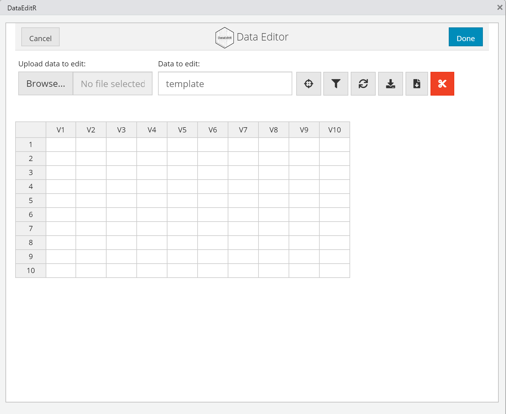

# (PART) Importation, gestion et visualisation de jeux de données {-}

<!-- # Introduction {#gestions-intro .unnumbered} -->

<!-- Réaliser des analyses statistiques et des représentations graphiques nécessite un jeu de données sur lequel travailler. Après l'ouverture de **R**, l'usager remarquera aisément que le logiciel n'est pas un tableur (tableau de données), c'est caractéristique là peut-être même frappé à la première ouverture!) comme d'autres logiciels bien connus. Il faudra donc conserver des données dans un fichier externe de la même façon qu'un script, à l'exception qu'il faudra importer les données pour son utilisation. -->

<!-- Dans cette section, la création, le téléchargement et la sauvegarde de jeux de données seront abordés. Ensuite, les manipulations rudimentaires d'un jeu de données seront expliquées. -->

# Gestion rudimentaire des jeux de données

Réaliser des analyses statistiques et des représentations graphiques nécessitent un jeu de données sur lequel travailler. Après l'ouverture de **R**, l'usager remarquera aisément que le logiciel n'est pas un tableur (tableau de données), contrairement aux logiciels traditionnels. Cette caractéristique l'a peut-être même frappé à la première ouverture! Pour utiliser données, il faudra les conserver dans un fichier externe de la même façon qu'un script, à l'exception qu'il faudra importer les données pour son utilisation.

Un jeu de données porte généralement les extensions ".Rdata", lorsqu'elles proviennent de **R**, ou d'extensions ".dat" et ".txt". Évidemment, **R** permet une grande flexibilité, il est ainsi possible d'exporter et d'importer dans d'autres extensions.

Les extensions ".Rdata" sont des environnements **R**, elles contiennent potentiellement plusieurs variables, comme une séance de travail complète. Elles ont aussi l'avantage que, si l'utilisateur double-clique sur un fichier d'extension ".Rdata", celui-ci s'ouvre automatiquement dans l'environnement **R**.

Il est recommandé de ne jamais manipuler les fichiers de données une fois toutes les vérifications réalisées (absence d'erreur dans les données). Il ne sera jamais nécessaire de modifier ces fichiers avec **R**. Contrairement aux logiciels traditionnels dans lesquels les modifications sont apportées directement aux valeurs ou ajoutées aux fichiers, cela n'est pas nécessaire dans la mesure où les syntaxes décrivant ces manipulations sont conservées. Il devient impossible d'endommager, de corrompre ou d'altérer le fichier de données. Les données originales restent intactes. Il suffit de les importer puis de commander la syntaxe qui lui est associée pour obtenir de nouveau la version *propre* du jeu de données.


## Quelques conseils de gestion

Voici quelques conseils pour la gestion le jeu de données.

* Éviter les noms trop longs ou trop courts et dépourvus de signification. Cela augmente le risque d'erreur. L'utilisation de huit caractères ou moins est une bonne recommandation (quoique ce n'est pas une règle!). Pour conserver plus de renseignements, utiliser les commentaires de la syntaxe.

* Éviter les espaces entre les mots. Cela peut être interprété erronément comme deux éléments. À la place, collez les mots et distinguer-les avec des majuscules (MaFonction), utiliser le tiret bas (ma_fonction) ou un point (ma.fonction).

* Éviter les espaces ou les vides dans les données. Cela peut être interprété comme des données (absentes) ou non.

* Éviter les symboles suivants `?, $, %, ^, &, *, (, ), -, #, ?, , , <, >, /, |, \, [, ], {` et `}` qui peuvent erronément être interprétés comme de la syntaxe autant dans les noms de variables que dans les données.

* Vérifier que les valeurs manquantes sont identifiées `NA`.

* Si les données proviennent d'un autre logiciel, vérifier la présence de  commentaires qui pourraient occasionner des lignes ou colonnes supplémentaires et ainsi corrompre le jeu de données.

* Vérifier que l'exportation et l'importation se sont bien déroulées.

## Voir la base de données

Il est possible de voir les données en utilisant la fonction `View()` et en y insérant le nom de la variable. Le logiciel afficher un tableur avec les données, dont il sera impossible de modifier les valeurs. Cela peut être utile pour s'assurer que le jeu de données est en ordre, bien importé, ou le consulter.

## Sauvegarder un jeu de données

Si un jeu de données est directement créé avec **R**, par exemple, les jeux de données artificiels, il est possible de les sauvegarder avec la fonction `save()` qui enregistre une variable dans un fichier.

```{r, eval=FALSE}
save("variable", file = "fichier.Rdata")
```

Il est possible à la fin d'une session de travail de sauvegarder l'environnement dans un fichier `save.image()`. Ainsi, toutes les variables et fonctions maison sont conservées pour une future utilisation.

```{r, eval = FALSE}
save.image(file = "SessionTravail.Rdata")
```

## Jeux de données provenant de **R** et de packages

Plusieurs packages offrent en plus des fonctions des jeux de données. Mieux encore! **R** offre des jeux de données inclus avec le logiciel. La fonction `data()` permet de voir la liste des jeux de données disponibles. Taper simplement le nom du jeu de données permet de l'utiliser, comme s'il avait été déclaré auparavant.

```{r}
head(cars)
```
La fonction `head()` introduite ici donne simplement un aperçu des six premières lignes du jeu de données pour ne pas afficher le jeu de données complet (ce qui prendrait beaucoup d'espace inutilement.

Pour consulter tous les jeux de données des packages importés, il est possible d'utiliser cette ligne de code.
```{r}
data(package = .packages((all.available = TRUE)))
```
Pour utiliser ces jeux, il faut rendre actif le package associé avec la fonction `library()`.

## Création des jeux de données artificielles

Une façon rudimentaire et efficace d'obtenir des données avec **R** est de les créer à l'aide des fonctions génératrices de données pseudoaléatoires.

```{r , eval= FALSE}
# Pour la reproductibilité
set.seed(142)
# Nombre d'unité
n <- 30
# Identifiant
id <- 1:n

# Variables
sexe <- rbinom(n, size = 1, prob = .5)
QI <-  round(rnorm(30, mean = 100, sd = 15) - 5 * sexe)
# Être "1" soustrait  5 points au QI en moyenne
# Arrondi avec round()

# Création de le jeu de donnees
donnees <-  data.frame(id = id, sexe = sexe, QI = QI)
# Enregistrement
save(donnees, file = "donnees.Rdata")
```

Et voilà un jeu de données simple et sauvegardé dans le dossier de travail auquel il sera possible de se référer.

Ici, deux nouvelles fonctions sont employées : `round()` arrondie les valeurs à l'unité et `data.frame()` crée un le jeu de données. L'utilisation des `=` permet de directement nommer les variables.

### Jeux de données provenant de IBM SPSS

Il est possible d'importer des données de IBM SPSS vers **R**. il faudra quelques manipulations préalables. En ayant le fichier de données IBM SPSS ouvert, il faut cliquer sur "Enregistrer sous" sous le menu déroulant "Fichier". Par défaut, IBM SPSS choisira toutes les variables, mais il est possible de sélectionner seulement les variables d'intérêt en décochant les variables qu'il n'est pas nécessaire de conserver. Ensuite, sélectionner le type de fichier de sauvegarde doit être "Tabulé (*.dat)". IBM SPSS offre également la possibilité d'enregistrer les noms de variables (première option à cocher) et les libellés de valeur. Il suffit maintenant de nommer le fichier et de cliquer sur l'onglet "Enregister".

En s'assurant que nouveau fichier se trouve dans le répertoire actif de **R**, il suffit de télécharger le fichier.
```{r, eval=FALSE}
read.table(file = "donnees.tab", header = TRUE)
```
L'option `header` devrait être `FALSE` si les noms de variables n'ont pas été conservés (première ligne du fichier) .

### Jeux de données provenant de Microsoft Excel

Fichier sous le menu déroulant. Sélectionner comme type de fichier "Texte Unicode (*.txt)". Intituler le fichier, puis cliquer sur "Enregister".

Microsoft Excel sauvegardera l'entièreté de la page active. Il est donc pertinent de créer une feuille Microsoft Excel contenant que les informations à conserver.

Par la suite, en s'assurant que nouveau fichier se trouve dans le répertoire actif de **R**, il suffit de télécharger le fichier avec `read.table()` et les arguments convenant au jeu de données.

### Importation de jeux de données avec **R**Studio.

**R**Studio offre une interface simple pour télécharger directement un jeu de de données IBM SPSS, Microsoft Excel, SAS, STATA, et des extensions ".txt" et ".readr". Il y a même un outil de visualisation pour s'assurer que le tout est en ordre.

> File

> Import dataset

> From "format de fichier"

où "format de fichier" remplace Text, SPSS, Excel et les autres. En indiquant le chemin du fichier, **R** importera le fichier et fournira une syntaxe afin de conserver l'importation pour de futurs usages.


## Manipulation de données

Les tableaux ont généralement deux dimensions (lignes par colonnes). Différents éléments ou groupes d'éléments peuvent être extraits des jeux de données. Plusieurs méthodes peuvent être utiliser en fonction des besoins. Le jeu de données `cars` sera utilisé à des fins illustratives.

```{r}
head(cars)
```

Elle contient 50 unités d'observation (lignes) et deux variables (colonnes), soit la vitesse (*speed*) et la distance (*dist*).

### Référer à une variable dans un jeu de données

Il est possible de référer à une variable soit en utilisant l'emplacement de la variable par rapport aux autres en utilisant les crochets ou en utilisant le signe `$` puis le nom de la variable après le libellé de le jeu de données. L'opération est fort simple avec le symbole `$`.
```{r}
# Avec $
head(cars$dist)
```

Précédemment utilisés pour extraire des valeurs dans une variable unidimensionnelle, les `[]` peuvent extraire des données sur un tableau en deux dimensions (ligne par colonne). Il faut spécifier la ou les lignes désirées, puis la ou les colonnes désirées entre crochets. Laissez une des dimensions en blanc (vide) indique au logiciel de rapporter toutes les valeurs. Par exemple, pour obtenir le même résultat, `dist` est la deuxième colonne. Il faut référer entre crochets à la colonne $2$ et comme toutes les lignes sont désirées, cette dimension reste vide.

```{r}
# Entre crochets
head(cars[,2])
```

Il est possible de faire la même chose avec les lignes.

```{r}
# Entre crochets
cars[4,]
```
Ici, toutes les variables de la 4^e^ unité sont rapportée. Remarquer bien l'absence d'argument après la virgule. La fonction `head` n'est pas nécessaire ici, car il y a peu d'informations à extraire.

Si certaines valeurs spécifiques étaient désirées, comme la valeur de la 4^e^ unité pour la 2^e^ variable.

```{r}
# Entre crochets
cars[4, 2]
```

Enfin, à l'intérieur d'un jeu de données, les variables peuvent être commandées avec le signe de `$` placé après le nom de la variable suivi du nom de la variable ou encore en identifiant les noms de variables entre crochets.

```{r}
# Utilisation du signe $
head(cars$speed)

# Nommer entre crochets
head(cars["speed"])
```


### Référer à un sous-ensemble d'unité.

Pour référer à des unités ayant certaines caractéristiques, la fonction `subset()` peut s'avérer utile. Les arguments sont un jeu de données, le deuxième est un opérateur logique en lien avec une variable du jeu de données.

```{r}
# Extraire les données pour toutes les unités ayant une vitesse égale à 24
subset(cars, speed == 24)
```
Cette fonction est utile s'il faut extraire les données d'un certain sexe, par exemple.

#### Nommer des variables dans un jeu de données

Il est possible d'attribuer ou de modifier des noms à des colonnes ou des lignes d'un tableau de données. Les fonctions `colnames()` et `rownames()` seront alors utilisées. Contrairement aux autres fonctions, celles-ci se retrouvent à gauche de l'équation.

```{r}
colnames(cars) <-  c("vitesse", "distance")
head(cars)
```
Il importe de fournir autant de noms qu'il y a de colonnes (ou lignes), et ce, en chaîne de caractères.

### Données manquantes

Les devis de recherche et les jeux de données empiriques sont rarement parfaits et peuvent souvent contenir des données manquantes. **R** reconnaît les données manquantes lorsqu'elles sont identifiées comme `NA` (*not available*). Plusieurs méthodes permettent de gérer les données manquantes. La méthode la plus simple est d'éliminer les unités ayant une donnée manquante, soit la suppression par liste (*listwise suppression*). Les fonctions natives de **R** recourront à l'argument `na.rm = TRUE`. Si cela est impossible, la fonction `na.omit()` permettra de créer des jeux de données sans les valeurs manquantes.

```{r}
valeurs <-  c(10, 12, 14, NA, 18)
# La présence de NA empêche la moyenne d'être calculée
mean(valeurs)
# L'argument "na.rm = TRUE" gère les NA
mean(valeurs, na.rm = TRUE)
# na.omit omet les valeurs NA dans la nouvelle variable.
valeurs.nettoyees <-  na.omit(valeurs)
mean(valeurs.nettoyees)
```


## Entrée de données

S'il y a bien une caractéristique de **R** qui rebute les nouveaux utilisateurs, c'est certainement que le logiciel ne soit pas prévu pour la saisie de données ou du moins que cela ne soit pas mis à l'avant-plan. Lorsque le logiciel s'ouvre, que ce soit **R** ou **R**Studio, l'aspect *table de données* n'existe pas. L'utilisateur pour qui il s'agit de sa première utilisation (et habitué à des logiciels traditionnels) reste pantois : où les données sont-elles entrées?
  
### Entrée de données avec `data.entry()` (R de base)

De base, **R** offre la possibilité d'entrer des données dans un tableur avec la commande `jd = data.entry()`. Si une base de données est demandée comme argument (p. ex., `data.entry(data = jd)`), alors le jeu de données est ouvert. Il est aussi possible d'ouvrir le fichier avec des variables déjà créées avec **R**. Si un tableur vierge est désiré, alors taper `data.entry(1)` dans la console ouvrira le tableur avec une seule valeur (`1`), L'utilisateur peut alors modifier les noms de colonnes et entrer les données comme il le ferait avec un logiciel traditionnel. Comme il est possible de le voir à la Figure \@ref(fig:dataentry), l'interface est bien moins attrayante que ses compétiteurs.

```{r dataentry, fig.cap="Ouverture du tableur R",echo=FALSE, out.width="75%", fig.align="center"}
knitr::include_graphics("image//data_entry.PNG")
```

Lorsque l'entrée de données est terminée, l'utilisateur doit sauvegarder le jeu de données ou l'environnement de travail qui pourront être importés pour de futures utilisations ou entrées. En général, l'utilisateur qui entre manuellement ces données préférera certainement un autre tableur, mais **R** est certainement en mesure de faire ce travail. 

### Entrée de données avec `data_edit` (package `DataEditR`)

Depuis tout récemment (juillet 2021), il existe un package qui permet de faire l'entrée de données en tableur avec **R**. Il s'agit du package `DataEditR` [@DataEditR], une interface utilisateur graphique. Il résout l'un de plus grands défis lorsqu'un utilisateur migre des tableurs traditionnels vers **R**, c'est-à-dire d'accomplir la transition d'une feuille de calcul interactive où il est possible de pointer et cliquer pour modifier, ajouter, supprimer des donnes vers un mode strict de syntaxe.

Pour démarrer, il faut d'abord installer le package, puis l'appeler. Pour commencer à entrer des données, la syntaxe `data_edit()` est suffisante. Pour ouvrir un jeu de données, il suffit de l'ajouter en argument `data_edit(jd)`.

Une fois l'interface ouvert, il est possible de manipuler le jeu de données avec les options affichés et avec le clic droit qui permettra notamment d'ajouter des lignes et des colonnes.

```{r, eval = FALSE, warning=FALSE}
# Pour installer le package
install.packages("DataEditR")

# Pour rendre la package accessible
library("DataEditR")

# La fonction
data_edit()
```

Il est recommandé de ne laisser que les données brutes, toutes les modifications et manipulations devraient rester en syntaxe **R** dans un script associé au jeu de données. Lorsque les entrées sont terminées, il faut simplement sauvegarder la base de données, préférablement en extension .csv. Il est aussi possible de sortir le tableur en tableau de données en assignant la fonction à une variable comme `jd = data_edit()`.

```{r editr, fig.cap="Ouverture du tableur de DataEditR", echo=FALSE, out.width="75%", fig.align="center"}

```

En général, l'utilisateur importera ces données dans l'environnement **R**. Il devra même le faire avec `data_edit()` à chaque ouverture d'un nouvelle séance, pour poursuivre l'entrée ou réaliser des manipulations.

# Importation de jeux de données

Dans la plupart des situations, les analyses et les graphiques seront réalisés à partir d'un jeu de données se trouvant dans un fichier. Ce devra être importé en **R** pour être manipulé. Les jeux de données peuvent se trouver dans un fichier dans l'ordinateur, mais aussi sur le web. Ils peuvent être en différents types de format.

Dans le premier chapitre, une méthode est présentée pour importer des données. Lorsqu'il provenait d'un logiciel comme IBM SPSS ou Excel, l'accent était mis sur l'exportation de ces données dans un certain format, puis l'importation avec **R**. Il n'est pas toujours nécessaire d'exporter ces données, puisque le logiciel à l'aide des fonctions de base ou de packages peut lire des fichiers d'une multitude d'extensions. 

Pour la description de l'importation, l'ouvrage tient pour acquis que le fichier de données se retrouve dans le directoire de travail (ce qui est l'idéal en général). Un peu plus loin, la création de trajectoires pour différents emplacements sera présentée.

Les fonctions de base permettront d'importer la plupart des jeux de données, particulièrement s'ils ont été exportés dans un format compatible. Pour le cas où ces fichiers ne pourraient être exportés de cette façon, des packages pallieront ce besoin. Dans cet ouvrage, seule une présentation sommaire de ces options sera discutée, l'utilisateur est recommandé à la documentation de ces packages pour plus d'informations.

La prochaine section décrit les fonctions pour importer les bases de données "manuellement". En plus de ces méthodes, **R**Studio possède une interface permettant l'importation des données.

## La fonction de base

La fonction de base `read.table()` permettra d'importer la plupart des jeux de données. C'est d'ailleurs ce qui a été présenté sommairement dans le chapitre sur les rudiments. Parfois, ceux-ci ont certaines caractéristiques qu'il faudra préciser comme argument à la fonction `read.table()` pour assurer une importation adéquate. Ces caractéristiques sont `header = FALSE`, `sep = ""`, et `fill = !blank.lines.skip` (les éléments à droite sont les options par défaut).

Parfois, certains fichiers sauvegardent le nom des variables en tête de colonne (première ligne). Par défaut, **R** assume qu'il s'agit de valeurs. L'argument `header = TRUE` ajouté à `read.table()` précisera à **R** lors de l'important que ces libellés sont des noms de colonnes. 

Si un autre symbole est utilisé pour délimiter (séparer) des valeurs dans le fichier, comme `;`ou `,`, l'argument `sep = ";"` ou `sep = ","` précisera le séparateur. 

Si les lignes du fichier sont de tailles inégales, **R** assumera qu'il s'agit de valeur, et ces *blancs* de texte seront ajoutés comme valeurs (`""`). Pour gérer cette situation, l'argument `fill = FALSE` devrait régler la situation.

## Fichiers d'extension .txt

Un fichier d'extension `.txt` est un fichier texte délimité par des tabulations (*tab-delimited text files*) et est importé à l'aide de la fonction `read.table()`.

```{r, eval=FALSE}
jd = read.table("fichier.txt")
```

## Fichiers d'extension .dat

Un fichier d'extension `.dat` est un fichier générique de données et est importé à l'aide de la fonction `read.table()`.

```{r, eval=FALSE}
jd = read.table("fichier.dat")
```

## Fichiers d'extension .csv

Un fichier d'extension .csv use généralement de séparateur comme `";"` (lorsque le système numérique de la langue d'origine utilise la virgule - comme le français par exemple) ou `","` (pour les autres langues qui n'utilise pas la virgule) et ont généralement les noms de variables en première ligne. Ainsi, la fonction `read.table()` est utilisable pourvu que le séparateur soit précisé et la présence d'en-tête également.
```{r, eval=FALSE}
jd = read.table("fichier.csv", sep = ";", header = TRUE)
```

Il existe aussi la fonction `read.csv()` et `read.csv2()` pour importer des fichiers d'extension `.csv`. Il s'agit exactement de `read.table()` à l'exception des arguments par défaut, mais précisant par défaut `header = TRUE` et `fill = TRUE` et détecte s'il s'agit de `";"` ou `","`.

## Fichiers délimités

Pour les fichiers recourant à un autre caractère qu'une tabulation, qu'une `","`, ou un `";"` pour délimiter les valeurs, spécifier le caractère dans `read.table()` importera le fichier.

```{r, eval = FALSE}
jd = read.table("fichier.txt", sep = "$")
```

Comme pour `read.csv()` et `read.csv2()`, les fonctions `read.delim()` et `read.delim()` pourraient être utilisées.

## Fichiers d'extension .sav, .dta, .syd et .mtp

Comme le lecteur s'en doute peut-être, **R** de base ne permet pas d'importer des fichiers spécifiques d'autres logiciels. Par contre, avec les années se sont développés des packages permettant de pallier la situation. Le package `foreign` permet d'importer des fichiers issus de IBM SPSS (`.sav`), Stata (`.dta`) et Systat (`.syd`) et Minitab (`mtp`) avec, respectivement les fonctions `read.spss()`, `read.data()`, `read.systat()` et `read.mtp()`. La logique d'importation est la même pour ces quatre fonctions.

Pour `read.spss()`, deux arguments sont importants à souligner. Par défaut, la fonctionne ne retourne pas un *data frame* et utilise les libellés de valeurs (*value labels*). Dans la plupart des cas, l'utilisateur désire probablement obtenir un jeu de données de type *data.frame* et les valeurs sous-jacentes au libellés de valeurs. L'utilisateur  peut alors changer ces arguments `to.data.frame = TRUE` (par défaut `FALSE`) et `use.value.labels = FALSE`(par défaut `TRUE`).                                                                                                               
```{r, eval = FALSE}
library(foreign)

# SPSS
jd = read.spss("fichier.sav",to.data.frame = TRUE,use.value.labels = FALSE)

# Stata
jd = read.dta("fichier.dta")

# Systat
jd = read.systat("fichier.syd") 

# Minitab
jd = read.mtp("fichier.mtp")
```
  
Consulter la documentation du package pour plus d'informations sur les options possibles.

## Fichiers d'extension .xls et xlsx

Il n'existe pas de fonction de base pour importer des fichiers Microsoft Excel (extensions `.xls` et `.xlsx`). Par contre, il existe plusieurs packages qui permettront de la faire, comme `readxl`. Le package `readlxl` permet d'utiliser la fonction `read_excel()` pour importer le fichier.

```{r, eval = FALSE}
#Excel
library(readxl)
jd = read_excel("fichier.xls")
```

La fonction `read_excel()` possède un argument `sheet = ` qui permet de préciser la feuille qu'il faut importer ou `range = ` (p. ex. `range = A1:B20` qui permet d'importer un rectangle de plage de données (du coin supérieur gauche `A1` au coin inférieur droit `B20`). 
Consulter la documentation du package pour plus d'informations sur les options possibles.

## Fichiers d'extension .html

Il n'existe pas de fonction de base pour importer des fichiers d'extension .html, (HTML, *HyperText Markup Language*). Le package `XML` fournit une solution possible avec la fonction `readHMTLTable()`.

```{r, eval = FALSE}
#HTML
library(XML)
jd = readHMTLTable("fichier.html")
```

Consulter la documentation du package pour plus d'informations sur les options possibles.

## Fichiers d'extension .json

Il n'existe pas de fonction de base pour importer des fichiers d'extension .json, (*JavaScript Object Notation*). Comme le lecteur pourra s'y attendre, il existe un package pour rectifier la situation : le package `rjson` et sa fonction `fromJSON()`.

```{r, eval = FALSE}
#JSON
library(rjson)
jd = fromJSON("fichier.json")
```

Consulter la documentation du package pour plus d'informations sur les options possibles.

## Fichiers d'extension .sas7bdat

Il n'existe pas de fonction de base pour importer des fichiers d'extension `.sas7bdat`, (*Statistical Analysis System*).  Il existe le package `sas7bdat` pour importer des données de SAS vers **R** avec la fonction `read.sas7bdat()`.

```{r, eval = FALSE}
# SAS
library(sas7bdat)
jd = read.sas7bdat("fichier.sas7dbat")
```

Consulter la documentation du package pour plus d'informations sur les options possibles.

## Emplacement du jeu de données

Idéalement, le fichier contenant le jeu de données sera déjà dans le directoire de travail (ou dan le projet R en cours). Dans ce contexte, référer seulement au nom du fichier suffira.

```{r, eval=FALSE}
jd = read.table("fichier.txt")
```

Si le jeu de données est sur le web, il peut être importé en précisant l'URL.

```{r, eval=FALSE}
jd = read.table("https://site/ou/trouver/le/fichier.txt")
```

S'il est plutôt dans un fichier sur l'ordinateur, mais pas dans le directoire de travail, ce sera essentiellement la même méthode.

```{r eval=FALSE}
jd = read.table("C:/site/ou/trouver/le/fichier.txt")
```

Si l'utilisateur ne connaît pas exactement la trajectoire, il peut se résoudre à passer par l'explorateur de fichiers (Windows ou Apple) pour déterminer l'emplacement du fichier de jeu de données. Il faut alors utiliser la fonction `file.choose()` sans aucun argument à l'intérieur de la fonction d'importation.

```{r, eval=FALSE}
jd = read.table(file.choose())
```

L'utilisateur devra alors identifier manuellement (pointer et cliquer) où se trouve le fichier. Il devra se promener de fichier en fichier jusqu'à ce qu'il arrive au bon jeu de données, un peu comme le font les logiciels traditionnels lorsque l'utilisateur souhaite sauvegarder un fichier à un certain endroit.

## Importation avec **R**Studio

**R**Studio offre également un interface qui lui est propre pour importer des jeux de données. Cette méthode est accessible en réalisant
> File
> Import Dataset

et en sélectionnant le type de fichier. Il suffit alors de suivre les instructions. **R**Studio offrira même une syntaxe pour répliquer l'importation au besoin.

## Conseils d'importation

Parfois des valeurs s'ajoutent lors de l'exportation ou l'importation des données. Des logiciels traditionnels font parfois ce mauvais tour. Une vérification de la base de données est par conséquent impérative, surtout lors de la première utilisation du jeu de données. Deux méthodes de vérification sont suggérées. D'abord ouvrir le fichier avec un éditeur de texte de base, comme bloc-notes, pour s'assurer qu'aucun caractère ne s'est indésirable ajouté à l'insu de l'utilisateur. Ensuite, voir avec la fonction `View()` dans **R** si la base de données s'affiche correctement et que les variables, et lignes semblent correspondre à ce qui est attendu.

# Gestion avancée de jeux de données

Avec **R**, il ne sera jamais nécessaire de manipuler directement le fichier contenant les données. Cette pratique est déconseillée. Préserver le fichier original intact évite de nombreuses complications, comme la compatibilité entre les versions, la reproductibilité des bases, la maintenance, etc. Toutes les manipulations seront conservées dans un script. Cela favorise le partage entre collègues, mais aussi le suivi des modifications apportées en comparant tout simplement les traces dans entre les syntaxes. Le jeu de données est importé dans la console et il ne sera plus touché par l'utilisateur. Le script consevera les manipulations réalisées qui pourront être refaites facilement en quelques cliques.

En pratique, l'expérimentateur aura le jeu de données officielles (final) avec lequel travailler. Il pourra l'importer tel que précisé dans la section précédente. Par la suite, il ne lui reste qu'à mettre en place le nettoyage et la préparation du jeu de données. Il existe plusieurs méthodes pour réalise la gestion; il ne faut pas s'étonner de voir d'autres ouvrages aborder la gestion de données d'une autre façon. Au final, la meilleure méthode est celle qui m'est l'utilisateur à son aise. Le présent ouvrage tente de monter une approche intuitive et simple, mais il ne faut pas en faire un dogme.

## Le tidyverse

Le nom *tidyverse* [@tidy] est une contraction de *tidy* (bien rangé) et de *universe*. Le package est fondé sur le concept de *tidy data*, développé par Hadley [@Wickham14]. Il repose sur une philosophie d’organisation des données facilitant la gestion, la préparation et le nettoyage préalable aux analyses quantitatives. Plusieurs packages respectent cette philosophie et font partie intégrante du *tidyverse*, comme `ggplot2` (présentation graphique), `dplyr` (manipulation de données), `readr` (importation de données), `tibble` (nouvelle catégorie de *data frame*), mais bien d'autres également. Ces packages font part intégrante de l'univers *tidy* et sont téléchargés simultanément avec le package.

Pour utiliser le package `tidyverse`, il faudra d'abord l'installer puis l'appeler.

```{r, eval = FALSE}
# Installer le package
install.packages("tidyverse")

# Rendre le package accessible
library(tidyverse)
```

## Les fonctions utiles

Un des avantages et nouveautés d'utiliser le `tidyverse` est d'obtenir l'opérateur `%>%` (appelée *pipe* en anglais que l'on pourrait traduire par *tuyau*) qui provient originellement du package `magrittr` [@magri] et est importé par `dplyr`. L'opérateur favorise la lisibilité et la productivité, car il est plus facile de suivre le flux de plusieurs fonctions à travers ces *tuyaux* que de revenir en arrière lorsque plusieurs fonctions sont imbriquées. En fait, il favorise la lecture par verbes, soit par action (fonction), dans une séquence temporelle intuitive. Si les arguments sont placés en une seule ligne, non seulement la ligne est-elle longue et complexe, voire illisible, mais, en plus, les éléments les plus à gauche (les premiers à la lecture) sont les derniers opérés. Si chacune des fonctions était en ligne, alors il faudrait écraser ou créer des variables temporaires inutiles tout simplement pour arriver à réaliser les fonctions. La philosophie `tidyverse`, par l'usage de `%>%`, évite tous ses problèmes.

L'opérateur `%>%` s'ajoute à la fin d'une ligne syntaxe. Son fonctionnement se traduit par l'argument de la ligne à gauche est introduit dans la fonction de droite, et ce, du haut vers le bas. Il peut être commandé plus rapidement avec le raccourci **Ctrl + Shift + M** sur Windows. En plus de l'opérateur `%>%` , `dplyr` offre de nouvelles fonctions pour gérer un jeu de données. Quelques-unes des plus importantes sont décrites ici. Par la suite, une mise en situation permettra de mieux comprendre leur fonctionnement.

### Sélectionner des variables

Pour sélectionner des données d'un très grand jeu de données, la fonction `select()` permettra de choisir les variables à conserver. Pour utiliser la fonction, il suffit d'indiquer les variables par leur nom de colonne dans la fonction. Aucun besoin de guillemets.

### Sélectionner des participants

Pour filtrer les participants selon les caractéristiques désirées, la fonction `filter()` permettra de sélectionner les unités satisfaisant les conditions spécifiées. Pour utiliser la fonction, il faut indiquer le ou les arguments conditionnels à respecter et sur quelle variable.

Dans ce contexte la fonction `na.if()` peut être utile pour retirer une valeur aberrante.

### Transformer et créer des variables

Pour créer ou transformer des variables, la fonction `mutate()` permettra de créer de nouvelles variables à partir des valeurs déjà dans le jeu de données. Il suffit d'indiquer dans la fonction, le calcul qui doit être opérer.

### Sommariser les informations pertinentes

Pour obtenir des informations sur le jeu de données ainsi créées, la fonction `summarise()` permettra notamment d'obtenir des statistiques d'intérêt. En ajoutant, dans la fonction, les fonctions désirées, comme `mean()` ou `sd()`, avec les variables sur lesquelles elles devraient être opérées ou encore `n()` pour connaître la taille des groupes.

S'il y a des groupes ou des catégories, le sommaire peut être divisé avec la fonction `group_by()` où la variable nominale est spécifiée.

### Autres fonctions

Il existe plusieurs autres fonctions possibles. Notamment, `slice()` permet de choisir les unités désirées en passant comme argument la base de données et le ou les numéros de ligne; `sample_slice()` qui est très similaire, retourne des lignes aléatoires; `rename()`, similaire à `select()`, permet de renommer les variables; `arrange` reclasse par ordre croissant en fonction d'une variable placée en argument. Et il y en a plusieurs autres.

## Mise en situation

Pour mettre en pratique la philosophie `tidyverse`, voici un exemple tiré du jeu de données `starwars`. Ce jeu de données possède de nombreuses caractéristiques (diversité de variables, de mesures, données manquantes) qui en font un jeu de données similaires à ce qu'un expérimentateur pourrait obtenir. Le jeu de données est déjà disponible avec **R**.

Sans plus de préliminaire, la fonction `head()` donne un aperçu du jeu de données 

```{r}
starwars[,1:6]
``` 

Pour obtenir de l'information sur ce jeu de données.

```{r, eval = FALSE}
?starwars
```

Voici la description du jeu de données (traduction libre),

> Les données d'origine, issues de SWAPI, l'API de Star Wars, https://swapi.dev/, ont été révisées pour tenir compte des recherches supplémentaires sur la détermination du genre et du sexe des personnages.

Peu utile comme descripteur, une inspection des données est plus informative. Pour afficher le jeu de données dans un nouvel onglet.

```{r, eval = FALSE}
View(starwars)
```

Le fichier contient, le nom de 87 personnages mesurés sur 14 variables, soit 

* le nom;

* la taille (cm);

* le poids (kg);

* la couleur des cheveux, de la peau et des yeux (trois variables);

* l'année de naissance;

* le sexe biologique (mâle, femelle, hermaphrodite ou aucun);

* le genre;

* la planète natale; 

* l'espèce; 

* une liste de films où le personnage apparaît;

* une liste des véhicules que le personnage a piloté;

* une liste des vaisseaux que le personnage a piloté.

L'objectif est de cette mise en situation est de comparer les hommes et les femmes humaines par rapport à leur indice de masse corporelle (IMC) ou *body mass index* (BMI). Le calcul de l'IMC consiste à diviser le poids par la taille au carré (kg/m^2^).

Les étapes à considérer sont les suivantes : sélectionner les variables pertinentes, filtrer en retirant les unités d'espèces non humaines, tenir compte des données manquantes, corriger la taille des unités qui devrait être en mètre et non en centimètre (divisé par 100) et créer l'indice de masse corporelle.

```{r}
# Importer le tidyverse avant de commencer
library(tidyverse)

jd <-  starwars %>% 
  select(sex, mass, height, species) %>% 
  filter(species == "Human") %>% 
  na.omit() %>% 
  mutate(height = height  / 100) %>% 
  mutate(IMC = mass / height^2)  
jd
```

Les étapes de la syntaxe se lisent comme suit :

* La première ligne `starwars %>% ` indique l'objet sur lequel il faut passer les fonctions subséquentes et la sortie est assignée à `jd`;

* puis, `select(sex, mass, height, species) %>%` indique les variables à conserver pour les fonctions subséquentes;

* puis, `filter(species == "Human")` filtre les unités qui sont humains et passe aux fonctions subséquentes;

* puis, `na.omit() %>%` retire les valeurs manquantes des unités dans le jeu de données et passe aux fonctions subséquentes;

* puis, `mutate(height = height  / 100) %>%`, transforme la variable `height` et passe à la dernière fonction;

* enfin, `mutate(IMC = mass / height^2)` crée la variable d'IMC.

Si une méthode plus traditionnelle avait été utilisée, la syntaxe pourrait ressembler à ceci.

```{r}
jd <- starwars[, c("sex", "mass", "height", "species")]  # select()
jd <- jd[jd[, "species"] == "Human",]                    # filter()
jd <- na.omit(jd)                                        # na.omit()
jd[,"height"] <- jd[,"height"] / 100                     # mutate()
jd[,"IMC"] <- jd[,"mass"] / jd[,"height"]^2              # mutate()
jd
```

Le jeu de données est créé en autant de ligne de syntaxe. Par contre, la lecture n'est pas aussi intuitive qu'avec l'utilisation de l'opérateur `%>%` et des fonctions associées `select()`, `filter()`, `mutate()`. Il ne faut pas trop penser à quoi ressemblerait ces manipulations en une seule ligne de syntaxe.

```{r, echo = FALSE}
jd = starwars %>% 
  select(name, sex, mass, height, species) %>% 
  filter(species == "Human") %>% 
  na.omit() %>% 
  mutate(height = height  / 100) %>% 
  mutate(IMC = mass / height^2)  
```

Une fois le jeu de données prêt, il est possible d'obtenir les informations sommaires. Ici, la moyenne, l'écart type, la valeur minimale et maximale ainsi que le nombre de données sont demandés en fonction du sexe. À cette étape, l'avantage d'embrasser la philosophie `tidyverse` apparaît, en quelques lignes rudimentaires, les cinq statistiques demandées sont affichées, et ce, par groupes.

```{r}
jd %>% 
  group_by(sex) %>% 
  summarise(mean(IMC), sd(IMC), min(IMC), max(IMC), length(IMC)) 
```

La base de données issues de ces opérations pourra par la suite être utilisée normalement pour réaliser des analyses statistiques. Il existe des packages pour demeurer dans le `tidyverse` comme `rstatix` où il est possible de faire des test-$t$ avec `test_t()` ou des corrations avec `cor_test()`, par exemple. Voir la documentation complète du package pour une vue d'ensemble de ce qu'il est possible d'accomplier avec `rstatix`. Cela dit, l'utilisateur préférera probablement utiliser d'autres méthodes lorsque des analyses statistiques seront nécessaires.

```{r, warning = FALSE, message=FALSE}
library(rstatix)
# Test-t sur l'IMC en fonction du sexe
jd %>% 
  t_test(IMC ~ sex)

# Analyse de corrélations
jd %>% 
  select(IMC, mass, height) %>% 
  cor_test() 
```

# Visualisation des données

La visualisation de données est l'un des deux objectifs fondamentaux de **R** (l'autre étant évidemment de faire des statistiques). Il existe plusieurs méthodes et packages pour produire rapidement et simplement des graphiques. Beaucoup de matériel se retrouve en ligne pour maîtriser les graphiques, mais surtout les personnaliser. L'objectif, bien modeste, de cette section n'est pas de rendre le lecteur maître de la production de figure, mais bien de lui faire faire ses premiers pas et de l'outiller pour qu'il puisse produire simplement et rapidement des graphiques de qualité.

## ggplot2

Le package `ggplot2` est une extension du `tidyverse` avec lequel il est possible de créer simplement et rapidement des graphiques. Ces graphiques sont de qualité de publications, idéale pour les articles scientifiques. Le package fournit un langage graphique pour la création intuitive de graphiques compliqués. Il permet à l'utilisateur de créer des graphiques qui représentent des données numériques et catégorielles univariées et multivariées.

La logique de `ggplot2` repose sur la grammaire des graphiques (*Grammar  of Graphics*), c'est-à-dire, l'idée selon laquelle toutes les figures peuvent être construites à partir des mêmes composantes. Il s'agit de la deuxième version du package. Voilà pour l'appellation *ggplot2*.
  
Dans la grammaire de graphique, une figure possède huit niveaux, dont les trois principaux sont les suivants : 
  
* *data*, les données utilisées;

* *mapping (aesthetic)*, cartographier les variables, c'est-à-dire, établir la carte des variables (abscisses, ordonnées, coleur, forme, taille, etc.);

* *geometric représentation*, la représentation géométrique ou le type de représentation graphique, par exemple, diagramme de dispersion, histogramme, boîte à moustache, etc.

Les cinq autres son, *statistics*, *facet*, *coordinate space*, *labels*, *theme* permettent de personnaliser la figure. 

Les composantes les plus importantes sont les trois premières, soit les données, la cartographie et la représentation géométrique. Ce sont les éléments de base pour débuter le graphique. Les autres composantes viendront bonifier la figure tout en l'ajustant au besoin de l'utilisateur.

La fonction `ggplot()` met en place la figure. Le résultat d'utiliser la fonction `ggplot()` seule est illustrée à la Figure \@ref(fig:ggplotseul)

```{r ggplotseul, fig.align="center", fig.cap = "La fonction ggplot() seule - Rien", out.height="75%", out.width="75%"}
ggplot(data = jd)
```

Il est aussi possible de *piper* (prononcé avec un fort accent anglophone) les données dans la fonction.

```{r, eval = FALSE}
jd %>% 
  ggplot()
```

Pour afficher des graphiques, il faut ajouter `+`, puis une représentation géométrique ainsi que la cartographie (*mapping*). La cartographie (`aes(mapping = )`-  *aes* désigne l'esthétisme, *aesthetic*) peut se trouver dans `ggplot()` ou dans la représentation géométrique. Si elle est dans `ggplot`, elle est passée aux autres niveaux.

Voici une liste des représentations géométriques possibles.

* `geom_line()` crée une ligne qui lie toutes les valeurs, très utiles pour une série temporelle (abscisse = temps, ordonnée = variable dépendante)
 
* `geom_point()` crée un diagramme de dispersion ou un nuage de point, très utile pour les corrélations

* `geom_bar()` crée un diagramme à bâton, idéal pour présenter des proportions, des fréquences ou des données comptées

* `geom_histogram()` crée un histogramme des variables

* `geom_box()` crée une boîte à moustache, idéal pour identifier des valeurs aberrantes et comparer la variabilité entre des groupes.

* `geom_smooth()` crée la ligne de prédiction des données avec des intervalles de confiances, la plupart des utilisateurs voudront certainement ces arguments `geom_smooth(method = lm)` (par défaut) ou sans l'erreur standard (`se = FALSE`).

* `geom_error()` crée de

Certaines cartographies sont d'ailleurs compatibles, `geom_smooth()` et `geom_point()`, par exemple.

La figure \@ref(fig:ggplotpoint) montre un diagramme dispersion construit à partir du jeu de données `jd` *piper* dans la fonction `ggplot()` dans laquelle la cartographie est passée `mapping = aes(x = mass, y = height)`, un second niveau est ajouté `+` et la représentation.

```{r ggplotpoint, fig.align="center", fig.cap = "Diagramme de dispersion", out.height="75%", out.width="75%"}
jd %>% 
  ggplot(mapping = aes(x = mass, y = height)) + 
  geom_point()
```

Voici une liste d'exemples de différentes représentations géométriques. 

## Diagramme de dispersion

Pour réaliser un diagramme de dispersion, la fonction se nomme `geom_point`. La cartographie identifie la variable à l'axe des $x$ (horizontal) et des $y$ (vertical). Dans cet exemple, il s'agit du poids ($x$) et de la taille ($y$). La cartographie ne se limite pas aux axes par contre. Dans cet exemple, la forme `shape` est aussi un dimension manipulée. Il aurait pu s'agir de `color` et même de `size`. Dans le code ci-dessous, `size` est placé à l'extérieur de *mapping*, il s'agit alors d'une constante (elle change la taille des points), c'est-à-dire qu'elle ne varie pas avec les variables.

```{r diagdisp, fig.cap = "Le lien entre le poids et la taille en fonction du sexe", fig.align="center", out.height="75%", out.width="75%"}
jd %>% 
  ggplot() + 
  geom_point(mapping = aes(x = mass, y = height, shape = sex), size = 2) 
```

La figure \@ref(fig:diagdisp2) montre le résultat si `size``est ajouté au *mapping* pour identifier l'IMC. Les unités avec un plus grand IMC obtiennent un plus gros pointeur.

```{r diagdisp2, fig.cap = "Le lien entre le poids et la taille en fonction de l'IMC et du sexe",fig.align='center', out.height="75%", out.width="75%"}
jd %>% 
  ggplot() + 
  geom_point(mapping = aes(x = mass, y = height, shape = sex, size = IMC)) 
```

On peut y ajouter la droite de régression, comme la Figure  \@ref(fig:diagdisp3) le montre. Ne pas ajouter `geom_point()` ne ferait que produire la droite. Les arguments de `geom_smooth()` indique que l'utilisation du modèle linéaire et l'absence des intervalles de confiance. Dans ce code, également comme le *mapping* est ajouté à `ggplot` directement, il se généralise directement à `geom_point()` et ` geom_smoooth()`

```{r diagdisp3, fig.cap = "Le lien entre le poids et la taille en fonction de l'IMC", fig.align='center', out.height="75%", out.width="75%"}
jd %>% 
  ggplot(mapping = aes(x = mass, y = height)) + 
  geom_point(size = 2) +
  geom_smooth(method = lm, se = FALSE, color = "black")
```

## Boîte à moustache

La boîte à moustaches (*box-and-whisker plot*) est une figure permettant de voir la variabilité des données. Elle  résume seulement quelques indicateurs de position soit la médiane, les quartiles, le minimum, et le maximum. Ce diagramme est utilisé principalement pour détecter des valeurs aberrantes et comparer la variabilité entre les groupes. C'est la représentation géométrique `geom_boxplot()` qui permettra de créer des boîtes à moustache. La cartographie prend en argument un variable nominale en `x` et une variable continue en `y`.

```{r boxplot1, fig.cap = "Boîte à moustache de l'IMC en fonction du sexe", fig.align='center', out.height="75%", out.width="75%"}
ggplot(data = jd) + 
  geom_boxplot(mapping = aes(x = sex, y = IMC)) +
  coord_flip()
```

Une fonction intéressante est la fonction `coord_flip()` qui tourne (*flip*) les axes, les coordonnées. L'axe $x$  prend la place de $y$; $y$ prend la place de $x$. Elle peut être pratique pour améliorer la qualité visuelle de certains graphiques.

## Histogramme

Un histogramme permet de représenter la répartition empirique d'une variable. Il donne aperçu de la distribution sous-jacente, soit comment les données sont distribuées. Cette figure permet de voir la forme de la distribution et permet de voir si elle ne démontre pas d'anomalie. La représentation graphique `geom_histogram()` produit des histogrammes. S'il faut en produire pour différentes variables, une statégie simple est les produire en série.

```{r, eval = FALSE}
# Trois histogrammes en trois figures
ggplot(data = jd) + 
  geom_histogram(mapping = aes(x = height))

ggplot(data = jd) + 
  geom_histogram(mapping = aes(x = mass))

ggplot(data = jd) + 
  geom_histogram(mapping = aes(x = IMC))
```

Des techniques plus avancées permettront de créer la Figure \@ref(fig:hist) d'un seul coup.

```{r hist, fig.cap="Histogrammes des variables continues", fig.align='center', out.height="75%", out.width="75%"}
# Trois histogrammes en une seule figure
# en optimisant avec le tidyverse
jd %>%
  keep(is.numeric) %>% 
  gather() %>% 
  ggplot(aes(value)) +
  facet_wrap(~ key, scales = "free") +
  geom_histogram()
```

Enfin, s'il est désiré de comparer deux distributions de groupes différents, l'argument `fill` dans la cartographie indiquera à la fonction de différencier les valeurs selon le *remplissage* des histogrammes.

```{r hist2, fig.cap="Histogrammes de l'IMC par rapport au sexe", fig.align='center', out.height="75%", out.width="75%"}
jd %>% 
  ggplot(mapping = aes(x = IMC, fill = sex)) + 
  geom_histogram(position = "identity", alpha = .7) + 
  scale_fill_grey()
```

Dans la figure \@ref(fig:hist2), l'argument `position = "identity"` indique de traiter les deux groupes comme différents, autrement les colonnes s'additionneraient dans le graphique. L'argument `alpha = .7` permet une transparence entre les couleurs, autrement, les valeurs *derrière* les autres ne paraîtraient pas. La valeur de `alpha` va de 0 (transparent) à 1 (opaque) et fonctionnera dans la plupart des contextes, surtout ceux liés à `ggplot2`.

## Les barres d'erreurs

Les barres d'erreur sont une représentation géométrique à part entière. C'est une composante que l'on peut ajouter. La fonction pour les commandées est `geom_errorbar()`. Elle nécessite deux arguments, soit l'intervalle de confiance maximale et minimale autour des moyennes à afficher. 

La figure \@ref(fig:erreurbar) illustre les différences entre moyennes avec des barres d'erreur à partir de la base de données `ToothGrowth`, une étude de l'effet de la vitamine C (`dose`) selon leur administration (jus ou supplément `supp`) sur la longueur des dents des cochons d'inde. Il y a deux facteurs et une variable continue.

La première étape est de tirer les statistiques sommaires, moyennes, écart type, tailles des groupes. La syntaxe tire profit de `groupe_by()` pour tirer les groupes et en faire le sommaire. Le sommaire `summarise` permet d'obtenir les statistiques, notamment la moyenne, l'erreur standard (`se`) pour en calculer l'intervalle autour de la moyenne `ci`.

```{r erreurbar, fig.cap="Les effets de la vitamine C sur les cochons d'inde", fig.align='center', out.height="75%", out.width="75%"}
jd = ToothGrowth %>% 
  group_by(dose, supp) %>% 
  summarise(mlen = mean(len),
            sdlen = sd(len),
            nlen = n(), 
            se = sd(len)/sqrt(n()), 
            ci = qt(.975, df = n()-1) * se,
            .groups = "drop")

jd %>% 
  ggplot(aes(x = dose,
             y = mlen, 
             shape = supp),
         size = 5) + 
    geom_errorbar(aes(ymin = mlen - ci,
                      ymax = mlen + ci), 
                  width = .05) +
    geom_line() +
    geom_point()
```

Une fois ces statistiques calculées et enregistrées dans le nouveau jeu de données `jd`, il est possible de créer le graphique avec les représentations géométriques désirées. Remarquer comment spécifié la cartographie dans le niveau `ggplot()` rend la syntaxe moins compliquée. Cette syntaxe produit un graphique avec `dose` à l' axe des $x$, `supp` comme pointeurs et les moyennes de `len` (longueur moyenne des dents). La fonction `geom_errorbar()` indique où placer les limites inférieures et supérieures des intervalles. Les arguments `size = 5` et `width = .05` sont ajoutés par pur esthétisme. L'argument `.groups = "drop"` de `summarise` permet d'éviter une avertissement expliquant qu'une variable de groupement est utilisé pour regrouper les résultats à la fin. Ajouter ou retirer cet argument ne change pas les calculs.

## Pour aller plus loin

Il existe une multitudes de livres, de sites web, de tutoriels en ligne et d'atelier pour donner l'occasion au lecteur d'aller plus loin dans sa conception graphique. Voici quelques ouvrages de références : Le *R Graphics Cookbook* (Chang) repérable à https://r-graphics.org/, *ggplot2: elegant graphics for data analysis* (Wickham) repérable à https://ggplot2-book.org/  ou *R Graphics* (Murrel) repérable à https://www.stat.auckland.ac.nz/~paul/RG2e/.

# Exercices {#exercice-gestion .unnumbered}

1. Prendre le jeu de données `mtcars` et produire un diagramme de dispersion montrant la puissance brute (en chevaux) (`hp`) par rapport à consommation en km/l (basé sur `mpg`) tout en soulignant l'effet du nombre de cylindres (`cyl`). **Attention** la fonction `as_factor` permettra d'utiliser `cyl` en facteur.

2. Prendre le jeu de données `mtcars` et produire un histogramme montrant la variabilité de la consommation `mpg` par rapport à la transmission (`am`). **Attention** la fonction `as_factor` permettra d'utiliser `am` en facteur.

3. Prendre le jeu de données `msleep` et produire un diagramme à bâton pour observer la fréquence de différents type de régime (`vore`). **Attention** aux données manquantes.

4. Prendre le jeu de données `msleep` et produire une boîte à moustache pour observer le temps total de sommeil (`sleep_total`) par rapport aux régimes (`vore`). **Attention** aux données manquantes.