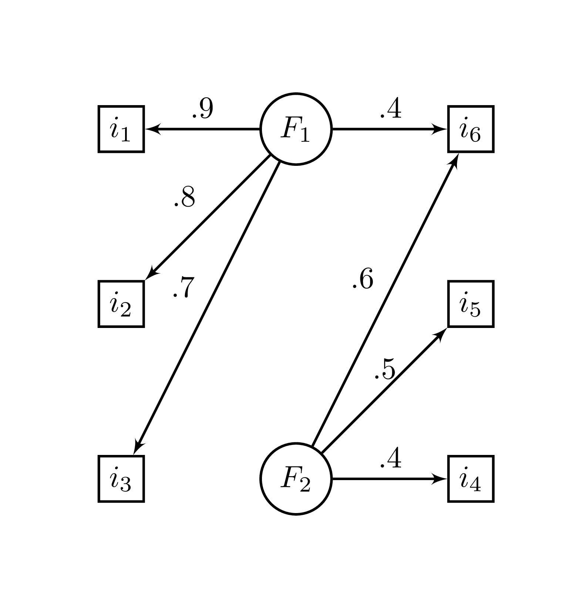

# Réduire

Comme mentionné d'entrée de jeu, l'analyse en composantes principales (ACP) n'est pas une technique de réduction des dimensions. S'il y a $p$ variables, l'ACP produit $p$ dimensions. Toutefois, comme les valeurs propres sont des indices de partage commun entre les variables, elle peut être utilisée de cette façon. En fait, l'ACP est presque toujours utilisée pour réduire la dimension d'un jeu de données.

Parallèlement, l'[analyse factorielle exploratoire] permet de dériver un indice de suffisance du nombre de dimensions (le $\chi^2$), toutefois, il existe de meilleures techniques pour déterminer le nombre de dimensions à retenir dans une analyse exploratoire.

Cette section porte sur les méthodes afin d'identifier le nombre de dimensions à retenir. C'est un sujet très complexe dont seulement quelques brides seront abordées.

## Illustration

Qu'est-ce que la réduction de dimensions? La réduction de dimensions ou la détermination du nombre de dimensions se retrouvent dans tous les domaines, que ce soit en psychologie, en biologie, en informatique ou en physique. Cela peut être autant pratique que théorique. En psychologie, les chercheurs s'intéressent à déterminer le nombre de dimensions d'un test psychométrique. En écologie, les chercheurs peuvent tenter de représenter la variabilité inter-espèces d'un habitat. En ingénierie, les ingénieurs en télécommunication peuvent vouloir extraire l'information pertinente des capteurs électroniques.

La compression d'images, en informatique, est un exemple de réduction dimensionnelle dont il est possible d'illustrer visuellement. La réduction de dimensions permet de résumer l'information afin d'en réduire la taille pour ne conserver que le signifiant. Ainsi, les mêmes techniques permettant d'identifier les facteurs psychologiques peuvent être utilisées pour les images, l'identification des thèmes de films et bien d'autres.

La Figure \@ref(fig:Pigeon) montre un exemple de compression d'une image de pigeon^[Tirée de https://pixnio.com/fr/faune-animaux/des-oiseaux-fr/pigeons-photos/oiseau-pigeon-tumbler-pigeon-mouche-animal-animal, License CC0]. Elle montre à différents niveaux factoriels de compression la même image. À trois dimensions, le pigeon est difficilement perceptible. Progressivement, le pigeon est plus facilement reconnaissable, mais surtout, à un certain seuil (deuxième et troisième lignes de la Figure \@ref(fig:Pigeon), par exemple), l'image gagne en clarté. Trente dimensions conviennent, les plus difficiles désireront peut-être retenir 125 dimensions. L'image à ce stade est très bien. Nonobstant ces nombres, ce sera toujours mieux, en termes de compression, que les 526 dimensions possibles (de l'image originale). Ainsi, à `r 125/526*100` % des dimensions, l'image est claire et le pigeon reconnaissable. Cette logique s'applique également pour les facteurs psychologiques.

```{r Pigeon, fig.cap="Pigeon compressé à divers niveaux de dimension $k$",echo=FALSE, fig.align="center", out.height='75%', out.width='75%'}
knitr::include_graphics("image//Pigeon.png")
```

## Importance d'une dimension

Une technique pour connaître l'importance d'une dimension est d'afficher les valeurs propres. Les valeurs propres les plus élevées impliquent qu'elles sont les plus importantes (les premières) alors que de petites valeurs signalent les moins importantes (du bruit, des résidus, soit les dernières). Il est toutefois plus ardu de déterminer le seuil entre important et non important.

La structure factorielle et le jeu de données du chapitre [Explorer] sont repris afin d'illustrer le propos.

```{r}
# Pour la reproductibilité
set.seed(44)

# Création de la matrice de recette de fabrication
phi = matrix(c(.9, .8, .7,  0,  0, .4,
                0,  0,  0, .6, .5, .4), 
             nrow = 6, ncol =  2)

# Nombre de variables
p <- nrow(phi)

# Identification des variables et facteurs
colnames(phi) = c("F1", "F2")
rownames(phi) = paste0(rep("i", 6), 1:6)

R = phi %*% t(phi)
diag(R) <- 1

# Création du jeu de données
jd <- MASS::mvrnorm(n = 50, 
                    mu = rep(0, ncol(R)), 
                    Sigma = R)
```

Voici l'analyse en composante principale.

```{r}
# L'ACP
res <- eigen(cor(jd))

# Les valeurs propres
res$values
```

Une façon d'illustrer les valeurs propres graphiquement est d'utiliser un graphique nommé *scree plot* ou *graphique des éboulis*. La Figure\ \@ref(fig:scree) peut être produite avec la syntaxe ci-dessous. Il s'agit de mettre en axe des $x$ la séquence (`Position`) des valeurs propres (leur ordre) par rapport à la valeur propre en axe des $y$. Ce graphique se produit simplement avec `plot()` ou `ggplot()` (voir [Visualiser]).

```{r scree, fig.cap="Les valeurs propres en fonction de la position de l'axe",fig.align="center", out.height='75%', out.width='75%'}
Position <-  1:p
vp <- data.frame(Position = Position ,
                 Valeurs.propres = c(res$values),
                 Test = rep("Empiriques", p))

ggplot(data = vp,
       mapping = aes(x = Position, 
                     y = Valeurs.propres, 
                     color = Test)) +
  geom_line() + 
  geom_point() +
  ylab("Valeur propre") +
  theme(legend.position = c(0.8, 0.8))
```
La Figure\ \@ref(fig:scree) est une bonne représentation visuelle des valeurs propres. Elle ne répond pas à la question d'intérêt : combien y a-t-il de dimensions *importantes*? Elle donne toutefois une idée. Probablement 2 ou 3? La première est indubitable; la valeur propre est très élevée. Les 4^e^, 5^e^ et 6^e^ sont quant à elles très petites et sont très près. Comment déterminer avec plus de rigueur le nombre de dimensions? C'est là que les règles d'arrêt entre en jeu.

## Les règles d'arrêt

La question est de savoir combien de dimensions il faut retenir pour rendre adéquatement compte des données. Dès lors, l'ACP devient une technique de réduction des dimension. Or, les analyses exploratoires (comme l'[ACP][Décomposer] ou [l'analyse factorielle exploratoire][Explorer] ne répondent pas explicitement à cette question. Le statisticien use de techniques complémentaires, des **règles d'arrêts** (*stopping rules*), pour déterminer le nombre de dimensions à retenir.

Ces règles d'arrêt sont en général un *bricolage* du statisticien pour répondre à la question. Bricolage n'est pas à prendre péjorativement, mais seulement comme un rappel à la réalité : ces techniques sont souvent créées sans aucune dérivation analytique. Il n'est pas possible de leur faire aveuglément confiance (il ne faudrait jamais faire cela de toute façon). Elles ont une pertinence pratique, mais les conditions selon lesquelles elles flanchent ne sont pas ou peu connues. Il existe probablement des centaines de techniques ayant leurs avantages et inconvénients ou bien des scénarios dans lesquels elles sont plus efficaces que les autres. Il en apparaît des nouvelles chaque année depuis 1950. Comme ces techniques sont des bricolages et qu'elles sont taillées différemment, elles ne s'accordent pas toujours sur la même conclusion. Faire l'étalage de ces règles d'arrêt serait bien inutile. Ainsi, trois techniques seront présentées, le test de Kaiser, l'analyse parallèle (*parallel analysis*) et le test de suffisance de la prochaine valeur propre (*Next eigenvalue sufficiency test*), une technique récente montrant un excellent rendement. Ces trois règles représentent une même ligne évolutive.

### Le test de Kaiser

Historiquement, le premier test est le *test de Kaiser* [@Kaiser]. C'est la règle d'arrêt utilisée par défaut dans la plupart des logiciels traditionnels. Cela lui permet d'être encore très répandu aujourd'hui, malgré qu'il soit discrédité depuis les années 60 [@Turner98;@Achim20;@Beauducel01]. 

Le test de Kaiser se fonde sur l'idée selon laquelle, si les variables ne sont pas corrélées entre elles (s'il n'y a pas de facteurs), les valeurs propres seront égales à 1. La logique du test est d'affirmer que, si une valeur propre est supérieure à 1, alors de l'information commune est nécessairement partagée entre deux ou plusieurs variables. Selon le test de Kaiser, le nombre de composantes à retenir correspond au nombre de valeurs propres supérieures à 1. 

À titre illustratif, une matrice de corrélation sans aucune corrélation est une matrice d'identité.

```{r}
mat.cor <- diag(6)
mat.cor
```
Les valeurs propres de cette matrice sont toutes égales à 1.

```{r}
eigen(mat.cor)$values
```
Si une seule corrélation est ajoutée, aussi petite soit-elle, alors toutes les plus grandes valeurs propres tendent à capitaliser sur cette variance partagée.

```{r}
mat.cor[1, 6] <- mat.cor[6,1] <- .1
mat.cor
eigen(mat.cor)$values
```
Autrement dit, si une valeur propre est supérieure à 1, c'est qu'il y a un facteur.

La Figure\ \@ref(fig:kaiser) illustre le test de Kaiser avec le présent exemple qui suggère deux facteurs (comme simulé).

```{r kaiser, fig.cap="Les valeurs propres en fonctions de la position de l'axe",fig.align="center", out.height='75%', out.width='75%'}
vp <- rbind(vp,
      data.frame(Position = Position,
                 Valeurs.propres = 1,
                 Test = rep("Kaiser", p))
      )

ggplot(data = vp,
       mapping = aes(x = Position, 
                     y = Valeurs.propres, 
                     color = Test)) +
  geom_line() + 
  geom_point() +
  ylab("Valeur propre") +
  theme(legend.position = c(0.8, 0.8))
```

Voici un exemple d'une fonction maison simple pour programmer le test de Kaiser.

```{r}
kaiser <- function(jd){
  # Obtenir la matrice de corrélation
  R <- cor(jd)
  
  # Extraire uniquement les valeurs propres
  eig <- eigen(R, only.values = TRUE)$values
  
  # Les valeurs propres plus grandes que 1
  sum(eig > 1)
}
```

### L'analyse parallèle de Horn

Asymptotiquement parlant, si $n \to \infty$, le test est vrai. Par contre, l'ordre des valeurs propres capitalise sur l'erreur, ce qui introduit l'idée selon laquelle les corrélations accidentelles se retrouvent dans les premières dimensions. Même s'il n'y a pas de corrélation sur le plan de la population, il y aura accidentellement des corrélations dans un échantillon. Conséquemment, les premiers axes sont surestimés, alors que les derniers sont sous-estimés.   

La solution proposée par @Horn65 est alors de tenir compte de cette erreur d'échantillonnage accidentelle. Pour ce faire, il propose de rééchantillonner les valeurs propres d'un jeu de données sans aucun facteur (aucune corrélation entre les variables) ayant les mêmes caractéristiques que le jeu de données cible (mêmes nombres de variables et de participants). Le jeu de données cible correspond au jeu de données de l'expérimentateur. 

Le rééchantillonnage est réitéré sur des milliers de jeu de données artificiels. À chaque fois, les valeurs propres sont enregistrées. Des valeurs critiques (moyennes ou percentiles) en sont retirées à la toute fin. Il s'agit du critère auquel l'hypothèse nulle est rejetée. De la première à la dernière, chaque valeur propre cible est comparée à la valeur propre moyenne correspondante. Si la cible est plus élevée, il s'agit d'une dimension à retenir. Dès que la cible est inférieure, le test est arrêté. Le nombre de valeurs propres supérieures aux valeurs propres artificielles correspond au nombre de dimensions à retenir. 
Dans la syntaxe ci-dessous, les mêmes caractéristiques que le jeu de données précédent sont utilisés, soit $p = 6$ et $n = 5000$. À la fin, il sera possible de comparer s'il y a effectivement deux facteurs selon l'analyse parallèle. 

```{r}
# Pour la reproductibilité
set.seed(1019)
p <- 6        # Nombre de variables
n <- 50       # Nombre de participants 
nreps <- 1000 # Nombre d'itérations
valeurs.propres <- matrix(0,            # Création d'une variable
                          nrow = p,     # vide pour enregistrer
                          ncol = nreps) # les valeurs propres

# Création d'une matrice de corrélation vide
R <- diag(p)

# Création de la boucle                                        
for(i in 1:nreps) {
  D <- MASS::mvrnorm(n = n,            # Création de n * p valeurs
                     mu = rep(0, p),   # aléatoires accidentellement
                     Sigma = R)        # corrélées
  
  ACP <- eigen(cor(D),                 # Réaliser l'ACP
               only.values = TRUE)        
  
  valeurs.propres[,i] <- ACP$values    # Enregistrer les valeurs propres
}

# Une fois les valeurs propres obtenues,
# les moyennes et quantiles sont calculables

# Une moyenne par ligne (valeurs propres)
rowMeans(valeurs.propres)

# Le 95e percentile (si préféré)
apply(X = valeurs.propres, 
      FUN = quantile,
      MARGIN = 1,
      probs = .95)
```

Pour connaître le nombre de dimensions, il suffit de tester les valeurs propres empiriques et les comparer aux valeurs propres simulées (moyenne ou 95^e^ percentile). Le nombre de valeur propre empirique supérieur aux valeurs propres simulés correspond au nombre de composantes à retenir.

```{r}
# Les valeurs propres empiriques
res$values

# La moyenne des valeurs propres simulées
rowMeans(valeurs.propres)

# Nombre de valeurs propres empiriques supérieures aux simulées
sum(res$values > rowMeans(valeurs.propres))
```

Ainsi, `r sum(res$values > rowMeans(valeurs.propres))` facteurs sont à retenir. Une façon d'illustrer les résultats de l'analyse parallèle est d'utiliser le graphique des éboulis en y représentant les valeurs propres empiriques comparativement aux simulées. Le nombre de valeurs propres empiriques supérieures aux simulées est le nombre de dimensions à retenir. Ce graphique est produit à la Figure \@ref(fig:scree2). Voici la syntaxe pour produire ce graphique avec `ggplot2`. La première étape est de mettre en commun les résultats obtenus dans un jeu de données. La variable `Position` indique l'ordre de la valeur propre, `valeurs.propres` contient les valeurs propres et `Test` indique s'il s'agit de valeurs propres empiriques ou simulées de l'analyse parallèle. Pour le reste, il s'agit de recourir à `ggplot()`.

```{r scree2, fig.cap="Comparaison des valeurs propres empiriques et simulées",fig.align="center", out.height='75%', out.width='75%'}
vp <- rbind(vp,
      data.frame(Position = Position,
                 Valeurs.propres = rowMeans(valeurs.propres),
                 Test = rep("Analyse parallèle", p))
      )

ggplot(data = vp,
       mapping = aes(x = Position, 
                     y = Valeurs.propres, 
                     color = Test)) +
  geom_line() + 
  geom_point() +
  ylab("Valeur propre") +
  theme(legend.position = c(0.8, 0.8))
```
Voici une fonction pour programmer l'analyse parallèle.

```{r}
analyse.parallele <- function(jd, 
                              p = ncol(jd), 
                              n = nrow(jd), 
                              nreps = 1000,
                              alpha = .05){
 
  # Extraire uniquement les valeurs propres
  eig <- eigen(cor(jd), only.values = TRUE)$values

  # Création d'une variable vide pour enregistrer
valeurs.propres = matrix(0,            
                         nrow = p,     
                         ncol = nreps) 

# Création d'une matrice de corrélation vide
R <- diag(p)

# Création de la boucle                                        
for(i in 1:nreps) {
  D <- MASS::mvrnorm(n = n,            # Création de n * p valeurs
                     mu = rep(0, p),   # aléatoires accidentellement
                     Sigma = R)        # corrélées
  
  ACP <- eigen(cor(D),                 # Réaliser l'ACP
               only.values = TRUE)        
  
  valeurs.propres[,i] <- ACP$values    # Enregistrer les valeurs propres
}

# Le 95e percentile
vp.crit <- apply(X = valeurs.propres, 
                 FUN = quantile,
                 MARGIN = 1,
                 probs = 1 - alpha)

# Les valeurs propres empiriques plus grandes 
# que celles simulées
sum(eig > vp.crit) 
}
```

### Test de suffisance de la prochaine valeur propre d'Achim

L'un des problèmes de l'analyse parallèle est que, bien qu'elle tient compte de l'erreur d'échantillonnage, elle ne tient pas compte de la logique séquentielle des tests d'hypothèses des valeurs propres [@Turner98; @Beauducel01]. Précisément, le test d'hypothèses sous-jacent, en termes de $k$ dimensions à retenir, est 
$$
H_0 : k = 0 \\
H_1 : k \geq1 
$$


Autrement dit, il n'y a pas de facteurs, ou bien il y a plus d'un facteur. Une fois la première dimension déterminée par l'analyse parallèle, il est inadéquat de tester les suivantes avec la même matrice de corrélation. Il faut tenir compte de cette nouvelle information : il y a au moins $k$ dimensions.

Le **Test de suffisance de la prochaine valeur propre** (*Next Eigenvalue Sufficiency Test*, NEST) développé par Achim [-@Achim17;-@Achim20] est le dernier cri en termes d'estimation du nombre de composantes à retenir. En plus de tenir compte pour l'erreur d'échantillonnage, comme l'analyse parallèle, il tient compte aussi de la logique séquentielle du test d'hypothèse. Plus précisément, le test utilise une matrice de corrélation contenant les $k$ dimensions déterminées auparavant. Lorsque $k=0$, le test est équivalent à l'analyse parallèle, mais uniquement pour la première valeur propre. Une fois l'hypothèse nulle rejetée, $k$ est incrémenté, une nouvelle matrice de corrélation basée sur ces $k$ facteurs est calculées, et un nouveau rééchantillonnage des valeurs propres est entrepris. Le test s'arrête lorsque la $k+1$ valeur propre (l'hypothèse nulle) n'est pas rejetée, pour donner $k$ dimensions.

La syntaxe suivante illustre de façon simplifiée le test NEST. Elle utilise plusieurs éléments déjà présentés. 

* Elle est basée sur [l'analyse parallèle][L'analyse parallèle de Horn]. Le changement principal est que la matrice de corrélation change pour différente valeur de $k$, alors qu'elle reste toujours identique pour l'analyse parallèle, `R = diag(p)`, peu importe $k$.

* Comme l'analyse parallèle, la fonction utilise une forme de rééchantillonnage qui est en fait du [bootstrap][Le bootstrap].
 
* Elle utilise `factanal()` (voir [Explorer]) pour reconstruire la matrice de corrélation à $k$ facteurs.

```{r}
mat.cor <- cor(jd)  # Matrice de corrélation du jeu de données
p <- ncol(mat.cor)  # Nombre de variables (6)
n <- nrow(jd)       # Nombre de participants (50)
nreps <- 1000       # Nombre d'itérations

# Test séquentiel des valeurs propres
for (k in 0:(p-1)){ # Pour 0 à (p-1) dimensions
  
  # Déterminer la matrice de corrélation pour k dimensions
  if(k == 0) {      # Pour tester 0 dimension (analyse parallèle)
    
    R <- diag(p)    # Matrice de corrélation à 0 dimension
    
  } else {          # Pour tester k dimensions
    
    fa <- factanal(covmat = mat.cor, n.obs = n, factors = k)
    R <- fa$loadings %*% t(fa$loadings)
    diag(R) <- 1    # Matrice de corrélation à k dimensions
  }
  
  # Rééchantillonnage des valeurs propres
  # Création d'une variable vide pour enregistrer
  valeurs.propres = matrix(0,            
                           nrow = p,     
                           ncol = nreps) 
  
  # Création de la boucle                                        
  for(i in 1:nreps) {
    
    # Création de n * p valeurs aléatoires corrélées
    D <- MASS::mvrnorm(n = n,            
                       mu = rep(0, p),   
                       Sigma = R)
    
     # Réaliser l'ACP
    ACP <- eigen(cor(D),                
                only.values = TRUE)  
    
     # Enregistrer les valeurs propres
    valeurs.propres[,i] <- ACP$values   
  }
  
  # Tester la k+1 valeurs propres à alpha = .05
  vp.crit <- quantile(valeurs.propres[k+1,], probs = .95)
  
  # Valeur propre empirique k testée à la valeur simulée
  # Si la valeur propre est plus élevée, NEST continue,
  # si la valeur propre est plus petite, NEST arrête.
  if(!(res$values[k + 1] > vp.crit)){break}
}

# Nombre de facteurs à retenir
nfactors = k
```
La sortie ici, `nfactors`  représente le nombre de dimensions à retenir.

#### Le package Rnest

```{r, eval = FALSE, message = FALSE, warning = FALSE, comment=FALSE, include = FALSE}
remotes::install_github(repo = "quantmeth/Rnest")
```


Il existe une version préliminaire d'un package permettant de réaliser facilement NEST en plus de fournir quelques fonctions utiles. Le package est `Rnest` [@Rnest]. Il est disponible par GitHub et est importable sur **R** avec la syntaxe suivante.

```{r, eval = FALSE}
remotes::install_github(repo = "quantmeth/Rnest")
```

Comme à l'habitude, il faut l'appeler dans l'environnement.

```{r, message = FALSE, warning = FALSE, comment=FALSE}
library(Rnest)
```

La fonction principale est `nest()`. Elle prend en argument un jeu de données ou une matrice de corrélation avec le nombre de participants. D'autres options sont possibles, comme le seuil critique (`alpha`), le nombre de répétitions (`nreps`), et la méthode d'extraction des dimensions (`"ml"`, *maximum likelihood*; `"paf"`, *principal axis factoring*; `"mrfa"`, *minimum rank factor analysis*)

Voici la fonction avec le présent exemple.

```{r}
nest(jd)
```
Voici la sortie des valeurs propres comparées aux deux autres règles d'arrêt illustrée à la Figure\ \@ref(fig:scree3).

```{r scree3, fig.cap="Comparaison des valeurs propres empiriques et simulées (analyses parallèle et nest)",fig.align="center", out.height='75%', out.width='75%'}
# Réorganisation du jeu de données contenant
# les valeurs propres
vp.nest <- plot(nest(jd))$data[-(1:p),]
colnames(vp.nest) <- colnames(vp)
vp.nest$Test <- "NEST" 
vp <- rbind(vp, vp.nest)

ggplot(data = vp,
       mapping = aes(x = Position, 
                     y = Valeurs.propres, 
                     color = Test)) +
  geom_line() + 
  geom_point() +
  ylab("Valeur propre") +
  theme(legend.position = c(0.8, 0.8))
```

Un bel avantage du package est sa possibilité de créer un graphique pour différentes valeurs critiques `alpha`. La Figure\ \@ref(fig:screenest) illustre la sortie.

```{r screenest, fig.align="center", out.height='75%', out.width='75%', fig.cap="Graphique produit par `nest` de `Rnest`"}
plot(nest(jd, alpha = c(.01, .025, .05, .10)))
```

<!-- ### Comparaisons des règles d'arrêts -->

<!-- À ce stage, les trois règles d'arrêt ont sorti le même nombre de facteurs. Elles semblent ne devenir qu'inutilement alambiqué. Il revient à l'exemple original d'être très simples : des loadings assez saillants, des valeurs propres élevées et une structure simple et orthogonale. Voici un exemple plus complexe. -->

<!-- Le package `Rnest` founir une matrice de corrélation basée sur 4 facteurs corrélées. La matrice se nomme `ex_4factors_corr` et la Figure\ \@ref(fig:structcp) -->

<!-- ```{r structcp, fig.cap = "Structure factorielle de `ex_4factors_corr`", fig.ext = 'png', cache=TRUE, echo = FALSE, out.height="50%", out.width="50%", fig.align = "center"} -->
<!--  -->
<!-- ``` -->

<!-- À partir de cette matrice, il est possible de créer un jeu de données pour 500 participants.  -->

<!-- ```{r} -->
<!-- set.seed(42) -->
<!-- jd2 <- MASS::mvrnorm(n = 500, -->
<!--                      mu = rep(0, ncol(ex_4factors_corr)), -->
<!--                      Sigma = ex_4factors_corr)  -->
<!-- ``` -->

<!-- La Figure\ \@ref(fig:scree4) les valeurs propres du jeu de données. -->

<!-- ```{r scree4,echo = FALSE, fig.cap="Les valeurs propres de `ex_4factors_corr`"} -->
<!-- res = eigen(cor(jd2), only.values = TRUE)$values -->
<!-- vp <- data.frame(Position = 1:ncol(ex_4factors_corr) , -->
<!--                  Valeurs.propres = res, -->
<!--                  Test = rep("Empiriques", p)) -->

<!-- ggplot(data = vp, -->
<!--        mapping = aes(x = Position,  -->
<!--                      y = Valeurs.propres)) + -->
<!--   geom_line() +  -->
<!--   geom_point() + -->
<!--   ylab("Valeur propre") + -->
<!--   scale_x_continuous(breaks = scales::pretty_breaks())+  -->
<!--   theme(legend.position = c(0.8, 0.8)) -->
<!-- ``` -->

<!-- Voici les tests comparés. -->

<!-- ```{r, cache = TRUE} -->
<!-- kaiser(jd2) -->
<!-- analyse.parallele(jd2) -->
<!-- nest(jd2) -->
<!-- ``` -->


