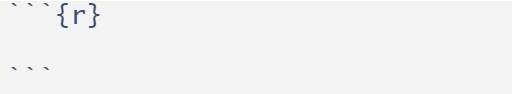
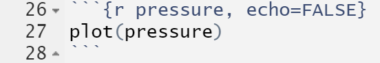

# Rédiger

**R** et **RStudio** offrent un environnement pour rédiger des rapports de recherche. Le package `Rmarkdown` [@R-rmarkdown] intègre les fonctions pour ce faire. Plus, **R** et **RStudio** permettent de faire des articles, des livres (comme celui-ci), des sites, des applications, etc. Pour ce faire, ils intègrent différents langages de programmation. Cette section insiste sur la production de rapports de recherche simple. La philosophie étant, si **Rmarkdown** ne le fait pas,  c'est superflu. Il demeure possible de personnaliser plusieurs éléments de ces textes, mais souvent cela sera inutile pour l'utilisateur débutant.

L'avantage principal de rédiger dans **R** est certainement le fait de tenir dans un projet, toute la syntaxe, le jeu de données, les graphiques ainsi que le texte rapportant le tout dans un seul fichier. 

## Ouvrir un document

La première à s'assurer est que le package `Rmarkdown` soit bien installé (voir [Les packages]. Il est préférable d'utiliser **R**Studio: l'environnement y est plus agréable et facilite l'expérience de l'utilisateur. Une fois installé, il faut faire `File -> New File -> Rmarkdown` pour ouvrir un nouveau document. La boîte de dialogue affichée à la Figure\ \@ref(fig:rediger1) demande quatre éléments : le titre, le nom de l'auteur, la date et le format du rapport (html, pdf ou word). Les deux premiers sont les plus utilisés. Une fois rempli, il faut cliquer sur OK.

<div class="figure" style="text-align: center">

<p class="caption">(\#fig:rediger1)Boîte de dialogue de Rmarkdown</p>
</div>

Cette procédure ouvre un [script][Les scripts] d'extension `.Rmd`. Il s'agit d'un exemple typique qui rappelle des éléments de base pour produire un document. L'exemple est présenté à la Figure\ \@ref(fig:rediger2). C'est une bonne source pour se rappeler les lignes de la syntaxe `Rmarkdown`. Chaque élément est vu en détail dans la prochaines section.

<div class="figure" style="text-align: center">

<p class="caption">(\#fig:rediger2)Exemple de Rmarkdown</p>
</div>

Il est possible de voir immédiatement le résultat final de ce script en cliquant sur `Knit` (*tricoter*) au milieu en haut (le symbole de pelote de laine avec une aiguille). À chaque que l'utilisateur désirer produire le rapport, il faudra le *tricoter en cliquant sur cet icône.

## Les éléments importants

### L'entête

L'entête est la zone qui conserve les éléments du texte, permet la personnalisation et l'ajout de composante, le cas échéant. Cet espace se nomme YAML pour *Yet Another Markdown Language*. Pour l'instant, les renseignements initiaux s'y retrouvent (titre, nom, date et format). 

<div class="figure" style="text-align: center">

<p class="caption">(\#fig:entete)Entête ou YAML</p>
</div>

### Les niveaux de titre

Pour les titres de section, les `#` permette d'indiquer qu'il s'agit effectivement d'un titre et leur nombre permette d'indiquer leur niveau, comme `#` est de niveau\ 1, `##` est de niveau\ 2, etc. Dans l'exemple, il y a deux titres de sections de niveau\ 2.

### Les chunks

Comme le texte est rédiger dans **R**, il sera utile d'employer du code de ce langage dans le rapport. Ainsi, les rapports servent à jumeler, textes, analyses et graphiques. Pour déterminer le texte du code à lire, la syntaxe à rouler est inscrite dans un **chunk** (morceau en français). Les chunks sont délimités par trois accents graves (*backticks* en anglais), puis un accolade indiquant le langage utilisé dans le chunk (`r` en général), et se termine par trois autre accents grave. La Figure\ \@ref(fig:chunk1) montre un chunk.

<div class="figure" style="text-align: center">

<p class="caption">(\#fig:chunk1)Un chunk</p>
</div>

Pour accélérer l'écriture au clavier, il est possible de faire **Ctrl + Alt + I** pour ouvrir un *chunk* complet automatiquement. C'est beaucoup plus efficace que de le taper caractère par caractère.

Le code peut être présenté avec `echo = TRUE` (par défaut) ou caché `echo = FALSE` au besoin.

Le code est automatiquement exécuté. S'il y a un chunk, le code est roulé. Cela se modifie avec `eval = TRUE` (par défaut) pour exécuter le code ou ne pas exécuter le code `echo = FALSE`. Il va sans dire que s'il y a une erreur de code dans un chunk, **R** ne produira pas le rapport.

Ces arguments `echo`  et `eval` doivent être spécifier dans les accolades du chunk. Il est possible de combiner les deux selon les besoins.

### Les figures

Pour inclure une figure, il suffit de la programmer dans un chunk. Dans l'exemple, le graphique du jeu de `pressure` est présenté avec `plot(pressure)` dans un chunk, voir la Figure\ \@ref(fig:rediger3). Noter dans les accolades la présence de `echo=FALSE` qui retire le code pour produire l'image du document final (le chunk n'est pas rapporté). Seule la figure est affichée.

<div class="figure">

<p class="caption">(\#fig:rediger3)Ajouter une figure</p>
</div>

Une autre option est utile pour les figure est de leur ajouter une légende (*caption* en anglais). Pour ce faire, il faut ajouter dans les accolades du chunk l'argument `fig.cap = L'égende de la figure`.

### Les images externes

Pour ajouter une image, il est possible de l'ajouter simplement avec la syntaxe suivante.


```r
knitr::include_graphics("chemin_vers_l_image/image.extension")
```

### Les tableaux

Pour ajouter un tableau, il est possible de passer par la fonction `kable()` de `knitr`. Le premier argument est le tableau à présenter. Dans cet exemple, il s'agit des six premières lignes (avec la fonction `head()`) du jeu de données `cars`. Les autres options sont pour la présentation. L'argument `caption = ` spécifie le titre, l'argument `align = ` permet de centrer (avec `"c"`) les éléments dans les cellules et `booktabs = TRUE` retire la majorité du grillage du tableau.

Il importe pour chaque tableau de s'assurer que la variable contient le `data.frame` ou la `matrix` disposé tel que l'utilisateur le souhaite (voir [Concaténer] pour créer ces objets).


```r
knitr::kable(head(cars), 
             caption = "Titre du tableau", 
             align = "c", 
             booktabs = TRUE)
```

<table>
<caption>(\#tab:unnamed-chunk-1)Titre du tableau</caption>
 <thead>
  <tr>
   <th style="text-align:center;"> speed </th>
   <th style="text-align:center;"> dist </th>
  </tr>
 </thead>
<tbody>
  <tr>
   <td style="text-align:center;"> 4 </td>
   <td style="text-align:center;"> 2 </td>
  </tr>
  <tr>
   <td style="text-align:center;"> 4 </td>
   <td style="text-align:center;"> 10 </td>
  </tr>
  <tr>
   <td style="text-align:center;"> 7 </td>
   <td style="text-align:center;"> 4 </td>
  </tr>
  <tr>
   <td style="text-align:center;"> 7 </td>
   <td style="text-align:center;"> 22 </td>
  </tr>
  <tr>
   <td style="text-align:center;"> 8 </td>
   <td style="text-align:center;"> 16 </td>
  </tr>
  <tr>
   <td style="text-align:center;"> 9 </td>
   <td style="text-align:center;"> 10 </td>
  </tr>
</tbody>
</table>

### Les équations

Il arrive qu'il soit nécessaire d'ajouter des équations dans un rapport. Pour ce faire, **R** utilise latex, un très puissant langage de programmation pour la rédaction de texte. Toute équation commence et termine avec le signe de dollars \$. Par exemple, l'équation $2+2=4$ s'écrit `$2+2=4$`. Il est possible d'ajouter des exposants avec `^` ou des indices avec `_`. Les lettres grecques s'écrivent avec une barre oblique, par exemple, $\beta$, s'écrit `$\beta$` ou la variance $\sigma^2$, s'écrit `$\sigma^2$`. 

S'il faut utiliser les vrais symboles, par exemple \$ et \%, alors il faut ajouter un `\` devant, comme `\$` ou `\%`. Également, l'utilisation de la barre oblique devant un espace permet de créer un espace insécable.

### Référer à des variables de **R** dans le texte

Pour référer à des variables de l'environnement du rapport, il est possible d'appeler ces valeurs des accents graves. Voici un exemple.

```r
moyenne <- 10
```
Pour rapporter la variable `moyenne` dans le texte, il faut recourir à   `` `r moyenne` ``, c'est-à-dire un accent grave, l'appel à `r` pour indiquer que la suite est du code **R**, le nom de la variable et un autre accent grave pour indiquer la fin.  Ainsi,  `` `r moyenne` `` produit le contenu de 10.

### Formater du texte

Plutôt que d'utiliser des onglets et des options pour modifier le texte, il faut utiliser la syntaxe `Markdown` (un langage de programmation de texte) pour altérer le texte. Ainsi, entourer un ou des mots avec une étoile de chaque côté met le texte en italique, comme ceci : `*italique*` donne *italique*; deux étoiles mettent en gras, `**gras**` donne **gras**, pour ajouter des éléments de code, il faut entourer le mot d'accent grave,  `` `code` `` donne `code`. Pour souligner il faut passer par du latex pour les pdf, avec `\underline{souligné}`, ou par `<u>souligné</u>` en html, ce qui donne <u>souligné</u>.

### Ajouter un hyperlien

Pour ajouter un hyperlien, il faut l'écrire entre crochet avec le préfixe `http://`, comme : `<http://mqr.teluq.ca>`, ce qui donne <http://mqr.teluq.ca>. Si l'utilisateur préfère caché le lien sous un mot ou une phrase comme ceci : [ce livre](http://mqr.teluq.ca), il doit écrire : `[ce livre](http://mqr.teluq.ca)`.

### Les commentaires dans le texte

Un commentaire dans le texte permet de délimiter une section de texte qui ne sera par exécuté lorsque le texte sera rendu. Cela permet de retirer du texte ou du code qui n'est pas présentement utile tout en le conservant dans le fichier.

Pour commenter dans un fichier `.Rmd`, il faut entourer le texte de `<!---` et `--->`, comme ceci `<!-- Commentaires -->`. Pour être plus efficace, plutôt que d'écrire tout au long, il est possible de sélectionner le texte puis **Ctrl + Shift + C**, ce qui commentera tout le texte sélectionné.

## Pour aller plus loin

Cette section n'est qu'un survol des possibilités. Pour aller plus loin, il y a beaucoup de documentation sur le web pouvant aider à maîtrise la création d'équation, des spécifier sur la gestion des figures, ou les façons de formater les figures. Et comme c'est la communauté de **R** qui crée le contenu, il y a plus d'une bonne manière de faire la même chose.


# Exercices {#exercice-rudiments .unnumbered}

1. Quel est le résultat de `mean <- c(1, 2, 3)`? Pourquoi?

2. Quelle est la différence entre `# Caractère` et `"Caractère"`?

3. Créer un vecteur contenant les valeurs $4, 10, 32$. Calculer la moyenne et l'écart type de ce vecteur.

4. Créer un vecteur contenant les valeurs de $4$ à $11$. Sélectionner la deuxième valeur de ce vecteur, puis additionner 100 à cette valeur et remplacer la dans le vecteur.

5. Générer 10 valeurs aléatoires distribuées normalement avec une moyenne de 50 et un écart type de 4. Calculer la moyenne, la médiane et la variance.

6. Créer un jeu de données contenant quatre sujets avec, pour chacun, leur nom de famille, leur âge et un score d'appréciation tiré d'une distribution uniforme allant de 0 à 100.

7. Rédiger une fonction calculant l'hypoténuse d'un triangle rectangle. Rappel: le théorème de Pythagore est $c^2=a^2+b^2$.

8. Rédiger une fonction calculant un score-$z$ pour une variable. Rappel: un score-$z$, correspond à $z=\frac{x-\mu}{\sigma}$.

9. Rédiger une fonction calculant la médiane d'une variable (ne recopiez pas celle de ce livre).

10. Rédiger une fonction qui pivote une liste de $k$ éléments par $n$. Par exemple, une liste de six ($k=6$ comme $[1,2,3,4,5,6]$) pivoté de deux ($n=2$) devient ($[3,4,5,6,1,2]$).

11. Rédiger une fonction pour générer une séquence de Fibonacci (chaque nombre est la somme des deux précédents) jusqu'à une certaine valeur, soit $1, 1, 2, 3, 5, 8,...$.
