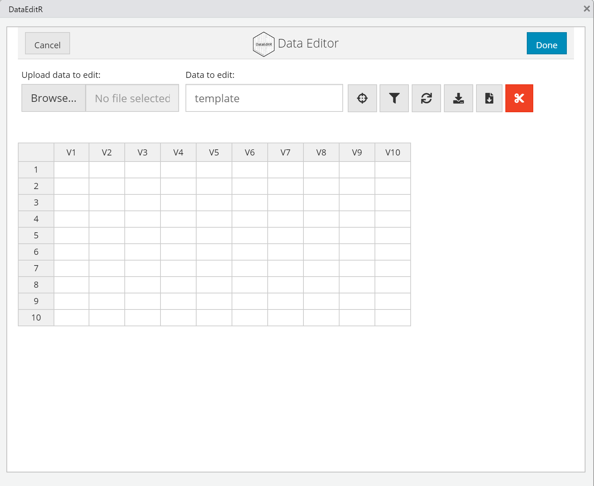

# Entrée de données

S'il y a bien une caractéristique de **R** qui rebute les nouveaux utilisateurs, c'est certainement que le logiciel ne soit pas prévu pour la saisie de données ou du moins que cela ne soit pas mis à l'avant-plan. Lorsque le logiciel s'ouvre, que ce soit **R** ou **R**Studio, l'aspect *table de données* n'existe pas. L'utilisateur pour qui il s'agit de sa première utilisation (et habitué à des logiciels traditionnels) reste pantois : où les données sont-elles entrées?
  
### Entrée de données avec `data.entry()` (R de base)

De base, **R** offre la possibilité d'entrer des données dans un tableur avec la commande `jd = data.entry()`. Si une base de données est demandée comme argument (p. ex., `data.entry(data = jd)`), alors le jeu de données est ouvert. Il est aussi possible d'ouvrir le fichier avec des variables déjà créées avec **R**. Si un tableur vierge est désiré, alors taper `data.entry(1)` dans la console ouvrira le tableur avec une seule valeur (`1`), L'utilisateur peut alors modifier les noms de colonnes et entrer les données comme il le ferait avec un logiciel traditionnel. Comme il est possible de le voir à la Figure \@ref(fig:dataentry), l'interface est bien moins attrayante que ses compétiteurs.

<div class="figure" style="text-align: center">

<p class="caption">(\#fig:dataentry)Ouverture du tableur R</p>
</div>

Lorsque l'entrée de données est terminée, l'utilisateur doit sauvegarder le jeu de données ou l'environnement de travail qui pourront être importés pour de futures utilisations ou entrées. En général, l'utilisateur qui entre manuellement ces données préférera certainement un autre tableur, mais **R** est certainement en mesure de faire ce travail. 

### Entrée de données avec `data_edit` (package `DataEditR`)

Depuis tout récemment (juillet 2021), il existe un package qui permet de faire l'entrée de données en tableur avec **R**. Il s'agit du package `DataEditR` [@DataEditR], une interface utilisateur graphique. Il résout l'un de plus grands défis lorsqu'un utilisateur migre des tableurs traditionnels vers **R**, c'est-à-dire d'accomplir la transition d'une feuille de calcul interactive où il est possible de pointer et cliquer pour modifier, ajouter, supprimer des donnes vers un mode strict de syntaxe.

Pour démarrer, il faut d'abord installer le package, puis l'appeler. Pour commencer à entrer des données, la syntaxe `data_edit()` est suffisante. Pour ouvrir un jeu de données, il suffit de l'ajouter en argument `data_edit(jd)`.

Une fois l'interface ouvert, il est possible de manipuler le jeu de données avec les options affichés et avec le clic droit qui permettra notamment d'ajouter des lignes et des colonnes.


```r
# Pour installer le package
install.packages("DataEditR")

# Pour rendre la package accessible
library("DataEditR")

# La fonction
data_edit()
```

Il est recommandé de ne laisser que les données brutes, toutes les modifications et manipulations devraient rester en syntaxe **R** dans un script associé au jeu de données. Lorsque les entrées sont terminées, il faut simplement sauvegarder la base de données, préférablement en extension .csv. Il est aussi possible de sortir le tableur en tableau de données en assignant la fonction à une variable comme `jd = data_edit()`.

<div class="figure" style="text-align: center">

<p class="caption">(\#fig:editr)Ouverture du tableur de DataEditR</p>
</div>

En général, l'utilisateur importera ces données dans l'environnement **R**. Il devra même le faire avec `data_edit()` à chaque ouverture d'un nouvelle séance, pour poursuivre l'entrée ou réaliser des manipulations.
