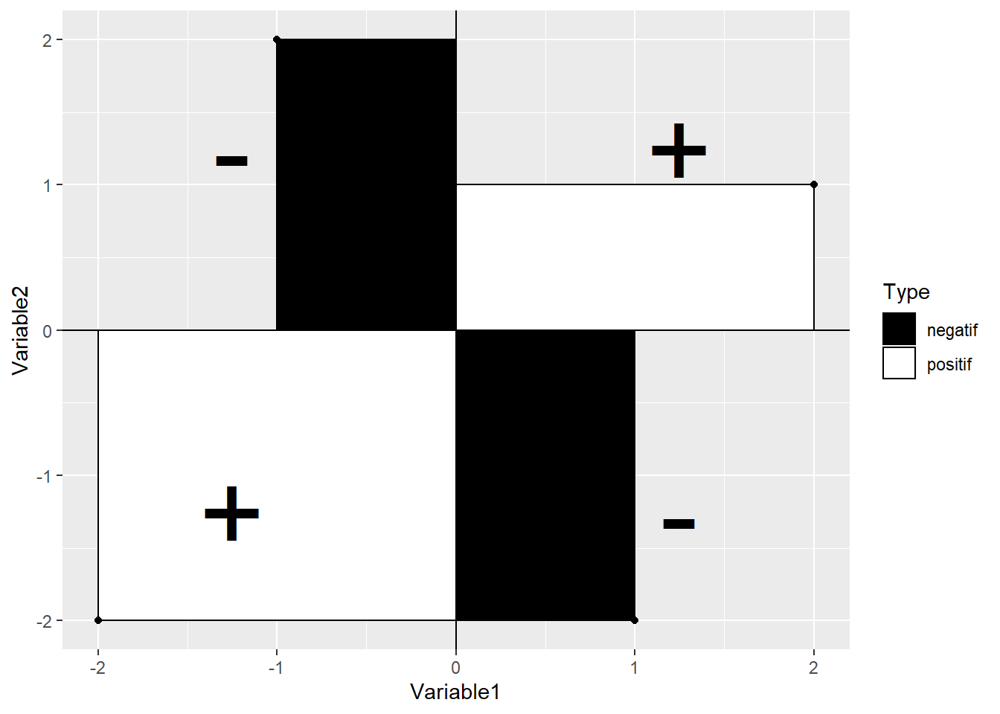
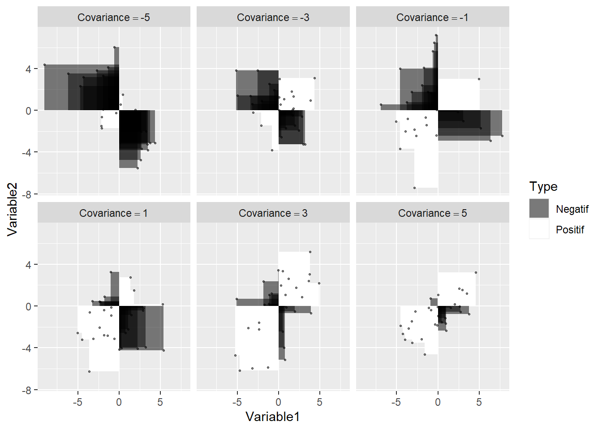
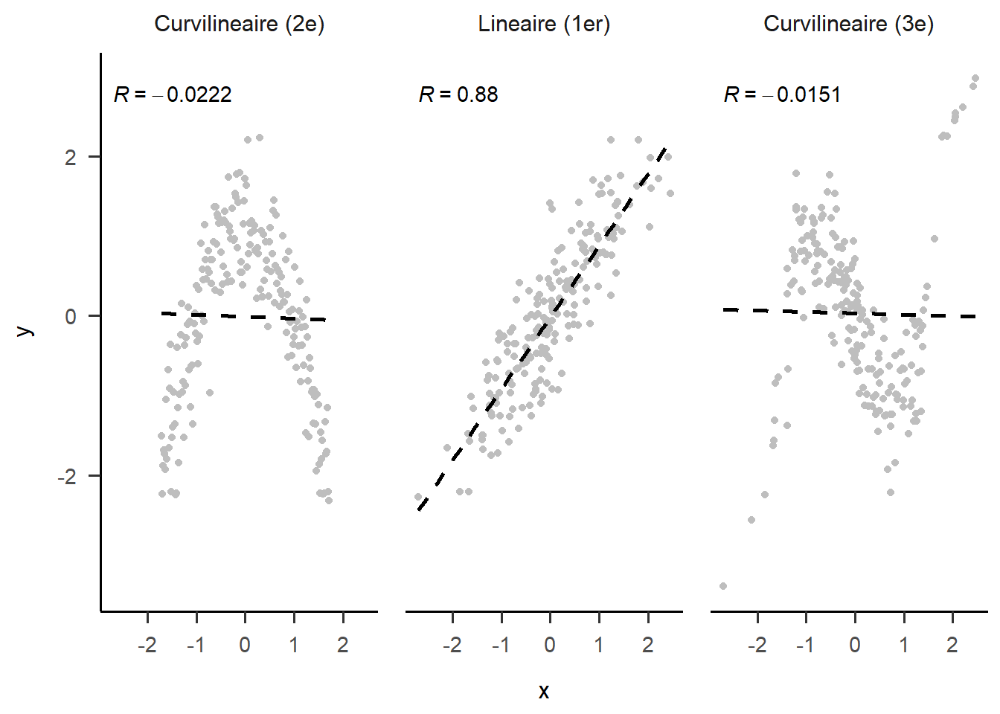

# (PART) Modèle linéaire {-}
# Régression

L'objectif de la régression est de décrire la relation entre un variable dépendante et un ensemble de variables indépendantes. Une première méthode de mesure d'association est la covariance (vue dans le chapitre sur les analyses de base) qui est représentée par l'équation ci-dessous.

\begin{equation}
s_{xy}=\frac{1}{n-1}\sum_{i=1}^n(x_i-\bar{x})(y_i-\bar{y})
(\#eq:cov1)
\end{equation}

L'équation \@ref(eq:cov1) représente la somme des produits des écarts à la moyenne de deux variables. Comment généraliser cette équation à un ensemble de plus de deux variables? Pour débuter, les variables sont mises sur un même pied d'égalité, plutôt que de recourir à des lettres différentes ($x$ et $y$), elles sont toutes considérées comme des $x_{i,j}$, où l'indice $i$ identifie le $i$^e^ participant, comme pour l'équation \@ref(eq:cov1), et l'indice $j$ indique la $j$^e^ variable parmi $p$. Le calcul pour chacune des paires de variables $j$ et $k$ est réalisé pour les $p$ variables; l'équation de la covariance devient ainsi.

\begin{equation}
s_{x_j,x_k}=\frac{1}{n-1}\sum_{i=1}^n(x_{i,j}-\bar{x_j})(x_{i,k}-\bar{x_k})
(\#eq:cov2)
\end{equation}

Si les variables sont centrées, l'équation \@ref(eq:cov2) devient, pour faciliter l'intuition, l'équation \@ref(eq:cov3), soit la somme des produits entre deux variables. 

\begin{equation}
s_{x_j,x_k}=\frac{1}{n-1}\sum_{i=1}^n(x_{i,j})(x_{i,k})
(\#eq:cov3)
\end{equation}

Avantageusement, lorsque $j=k$, les équations \@ref(eq:cov2) et \@ref(eq:cov3) calculent la variance de la variable correspondante. En syntaxe **R,** ces équations pourraient s'écrire dans une fonction comme la suivante. Pour rappel, la fonction `cov()` dans laquelle une matrice de données est passée comme argument fournira la matrice de covariance.


```r
covariance1 <- function(X){} 
# X est un jeu de données
Xc = X - colMeans(X) # Centrées les variables
p = dim(X)[2]    # Nombre de variables 
n = dim(X)[1]    # Nombre de sujets
S = as.numeric() # Matrice vide pour enregistrer résultats (Sigma)
for(j in 1:p) {
  for(k in 1:p) {
    S = sum(Xc[,j] * Xc[,k])
  }
}
S = S / (n-1)
# S est la matrice de covariance
return(covariance = S)
}
```

Dans le code **R** ci-joint, `dim()` extrait le nombre de dimensions de la base de données, soit le nombre d'unités et le nombre de variables. Les crochets dans l'expression `dim(X)[1]` indiquent que seule la première valeur doit être enregistrée - le nombre d'unités et `dim(X)[2]`, le nombre de variable. Il est possible d'utiliser cette astuce dans d'autres contextes. La fonction `colMeans()` (moyenne de chaque colonne) calcule toutes les moyennes des variables. La ligne soustrait de `X` ces moyennes.

### Illustration de la covariance

Il est relativement aisé d'exprimer graphiquement la covariance bivariée. Pour chaque paire $(x_i,y_i)$, il est possible de dessiner un rectangle à partir du centre $(0, 0)$. Lorsque la moyenne d'une variable est soustraite, les données deviennent centrées sur ce point. L'expression $xy$ ou $x_ix_j$ peut rappeler à certain le calcul de l'aire d'un rectangle. C'est effectivement ce qui se produit pour la covariance. L'équation calcule l'aire du rectangle formé par les points $(0,0)$ et $(x_i,y_i)$. En fait, la covariance calcule le rectangle *moyen*, car le produit est ensuite divisé par le nombre de rectangles $(-1)$.


<div class="figure" style="text-align: center">

<p class="caption">(\#fig:unnamed-chunk-2)Illustration de la covariance</p>
</div>


<div class="figure" style="text-align: center">

<p class="caption">(\#fig:unnamed-chunk-3)Illustration des produits (rectangles) pour différentes valeurs de covariance</p>
</div>

À partir des images suivantes, quelques propriétés de la covariance peuvent être déduites. 

* Comme la quantité de surface blanche (ou de noire) dépend de la taille de la figure, la covariance est directement proportionnelle aux échelles à l'abscisse et l'ordonnée. 

* La covariance augmente lorsque les points s'approchent d'une ligne à pente ascendante et diminue lorsque les points s'approchent d'une ligne à pente descendante. 

* Comme les associations non linéaires peuvent créer des amalgames de rectangles positifs et négatifs, elles conduisent à des covariances imprévisibles et peu pertinentes.

* La covariance (et la corrélation) est sensible aux valeurs aberrantes. Un point éloigné de la masse créera une aire rectangulaire bien plus grande que les autres points. À lui seul, il peut créer une quantité substantielle positive ou négative de surface blanche (ou noire) dans la figure.

* Si une variable est multipliée par elle-même, il s'agit de l'aire d'un carré, ce qui équivaut au calcul d'une variance. Par extension, si le produit de deux variables se rapproche davantage d'un carré que d'un rectangle (en moyenne), alors les deux variables sont fortement liées.

* Le paramètre de la corrélation de la population peut être conceptualisé comme un triangle déformé en rectangle à cause de l'erreur de mesure des axes.


### La covariance en termes d'algèbre matricielle

Pour l'instant, seul l'aspect linéaire est présenté. L'équation de la covariance peut aussi se calculer en termes d'algèbre matricielle. En plus d'accélérer le calcul des résultats, il simplifie énormément les mathématiques sous-jante (pourvu que l'utilisateur connaisse l'algèbre matricielle).

Dans le présent contexte, une matrice est un ensemble de variables représentées sous une seule variables. Dans les équations mathématiques, une matrice est désignée par une lettre majuscule : $x$ devient $X$ et $\sigma$ devient $Sigma$. Dans une matrice, chaque colonne est une variable, chaque ligne correspond à un sujet différent mesuré sur toutes les variables. Une matrice est définie en partie par son nombre de lignes ($n$, nombre d'unités) et son nombre de colonnes ($p$, nombre de variables), dont voici une illustration.

$$
X = \left(\begin{array}{cccc} 
x_{1,1} & x_{1,2} & ...&x_{1,p}\\
x_{2,1} & x_{2,2} & ...&x_{2,p}\\
... & ...& ...& ... \\
x_{n,1} & x_{n,2} & ... &x_{n,p}\\
\end{array}\right)
$$ 

En syntaxe **R**, il ne s'agit rien de plus que de concaténer des variables (mesurant les mêmes individus) ensembles par des colonnes, comme il est fait avec des jeux de données `data.frame()` ou `cbind()`. Un jeu de données est, à peu de chose près, une matrice. Pour créer une matrice `X` à partir des variables `x`, `y`, et `z` avec **R**, par exemple, la ligne `X = cbind(x, y, z)` joindra les trois variables ensemble.

Pour réaliser le calcul de la covariance, il faut multiplier la matrice des données centrées (les variables concaténées) par elle-même puis de diviser par $n-1$. Le symbole $X$ représente la concaténation des variables. Par simplicité, l'équation utilise des **variables centrées**.

\begin{equation}
\Sigma = (n-1)^{-1}X^\prime X
(\#eq:covmat1)
\end{equation}

Le symbole $\Sigma$ (sigma majuscule) représente la matrice de variance-covariance. La diagonale de cette matrice représente les variances des données et les éléments hors diagonales sont les covariances, soulignant le lien entre la variance et la covariance. Le symbole $\prime$ (prime) correspond à l'opération de transposer une matrice, soit d'échanger les lignes par ces colonnes. Cette procédure est nécessaire pour produire la multiplication d'une matrice par elle-même. Noter que l'expression $(n-1)^{-1}=\frac{1}{n-1}$.

TODO

\begin{equation}
\begin{aligned}
S & = (n-1)^{-1}
\left(\begin{array}{cccc} 
x_{1,1} & x_{2,1} & ... & x_{n,1} \\
x_{2,1} & x_{2,2} & ... & x_{n,2} \\
\end{array}\right) 
\left(\begin{array}{cc} 
x_{1,1} & x_{1,2} \\
x_{2,1} & x_{2,2}\\
... & ...  \\
x_{n,1} & x_{n,2} \\
\end{array}\right) \\
   & = (n-1)^{-1}
\left(\begin{array}{cc}
\sum_{i=1}^n(x_{i,1})(x_{i,1}) & \sum_{i=1}^n(x_{i,1})(x_{i,2})\\
\sum_{i=1}^n(x_{i,2})(x_{i,1}) & \sum_{i=1}^n(x_{i,2})(x_{i,2})
\end{array}\right)
\end{aligned}
(\#eq:covmat2)
\end{equation}


L'équation \@ref(eq:covmat2) illustre l'équation \@ref(eq:covmat1) qui sont toutes les deux équivalentes à \@ref(eq:cov3). En termes de syntaxe **R**, elles peuvent être traduites comme suit.


```r
covariance2 = function(X){
  # X est une data.frame ou matrice de n sujets par p variables
  n = dim(X)[1]
  Xc = X - colMeans(X)
  # Algèbre matriciel pour le produit qui permet de calculer
  # le produit d'une colonne avec les autres colonnes
  cov.X = t(Xc) %*% Xc / (n - 1)
  return(cov.X)
}
```

La fonction `t()` opère la transpose ($\prime$) et le symbole `%*%` signifie le produit matriciel des variables. Si l'usuel symbole de multiplication `*` était utilisé, **R** opérerait une multiplication cellule par cellule (avec recyclage) plutôt que celle désirée ici.

L'utilisation de l'algèbre matricielle est plus simple  et efficace : Elle nécessite cinq lignes de code, élimine deux boucles, prend moins de temps à calculer en plus de produire toutes les variances et les covariances.

Une matrice de covariance possède plusieurs propriétés qu'il faut connaître. Elle est toujours carrée soit $p \times p$ pour $p$ variables et contient $p^2$ éléments. Parmi ces éléments, les $p$ éléments de la diagonale sont des variances, ce pourquoi elle est parfois appelée matrice de variance-covariance. Les éléments triangulaires inférieurs hors diagonale sont un parfait reflet des éléments supérieurs, p.ex. $\sigma_{1,2} = \sigma_{2,1}$. Il y a ainsi $\frac{p(p-1)}{2}$ covariances uniques dans une matrice et $p(p+1)/2$ éléments uniques (variances et covariances). En plus, de ces caractéristiques, la matrice doit être *positive semi-définie*, ce qui est un terme mathématique impliquant, pour les fins de ce chapitre, que les variances ne peuvent être nulles. (C'est plus complexe que cela, mais il suffit d'accepter cette affirmation pour procéder.)

$$
\Sigma = \left( 
\begin{array}{cccc}
\sigma_{1,1} & \sigma_{1,2} & ... &  \sigma_{1,p}\\
\sigma_{2,1} & \sigma_{2,2} & ... &  \sigma_{2,p}\\
...& ...& ... &  \sigma_{3,p}\\
\sigma_{p,1} & \sigma_{p,2} & ... &  \sigma_{p,p}\\
\end{array}
\right)
$$ 


### Création de données

Une façon simple et efficace de créer des données à ce stade est la package `MASS` dont un aperçu a été donné dans le chapitre sur les analyses de base.


```r
# Création de la matrice de covariance pour p=3
Sigma = matrix(c(s11, s12, s13,
                 s12, s22, s23,
                 s13, s23, s33), nrow = 3, ncol = 3)
# Création des données 
donnees = data.frame(MASS::mvrnorm(n = n, mu = c(0,0), Sigma = Sigma))
```

La matrice de covariance pour $p=3$ s'écrit comme suit.
$$
\Sigma = \left( 
\begin{array}{ccc}
\sigma_{1,1} & \sigma_{1,2} & \sigma_{1,3}\\
\sigma_{2,1} & \sigma_{2,2} & \sigma_{2,3}\\
\sigma_{3,1} & \sigma_{3,2} & \sigma_{2,3}
\end{array}
\right)
$$
Il convient d'écrire $\Sigma$ (sigma majuscule) et $\sigma$ (sigma minuscule) plutôt que $S$, car il s'agit de la matrice de covariance de la population. Le résultat de `S = cov(donnees)` est empirique et la notation $S$ est plus appropriée. Comme il y a $p=3$ variables dans la syntaxe, il faudra préalablement spécifier $3*4/2 = 6$ arguments :$p = 3$ variances $\sigma_{1,1},\sigma_{3,3},\sigma_{3,3}$ et $3*2/2 =3$ covariances $\sigma_{1,2},\sigma_{1,3},\sigma_{2,3}$.

### La matrice de corrélation

Pour rappel, une matrice de corrélation est une matrice de covariance dont les variables ont été standardisées. Cela implique de transformer la matrice afin que toute la diagonale soit à l'unité, que toutes les variances soient égalent à 1. Cela permet d'avoir une interprétation *standardisée* des corrélations, car celles-ci sont indépendantes des métriques originales. Les autres éléments conceptuels de la matrice de covariance s'appliquent pour la matrice de corrélation.

Pour transformer la matrice de covariance en matrice de corrélation, trois techniques sont possibles. 

La première est de standardise $X$ préalablement au calcul de la covariance. Comme il n'y a pas d'équivalent à `colMeans()` pour l'écart type, l'utilisation de `apply(X, MARGIN = 2, FUN = sd)` fera le travail. Cette ligne de syntaxe reproduit la même logique, mais pour l'écart type `sd()`. Textuellement, elle applique (`apply()`) l'écart type (`sd()`) pour chaque colonne `MARGIN = 2` à la matrice de données `X`. 


```r
X = (X - colMeans(X)) / apply(X, MARGIN = 2, FUN = sd)
```

La deuxième méthode est de standardiser la matrice de covariance en termes d'algèbre matricielle, où $S$ est la matrice de covariance. Il faut extraire de la matrice les variances de la diagonale (avec la fonction mathématique $\text{diag()}$), puis en faire la racine carrée pour obtenir des écarts types, puis en refaire une matrice carrée avec la fonction mathématique $\text{diag()}$ qu'il faut finalement inversé pour en faire une division.

\begin{equation}
R = (\text{diag}(\sqrt{\text{diag}(S)})^{-1}) S (\text{diag}(\sqrt{\text{diag}(S)})^{-1})
(\#eq:cov2cor)
\end{equation}

En code **R**, l'équation \@ref(eq:cov2cor) se traduit ainsi. 

```r
R = solve(diag(sqrt(diag(S)))) %*% S %*% solve(diag(sqrt(diag(S))))
```

Lorsqu'une matrice est passée comme argument à `diag()`, elle extrait les éléments de la diagonale pour en faire un vecteur. Si un vecteur est passé en argument, alors `diag()` retourne une matrice avec les éléments du vecteur en diagonale. La fonction `solve()` calcule l'inverse d'une matrice, comme l'utilisateur pourrait attendre de $X^{-1}$. Il s'agit certainement de l'aspect le plus biscornu de **R**.  Enfin, l'opérateur `%*%` est le produit matriciel. 

La troisième est d'utiliser la fonction de base `cov2cor()` pour transformer la matrice de covariance en matrice de corrélation, ce qui est plus simple et plus rapide que la deuxième option, mais qui cache ce qui se réalise.

## La régression

Pour l'instant, des rudiments de la covariance et de la corrélation ont été présentés dans le but d'introduire graduellement l'algèbre matricielle. L'objectif étant atteint, le regard portera sur la régression en tant que moyen de prédire une variable $y$ à partir d'un ensemble de variables $X$.

Quelle est la différence entre les analyses de covariance et corrélation comparativement à l'analyse de régression? Bien que la logique sous-jacente soit très similaire, il faut maintenant déterminer une variable *différente* de l'autre, c'est-à-dire une variable dépendante. Les autres sont des variables indépendantes. Les variables indépendantes prédisent la variable dépendante  un peu comme dans un modèle *déterministe*, il faut décider de la cause (variables indépendantes) et l'effet (variable dépendante), ce dernier étant généré par les premiers. 

Plutôt que de traiter chaque paire de variable comme c'était le cas avec l'analyse de corrélation, la régression correspond à étudier la relation entre la variable dépendante et toutes les autres, et ce, simultanément. Ainsi, les variables indépendantes sont contrôlées entre elles pour évaluer leur effet sur la variable dépendante et un modèle de prédiction plus juste est obtenu (autant que faire ce peut avec modèle statistique).

### Le modèle de régression simple 

L'équation pour un modèle de régression simple se résume en un cas bivarié, soit la prédiction de $y$ par une seule variable $x$.

\begin{equation}
y = \beta_0 + \beta_1 x + \epsilon_y
(\#eq:modlin)
\end{equation}

Dans ce modèle, $y$ est la variable prédite, $x$ est le seul prédicteur, $\beta_0$ est l'ordonnée à l'origine, $\beta_1$ est le coefficient de régression et $\epsilon_y$, l'erreur dans la variable $y$ indépendante (non corrélée, ni fonctionnelement liée) de $x$.


### Création de données

Une façon simple de créer des données en fonction d'un modèle linéaire plutôt qu'à partir de la matrice de corrélation (comme ce fut le case jusqu'à présent) est de reprendre l'équation \@ref(eq:modlin) et de spécifier les paramètres libre. D'abord, il faut  remplacer les paramètres du modèle par des valeurs, $beta_0$, $beta_1$, et ensuite, créer deux variables aléatoires de taille $n$ (la taille d'échantillon), une première pour $x$ et une seconde pour $\epsilon_y$. Les hypothèses sous-jacentes aux modèles linéaires assument généralement que la l'erreur ($\epsilon$) est distribuée normalement (avec implicitement une moyenne de 0), la fonction `rnorm()` pourra jouer le rôle. Pour $x$, il n'y a pas de distribution à respecter, mais une distribution normale fait très bien l'affaire. Voici un exemple de code **R**.


```r
# En spécifiant une taille d'échantillon très grande,
# l'erreur échantillonnalle est considérablement réduite.
# Valeurs choisies par l'utilisateur
n = 10000 # Taille d'échantillon
beta0 = 5 # Les betas
beta1 = 1
# Deux variables aléatoires tirées de distributions normales.
# Les moyennes sont nulles et 
# les écarts types sont spécifiés par l'utilisateur.
x = rnorm(n = n, sd = 1)
e.y = rnorm(n = n, sd = 3)
# Création de la variable dépendante
y = beta0 + beta1 * x + e.y
```

Si l'utilisateur souhaite ajouter une autre variable, il lui suffit d'ajouter un $\beta$ supplémentaire et de créer une autre variable aléatoire 

Cette méthode de création de données possède toutefois des limites. Principalement, elle ne spécifie pas les propriétés statistiques désirables, par exemple, la corrélation entre les variables est évacuée. Quelle est la corrélation entre `x`et `y` dans l'exemple précédent? Il est bien sûr possible de déterminer ces valeurs pour la population a posteriori. Il faut résoudre l'équation \@ref(eq:eqrho).

\begin{equation}
\rho_{x,y} = \beta_1 \frac{\sigma_x}{\sigma_y} 
(\#eq:eqrho)
\end{equation}

Certaines valeurs sont déjà connues, car spécifiées par l'utilisateur, $\beta_1 = 1$ et $\sigma_x = 1$. Qu'en est-il de $\sigma_y$? L'utilisateur n'a pas spécifié la valeur de la variance de $y$, il a plutôt choisi la valeur de la variance de l'erreur résiduelle, $\sigma^2_{\epsilon_y}$. La loi de la somme des variances permettra de calculer cette valeur. Pour le lecteur intéressé, les réponses sont $\sigma^2_y = \beta_1^2\sigma^2_x+\sigma^2_{\epsilon_y} = 10$ et donc $\rho_{x,y} = \frac{\beta_1 \sigma_x}{\sigma_y} = 0.316$.

La limite liée à la méthode de création de données est maintenant flagrante. En plus de ne pas connaître la corrélation entre les variables, la variance de $y$ n'est pas connue a priori.  La stratégie de spécification est ainsi de choisir des valeurs et d'espérer qu'elles soient conformes aux attentes. Pire, s'il y avait plusieurs variables indépendantes, elles seraient toutes non corrélées entre elles, alors que l'utilisateur pourrait vouloir autrement, mais cette première technique ne le permet pas.

Pour l'utilisateur qui crée son jeu de données, ces caractéristiques sont souvent plus essentielles que de spécifier à l'avance la variance résiduelle. Pour résoudre cette situation, la solution est de spécifier un modèle standardisé, puis de le *déstandardiser* (ajouté des moyennes et des variances a posteriori).

La philosophie de modélisation de cet ouvrage repose sur l'idée selon laquelle, un modèle doit être standardisé au départ puis *déstandardisé*. Cette logique ne se prêtera pas à tous les contextes, pour certains la difficulté sera immense, pour d'autres, cela ne respectera pas les objectifs. En partant d'un modèle standardisé toutefois, la matrice de corrélation est connue à l'avance et la variance est spécifiée directement par l'utilisateur. Les tailles d'effets attendues sont également assurées. Il suffit de dériver la variance résiduelle du modèle plutôt que de la spécifier.

En assumant un modèle linéaire,

\begin{equation}
y = \beta_0 + \beta_1 x_1 + ... +\beta_k x_k + \epsilon_y
(\#eq:modling)
\end{equation}

où l'équation \@ref(eq:modling) correspond à la généralisation de l'équation \@ref(eq:modlin) pour $k$ variables indépendantes, il est possible d'isoler $\epsilon_y$. La variance se calcule alors comme l'équation \@ref(eq:emat), pour le cas générale. 

\begin{equation}
\sigma^2_{\epsilon_y} = \sigma^2_y - B^{\prime}RB
(\#eq:emat)
\end{equation}

où $R$ est la matrice de corrélation et $B$ est le vecteur contenant tous les $\beta$ standardisés. Pour assurer un scénario standardisé $\sigma^2_y = 1$. La seule condition sous-jacente à l'équation \@ref(eq:emat) est de s'assurer que $\sigma^2_{\epsilon_y} > 0$, c'est-à-dire en vérifiant que $B^{\prime}RB < \sigma^2_y$, autrement la variance est négative, ce qui est impossible. En termes de syntaxe **R**, l'équation \@ref(eq:emat) correspond à ceci.


```r
# Cacluler la variance de epsilon
var_e = var_y - t(B) %*% R %*% B
```

L'avantage de cette technique est (a) de pouvoir spécifier les corrélations entre les variables indépendantes avec la matrice $R$; (b) de déterminer à l'avance la variance de $y$ et (c) que le vecteur $B$ contient les $\beta$ standardisés qui sont dans ce contexte les corrélations partielles qui relient chacune des variables indépendantes à la variable dépendante (des tailles d'effet) en contrôlant pour chacune d'elles. 

L'utilisateur crée par la suite les données en spécifiant le vecteur $B$ et en créant une variable basée sur la matrice de corrélation. Voici un exemple pour $k=3$ variables centrées suivant une distribution normale multivariée avec la matrice de corrélation $R$.

$$
R= \left( 
\begin{array}{ccc}
1 & .2 & .3\\
.2 & 1 & .1\\
.3 & .1 & 1
\end{array}
\right)
$$
Une fois les données de $X$ créées, avec la fonction `MASS::mvrnorm()`, comme il a été fait précédemment, il suffit de multiplier $X$ avec $B$ et d'ajouter la variable aléatoire $\epsilon_y$ avec la variance appropriée pour obtenir la variable dépendante $y$.


```r
set.seed(42)  # Pour reproductibilité
n = 1000      # Taille d'échantillon
k = 3         # Nombre de variables indépendantes

# Matrice de corrélation
R = matrix(c(1, .2, .3,
             .2, 1, .1,
             .3, .1, 1), k, k)
# Moyennes
mu = rep(0, k)

# Choix des betas standardisés
B = c(beta1 = .2, beta2 = -.5, beta3 = .3)

#variance de epsilon
var_e = 1 - t(B) %*% R %*% B

# Créations des variables aléatoires
X = MASS::mvrnorm(n = n, mu = mu, Sigma = R)
e = rnorm(n = n, sd = sqrt(var_e))
# Création de la variable dépendante
y = X %*% B + e

# Création du jeu de données
jd = data.frame(y = y, X = X)

# Quelques vérifications
# Les données
head(jd)
#>        y    X.1    X.2     X.3
#> 1  0.635 -0.956 -2.567  0.3239
#> 2 -0.264  0.672 -0.172  0.5200
#> 3  0.341  0.885 -1.369 -0.6387
#> 4 -0.602  0.778 -1.104 -1.2678
#> 5  0.401  0.360  0.286 -1.4336
#> 6 -1.076 -0.210  0.621 -0.0399
# La matrice de corrélation entre les variables indépendantes
# Très près des valeurs choisies à la troisième décimale
cor(X)
#>       [,1]  [,2]  [,3]
#> [1,] 1.000 0.188 0.279
#> [2,] 0.188 1.000 0.136
#> [3,] 0.279 0.136 1.000
# La variance de y (encore une fois très près)
var(y)
#>      [,1]
#> [1,] 1.03
```

Maintenant, il est possible de *déstandardisé* `X` et `y` en additionnant des moyennes ou multipliant par des écarts types à chaque variable.

## L'analyse de régression

Lorsque le jeu de données est obtenu, il est temps de procéder à l'analyse de régression. Essentiellement, l'analyse de régression produit à peu près ceci (mais en algèbre matricielle).

Pour aider la compréhension, voici une explication avec le modèle linéaire simple assumant des variables centrées. Le modèle correspond à 

$$
y = \beta x
$$

où l'erreur, $\epsilon_y$ n'est pas explicitée. Il faut isoler $\beta$ afin de l'estimer, soit l'opération suivante,

$$
\beta = \EX(\frac{y}{x})
$$

où le symbole $\EX$ signifie l'espérance (la moyenne). En multipliant par $\frac{x}{x}$ de chaque côté de l'équation, cela produit l'équation suivante.

\begin{equation}
\beta = \EX(\frac{xy}{xx}) = \frac{\sigma_{xy}}{\sigma^2_x}
(\#eq:beta2)
\end{equation}

Dans l'équation \@ref(eq:beta2), le numérateur sera rapidement reconnu comme la covariance et au dénominateur la variance de $X$. Comment généralisé  pour $k$ variables? En algèbre matricielle et dans la mesure où les variables contenues dans $X$ sont centrées, cela revient au même que de calculer l'équation \@ref(eq:beta).

\begin{equation}
\hat{B} = (X^{\prime} X)^{-1} X^{\prime} y
(\#eq:beta)
\end{equation}

Comme pour l'équation \@ref(eq:beta2), la composante $(X^{\prime} X)^{-1}$ agit en dénominateur (par l'exposant $-1$) et correspond à la matrice de variance-covariance des variables de $X$ ensemble, alors que $X^{\prime} y$ agit comme le numérateur, soit la covariance entre les variables de $X$ avec $y$.

Pour l'erreur type, il s'agit de calculer ceci.

\begin{equation}
\text{var}(\hat{B}) = \sigma^2 \left(X^{\prime}X\right)^{-1}
\end{equation}

La racine carrée donne l'erreur type (*standard error*).

Le ratio $\frac{B}{\text{se}_B} \sim t_{n-p-1}$, soit le quotient d'un estimateur par son erreur type, suit une distribution-$t$ avec $n-p-1$ degrés de liberté.

En syntaxe **R**, la régression s'écrit comme ceci.


```r
regression = function(y, X){
  # Ajouter un intercepte
  X = cbind(intercept = 1, X)
  B = solve(t(X) %*% X) %*% t(X) %*% y
  var.e = var(y - X %*% B) 
  se.B = sqrt(c(var.e) * diag(solve(t(X) %*% X)))
  n = dim(X)[1]
  p = dim(X)[2]
  vt = B / se.B
  vp = (1-pt(tv, df = n - p - 1)) * 2
  resultats = data.frame(Estimate = B, 
                         Std.Error = se.B, 
                         t.value = vt, 
                         p.value = vp) 
  return(resultats)
}  
```

Le modèle linéaire peut aussi contenir des variables nominales dans la mesure où celle-ci sont transformées en données factices (*dummy coding*). En fait, une analyse de variance n'est au fond qu'une régression dans laquelle les variables nominales sont transformées en données factices, puis utilisées en variable indépendante. Les $\beta$ de la régression correspondent aux moyennes $\mu$, si le participant appartient (1) à tel ou tel autre groupe ou (0) autrement. Bien que les logiciels produisent souvent des sorties statistiques différentes en fonction de l'analyse demandée, les mathématiques sous-jacentes sont les mêmes.

### Conditions d'application de la régression

La régression possède quatre hypothèses sous-jacentes :

* La vraie relation est linéaire;

* Les observations sont indépendantes.

* Les résidus sont normalement distribués;

* La variance résiduelle est homoscédastique.

Les deux premiers points sont davantage méthodologiques que statistiques bien que leurs conséquences soient réelles. La relation entre les variables doit être linéaire. La régression tient compte des relations en ligne droite, si la relation entre deux variables suit une courbe, elle ne pourra être adéquatement analysée. La figure \@ref(fig:courbe) montre trois relations possibles entre deux variables. Bien que la relation soit très forte, peu importe la forme de la relation (les données suivent un parton très évident), seule celle au centre (relation linéaire) donnera un résultat indiquant un lien fort existant. Il existe des techniques de transformation de données lorsque ce sera *théoriquement* justifié. La relation quantitative entre l'âge et la quantité de rapport sexuel est un exemple de relation non linéaire : elle débute à l'adolescence, atteint son apogée à l'âge de jeune adulte, puis décroît progressivement. La seconde hypothèse est que les unités d'observation doivent être indépendantes. Techniquement, chaque unité devrait avoir une chance égale et indépendante d'être choisie.  La régression est robuste à ce genre de violation, mais il faut toujours conserver cette idée en tête lorsque le devis d'étude est conceptualisé et lors des analyses. Les élèves dans une même salle de classe ne sont techniquement pas indépendants puisqu'ils sont tous corrélés. Ils ont le même enseignant, les mêmes pairs, les locaux, etc., des variables qui peuvent toutes à leur façon avoir des effets sur les comportements des enfants. Dans ce cas, recourir à des analyses multiniveaux sera la seule possibilité pour tenir compte de cette violation et bien représenter les modèles. Un autre exemple est la corrélation entre différents temps de mesure sur une même unité (qui est corrélée avec elle-même). Dans ce cas, ce sera des analyses pour des devis temporels (les analyses multiveaux peuvent également tenir compte du temps).

Les deux autres considérations, qui sont elles d'ordre statistique, concernent les résidus (l'écart entre la prédiction et les valeurs réelles de $y$). Comme il a été mentionné dans la création de données pour la régression, les distributions des variables n'a pas être normales;  elles peuvent suivre différentes distributions de probabilités. Par contre, l'erreur, elle, doit être normales distribuées, car il s'agit d'une hypothèse assumée de l'estimation des moindres carrés. La dernière hypothèse concerne la variance résiduelle homoscédastique, c'est-à-dire que l'écart entre les résidus et les valeurs prédites restent *constantes,* peu importe le niveau sur la droite de régression. Si ce n'est pas le cas pour l'une ou l'autre, c'est qu'une variable a vraisemblablement été négligée ou qu'une des relations n'est pas linéaire avec une des variables indépendantes. 


```
#> `geom_smooth()` using formula 'y ~ x'
```

<div class="figure" style="text-align: center">

<p class="caption">(\#fig:courbe)Différentes formes de relation</p>
</div>


### L'analyse de régression

**R** de base offre la fonction `lm()` pour *linear model* (modèle linéaire) afin de réaliser une régression. Pour réaliser l'analyse, deux éléments sont primordiaux : le jeu de données et le modèle. Le jeu de données est assez explicite. Le modèle linéaire est quant à lui déjà représenté par l'équation \@ref(eq:modling). 

Pour écrire le modèle en syntaxe **R**, il faut remplacer les $x$ par le nom des variables dans le jeu de données, utiliser le `~` (tilde) pour délimiter les variables dépendantes à gauche des variables indépendantes à droite. Les variables indépendantes sont délimitées, comme dans l'équation \@ref(eq:modling), par des signes d'addition `+`. Il est aussi de définir des effets d'interaction (modération) avec le signe de multiplication `*`. Les symboles `-` (soustraction) et `/` (division) ne fonctionnent pas. L'intercepte ($\beta_0$) est ajouté par défaut. Enfin, cette équation doit ensuite être mis entre guillemets, `formula = "y ~ x1 + x2 + x3" ` pour indiquer qu'il s'agit de texte.


```r
# Créer un jeu de données à partir des variables de la syntaxe précédente
res.lm = lm(formula = y ~ X.1 + X.2 + X.3, data = jd)
# Les résultats
res.lm
#> 
#> Call:
#> lm(formula = y ~ X.1 + X.2 + X.3, data = jd)
#> 
#> Coefficients:
#> (Intercept)          X.1          X.2          X.3  
#>     -0.0171       0.2139      -0.5520       0.3095
# Sommaire des résultats
summary(res.lm)
#> 
#> Call:
#> lm(formula = y ~ X.1 + X.2 + X.3, data = jd)
#> 
#> Residuals:
#>     Min      1Q  Median      3Q     Max 
#> -2.5227 -0.5546 -0.0119  0.5513  2.5762 
#> 
#> Coefficients:
#>             Estimate Std. Error t value Pr(>|t|)    
#> (Intercept)  -0.0171     0.0253   -0.68      0.5    
#> X.1           0.2139     0.0266    8.03  2.7e-15 ***
#> X.2          -0.5520     0.0258  -21.42  < 2e-16 ***
#> X.3           0.3095     0.0263   11.76  < 2e-16 ***
#> ---
#> Signif. codes:  
#> 0 '***' 0.001 '**' 0.01 '*' 0.05 '.' 0.1 ' ' 1
#> 
#> Residual standard error: 0.8 on 996 degrees of freedom
#> Multiple R-squared:  0.383,	Adjusted R-squared:  0.381 
#> F-statistic:  206 on 3 and 996 DF,  p-value: <2e-16
```

Pour ajouter une variable il suffit de `VD ~ VI1 + VI2`; pour ajouter un effet d'interaction, il est possible de faire `VD ~ VI1 * VI2`. Pour ajouter une variable nominale (catégorielle), il suffit d'ajouter la variable comme n'importe quelles autres `x`, mais en s'assurant bien qu'elle soit désignée comme un facteur dans le jeu de données. Si ce n'était pas le cas, la fonction `as.factor()` devrait corriger la situation.

La fonction `lm()` en elle-même n'imprime que peut de résultats. Pour obtenir l'information complète, il faut requérir le sommaire avec la fonction `summary()`. Le sommaire des résultats contient toute l'information qu'un expérimentateur peut désirer. Il y a les coefficients de régression `Estimate`, leur erreur standard `Std. Error`, leur valeur-$t$ `t value` et leur valeur-$p$ `Pr(>|t|)`. Tout cela peut être extrait avec `summary(res.lm)$...` en remplaçant `...` par les éléments désirés. Au-dessous de la sortie imprimée, il y a également le coefficient de détermination ($R^2$, `R-squared`), les degrés de liberté et la valeur-$p$ associé au modèle.


Un manuscrit pourrait rapport les résultats ainsi. Le modèle tester obtient un coefficient de détermination de $R^2(996) = 0.383, p < .001$. Les trois prédicteurs sont liés significativement à la variable dépendante, respectivement $X_1: \beta_1 = 0.214, p = < .001$, $X_2: \beta_2 = 0.214, p = < .001$, $X_3: \beta_3 = 0.31, p = < .001$. Évidemment, comme l'exemple est artificiel, il y a peu de chose à dire sans devoir fabriquer de toutes pièces des interprétations alambiquées bien que cela fût fort bénéfique pour la carrière de certains psychanalystes.

Pour vérifier la qualité des résultats, il faut vérifier la distribution des résidus. Pour ce faire, il faut extraire les résidus et les valeurs prédites. Pour la création de graphiques, il est plus simple d'ajouter ces scores au jeu de données. Les fonctions `resid()` et `predict()` permettront d'extraire les résidus et les prédictions en y insérant comme argument le sommaire de la fonction `lm()` obtenu avec les données.


```r
# Ajouter les résidus et scores prédits à la base de données
# avec la fonction `resid()`
jd$residu = resid(res.lm)
jd$predit = predict(res.lm)
```

Une fois, c'est valeur extraite, le package `ggplot2` permet de réaliser rapidement des graphiques, comme le diagramme de dispersion à la figure \@ref(fig:respred) ou l'histogramme des résidus à la figure \@ref(fig:reshist). Dans les meilleures situations, les résidus seront distribués normalement dans l'histogramme et aucune tendance ne devrait être discernable dans le diagramme de dispersion. Si ce n'était pas le cas, il pourrait y avoir un problème à élucider, par exemple, une relation non linéaire imprévue. Les figures \@ref(fig:respred) et \@ref(fig:reshist) ne signale aucun problème, ce qui est attendu considérant la création des données employées.


```r
# Diagramme de dispersion prédits par résidus
jd %>% 
  ggplot(mapping = aes(x = predit, y = residu)) + 
  geom_point() 
```

<div class="figure" style="text-align: center">

<p class="caption">(\#fig:respred)Relation entre prédicitons et résidus</p>
</div>


```r
# Histogramme des résidus
jd %>% 
  ggplot(mapping = aes(x = residu)) + 
  geom_histogram()
```

<div class="figure" style="text-align: center">

<p class="caption">(\#fig:reshist)Histogramme des résidus</p>
</div>

<!-- # L'analyse de régression en modélisation par équations structurelles -->

<!-- # Exercices -->

