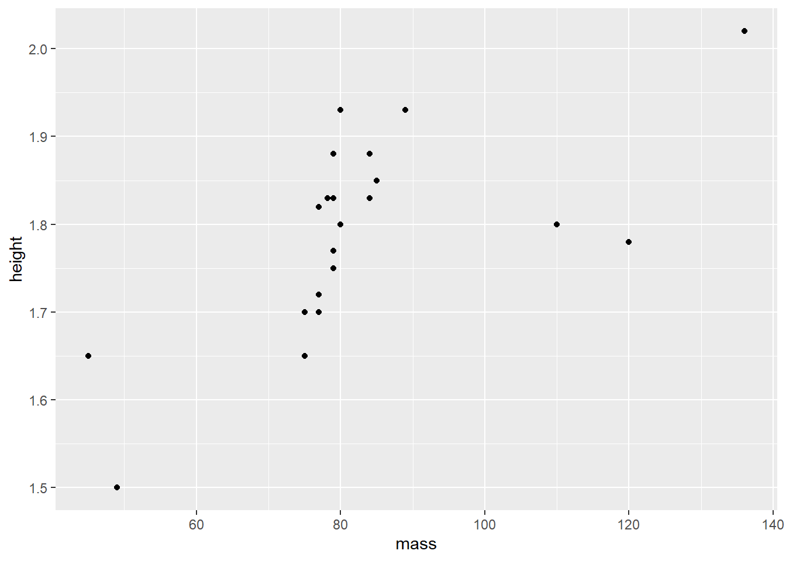

# Visualiser

La visualisation de données est l'un des deux objectifs fondamentaux de **R** (l'autre étant évidemment de faire des statistiques). Il existe plusieurs méthodes et packages pour produire rapidement et simplement des graphiques. Beaucoup de matériel se retrouve en ligne pour maîtriser les graphiques, mais surtout les personnaliser. L'objectif, bien modeste, de cette section n'est pas de rendre le lecteur maître de la production de figure, mais bien de lui faire faire ses premiers pas et de l'outiller pour qu'il puisse produire simplement et rapidement des graphiques de qualité.

L'exemple de cette section est basé sur celle de la section [Manipuler]. Voici la syntaxe pour réobtenir le jeu de données.


```r
jd <- starwars %>% 
  select(name, sex, mass, height, species) %>% 
  filter(species == "Human") %>% 
  na.omit() %>% 
  mutate(height = height  / 100) %>% 
  mutate(IMC = mass / height^2)  
```


## ggplot2

Le package `ggplot2` est une extension du `tidyverse` avec lequel il est possible de créer simplement et rapidement des graphiques. Ces graphiques sont de qualité de publications, idéale pour les articles scientifiques. Le package fournit un langage graphique pour la création intuitive de graphiques compliqués. Il permet à l'utilisateur de créer des graphiques qui représentent des données numériques et catégorielles univariées et multivariées.

La logique de `ggplot2` repose sur la grammaire des graphiques (*Grammar  of Graphics*), c'est-à-dire, l'idée selon laquelle toutes les figures peuvent être construites à partir des mêmes composantes. Il s'agit de la deuxième version du package. Voilà pour l'appellation *ggplot2*.
  
Dans la grammaire de graphique, une figure possède huit niveaux, dont les trois principaux sont les suivants : 
  
* *data*, les données utilisées;

* *mapping (aesthetic)*, cartographier les variables, c'est-à-dire, établir la carte des variables (abscisses, ordonnées, coleur, forme, taille, etc.);

* *geometric représentation*, la représentation géométrique ou le type de représentation graphique, par exemple, diagramme de dispersion, histogramme, boîte à moustache, etc.

Les cinq autres son, *statistics*, *facet*, *coordinate space*, *labels*, *theme* permettent de personnaliser la figure. 

Les composantes les plus importantes sont les trois premières, soit les données, la cartographie et la représentation géométrique. Ce sont les éléments de base pour débuter le graphique. Les autres composantes viendront bonifier la figure tout en l'ajustant au besoin de l'utilisateur.

La fonction `ggplot()` met en place la figure. Le résultat d'utiliser la fonction `ggplot()` seule est illustrée à la Figure \@ref(fig:ggplotseul)


```r
ggplot(data = jd)
```

<div class="figure" style="text-align: center">

<p class="caption">(\#fig:ggplotseul)La fonction ggplot() seule - Rien</p>
</div>

Il est aussi possible de *piper* (prononcé avec un fort accent anglophone) les données dans la fonction.


```r
jd %>% 
  ggplot()
```

Pour afficher des graphiques, il faut ajouter `+`, puis une représentation géométrique ainsi que la cartographie (*mapping*). La cartographie (`aes(mapping = )`-  *aes* désigne l'esthétisme, *aesthetic*) peut se trouver dans `ggplot()` ou dans la représentation géométrique. Si elle est dans `ggplot`, elle est passée aux autres niveaux.

Voici une liste des représentations géométriques possibles.

* `geom_line()` crée une ligne qui lie toutes les valeurs, très utiles pour une série temporelle (abscisse = temps, ordonnée = variable dépendante)
 
* `geom_point()` crée un diagramme de dispersion ou un nuage de point, très utile pour les corrélations

* `geom_bar()` crée un diagramme à bâton, idéal pour présenter des proportions, des fréquences ou des données comptées

* `geom_histogram()` crée un histogramme des variables

* `geom_box()` crée une boîte à moustache, idéal pour identifier des valeurs aberrantes et comparer la variabilité entre des groupes.

* `geom_smooth()` crée la ligne de prédiction des données avec des intervalles de confiances, la plupart des utilisateurs voudront certainement ces arguments `geom_smooth(method = lm)` (par défaut) ou sans l'erreur standard (`se = FALSE`).

* `geom_error()` crée de

Certaines cartographies sont d'ailleurs compatibles, `geom_smooth()` et `geom_point()`, par exemple.

La figure \@ref(fig:ggplotpoint) montre un diagramme dispersion construit à partir du jeu de données `jd` *piper* dans la fonction `ggplot()` dans laquelle la cartographie est passée `mapping = aes(x = mass, y = height)`, un second niveau est ajouté `+` et la représentation.


```r
jd %>% 
  ggplot(mapping = aes(x = mass, y = height)) + 
  geom_point()
```

<div class="figure" style="text-align: center">

<p class="caption">(\#fig:ggplotpoint)Diagramme de dispersion</p>
</div>

Voici une liste d'exemples de différentes représentations géométriques. 

## Diagramme de dispersion

Pour réaliser un diagramme de dispersion, la fonction se nomme `geom_point`. La cartographie identifie la variable à l'axe des $x$ (horizontal) et des $y$ (vertical). Dans cet exemple, il s'agit du poids ($x$) et de la taille ($y$). La cartographie ne se limite pas aux axes par contre. Dans cet exemple, la forme `shape` est aussi un dimension manipulée. Il aurait pu s'agir de `color` et même de `size`. Dans le code ci-dessous, `size` est placé à l'extérieur de *mapping*, il s'agit alors d'une constante (elle change la taille des points), c'est-à-dire qu'elle ne varie pas avec les variables.


```r
jd %>% 
  ggplot() + 
  geom_point(mapping = aes(x = mass, y = height, shape = sex), size = 2) 
```

<div class="figure" style="text-align: center">

<p class="caption">(\#fig:diagdisp)Le lien entre le poids et la taille en fonction du sexe</p>
</div>

La figure \@ref(fig:diagdisp2) montre le résultat si `size``est ajouté au *mapping* pour identifier l'IMC. Les unités avec un plus grand IMC obtiennent un plus gros pointeur.


```r
jd %>% 
  ggplot() + 
  geom_point(mapping = aes(x = mass, y = height, shape = sex, size = IMC)) 
```

<div class="figure" style="text-align: center">

<p class="caption">(\#fig:diagdisp2)Le lien entre le poids et la taille en fonction de l'IMC et du sexe</p>
</div>

On peut y ajouter la droite de régression, comme la Figure  \@ref(fig:diagdisp3) le montre. Ne pas ajouter `geom_point()` ne ferait que produire la droite. Les arguments de `geom_smooth()` indique que l'utilisation du modèle linéaire et l'absence des intervalles de confiance. Dans ce code, également comme le *mapping* est ajouté à `ggplot` directement, il se généralise directement à `geom_point()` et ` geom_smoooth()`


```r
jd %>% 
  ggplot(mapping = aes(x = mass, y = height)) + 
  geom_point(size = 2) +
  geom_smooth(method = lm, se = FALSE, color = "black")
> `geom_smooth()` using formula 'y ~ x'
```

<div class="figure" style="text-align: center">

<p class="caption">(\#fig:diagdisp3)Le lien entre le poids et la taille en fonction de l'IMC</p>
</div>

## Boîte à moustache

La boîte à moustaches (*box-and-whisker plot*) est une figure permettant de voir la variabilité des données. Elle  résume seulement quelques indicateurs de position soit la médiane, les quartiles, le minimum, et le maximum. Ce diagramme est utilisé principalement pour détecter des valeurs aberrantes et comparer la variabilité entre les groupes. C'est la représentation géométrique `geom_boxplot()` qui permettra de créer des boîtes à moustache. La cartographie prend en argument un variable nominale en `x` et une variable continue en `y`.


```r
ggplot(data = jd) + 
  geom_boxplot(mapping = aes(x = sex, y = IMC)) +
  coord_flip()
```

<div class="figure" style="text-align: center">

<p class="caption">(\#fig:boxplot1)Boîte à moustache de l'IMC en fonction du sexe</p>
</div>

Une fonction intéressante est la fonction `coord_flip()` qui tourne (*flip*) les axes, les coordonnées. L'axe $x$  prend la place de $y$; $y$ prend la place de $x$. Elle peut être pratique pour améliorer la qualité visuelle de certains graphiques.

## Histogramme

Un histogramme permet de représenter la répartition empirique d'une variable. Il donne aperçu de la distribution sous-jacente, soit comment les données sont distribuées. Cette figure permet de voir la forme de la distribution et permet de voir si elle ne démontre pas d'anomalie. La représentation graphique `geom_histogram()` produit des histogrammes. S'il faut en produire pour différentes variables, une statégie simple est les produire en série.


```r
# Trois histogrammes en trois figures
ggplot(data = jd) + 
  geom_histogram(mapping = aes(x = height))

ggplot(data = jd) + 
  geom_histogram(mapping = aes(x = mass))

ggplot(data = jd) + 
  geom_histogram(mapping = aes(x = IMC))
```

Des techniques plus avancées permettront de créer la Figure \@ref(fig:hist) d'un seul coup.


```r
# Trois histogrammes en une seule figure
# en optimisant avec le tidyverse
jd %>%
  keep(is.numeric) %>% 
  gather() %>% 
  ggplot(aes(value)) +
  facet_wrap(~ key, scales = "free") +
  geom_histogram()
> `stat_bin()` using `bins = 30`. Pick better value with
> `binwidth`.
```

<div class="figure" style="text-align: center">

<p class="caption">(\#fig:hist)Histogrammes des variables continues</p>
</div>

Enfin, s'il est désiré de comparer deux distributions de groupes différents, l'argument `fill` dans la cartographie indiquera à la fonction de différencier les valeurs selon le *remplissage* des histogrammes.


```r
jd %>% 
  ggplot(mapping = aes(x = IMC, fill = sex)) + 
  geom_histogram(position = "identity", alpha = .7) + 
  scale_fill_grey()
> `stat_bin()` using `bins = 30`. Pick better value with
> `binwidth`.
```

<div class="figure" style="text-align: center">

<p class="caption">(\#fig:hist2)Histogrammes de l'IMC par rapport au sexe</p>
</div>

Dans la figure \@ref(fig:hist2), l'argument `position = "identity"` indique de traiter les deux groupes comme différents, autrement les colonnes s'additionneraient dans le graphique. L'argument `alpha = .7` permet une transparence entre les couleurs, autrement, les valeurs *derrière* les autres ne paraîtraient pas. La valeur de `alpha` va de 0 (transparent) à 1 (opaque) et fonctionnera dans la plupart des contextes, surtout ceux liés à `ggplot2`.

## Les barres d'erreurs

Les barres d'erreur sont une représentation géométrique à part entière. C'est une composante que l'on peut ajouter. La fonction pour les commandées est `geom_errorbar()`. Elle nécessite deux arguments, soit l'intervalle de confiance maximale et minimale autour des moyennes à afficher. 

La figure \@ref(fig:erreurbar) illustre les différences entre moyennes avec des barres d'erreur à partir de la base de données `ToothGrowth`, une étude de l'effet de la vitamine C (`dose`) selon leur administration (jus ou supplément `supp`) sur la longueur des dents des cochons d'inde. Il y a deux facteurs et une variable continue.

La première étape est de tirer les statistiques sommaires, moyennes, écart type, tailles des groupes. La syntaxe tire profit de `groupe_by()` pour tirer les groupes et en faire le sommaire. Le sommaire `summarise` permet d'obtenir les statistiques, notamment la moyenne, l'erreur standard (`se`) pour en calculer l'intervalle autour de la moyenne `ci`.


```r
jd = ToothGrowth %>% 
  group_by(dose, supp) %>% 
  summarise(mlen = mean(len),
            sdlen = sd(len),
            nlen = n(), 
            se = sd(len)/sqrt(n()), 
            ci = qt(.975, df = n()-1) * se,
            .groups = "drop")

jd %>% 
  ggplot(aes(x = dose,
             y = mlen, 
             shape = supp),
         size = 5) + 
    geom_errorbar(aes(ymin = mlen - ci,
                      ymax = mlen + ci), 
                  width = .05) +
    geom_line() +
    geom_point()
```

<div class="figure" style="text-align: center">

<p class="caption">(\#fig:erreurbar)Les effets de la vitamine C sur les cochons d'inde</p>
</div>

Une fois ces statistiques calculées et enregistrées dans le nouveau jeu de données `jd`, il est possible de créer le graphique avec les représentations géométriques désirées. Remarquer comment spécifié la cartographie dans le niveau `ggplot()` rend la syntaxe moins compliquée. Cette syntaxe produit un graphique avec `dose` à l' axe des $x$, `supp` comme pointeurs et les moyennes de `len` (longueur moyenne des dents). La fonction `geom_errorbar()` indique où placer les limites inférieures et supérieures des intervalles. Les arguments `size = 5` et `width = .05` sont ajoutés par pur esthétisme. L'argument `.groups = "drop"` de `summarise` permet d'éviter une avertissement expliquant qu'une variable de groupement est utilisé pour regrouper les résultats à la fin. Ajouter ou retirer cet argument ne change pas les calculs.

## Pour aller plus loin

Il existe une multitudes de livres, de sites web, de tutoriels en ligne et d'atelier pour donner l'occasion au lecteur d'aller plus loin dans sa conception graphique. Voici quelques ouvrages de références : Le *R Graphics Cookbook* (Chang) repérable à https://r-graphics.org/, *ggplot2: elegant graphics for data analysis* (Wickham) repérable à https://ggplot2-book.org/  ou *R Graphics* (Murrel) repérable à https://www.stat.auckland.ac.nz/~paul/RG2e/.

# Exercices {#exercice-gestion .unnumbered}

1. Prendre le jeu de données `mtcars` et produire un diagramme de dispersion montrant la puissance brute (en chevaux) (`hp`) par rapport à consommation en km/l (basé sur `mpg`) tout en soulignant l'effet du nombre de cylindres (`cyl`). **Attention** la fonction `as_factor` permettra d'utiliser `cyl` en facteur.

2. Prendre le jeu de données `mtcars` et produire un histogramme montrant la variabilité de la consommation `mpg` par rapport à la transmission (`am`). **Attention** la fonction `as_factor` permettra d'utiliser `am` en facteur.

3. Prendre le jeu de données `msleep` et produire un diagramme à bâton pour observer la fréquence de différents type de régime (`vore`). **Attention** aux données manquantes.

4. Prendre le jeu de données `msleep` et produire une boîte à moustache pour observer le temps total de sommeil (`sleep_total`) par rapport aux régimes (`vore`). **Attention** aux données manquantes.

<!-- # Travail pratique cours 5 -->
<!-- # Importer la base de données #### -->
<!-- # donnees_tp4.csv (sur moodle) -->

<!-- # Créer une variable d'IMC #### -->
<!-- # IMC = poids / taille^2 -->

<!-- # Extraire le sommaire des statistiques descriptives #### -->
<!-- # moyenne, écart type, minimum, maximum, taille -->
<!-- # pour taille, poids et IMC -->

<!-- # Faire un test t #### -->
<!-- # entre sexe et taille -->

<!-- # Faire une anova  #### -->
<!-- # entre scolarite et poids -->

<!-- # Faire une corrélation #### -->
<!-- # entre pas et IMC -->

<!-- # Faire une boîte à moustache #### -->
<!-- # avec taille pas rapport à sexe -->

<!-- # Faire un histogramme #### -->
<!-- # pour poids -->

<!-- # Faire un diagramme de dispersion#### -->
<!-- # avec pas et IMC -->

<!-- # Travail pratique cours 5 -->
<!-- # Importer la base de données #### -->
<!-- # donnees_tp4.csv (sur moodle) -->

<!-- # Créer une variable d'IMC #### -->
<!-- # IMC = poids / taille^2 -->

<!-- # Faire un test t #### -->
<!-- # entre sexe et taille -->

<!-- # Faire une anova  #### -->
<!-- # entre scolarite et poids -->

<!-- # Faire une corrélation #### -->
<!-- # entre pas, taille, poids, et IMC -->
