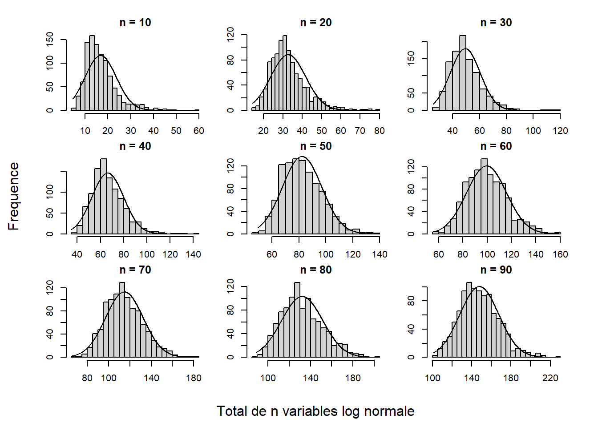
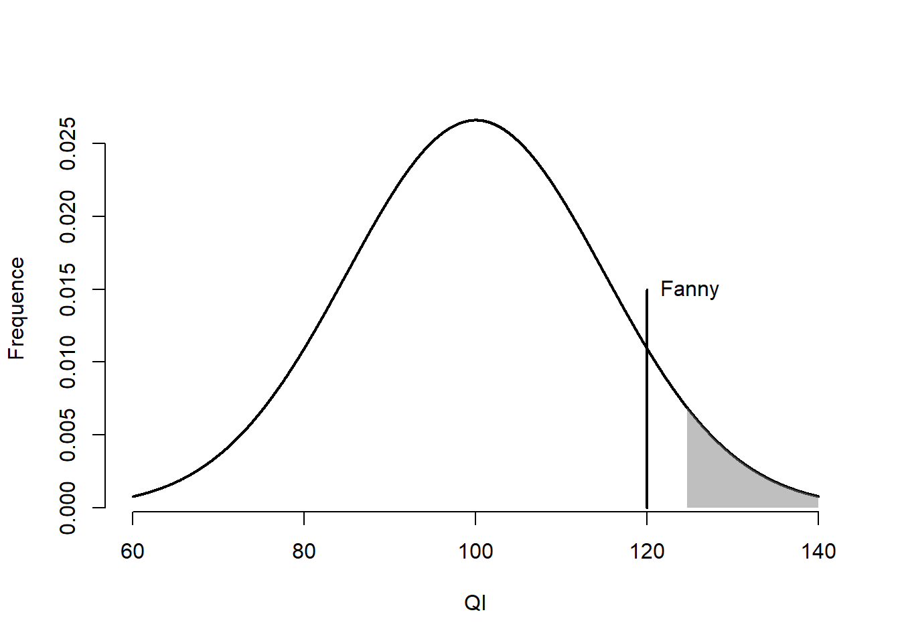
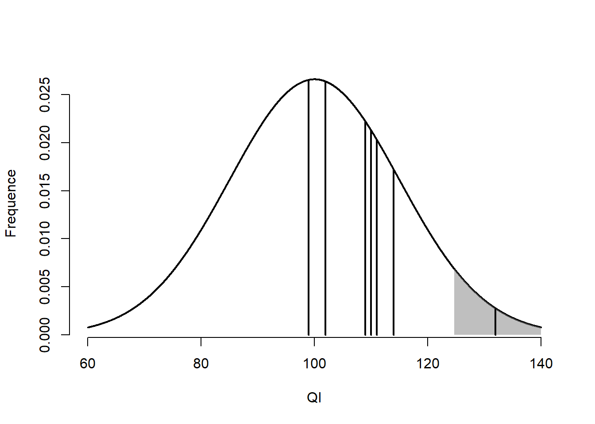
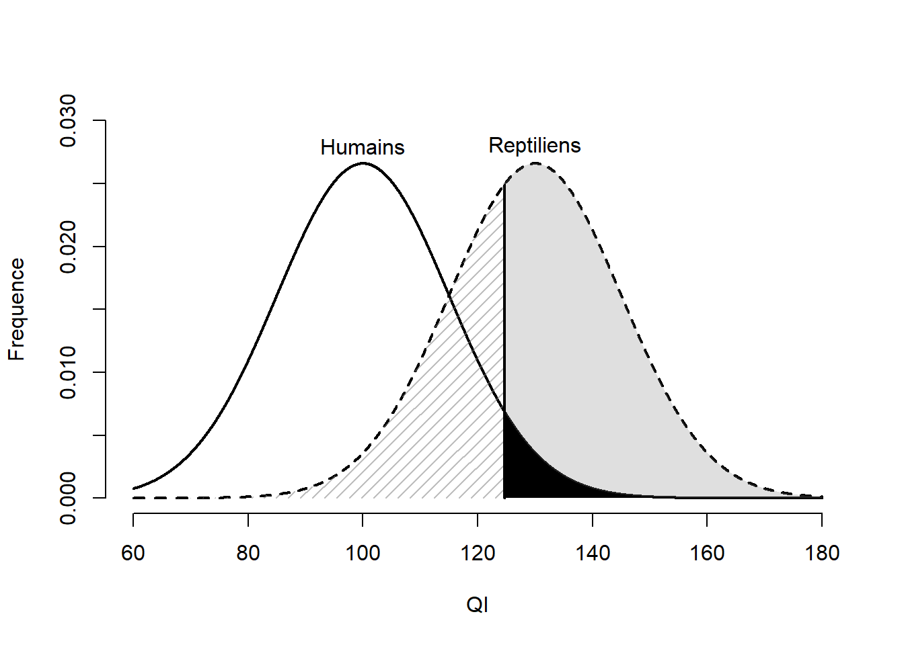
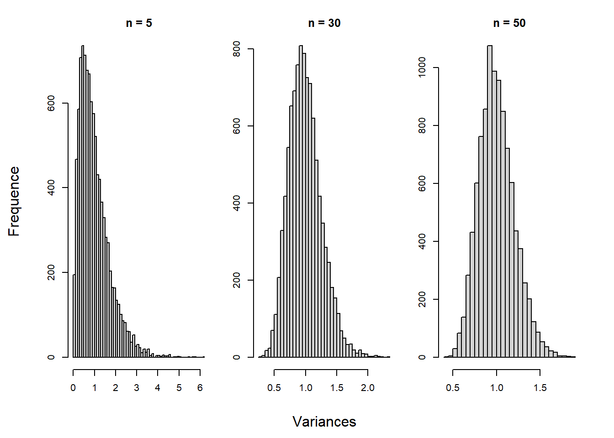
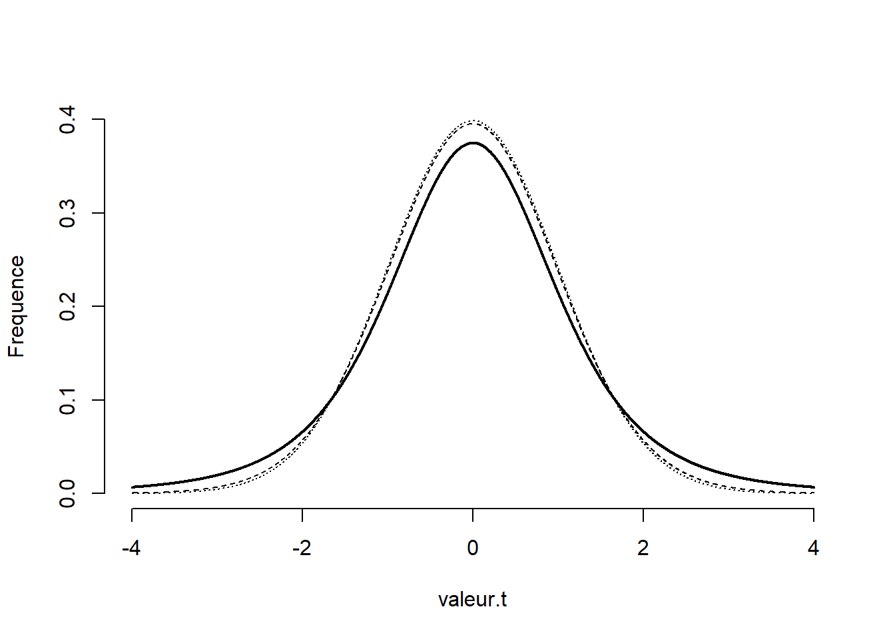

<!-- # (PART) Statistiques {-} -->

# Inférer

Le but principal de toute inférence statistique est de tirer des conclusions sur une population à partir d'un échantillon (un fragment beaucoup plus petit de la population). Comme il est rarement possible de collecter des données sur l'ensemble de la population, l'expérimentateur choisi, idéalement, un échantillon représentatif tiré aléatoirement. Une fois l'échantillon recruté et mesuré, l'expérimentateur dérive des indices statistiques. Un **indice** statistique synthétise par une estimation basée sur l'échantillon de l'information sur le **paramètre** de la population. Cet indice possède un comportement, une distribution d'échantillonnage qui détermine les différentes valeurs qu'il peut prendre. En obtenant ces indices, l'expérimentateur tente de connaître le paramètre de la population. S'il s'intéresse à la relation entre l'anxiété et un cours de méthodes quantitatives, l'expérimentateur voudra savoir si cette relation n'est pas nulle, mais aussi sa force, en termes de tailles d'effet. 

Cette tâche peut apparaître difficile considérant le peu d'informations sur la population, sa distribution de probabilité, les paramètres et la relative petite taille de l'échantillon par rapport à la population. Pour aider l'expérimentateur, les statisticiens ont  le théorème central limite. Pour eux, il est certainement l'équivalent de la théorie de l'évolution pour le biologiste ou la théorie de la relativité générale pour le physicien. Ce théorème permet de connaître comment et sous quelles conditions se comportent les variables aléatoires.

## Le théorème central limite

Les valeurs d'un échantillon sont, pour le statisticien, des variables aléatoires. Une variable aléatoire, c'est un peu comme piger dans une boîte à l'aveuglette pour obtenir une valeur. La boîte est impénétrable, personne ne sait par quel processus elle accorde telle ou telle autre valeur. Pour le statisticien, ce qui importe c'est que chaque valeur possède une chance égale aux autres d'être sélectionnée et qu'elles soient indépendantes entre elles (le fait d'en choisir une soit sans conséquence sur la probabilité des autres). 

Pour le non-initié aux fonctions permettant de créer des nombres pseudoaléatoires, une fonction **R** comme `rnorm()` ou `runif()` (*r* suivi d'un nom de distribution, voir [Les distributions]) joue parfaitement le rôle de cette boîte. Si l'usager demande une valeur, la fonction retourne une valeur aléatoire (imprévisible à chaque fois) sans connaître comment cette valeur est produite.


```r
runif(n = 1)
> [1] 0.0651
```

Le statisticien s'intéresse à inférer comment ces valeurs sont générées. Il postule ainsi que les valeurs aléatoires suivent une distribution de probabilité. Connaître cette distribution est très important, car c'est elle qui permet de répondre à des questions comme : quelle est la probabilité d'obtenir un résultat aussi rare que $x$? Ou quelle sont les valeurs attendues pour $95\%$ des tirages? Questions tout à fait pertinentes pour l'expérimentateur. Une des distributions les plus connues est certainement la distribution normale, celle qui est derrière la fonction `rnorm()` d'ailleurs. Mais, il y en a beaucoup, beaucoup d'autres. 

Lorsque plus d'une variable sont issues d'une même boîte (distribution), elles sont *identiquement distribuées*. Si ces variables aléatoires sont combinées, que ce soit en termes de produit, de quotient, d'addition, de soustraction, le résultat est une nouvelle variable aléatoire qui possède sa propre distribution nommée *distribution d'échantillonnage*. Sur le plan de la syntaxe **R**, il s'agit de réaliser des opérations mathématiques avec des variables aléatoires identiquement distribuées.


```r
# Pour répliquer
set.seed(1)

# Création de deux variables identiquement distribuées
a <- runif(n = 1)
b <- runif(n = 1)
a ; b
> [1] 0.266
> [1] 0.372

# Une nouvelle variable aléatoire
total <- a + b
```

Entre en jeu le *théorème central limite*: plus des variables aléatoires identiquement distribuées sont additionnées ensemble, plus la distribution de probabilité de cette somme se rapproche d'une distribution normale.

Par exemple, la fonction `rlnorm()` génère des variables issues d'une distribution log normale. Elle a la forme illustré à la Figure \@ref(fig:lognormal) (qui n'a rien de normal à première vue).

<div class="figure" style="text-align: center">

<p class="caption">(\#fig:lognormal)Distribution log normale</p>
</div>

En calculant la somme de plusieurs variables aléatoires de cette distribution, pour diverses valeurs de tailles d'échantillons (nombre de variables échantillonnées), les résultats tendent de plus en plus vers une distribution normale. Le code ci-dessous présente la démarche utilisée et la Figure \@ref(fig:testn) en fait la démonstration graphique en présentant les distributions d'échantillonnage obtenues.


```r
# Cette fonction sort les nombres, mais pas les graphiques.
# Différentes tailles d'échantillons
N <- seq(10, 90, by = 10)
# Nombre de tirage pour chaque élément de N
reps <- 1000

# Une boucle pour tester toutes les possibilités
for(n in N){
  total <- as.numeric()
  for(i in 1:reps){
    # Faire la somme de n valeurs tirés d'une distribution log normale
    total[i] <- sum(rlnorm(n))
  }
  # hist(total) 
}
```


La Figure \@ref(fig:testn) montre que la distribution d'échantillonnage de la somme des variables converge vers une distribution normale à mesure que la taille d'échantillon $n$ augmente. Cela est vrai pour n'importe quelle distribution de probabilité de la population. Le théorème central en dit plus que simplement la forme de la distribution. Elle affirme également qu'une distribution de probabilité d'une population ayant une moyenne $\mu$ et un écart type $\sigma$ échantillonnées sur $n$ unités, génére une distribution d'échantillonnage des totaux (indicé $t$) ayant une espérance (la moyenne) de $n\mu_t$ et un écart type de $n\sigma_t^2$.

<div class="figure">

<p class="caption">(\#fig:testn)Distributions des totaux de n variables log normales</p>
</div>


Les expérimentateurs ne connaissent pas les distributions sous-jacentes aux valeurs des unités issues de la population. Par contre, à l'aide des statisticiens et du théorème central limite, ils savent comment se comportent les sommes des variables. Les expérimentateurs s'intéressent toutefois rarement aux sommes de variable... ou le sont-ils? En fait, les expérimentateurs s'intéressent particulièrement aux sommes de variables, comme la moyenne (une somme de variables divisée par la constante $n$), la variance (la somme des écarts au carré) ou la corrélation (la somme des produits de deux variables divisée par $n-1$). Dans le cas de la moyenne, le théorème central limite stipule qu'une distribution de probabilité ayant une moyenne $\mu$ et un écart type $\sigma$ dont l'échantillon est constitué de $n$ unités, génère une distribution d'échantillonnage des moyennes avec une espérance de $\mu_{\bar{x}}$ et un écart type de $\sigma_{\bar{x}}/\sqrt{n}$.

Dans la mesure où l'expérimentateur connaît la distribution de la population (extrêmement rare, mais permet de mieux illustrer la théorie) ou qu'il recoure à une distribution d'échantillonnage connue, il peut inférer la probabilité d'une variable aléatoire par rapport à ce qui est attendu simplement par hasard. Il juge alors si cette variable est trop rare par rapport à l'hypothèse de base (nulle).

La théorie traditionnelle des tests d'hypothèses repose sur l'idée selon laquelle on compare la vraisemblance d'une variable aléatoire estimée auprès d'un échantillon par rapport à une hypothèse nulle (l'absence d'effet). En épistémologie des sciences, il n'est pas possible de montrer l'exactitude d'une hypothèse, seulement son inexactitude. Cela rappelle le principe du falsificationnisme selon lequel on ne peut prouver une hypothèse, on ne peut que la falsifier. En statistiques, c'est la rareté d'une donnée qui agira comme indice d'*inexactitude*. Si la variable aléatoire est trop rare pour l'hypothèse nulle, celle-ci est rejetée : d'autres hypothèses doivent être considérées pour expliquer ce résultat. Autrement, l'hypothèse nulle n'est pas rejetée, les preuves sont insuffisantes pour informer l’expérimentateur sur l'hypothèse nulle.

## Inférence avec la distribution normale sur une unité


Un excellent exemple en sciences humaines et sociales où la distribution de probabilité de la population est connue est le quotient intellectuel (QI). Le QI d'une population occidentale est distribué normalement (établi intentionnellement par les psychométriciens) avec une moyenne de 100 ($\mu=100$) et un écart type de $\sigma = 15$. Ces valeurs sont totalement arbitraires, il est tout aussi convenable de parler d'une moyenne de 0 et d'un écart type de 1 (la distribution peut être standardisée) quoiqu'il est contre-intuitif de parle d'un QI de 0. (Qui voudrait avoir une intelligence de 0?)

Dans la population, bien que la moyenne et la variance peuvent être connues, sélectionner une unité au hasard génère une variable aléatoire. Chaque individu de la population a une probabilité très faible d'être sélectionné et est indépendant des autres individus de la population. Il est très difficile de prédire le score exact d'une personne. Toutefois, il est possible d'avoir un idée de la variabilité des scores. La Figure \@ref(fig:regle) montre la distribution normale par rapport à la moyenne, $\mu$ pour différentes valeurs d'écart type, $\sigma$. Elle montre que 68.269% devrait se retrouvé entre plus ou moins un écart types ou encore que 95.45%  devrait se retrouvé entre plus ou moins deux écarts types. Ajuster au QI, il s'agit de 85 à 115 et de 70 à 130 respectivement


<div class="figure" style="text-align: center">

<p class="caption">(\#fig:regle)La distribution normale du QI</p>
</div>

Une autre façon de fonctionner est de prendre une personne au hasard et de mesurer son QI. Le score obtenu est une valeur aléatoire. Comme la distribution est connue avec ses paramètres, il est possible de juger de la vraisemblance de ce score (est-il rare?) par rapport à la population. 

Voici un exemple où ces informations sont pertinentes. Un groupe d'*expérimentateurs* mettent en place un outil d'évaluation qui teste si un individu donné est un humain ou un reptilien (une race d'extra-terrestre). Leur outil n'est pas si sophistiqué. En fait, il se base sur le QI, car les expérimentateurs ont remarqué que les reptiliens ont un QI beaucoup plus élevé que le QI humain.

La distribution normale du QI humain joue le rôle d'hypothèse nulle, les personnes mesurées sont admises humaines jusqu'à preuve du contraire (une présomption d'innocence en quelque sorte), un QI *trop* élevé suggérant la culpabilité.

Les expérimentateurs émettent l'hypothèse que les 5 % personnes ayant le plus haut QI sont vraisemblablement reptiliens. C'est le risque qu'ils sont prêts à prendre de sélectionner un humain et de le classer erronément comme reptilien.

Le groupe d'expérimentateurs teste leur instrument sur Fanny. Elle a un QI de 120. La Figure\ \@ref(fig:fannyd) illustre la distribution de l'intelligence dans la population et où se situe Fanny parmi celle-ci. Comment tester si elle est reptilienne? 

<div class="figure">

<p class="caption">(\#fig:fannyd)Score de Fanny sur la distribution normale</p>
</div>


La première étape est d'obtenir un **score-$z$**. Un score-$z$ est une échelle standardisée des distances d'une valeur par rapport à la moyenne. Lorsqu'une échelle de mesure est transformée en score-$z$, la moyenne est de 0 et l'écart type est égal à 1. Cela permet de mieux apprécier les distances et leur probabilité. Un score-$z$ s'obtient en prenant la différence entre une unité ($x$) par rapport à la moyenne ($\mu$) divisée par l'écart type ($\sigma$). L'équation \@ref(eq:zzz) illustre ce calcul.

\begin{equation}
z = \frac{x-\mu}{\sigma}
(\#eq:zzz)
\end{equation}

Comme un score-$z$ est standardisé, la Figure \@ref(fig:regle) est utilisable pour tirer des conclusions, car celle-ci applicable pour toutes sortes de situations où la distribution est vraisemblablement normale.


```r
fanny <- 120
z.fanny <- (fanny - 100) / 15
```

Fanny a un score-$z$ de 1.333. Maintenant, il faut traduire cette valeur en probabilité.


```r
# La probabilité que Fanny ait un QI de -Inf à z.fanny
pnorm(z.fanny)
> [1] 0.909

# En pourcentage
pnorm(z.fanny) * 100
> [1] 90.9
```

L'expectative sous l'hypothèse nulle est d'observer un score pareil ou supérieur à celui de Fanny 9.121 % du temps. Cette statistique correspond à la *valeur-$p$*, la probabilité de l'indice par rapport à sa distribution d'échantillonnage (hypothèse nulle). Comme elle ne dépasse pas le seuil de 5%, soit la limite selon laquelle le score est jugé invraisemblable, l'hypothèse nulle n'est pas rejetée (elle est humaine!).

Avec le critère d'identifier erronément les 5 % humains les plus intelligents, il s'agit, du même coup, du **taux de faux positif** *acceptable* de l'étude. Un faible sacrifice à réaliser afin identifier des reptiliens parmi les humains. La zone de rejet, c'est-à-dire la zone dans laquelle l'hypothèse nulle (humain) est rejetée, correspond à la zone ombragée à droite de la distribution.

La logique des tests statistiques inférentiels repose sur cette série d'étapes : choisir un indice, connaître sa distribution sous-jacente, déterminer l'hypothèse nulle (généralement l'absence d'effet), calculer la probabilité de l'indice par rapport à cette hypothèse nulle.

## Inférence avec la distribution normale sur un échantillon

Jusqu'à maintenant, seule une unité d'observation était traitée. L'indice et la distribution étaient également spécifiés. Dans cette section, l'exemple est étendu aux échantillons (plus d'une unité d'observation).

Fanny a un QI de 120. Si une autre personne est sélectionnée, cette nouvelle personne aurait inévitablement un autre score. Cette logique s'applique également aux échantillons. L'exemple ci-dessous échantillonne 10 unités d'une population de QI distribuée normalement avec les paramètres usuels.


```r
# Création d'un échantillon de 10 unités
set.seed(824)

# Dix valeurs arrondies avec une moyenne de 100 et un écart type de 10
QI <- round(rnorm(n = 10, mean = 100, sd = 15))
QI
>  [1] 110 111 102  99 109 102  99 110 132 114
```

<div class="figure">

<p class="caption">(\#fig:rept)Scores des unités de l'échantillon</p>
</div>

Dans la Figure \@ref(fig:rept), chaque unité est présentée par un trait vertical noir. La moyenne de cet échantillon est de 108.8 et l'écart type est de 9.762. Dans cet exemple, l'indice est clairement identifié, mais quelle est la distribution d'échantillonnage des moyennes? Selon le théorème central limite, la moyenne de la distribution d'échantillonnage est $\mu=\mu_{\bar{x}}=100$ et l'écart type est $\sigma_{\bar{x}} = \frac{\sigma}{\sqrt{n}}=\frac{15}{\sqrt{10}}=4.743$ . Maintenant, il est possible de calculer un score-$z$.

$$
z = \frac{\bar{x}-\mu_{\bar{x}}}{\sigma/\sqrt{n}}=\frac{108.8-100}{15/\sqrt{10}}=1.855
$$
Cela donne le code suivant.


```r
z <- (mean(QI) - 100)/(15 / sqrt(10))
z
> [1] 1.86
```

La fonction `(1 - pnorm(z)) * 100`, retourne la probabilité (en pourcentage) d'un résultat plus rare que l'indice obtenu auprès de l'échantillon par rapport à la population. Comme pour l'exemple de Fanny, ce chiffre est une valeur-$p$, soit la probabilité de l'indice observé par rapport à l'hypothèse nulle. La Figure\ \@ref(fig:tye) montre l'emplacement de l'échantillon sur la distribution d'échantillonnage. La probabilité de cet échantillon par rapport à l'hypothèse nulle est de 3.178 %, juste en deçà du 5 % fixé. Dans la Figure\ \@ref(fig:tye), la moyenne de l'échantillon se retrouve à l'intérieur de la zone de rejet (la zone grise). La conclusion est par conséquent de rejeter l'hypothèse nulle, l'échantillon semble provenir d'une autre distribution (avec des paramètres différents) que celle postulée.

<div class="figure">

<p class="caption">(\#fig:tye)Moyenne de l'échantillon sur la distribution normale</p>
</div>

**Qu'en est-il vraiment de ce résultat?** Pour l'expérimentateur, il ne peut aller plus loin, car il ne connaît pas la boîte noire selon laquelle les valeurs de l'échantillon sont générées. Il ne peut que constater que plusieurs (9/10) unités ont un score plus élevé que 100. Par contre, comme il s'agit d'un exemple simulé, la boîte noire est connue. C'est la fonction, `round(rnorm(n = 10, mean = 100, sd = 15))`, une distribution normale ayant $\mu=100,\sigma=15$ qui est utilisée pour générer les valeurs. L'utilisateur sait qu'il s'agit d'un faux positif (une erreur de Type I) : l'échantillon fait partie des 5 % des échantillons qui risquent de se faire rejeter accidentellement. Si l'utilisateur utilise une autre graine (`seed()`), la plupart (95%) des moyennes ne sont pas rejetées.

Pour l'instant, seule une boîte noire a été examinée - celle de l'hypothèse nulle. Qu'advient-il du vrai phénomène? Par exemple, si les reptiliens existent vraiment. Comme l'utilisateur est le maître du modèle, il peut spécifier les paramètres à sa convenance. Le QI des reptiliens est conceptualisé pour être distribué comme une distribution normale ayant $\mu_{r}=130, \sigma_r = 15$ où l'indice $r$ ne fait qu'indiquer qu'il s'agit des paramètres de la population reptilienne. Les paramètres humains sont désignés par $h$, soit $\mu_h = 100,\sigma_h = 15$.


```r
mu.h <- 100 ; sd.h <- 15
mu.r <- 130 ; sd.r <- 15
```

La Figure \@ref(fig:rh) présente les distributions de ces populations. Trois zones sont ajoutées pour illustrer les concepts statistiques d'erreur de type I, d'erreur de type II et de puissance statistique. Comme les populations sont connues, ces concepts statistiques sont calculables. 

<div class="figure" style="text-align: center">

<p class="caption">(\#fig:rh)Distribution du QI des humains et des reptiliens</p>
</div>

L'erreur de type I (présentée auparavant) représente la probabilité d'émettre un faux positif, souvent représentée par $\alpha$ (alpha). Elle correspond à la probabilité de rejeter l'hypothèse lorsqu'elle est vraie. Dans la Figure \@ref(fig:rh), il s'agit de la zone noire. Elle correspond à conclure qu'un vrai humain est un reptilien (ce qu'il n'est pas). Ce taux est fixé à l'avance par l'expérimentateur, ici, 5%. C'est le risque qu'il est prêt à prendre. Ainsi, 95% des humains sont correctement identifiés comme humains.


```r
# Erreur de type I (fixé à l'avance)
alpha <- .05 

# Valeur critique à laquelle l'expérimentateur rejette H0
v.crit <- qnorm(1 - alpha, mean = mu.h, sd = sd.h)
v.crit
> [1] 125

# Erreur de type II
beta <- pnorm(v.crit, mean = mu.r, sd = sd.r)
beta
> [1] 0.361

# Puissance statistique
puissance <- 1 - beta
puissance 
> [1] 0.639
```

La zone hachurée de la Figure \@ref(fig:rh) correspond à l'**erreur de type II**, souvent représentée par $\beta$ (beta), soit la probabilité de *ne pas rejeter* l'hypothèse nulle. Autrement dit, c'est la probabilité de ne pas trouver l'effet lorsque celui-ci est vrai. Pour cet exemple, il s'agit d'un reptilien assez sournois (avec un QI suffisamment faible pour sa population) qu'il passe inaperçu auprès des humains, ou, en d'autres termes, de conclure qu'un vrai reptilien est un humain (ce qu'il n'est pas). Cette probabilité est estimée à 36.124%, donc 36.124% des reptiliens passeront inaperçus.

La **puissance**, la zone grise de la Figure \@ref(fig:rh), correspond à la probabilité de rejeter correctement l'hypothèse nulle. Il s'agit de rejeter l'hypothèse nulle lorsqu'elle est fausse. Cela signifie d'identifier un vrai reptilien correctement. C'est exactement ce que le groupe de chercheur désire réaliser. Elle est estimée à 63.876% en ne prenant qu'une mesure de QI. La puissance est l'une des statistiques qui intéressent le plus l'expérimentateur *avant* de réaliser son étude, car elle donne une approximation sur la probabilité de trouver un résultat significatif. Par contre, les expérimentateurs ne connaissent que rarement les paramètres de la vraie distribution de l'effet qu'il désire trouver. En langage statistique, il s'agit un paramètre de non-centralité (ou de décentralisation) ou `ncp` en syntaxe **R**. L'expérimentateur recourt alors à d'habiles approximations éclairées basées sur leurs connaissances du phénomène et en regard des études déjà publiées sur le sujet (ou un sujet similaire), s'il y en a. Ces estimations souffrent tout de même d'être des variables aléatoires (elles respectent elles aussi une distribution d'échantillonnage), et non les paramètres recherchés.

Avant de procéder davantage, une dernière notion est importante à présenter : la direction du test. Dans tous les exemples précédents, l'hypothèse nulle était rejetée si une valeur plus rare était obtenue. Il s'agit d'un test d'hypothèse **unilatérale** (d'un seul côté). Cela facilite grandement la présentation de certains concepts et calculs. Un test peut être unilatérale inférieure, trouver un résultat plus faible qu'une valeur critique; ou unilatérale supérieure, trouver un résultat plus élevé qu'une valeur critique; ou encore **bilatérale**, soit trouver un résultat moins élevée ou plus élevée que des valeurs critiques. 

Dans le cas d'un test bilatéral, l'erreur de type I est divisée par 2, $\alpha/2$ pour couvrir l'espace des deux côtés de la distribution. L'espace total est identique même s'il est divisé sur les deux extrêmes. Cela implique des valeurs critiques plus élevées que si le test n'était que d'un côté et par conséquent une puissance statistique un peu plus faible, car l'effet est directionnel. La probabilité de rejeter l'hypothèse dans une direction a été diminuée pour tenir compte de l'autre côté. La Figure \@ref(fig:tt) montre un exemple de chacun de ces types de tests pour $\alpha = .05$. 

<div class="figure" style="text-align: center">

<p class="caption">(\#fig:tt)Illustration de l'erreur de type I</p>
</div>

Le choix entre unilatérale inférieure, supérieure ou bilatérale repose essentiellement sur la question de recherche de l'expérimentateur. Qu'attend-il ou que veut-il savoir du résultat? L'expérimentateur recourt généralement au test bilatéral afin d'identifier des résultats allant pour son hypothèse ou à l'opposé de son hypothèse. Cela permet notamment d'identifier des devis qui peuvent nuire aux participants. Par exemple, si un expérimentateur développe une intervention pour réduire la consommation de drogues chez les adolescents et n'est concerné que par la probabilité que l'intervention soit efficace, il peut manquer l'effet délétère d'une telle intervention, soit que l'intervention augmente la consommation de drogue. Il est certain que l'expérimentateur souhaite être rapidement mis au courant si ces résultats se dessinent.

## La distribution-$t$

Dans la plupart des cas, l'expérimentateur ne connaît pas la variance de la population. Il recourt alors à la meilleure estimation qui lui est disponible, celle obtenue auprès de l'échantillon. De recourir à une estimation au lieu de la vraie valeur cause un réel problème: l'estimation est une variable aléatoire respectant une distribution d'échantillonnage. La distribution des variances montre une légère asymétrie positive plus flagrante pour les petites tailles d'échantillon, car les variances sont distribuées en distribution-$\chi^2$.

<div class="figure">

<p class="caption">(\#fig:illvar)Distribution de la variance en fonction de la taille d'échantillon</p>
</div>

Une petite simulation faite à partir d'une distribution normale standardisée par rapport à trois tailles d'échantillon et dont la variance est estimée 10^{4} fois est présentée dans la Figure \@ref(fig:illvar). Elle montre que l'estimation n'est pas biaisée (elles sont toutes les trois centrées à 1), mais relève l'asymétrie en question pour les petites tailles d'échantillon qui tend à décroître à mesure que $n$ augmente. Autrement dit, une estimation unique (pris d'un échantillon) est plus susceptible d'être sous-estimée. Ne pas tenir compte de cet aspect augmente indûment les valeurs obtenues (à cause du dénominateur plus petit). Ainsi, il est inadéquat d'utiliser une distribution normale lorsque la variance est inconnue. Il faut plutôt opter pour la **distribution-$t$** qui, elle, tient compte de la variabilité de l'estimation de la variance. 

La distribution-$t$ est symétrique, comme la distribution normale, mais a des queues plus larges pour tenir compte de la surestimation des valeurs dû à la sous-estimation de la variance. La distribution-$t$ tend vers une distribution normale lorsque $n$ augmente, ce qui est illustré à la Figure \@ref(fig:tnorm). La ligne pleine noire montre la distribution pour 5 unités, les deux autres lignes, traits et pointillés, pour 30 et 1000 unités respectivement. Il est difficile de distinguer ces deux dernières.

<div class="figure" style="text-align: center">

<p class="caption">(\#fig:tnorm)Comparaison d'une distribution normale à deux distributions-$t$</p>
</div>

En ayant recours à des échantillons et une estimation de la variance (la variance est inconnue de l'expérimentateur, ce qui est généralement le cas), il faut procéder avec la distribution-$t$. La procédure est la même que celle utilisée avec les scores-$z$ précédemment, la différence étant que la distribution-$t$ est utilisée au lieu de la distribution normale, car l'écart type est estimé.

## Le test-$t$ à échantillon unique 

Le test-$t$ à échantillon unique permet de tester la moyenne d'échantillon par rapport à une valeur arbitraire $\mu_0$ (généralement $\mu_0 = 0$) qui joue le rôle d'hypothèse nulle.

$$ t_{n-1} = \frac{\bar{x}-\mu_0}{(s/\sqrt{n})} $$

La distribution-$t$ a un degré de liberté (l'indice de $t$ dans l'équation) qui lui est associé et qui est fixé à $dl = n - 1$, la taille d'échantillon moins 1. Un degré est perdu à cause de l'estimation de l'écart type de l'échantillon. Qu'en est-il de la probabilité d'obtenir cette moyenne? En recourant à la distribution intégrée de **R**, `pt()` il est possible d'obtenir la probabilité d'une valeur-$t$ par rapport à l'hypothèse nulle. La fonction nécessite une valeur-$t$ et le degré de liberté associé, p. ex., `pt(t = , df = n - 1)`. La valeur produite donne la probabilité d'obtenir un score plus petit jusqu'à la valeur-$t$. Une astuce permet de calculer aisément la probabilité lorsque la distribution d'échantillonnage est symétrique. Utiliser une valeur absolue permet de considérer les deux côtés de la distribution simultanément. Les valeurs-$t$ négatives sont alors positives. Comme un côté est supprimé, l'espace positif est doublé, le code pour tenir compte de cet astuce est : `(1 - pt(abs(t), df = n - 1)) * 2` où `t` est la valeur-$t$ obtenue.


```r
testt <- function(x, mu = 0){
  # x est une variable continue
  # mu est une moyenne à tester comme hypothèse nulle(H0)
  xbar <- mean(x)
  sdx <- sd(x)
  n <- length(x)
  vt <- (xbar - mu) / (sdx / sqrt(n))
  dl <- n - 1
  vp <- (1 - pt(abs(vt), df = dl)) * 2 
  statistique <- list(valeur.t = vt, 
                      dl = dl, 
                      valeur.p = vp)
  return(statistique)
}
```

Une fois la fonction créée, il est possible de la tester en la comparant avec la fonction **R** de base `test.t()`. Le code suivant crée un échantillon de 30 unités avec une moyenne de 1 et un écart type de 1.


```r
# Un exemple de jeu de données
set.seed(20)
x = rnorm(n = 30, mean = 1, sd = 1)
# Vérification de la fonction maison
testt(x)
> $valeur.t
> [1] 3.69
> 
> $dl
> [1] 29
> 
> $valeur.p
> [1] 0.000919
# Comparer avec la fonction R
t.test(x)
> 
> 	One Sample t-test
> 
> data:  x
> t = 4, df = 29, p-value = 9e-04
> alternative hypothesis: true mean is not equal to 0
> 95 percent confidence interval:
>  0.31 1.08
> sample estimates:
> mean of x 
>     0.696
```

<div class="figure" style="text-align: center">

<p class="caption">(\#fig:sss)Valeur-$t$ de l'échantillon sur la distribution-$t$</p>
</div>

Qu'est-ce que ces résultats signifient? La Figure \@ref(fig:sss) montre la distribution d'échantillonnage de l'hypothèse nulle, c'est-à-dire l'hypothèse selon laquelle la moyenne de la population est égale à 0. Les zones grises montrent les zones de rejet. Si une valeur-$t$ se retrouve dans ces zones, elle est jugée comme *trop rare*, il faut alors rejeter l'hypothèse nulle. C'est ce qui s'est produit ici. Rien de surprenant, l'échantillon est tiré d'une distribution normale avec une moyenne de 1 et un écart type de 1.

## Critiques des tests d'hypothèses

TODO

Le présent ouvrage ne couvre que l'aspect traditionnel ou classique des tests d'hypothèse. Cette approche est remise en question depuis 1950 jusqu'à aujourd'hui. D'excellents ouvrages couvrent les failles et solutions des tests d'hypothèses classiques de façon plus approfondie qu'il ne l'est fait ici.

* L'hypothèse nulle n'est jamais susceptible d'être vraie.
* La conclusion statistique n'est pas celle désirée par l'expérimentateur.
* La significativité statistique n'implique pas la significativité pratique.
* Les expérimentateurs interprètent incorrectement la valeur-$p$.
* Une valeur-$p$ faible n'est pas garantie de la reproductibilité.
* La dichotomisation de la preuve $p<=\alpha$.
* Une saine utilisation de la valeur-$p$ n'accomplit pas grand-chose.
* L'obsession de la valeur-$p$ cause plus de problèmes qu'elle n'en résout : $p$-hacking, triturage de données, abus de variables, comparaison multiple, biais pour les hypothèses originales et  surprenantes.


