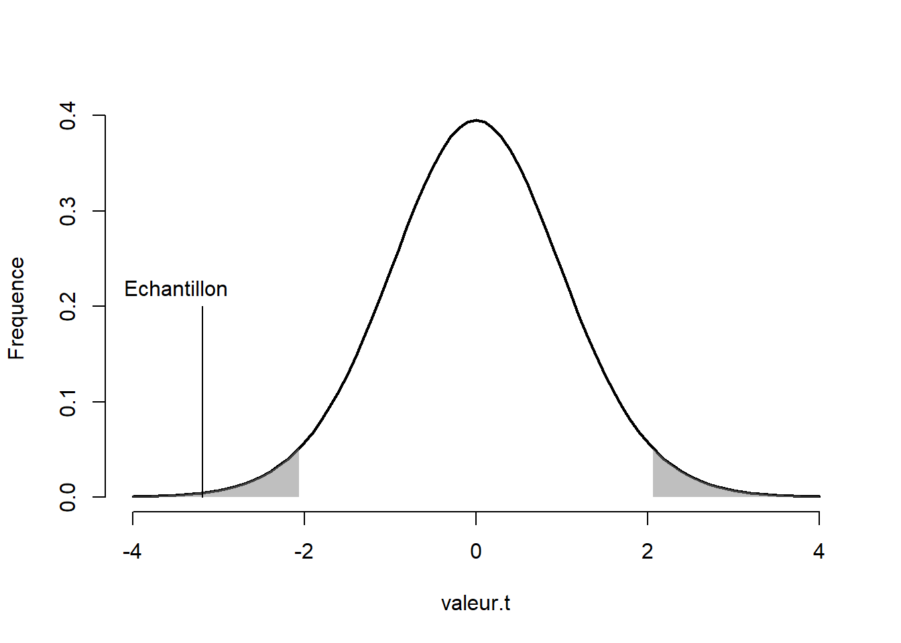

# Analyser

En continuation de l'introduction des théories des tests d'hypothèses (voir [Inférer]) et l'aperçu donnée par [le test-$t$ à échantillon unique], cette section poursuit la présentation en introduisant des analyses statistiques de bases comme les différences de moyennes, l'association linéaire et les tests pour données nominales. Les tests-$t$ indépendant et dépendant, l'analyse de variables, la covariance, la corrélation ainsi que le test du $\chi2$ pour table de contingence sont présentées. 

## Les différences de moyennes

### Le test-$t$ indépendant

En général, l'expérimentateur ne s'intéresse pas à comparer une moyenne à une valeur arbitraire, comme c'était le cas avec [le test-$t$ à échantillon unique]. Cela peut lui être assez trivial. Il s'intéresse plutôt à comparer une moyenne à une autre moyenne, soit une différence entre deux groupes indépendants, par exemple, quelle est la différence entre un groupe traitement et un groupe contrôle?

En se basant sur le test $t$ à échantillon unique, la valeur-$t$ pour deux moyennes se calcule selon l'équation \@ref(eq:test2)

\begin{equation}
t_{n-2} = \frac{\bar{x_1}-\bar{x_2}}{\sqrt{\frac{s^2_{1}}{n_1}+\frac{s^2_{2}}{n_2}}}
(\#eq:test2)
\end{equation}

où l'indice de la valeur-$t$ est le nombre de degrés de liberté $n-2$. Comme deux variances sont estimées, deux degrés de libertés sont imputés, ce qui octroi $n-2$ degrés. En plus de considérer $\bar{x_2}$ la valeur *arbitaire* de comparaison (l'ordre de $\bar{x_2}$ et $\bar{x^1}$ est arbitraire), les deux écarts types sont également considérés au dénominateur. 

Une fois le calcul réalisé, la logique du test d'hypothèse est la même, à l'exception de l'hypothèse nulle qui correspond maintenant à l'absence de différence entre les deux moyennes. 

Voici un exemple de programmation du test-$t$ pour deux groupes indépendants.


```r
testt.ind <- function(x1, x2){
  # x1 est une variable continue associée au groupe 1
  # x2 est une variable continue associée au groupe 2
  
  # Calcul des moyennes
  x1bar <- mean(x1) ; x2bar <- mean(x2)
  
  # Calcul des variances
  x1var <- var(x1) ; x2var <- var(x2)
  
  # Calcul des tailles d'échantillon
  nx1 <- length(x1) ; nx2 <- length(x2)
  
  # Valeur-t, degrés de liberté et valeur-p
  vt <- (x1bar - x2bar) / sqrt(x1var / nx1 + x2var / nx2)
  dl <- nx1 + nx2 - 2
  vp <- (1 - pt(abs(vt), df = dl)) * 2 
  statistique <- list(valeur.t = vt, dl = dl, valeur.p = vp)
  return(statistique)
}
```

Pour générer un exemple de données, le code ci-après crée un échantillon de 15 unités réparties en deux groupes, le premier groupe (`gr0`) est tiré d'une distribution normale ayant une moyenne de 1 et un écart type de 1, le deuxième groupe (`gr1`), une moyenne de 0 et un écart type de 1. La syntaxe illustre la création de deux variables pour créer les deux groupes. Il est aussi possible d'envisager la création sur en termes d'équation linéaire, comme l'équation \@ref(eq:el1),

\begin{equation}
y = \mu_0 + \mu_1x_1 + \epsilon
(\#eq:el1)
\end{equation}

où $y$ est le score observé des unités et les autres variables construisent ce score, $\mu_0$ correspond à la moyenne du groupe référent de population (le groupe *contrôle* en quelque sorte.), $\mu_1$ réfère à la différence de moyenne entre les deux groupes identifiés par $x_1$ qui réfère à l'assignation au groupe, soit 0 pour le groupe *contrôle* et 1 pour le groupe *différent*. Pour ce même exemple, $\mu_1 = -1$. Par le produit $\mu_1x_1$, le groupe *contrôle* associé à la valeur 0 n'a pas de modification de la moyenne, $-1*0=0$ alors le groupe *différent* associé  à la valeur\ 1, $-1*1=-1$. Enfin, $\epsilon$ correspond à la variabilité entre les unités. Cette façon de programmer la création des variables illustre bien l'association linéaire qui existe même dans les différences de moyennes et sera très utile pour des modèles plus compliqués.


```r
# Un exemple de jeu de données programmé de deux façons
# Méthode 1
set.seed(2021)
gr0 <- rnorm(n = 15, mean = 1, sd = 1)
gr1 <- rnorm(n = 15, mean = 0, sd = 1)

# Méthode 2
set.seed(2021)

x1 <- c(rep(0, 15), rep(1, 15)) # Appartenance au groupe (0 et 1)
e  <- rnorm(n = 30, mean = 0, sd = 1) # Erreur interindividuel
mu0 <- 1  # La moyenne du groupe référent
mu1 <- -1 # Le deuxième groupe a une différence de moyenne de -1

y <- mu0 + mu1 * x1 + e

# Présenter quelques participants; retirer les crochets pour voir tous
(cbind(method1 = c(gr0, gr1), method2 = y))[10:20,]
>       method1 method2
>  [1,]  2.7300  2.7300
>  [2,] -0.0822 -0.0822
>  [3,]  0.7272  0.7272
>  [4,]  1.1820  1.1820
>  [5,]  2.5085  2.5085
>  [6,]  2.6045  2.6045
>  [7,] -1.8415 -1.8415
>  [8,]  1.6233  1.6233
>  [9,]  0.1314  0.1314
> [10,]  1.4811  1.4811
> [11,]  1.5133  1.5133
```
Les données sont identiques.

Une fois la fonction créée, il est possible de la tester et de la comparer avec la fonction **R** de base `test.t()`.


```r
# Vérification de la fonction maison
testt.ind(gr0, gr1)
> $valeur.t
> [1] 3.4
> 
> $dl
> [1] 28
> 
> $valeur.p
> [1] 0.00205

# Comparer avec la fonction R
t.test(gr0, gr1, var.equal = TRUE)
> 
> 	Two Sample t-test
> 
> data:  gr0 and gr1
> t = 3, df = 28, p-value = 0.002
> alternative hypothesis: true difference in means is not equal to 0
> 95 percent confidence interval:
>  0.54 2.18
> sample estimates:
> mean of x mean of y 
>     1.332    -0.029
```

Les équations et codes précédents ne sont adéquats que si les variances sont égales entre les deux groupes. Cette notion est quelque peu trahie par la spécification dans la fonction **R** de l'argument `var.equal = TRUE` qui par défaut est `FALSE`. Pour un test-$t$ indépendant suivant les règles de l'art, il faut appliquer une correction (approximation de Welsh) aux degrés de liberté. Les degrés de liberté deviennent moins élégants et respectent l'équation\ \@ref(eq:welsh).

\begin{equation}
dl=\frac{\left(\frac{s^2_1}{n_1}+\frac{s^2_2}{n_2}\right)^2}{\frac{\left(\frac{s^2_1}{n_1}\right)^2}{n_1-1}+\frac{\left(\frac{s^2_2}{n_2}\right)^2}{n_2-1}}
(\#eq:welsh)
\end{equation}

En apportant cette correction au code initial.


```r
testt.ind2 <-function(x1, x2){
  # x1 est une variable continue associée au groupe 1
  # x2 est une variable continue associée au groupe 2
  x1bar <- mean(x1) ; x2bar <- mean(x2)  # Les moyennes
  x1var <- var(x1) ; x2var <- var(x2)    # Les variances
  nx1 <- length(x1) ; nx2 <- length(x2)  # Les tailles
  
  # L'erreur type 
  et <- sqrt(x1var / nx1 + x2var / nx2)
  
  # Valeur-t
  vt <- (x1bar - x2bar) / et
  
  # Correction des degrés de liberté
  dl <- et^4 / 
    ((x1var^2 / (nx1^2 * (nx1 - 1))) + 
       (x2var^2 / (nx2^2 * (nx2 - 1))))
  
  # Valeur-p
  vp <- (1 - pt(abs(vt), df = dl)) * 2 
  
  statistique <- list(valeur.t = vt, dl = dl, valeur.p = vp)
  return(statistique)
}
```

Le voici comparé à la fonction **R** de base.


```r
t.test(gr0, gr1) # Absence de l'argument var.equal = TRUE
> 
> 	Welch Two Sample t-test
> 
> data:  gr0 and gr1
> t = 3, df = 27, p-value = 0.002
> alternative hypothesis: true difference in means is not equal to 0
> 95 percent confidence interval:
>  0.539 2.182
> sample estimates:
> mean of x mean of y 
>     1.332    -0.029
testt.ind2(gr0, gr1)
> $valeur.t
> [1] 3.4
> 
> $dl
> [1] 26.9
> 
> $valeur.p
> [1] 0.00213
```

Les sorties sont identiques.

<div class="figure" style="text-align: center">

<p class="caption">(\#fig:disttt)Valeur-$t$ de la différence de moyenne sur la distribution-$t$</p>
</div>

La Figure \@ref(fig:disttt) illustre où se situe la moyenne de l'échantillon par rapport à la distribution d'échantillonnage de l'hypothèse nulle. Comme la valeur se retrouve dans la zone de rejet ou, de façon équivalente, la valeur-$p$ est plus petite que la valeur $\alpha$ fixée à .05, on rejette l'hypothèse nulle, il y a vraisemblablement une différence entre les groupes. C'est bien l'intention derrière la création des données.

Voici comment il est possible de rapporter les résultats.


> La présente étude compare deux groupes sur une échelle de mesure psychologique. Le test-$t$ indépendant suggère que la différence entre les groupes est significative, $t(26.912) =3.398, p =  0.002$.

### Le test-$t$ dépendant

Un autre test-$t$ est celui permettant de comparer deux de temps de mesure sur les mêmes participants. L'hypothèse est de vérifier si $\mu_1 = \mu_2$, soit la moyenne du temps\ 1 est égale à la moyenne du temps\ 2. Une habile manipulation mathématique permet de poser cette hypothèse en hypothèse nulle, $\mu_1-\mu_2=0$. Il est intéressant de noter que la différence entre deux variables est normalement distribuée si la variance est connue ou distribuée en $t$ si la variance est inconnue.

Ce test est utile lorsqu'il faut tester si les participants se sont améliorés ou détériorés entre deux temps de mesure. Pour calculer la valeur-$t$,

$$ t_{dl_1} = \frac{\bar{x_1}-\bar{x_2}}{\sigma_d/\sqrt{n}} $$

avec $n-1$ degrés de liberté à cause de l'estimation de l'écart type des différences. Les étapes subséquentes sont identiques au test-$t$ à groupe unique.


```r
testt.dep <- function(temps1, temps2){
  # Temps est une variable continue mesurée 
  # à deux occasions auprès des mêmes participants
  
  # Calculer la différence
  difference <- temps1 - temps2
  dbar <- mean(difference) # La moyenne des différences
  dvar <- var(difference)  # L'écart type des différences
  n <- length(difference)  # Taille d'échantillon
  
  # Valeur-t, degrés de liberté et valeur-p
  vt <- (dbar) / sqrt(dvar / n)
  dl <- n - 1                   
  vp <- (1 - pt(abs(vt), df = dl)) * 2 
  statistique <- list(valeur.t = vt, dl = dl, valeur.p = vp)
  return(statistique)
}
```

Pour créer le jeu de données, les étapes sont similaires au test-$t$ indépendant pour des temps de mesure indépendants (sans corrélation) où seules les populations des temps de mesure sont définis. Il est possible de spécifier une corrélation entre les deux de mesures. Cela sera introduit dans la section [La corrélation].

Dans le jeu de données suivant, 25 personnes sont mesurées à deux temps de reprises. Il n'y a pas de corrélation entre les temps de mesure. La variance des temps de mesure est de 1. La différence de moyenne est de 2. La syntaxe simule la situation suivante, le `temps1` correspond à la mesure initiale et `difference` correspond à la différence entre les temps de mesure. La somme de ces deux scores donnent la mesure au `temps2`. Cela montre assez simplement que la différence entre `temps2 - temps1` permet de retrouver le vecteur de `difference`.


```r
# Un exemple de jeu de données
set.seed(148)
temps1 <- rnorm(n = 25, mean = 0, sd = 2)
difference <- rnorm(n = 25, mean = 2, sd = 2)
temps2 <- temps1 + difference
```

La fonction base de **R** est encore `t.test()`, mais il faudra spécifier l'argument `paired = TRUE` pour commander un test apparié (une autre appellation pour un test-$t$ dépendant).


```r
t.test(temps1, temps2, paired = TRUE)
> 
> 	Paired t-test
> 
> data:  temps1 and temps2
> t = -3, df = 24, p-value = 0.004
> alternative hypothesis: true mean difference is not equal to 0
> 95 percent confidence interval:
>  -2.172 -0.465
> sample estimates:
> mean difference 
>           -1.32
testt.dep(temps1, temps2)
> $valeur.t
> [1] -3.19
> 
> $dl
> [1] 24
> 
> $valeur.p
> [1] 0.00395
```

Les sorties sont identiques.

<div class="figure" style="text-align: center">

<p class="caption">(\#fig:testtttt)Valeur-$t$ de moyenne de différences sur la distribution-$t$</p>
</div>

La Figure \@ref(fig:testtttt) montre où se situe la différence de moyenne par rapport à la distribution d'échantillonnage de l'hypothèse nulle. Comme la valeur se retrouve dans la valeur-$p$ est plus petite que la valeur $\alpha$ fixée à .05, on rejette l'hypothèse nulle; il y a vraisemblablement une différence entre les temps de mesure, ce qui était l'intention derrière la création des données.

Voici comment rapporter dans un article.


> Un groupe de participants est mesuré à deux reprises sur une même mesure psychologique. Le test-$t$ dépendant suggère que la différence entre les temps de mesure est significative, $t(24) =-3.188, p =  0.002$.

### L'analyse de variance à un facteur

L'analyse de variance, souvent appelée ANOVA (*ANalysis Of VAriance*), permet de comparer une variable continue sur plusieurs groupes ou traitements. Il s'agit d'une extension du test-$t$ indépendant qui compare une variable continue auprès de deux groupes. À plus de deux groupes, l'analyse de variance entre en jeu.

**Attention!** Cette section se limite au cas où les groupes sont de tailles identiques (même nombre de participants par groupe, le symbole $n_k$ pour référer à cette quantité) afin d'en simplifier la présentation. 

#### La logique de l'analyse de variance

Comme il a été présenté dans la section sur [le test-$t$ indépendant], le modèle sous-jacent à l'analyse de variance à un facteur est une extension de ce modèle pour $k$ groupes. Chaque groupe est associé à une différence de moyennes $\mu_i$, pour $i = 1,2, ...k$ par rapport à la moyenne groupe référent, $\mu_0$. Les variables $x_i$ définissent l'appartenance au groupe $i$ par la valeur 1 et 0 pour les autres groupes (codage factice ou *dummy coding*).

$$y = \mu_0 + \mu_1x_1 + \mu_2x_2+ ... +\mu_kx_k + \epsilon$$
L'hypothèse nulle est la suivante. 
$$\sigma^2_1=\sigma^2_2=...=\sigma^2_k$$
L'analyse de variance est un test omnibus (global) qui ne teste pas où est la différence, mais bien *s'il y a au moins une différence* entre les groupes. L'hypothèse nulle peut s'avérer fausse de plusieurs façons. Il peut y avoir une ou plusieurs inégalités pour rejeter l'hypothèse nulle. 

La logique sous-jacente est basée sur l'idée selon laquelle les moyennes des groupes proviennent d'une même population. Elle compare les hypothèses suivantes : l'hypothèse nulle : les données (les moyennes) proviennent d'une même population; et l'hypothèse opposée : les données ne proviennent pas d'une même population. 

Elle suggère ainsi deux types de variances (ou carré moyen, CM, dans ce contexte) : le CMI, carré moyen intergroupe, lorsque l'hypothèse nulle est vraie (la variabilité des moyennes); et le CMR, carré moyen résiduel, lorsque l'hypothèse nulle n'est ni vraie, ni fausse (la variabilité des données). 

Pour calculer le CMI, la variance des moyennes des groupes est 
$$s^2_{\bar{x}}=\sum_{i=1}^k\frac{(\bar{x_i}-\overline{\overline{x}})^2}{k-1}$$ 

où $\overline{\overline{x}}$ est la grande moyenne (la moyenne de toutes les unités). Cette statistique se retrouve sur la plan des distributions d'échantillonnage (comment les moyennes se distribuent). Il faut ainsi multiplier cette valeur par $n_k$, le nombre d'unités par groupes, pour obtenir une estimation de la variance de la population. Ainsi, $\text{CMI} = s^2_{\bar{x}}n_k$.

Il y a plusieurs méthodes pour calculer le CMR, comme le CMR est envisagé comme la moyenne des variances de groupes, il est pratique d'en référer le calcul à sa définition.  

$$
\text{CMR} = \bar{s^2} = \frac{1}{k}\sum_{i=k}^k\sigma_k^2 
$$
Lorsque l'hypothèse nulle est vraie, les variances des groupes sont traitées comme le résultat d'une étude sur une même population, comme si $k$ petites études avaient été réalisées. L'estimation du CMI est de l'ordre d'une distribution d'échantillonnage connue par le théorème central limite définissant le comportement des moyennes lorsqu'elles proviennent d'une même population (c'est ce que pose comme hypothèse l'analyse de variance). Toutefois, la valeur du CMI est relative au CMR, la quantité de bruit dans les données. 

L'analyse de variance pose alors la question : la variance attribuable aux différentes moyennes des groupes est-elle supérieure à la variance résiduelle? Pour tester cette question, une possibilité est de tester le ratio $\frac{\text{CMI}}{\text{CMR}}$, ce qui donne une valeur-$F$. Le ratio de deux variances suit une distribution-$F_{dl_1, dl_2}$ avec deux degrés de liberté différents qui lui sont associés. Autrement dit, la distribution-$F$ est la distribution d'échantillonnage du ratio deux variances.

$$F_{dl_1,dl_2} = \frac{n_ks^2_{\bar{x}}}{\bar{s^2}} = \frac{\text{CMI}}{\text{CMR}}$$
où $dl_1 = k-1$, et $dl_2 = k(n_k-1)$. L'interprétation du ratio est ainsi :

* si $\text{CMI}>\text{CMR}$, alors $\text{CMI}/\text{CMR}>1$;
* si $\text{CMI}=\text{CMR}$, alors $\text{CMI}/\text{CMR}=1$;
* si $\text{CMI}<\text{CMR}$, alors $\text{CMI}/\text{CMR}<1$.

Plus les moyennes sont variables, plus la valeur du CMI est élevée. Plus les unités sont variables, plus le CMR est élevé. S'il existe au moins une différence entre les groupes, le ratio est en faveur du CMI. En fait, plus $F$ est élevée, toutes autres choses étant égales (les degrés de libertés, p. ex.), plus la probabilité de rejeter l'hypothèse nulle est grande. Ainsi, lorsque, la valeur-$F$ est obtenue, il est possible de calculer une valeur-$p$, et le test d'hypothèse se déroule tel qu'auparavant.

#### La création de données

Dans un jeu de données commun, une variable désigne les groupes et une autre leur score sur une certaine mesure. La syntaxe suivante montre trois façons pour créer une variable facteur.


```r
nk <- 5 # nombre d'unités par groupe
k <- 4  # nombre de groupes
# En ordre
groupe1 <- rep(1:k, each = nk)
# En alternance
groupe2 <- rep(1:k, times = nk)
# Aléatoire
set.seed(765)
groupe3 <- sample(x = 1:k, size = (k * nk), replace = TRUE)
cbind(groupe1, groupe2, groupe3)
>       groupe1 groupe2 groupe3
>  [1,]       1       1       4
>  [2,]       1       2       2
>  [3,]       1       3       4
>  [4,]       1       4       3
>  [5,]       1       1       3
>  [6,]       2       2       4
>  [7,]       2       3       3
>  [8,]       2       4       1
>  [9,]       2       1       4
> [10,]       2       2       3
> [11,]       3       3       3
> [12,]       3       4       2
> [13,]       3       1       3
> [14,]       3       2       3
> [15,]       3       3       2
> [16,]       4       4       4
> [17,]       4       1       4
> [18,]       4       2       2
> [19,]       4       3       1
> [20,]       4       4       1
```

Il est aussi possible de remplacer les arguments, `1:k` par des chaînes de caractères (des catégories au lieu de nombres).


```r
categorie <- c("char", "chat", "cheval", "chevalier", "chien")
nk <- 2
groupe <- as.factor(rep(categorie, each = nk)) # Déclarer comme facteur
groupe
>  [1] char      char      chat      chat      cheval   
>  [6] cheval    chevalier chevalier chien     chien    
> Levels: char chat cheval chevalier chien
```
Une bonne pratique dans le contexte des comparaisons de moyenne est de déclarer les variables catégorielles comme facteur avec `as.factor()`.

Pour créer des valeurs à ces catégories, une stratégie simple est de créer des valeurs pour chacun des groupes et de les combiner. 


```r
# Pour la reproductibilité
set.seed(2602)
char      <- rnorm(n = nk, mean = 15, sd = 4) 
chat      <- rnorm(n = nk, mean = 20, sd = 4) # Différences ici
cheval    <- rnorm(n = nk, mean = 10, sd = 4) # et ici
chevalier <- rnorm(n = nk, mean = 15, sd = 4)
chien     <- rnorm(n = nk, mean = 15, sd = 4) 
# Combinés
score <- round(c(char, chat, cheval, chevalier, chien))
# Conserver toutes les informations en un jeu de données
donnees <- data.frame(groupe, score)
head(donnees)
>   groupe score
> 1   char    14
> 2   char    12
> 3   chat    17
> 4   chat    21
> 5 cheval    14
> 6 cheval    10
```

#### Codage factice

La plupart du temps, les variables de regroupement, les variables identifiant l'appartenance aux groupes, sont construites avec une variable de type facteur, c'est-à-dire une colonne avec différentes valeurs ou libellés. C'est d'ailleurs ce qui a été fait dans l'exemple précédent. Cette méthode d'identification de groupement implique une programmation plus intensive, surtout pour la création de valeurs. En termes de programmation, il est plus élégant de recourir à une fonction de codage factice (*dummy coding*). Cela permettra de représenter fidèlement le modèle sous-jacent. Étrangement, il n'y a pas de fonction de base avec **R** pour du codage factice. Une fonction maison permettra d'automatiser la réassignation des groupes (en une seule variable) sur plusieurs variables désignant leur appartenance.


```r
dummy.coding <- function(x){
  # Retourne un codage factice de x
  # avec les facteurs en ordre alphabétique
  W <- sapply(unique(x), 
              USE.NAMES = TRUE,
              FUN = function(v) {x == v}) * 1 
  return(W)
}
```


La plupart du temps, les variables de regroupement, les variables identifiant l'appartenance aux groupes, sont construites avec une variable de type facteur, c'est-à-dire une colonne avec différentes valeurs ou libellés. C'est d'ailleurs ce qui a été fait dans l'exemple précédent. Cette méthode d'identification de groupement implique une programmation plus intensive, surtout pour la création de valeurs. En termes de programmation, il est plus élégant de recourir à une fonction de codage factice. Cela permettra de représenter fidèlement le modèle sous-jacent. Étrangement, il n'y a pas de fonction de base avec **R** pour du codage factice. Une fonction maison permettra d'automatiser la réassignation des groupes (en une seule variable) sur plusieurs variables désignant leur appartenance.

<!-- ```{r} -->
<!-- dummy.coding <- function(x){ -->
<!--   # Retourne un codage factice de x -->
<!--   # avec les facteurs en ordre alphabétique -->

<!--   tab <- table(x)    # Extraire une table -->
<!--   k <- length(tab)   # Nombre de groupes -->
<!--   n <- length(x)     # Nombre d'unités -->
<!--   X <- matrix(0, nrow = n, ncol = k) # Création d'une nouvelle variable  -->
<!--   xlev <- as.factor(x) -->
<!--   for (i in 1:n) { -->
<!--     X[i, xlev[i]] <- 1 # Identification des groupes -->
<!--   } -->
<!--   colnames(X) <- names(tab) -->
<!--   return(X) -->
<!-- } -->
<!-- ``` -->

La fonction maison retourne un codage factice pour les $k$ groupes. **Attention**, le codage factice est fait en ordre alphabétique. Comme il est redondant d'avoir $k$ groupes (identifier $k$ groupes nécessite $k-1$ variables), un groupe référent est désigné. Ce dernier aura 0 sur tous les scores. Pour retirer un groupe, l'utilisation des crochets et une valeur négative associés à la colonne du groupe référent feront l'affaire, p. ex. `dummy.coding(x)[,-k]` déclare le $k$^e^ groupe comme le groupe référent.


```r
# Pour la reproductibilité
set.seed(2602)

# Facteur de groupe
k <- length(categorie)
nk <- 2
groupe <- rep(categorie, each = nk)

# Groupement
X <- dummy.coding(groupe)[,-5] # groupe 4 "chien" comme référent

# Spécifications des paramètres
mu0 <- 15
mu <- c(0, 5, -5, 0)
e <- rnorm(n = k * nk, sd = 4)

# Création des scores
score <- round(mu0 + X %*% mu + e)

# Comparaison des valeurs
cbind(donnees, score)
>       groupe score score
> 1       char    14    14
> 2       char    12    12
> 3       chat    17    17
> 4       chat    21    21
> 5     cheval    14    14
> 6     cheval    10    10
> 7  chevalier    12    12
> 8  chevalier    17    17
> 9      chien    21    21
> 10     chien    18    18
```

L'expression `X %*% mu` est une multiplication d'algèbre matricielle qui multiplie la matrice $n \times p$ de codage factice $X$ à une matrice $p\times 1$ de moyennes $\mu$. L'opération multiple les $p$ éléments d'une ligne de $X$ à la colonne $p$ correspondante de $\mu$. En algèbre matricielle Le résultat est une matrice $n \times 1$ qui contient les différences de moyennes pour chaque unité. Dans la même ligne de syntaxe, la moyenne de la population (groupe référent), $\mu_0$ est ajoutée et la variation individuelle, $\epsilon$.

Les scores produits sont identiques. Dans cet exemple par contre, l'origine des différences entre groupes est plus évidente, spécialement en comparant le modèle sous-jacent à l'analyse de variance. La source d'erreur est visible ainsi que les différences de moyennes. La force de cette deuxième méthode est qu'elle peut facilement être automatisée pour créer des jeux de données, alors que la première est plus compliquée. La seconde méthode nécessite six arguments ($n_k$, $\mu_0$, $\mu_{1:k}$, et $\sigma_{e}$ en plus de catégories et définir le groupe référent), la première aurait de la difficulté à spécifier tous les arrangements de différence de moyennes automatiquement, quoiqu'elles sont plus personnalisables.

#### Analyse


À toute fin pratique, un jeu de données est recréé avec les catégories et paramètres précédents, mais avec $n_k=20$ unités par groupe. La fonction **R** de base est `aov()`. Elle prend comme argument une formule, de forme `VD ~ VI` (variable dépendante prédite par variable indépendante) et un jeu de données duquel prendre les variables. Il existe également une fonction `anova()`, une fonction un peu plus complexe que `aov()`. Pour obtenir toute l'information désirée de la sortie de la fonction, il faut demander un sommaire de la sortie avec `summary()`.


```r
# Anova de base
res <- aov(score ~ groupe, data = donnees)
summary(res)
>             Df Sum Sq Mean Sq F value  Pr(>F)    
> groupe       4    834   208.4      14 5.1e-09 ***
> Residuals   95   1414    14.9                    
> ---
> Signif. codes:  
> 0 '***' 0.001 '**' 0.01 '*' 0.05 '.' 0.1 ' ' 1

# Fonction maison
gr <- table(donnees$groupe)
k  <- length(gr)          # Nombre de groupes
nk <- dim(donnees)[1] / k # Nombre de participants par groupe

# Moyennes et variance par (`by()`) groupes
moyenne  <- by(donnees$score, donnees$groupe, mean)
variance <- by(donnees$score, donnees$groupe, var)

# Statistiques
CMI <- nk * var(moyenne)
CMR <- mean(variance)
dl1 <- k - 1
dl2 <- k * (nk - 1)
vf <- CMI / CMR 
vp <- (1 - pf(vf, df1 = dl1, df2 = dl2)) 

# Création du tableau
resultats <- matrix(0,2,5) # Tableau vide

# Ajouter noms
colnames(resultats)  <- c("dl", "SS", "CM", "F", "p")
row.names(resultats) <- c("groupe", "residu")

# Ajouter valeurs
resultats[1,] <- c(dl1, CMI * dl1, CMI, vf, vp)
resultats[2,] <- c(dl2, CMR * dl2, CMR, 0, 0)
resultats
>        dl   SS    CM  F        p
> groupe  4  834 208.4 14 5.15e-09
> residu 95 1414  14.9  0 0.00e+00
```

Les résultats sont identiques, les seules différences étant dues à l'arrondissement. Comme la valeur-$p$ est de 5.145\times 10^{-9}, ce qui est extrêmement plus petit que l'usuel .05 (ou un autre taux d'erreur de type I fixé à l'avance), l'hypothèse nulle est rejetée, il y a vraisemblablement une différence entre les groupes, ce qui est déjà connu. La Figure\ \@ref(fig:ft) illustre très bien la rareté d'un tel jeu de données sous l'hypothèse nulle.

<div class="figure">

<p class="caption">(\#fig:ft)Valeur-$F$ de la comparaison des moyennes</p>
</div>

## L'association linéaire

### La covariance

La covariance représente une mesure du degré auquel une variable augmente lorsque l'autre augmente. Elle correspond au produit moyen entre deux variables centrées (dont les moyennes sont soustraites). On retrouve la covariance sous la forme de l'équation\ \@ref(eq:cov101). 

\begin{equation}
\text{cov}_{xy} = \sigma_{xy}=\frac{1}{n-1}\sum_{i=1}^n(x_i-\bar{x})(y_i-\bar{y})
(\#eq:cov101)
\end{equation}

La covariance est une extension multivariée de la variance. La variance est le produit d'une variable **centrée** avec elle-même (le carré de la variable), $$\sigma^2=\frac{1}{n-1}\sum_{i=1}^nx_ix_i$$.

En transformant $x$ et $y$ pour qu'elles soient **centrées**, l'aspect de produit entre les deux variables devient évident dans l'expression de la covariance.
$$\text{cov}_{xy} = \frac{1}{n-1}\sum_{i=1}^nxy$$
La programmation de la covariance peut se traduire ainsi.


```r
covariance <- function(x, y){
  # X est une data.frame ou matrice de n sujets par p variables
  n <- length(x)
  # centrer variables
  xc <- x - mean(x)
  yc <- y - mean(y)
  prod.xy <- xc * yc
  cov.xy <- sum(prod.xy) / (n-1)
  return(cov.xy)
}
```

La fonction de base `cov()` est plus efficace (plus robuste et plus simple) que la fonction maison précédente. La fonction `cov()` peut tenir compte de plus de deux variables. 
La covariance indique la direction de la covariation entre les deux variables, positives ou négatives, mais n'indique pas la force de la relation. Bien qu'une covariance de 0 indique l'absence de colinéarité, une covariance de 120 n'est pas nécessairement plus forte qu'une covariance de 1. La mesure est intrinsèquement influencée par les unités l'échelle de mesure. Il serait aberrant de considérer le système métrique comme moins efficace, car ces mesures sont moins variables que les mesures impériales. (Il y a plusieurs raisons de préférer le système métrique, mais ce n'en est pas une!)

### La corrélation

La corrélation représente le degré d'association linéaire entre deux variables. Une façon simple de concevoir la corrélation est comme une covariance standardisée.  Elle varie entre -1 et 1, ces deux dernières valeurs impliquant, respectivement, une relation parfaitement négative et positive entre les deux variables. En plus d'indiquer la direction de la relation, la corrélation suggère une force à ce lien. Lorsque la valeur de la corrélation est nulle, $r=0$, un diagramme de dispersion ne montre qu'un nuage de point épars (sans structure). Plus la corrélation augmente (en terme absolu), plus le nuage tends vers une ligne droite. La Figure\ \@ref(fig:corimage) montre différentes valeurs de corrélation et un exemple de nuage de points qui lui est associé.


<div class="figure" style="text-align: center">

<p class="caption">(\#fig:corimage)Illustrations de diagrammes de dispersion associé en fonction de corrélations</p>
</div>

En statistiques, la corrélation est souvent représentée par la lettre grecque $\rho$ (rho) ou l'usuel $r$ lorsqu'il s'agit d'une estimation à partir d'un échantillon.

Il y a plusieurs méthodes pour calculer la corrélation. Une première est de considérer la corrélation comme le produit de variables standardisées (autrement dit, score-$z$). Pour la covariance, la moyenne était soustraite de la variable, c'est-à-dire des variables centrées. Pour la corrélation, on divise pas l'écart type également pour obtenir des variables standardisées.

En admettant que $x$ et $y$ sont déjà **standardisée**, $z_x,z_y$, comme c'était le cas pour la covariance, l'aspect de produit entre les deux variables est conservé.
$$\text{cor}_{xy} = r_{xy}= \frac{1}{n-1}\sum_{i=1}^nz_xz_y$$

Il est possible de calculer directement la corrélation à partir de la covariance, soit en divisant par le produit des écarts types des variables.

$$r_{xy} = \frac{\text{cov}_{xy}}{\sigma_x\sigma_y}$$

Voici trois options de programmation de la corrélation. La première et la deuxième sont basées sur la covariance. Dans la première, la covariance est calculée de nouveau dans la fonction. La deuxième quant à elle profite avantageusement de l'existence d'une fonction maison qui calcule directement la covariance. La troisième recourt au produit de variables standardisées.


```r
# Option 1 : Calcul complet
correlation1 <- function(x, y){
  
  # La taille d'échantillon
  n <- length(x)
  
  # Centrer les variables
  xc <- x - mean(x)
  yc <- y - mean(y)
  
  # Produit des variables
  prod.xy <- xc * yc
  
  # La somme des produits divisée par n - 1
  cov.xy <- sum(prod.xy) / (n - 1)  # La covariance
  
  # Diviser par les écarts types
  cor.xy <- cov.xy / (sd(x) * sd(y))
  
  return(cor.xy)
}

# Option 2 : Basé sur la covariance
correlation2 <- function(x, y){
  
  # Calculer la covariance
  cov.xy <- covariance(x,y)
  
  # Diviser par les écarts types
  cor.xy <- cov.xy / (sd(x) * sd(y))
  return(cor.xy)
}

# Option 3 : Basé sur des variables standardisées
correlation3 <- function(x, y){
  
  # La taille d'échantillon
  n <- length(x)
  
  # Centrer et réduire les variables
  xs <- (x - mean(x)) / sd(x)
  ys <- (y - mean(y)) / sd(y)
  
  # La somme des produits divisé par n - 1
  cor.xy <- sum(xs * ys)/(n - 1)
  
  return(cor.xy)
}
```

Évidemment, **R** possède une fonction de base pour le calcul d'une corrélation entre deux variables ou d'une matrice de corrélation (à partir d'un jeu de données de deux variables ou plus). Il s'agit de `cor()`. Ces trois fonctions maison en plus de la fonction **R** sont comparées ci-dessous. Pour ce faire, un jeu de données est créé possédant les caractéristiques désirées. Dans ce cas-ci, la taille d'échantillon est fixée à $n=10000$ pour assurer une bonne précision dans l'échantillon et une corrélation $r=.7$.

Une façon simple de produire des données à partir d'une matrice de corrélation (ou de covariance) est d'utiliser la fonction `mvrnorm()` du package `MASS`. Elle évite pour l'instant d'introduire les manipulations mathématiques nécessaires (ce sera donc pour l'instant l'une de ces boîtes noires ayant la confiance de l'utilisateur, mais élucider dans le chapitre [Créer]).

La fonction `mvrnorm()` pour *MultiVariate Random NORMmal* nécessite trois arguments : 

* la taille d'échantillon `n`;

* les moyennes `mu` des $p$ variables, et;

* la matrice de covariance `Sigma` (la corrélation est un cas particulier de la covariance où les variables sont standardisées). 

Le lecteur avisé aura noté la ressemblance de nomenclature entre `mvrnorm()` (multivariée) et 
`rnorm()` (univariée). Enfin, la dernière étape est de produire une matrice de covariance $p \times p$. La fonction `matrix()` prend une variable de données, dans cet exemple , `c(1, r, r, 1)` qu'elle répartit ligne par colonne (voir [Créer une matrice]. Comme $p=2$, cela crée une matrice $2 \times 2$.


```r
# Pour la reproductibilité
set.seed(820)

# Taille d'échantillon importante pour réduire l'erreur d'échantillonnage
n <- 10000

# La corrélation désirée
r <- .70

# Création d'une matrice de corrélation
R <- matrix(c(1, r, r, 1), nrow = 2, ncol = 2)

# Création des données 
donnees <- data.frame(MASS::mvrnorm(n = n, 
                                    mu = c(0,0), 
                                    Sigma = R))
colnames(donnees) <- c("x", "y") # Ajouter des noms de colonnes

# Voici la matrice de corrélation
R
>      [,1] [,2]
> [1,]  1.0  0.7
> [2,]  0.7  1.0

# Voici une visualisation partielle des données
head(donnees)
>        x      y
> 1  0.635  0.914
> 2 -0.193  0.360
> 3 -0.602 -1.213
> 4 -0.841 -0.986
> 5 -0.105 -1.771
> 6 -2.147 -1.590

# Vérifications des variables
mean(donnees$x); mean(donnees$y); sd(donnees$x); sd(donnees$y)
> [1] -0.00578
> [1] -0.00531
> [1] 0.999
> [1] 1.01

# Les résultats sont près des attentes
# Vérifications de la corrélations
cor(donnees$x, donnees$y)
> [1] 0.699
correlation1(donnees$x, donnees$y)
> [1] 0.699
correlation2(donnees$x, donnees$y)
> [1] 0.699
correlation3(donnees$x, donnees$y)
> [1] 0.699
```

Les résultats sont près des attentes et identiques.

Pour tester la probabilité d'obtenir cette valeur, la corrélation $r$ peut se transformer monotonement en valeur-$t$ avec l'équation\ \@ref(eq:r2t), ce qui permet de calculer des valeurs-$p$.

\begin{equation}
t_{n-2} = \frac{r}{(\frac{\sqrt{1-r^2}}{\sqrt{n-2}})}
(\#eq:r2t)
\end{equation}

L'équation\ \@ref(eq:r2t) se traduit simplement en code **R**.


```r
# Création d'une matrice de corrélation 
# Il pourrait également s'agir d'un vecteur ou d'un scalaire.
r <- matrix(c( 1, .5, .4,
               .5,  1, .3,
               .4, .3,  1), 
            nrow = 3, ncol = 3)

# Nombre d'unités (valeur arbitraire ici)
n <- 10

# Valeurs-t
vt <- r * sqrt(n - 2) / sqrt(1 - r ^ 2)

# Valeurs-p
vp <- (1 - pt(abs(vt), df = n - 2)) * 2
vt ; vp
>      [,1]  [,2]  [,3]
> [1,]  Inf 1.633 1.234
> [2,] 1.63   Inf 0.889
> [3,] 1.23 0.889   Inf
>       [,1]  [,2]  [,3]
> [1,] 0.000 0.141 0.252
> [2,] 0.141 0.000 0.400
> [3,] 0.252 0.400 0.000
```

Dans le code ci-dessous, l'équation\ \@ref(eq:r2t) précédente est subtilement réarrangée pour être plus simple et élégante quoiqu'équivalente. 

\begin{equation}
t_{n-2} = \frac{r}{(\frac{\sqrt{1-r^2}}{\sqrt{n-2}})} = \frac{r\sqrt{n-2}}{\sqrt{1-r^2}}
(\#eq:r2t2)
\end{equation}

L'équation\ \@ref(eq:r2t) a l'avantage de montrer la relation entre l'estimateur et l'erreur type alors que l'équation\ \@ref(eq:r2t2) est moins encombrante.

### Rapporter une corrélation

Voici comment rapporter la corrélation dans un article. Plusieurs options sont possibles. Pour une seule corrélation, **R** permet d'obtenir la corrélation et la valeur-$p$ avec la fonction `cor.test()`. Il est possible de rédiger la syntaxe ainsi.


```r
cor.test(donnees$x, donnees$y)
```
ou encore comme ceci.


```r
cor.test(~ y + x, data = donnees)
> 
> 	Pearson's product-moment correlation
> 
> data:  y and x
> t = 98, df = 9998, p-value <2e-16
> alternative hypothesis: true correlation is not equal to 0
> 95 percent confidence interval:
>  0.689 0.709
> sample estimates:
>   cor 
> 0.699
```

En général, la matrice corrélation complète est intéressante à rapporter. Cela se fait rapidement et simplement avec la fonction `cor()`. Toutefois, elle ne rapporte pas les valeurs-$p$ et n'est pas agrémentée d'étoiles scintillantes. Plusieurs packages et fonctions sont envisageables, mais `psych` avec sa fonction `corr.test` est l'une des plus pertinentes. Voici un exemple avec le jeu de données `mtcars` (disponible dans **R** de base). 


```r
psych::corr.test(mtcars)
> Call:psych::corr.test(x = mtcars)
> Correlation matrix 
>        mpg   cyl  disp    hp  drat    wt  qsec    vs    am
> mpg   1.00 -0.85 -0.85 -0.78  0.68 -0.87  0.42  0.66  0.60
> cyl  -0.85  1.00  0.90  0.83 -0.70  0.78 -0.59 -0.81 -0.52
> disp -0.85  0.90  1.00  0.79 -0.71  0.89 -0.43 -0.71 -0.59
> hp   -0.78  0.83  0.79  1.00 -0.45  0.66 -0.71 -0.72 -0.24
> drat  0.68 -0.70 -0.71 -0.45  1.00 -0.71  0.09  0.44  0.71
> wt   -0.87  0.78  0.89  0.66 -0.71  1.00 -0.17 -0.55 -0.69
> qsec  0.42 -0.59 -0.43 -0.71  0.09 -0.17  1.00  0.74 -0.23
> vs    0.66 -0.81 -0.71 -0.72  0.44 -0.55  0.74  1.00  0.17
> am    0.60 -0.52 -0.59 -0.24  0.71 -0.69 -0.23  0.17  1.00
> gear  0.48 -0.49 -0.56 -0.13  0.70 -0.58 -0.21  0.21  0.79
> carb -0.55  0.53  0.39  0.75 -0.09  0.43 -0.66 -0.57  0.06
>       gear  carb
> mpg   0.48 -0.55
> cyl  -0.49  0.53
> disp -0.56  0.39
> hp   -0.13  0.75
> drat  0.70 -0.09
> wt   -0.58  0.43
> qsec -0.21 -0.66
> vs    0.21 -0.57
> am    0.79  0.06
> gear  1.00  0.27
> carb  0.27  1.00
> Sample Size 
> [1] 32
> Probability values (Entries above the diagonal are adjusted for multiple tests.) 
>       mpg cyl disp   hp drat   wt qsec   vs   am gear carb
> mpg  0.00   0 0.00 0.00 0.00 0.00 0.22 0.00 0.01 0.10 0.02
> cyl  0.00   0 0.00 0.00 0.00 0.00 0.01 0.00 0.04 0.08 0.04
> disp 0.00   0 0.00 0.00 0.00 0.00 0.20 0.00 0.01 0.02 0.30
> hp   0.00   0 0.00 0.00 0.17 0.00 0.00 0.00 1.00 1.00 0.00
> drat 0.00   0 0.00 0.01 0.00 0.00 1.00 0.19 0.00 0.00 1.00
> wt   0.00   0 0.00 0.00 0.00 0.00 1.00 0.02 0.00 0.01 0.20
> qsec 0.02   0 0.01 0.00 0.62 0.34 0.00 0.00 1.00 1.00 0.00
> vs   0.00   0 0.00 0.00 0.01 0.00 0.00 0.00 1.00 1.00 0.02
> am   0.00   0 0.00 0.18 0.00 0.00 0.21 0.36 0.00 0.00 1.00
> gear 0.01   0 0.00 0.49 0.00 0.00 0.24 0.26 0.00 0.00 1.00
> carb 0.00   0 0.03 0.00 0.62 0.01 0.00 0.00 0.75 0.13 0.00
> 
>  To see confidence intervals of the correlations, print with the short=FALSE option
```
La syntaxe retourne les corrélations, la taille d'échantillon et les valeurs-$p$. La sortie contient encore plus d'informations, mais elle n'imprime que les usuelles. Il ne reste qu'à rédiger les corrélations les plus pertinents à rapporter (selon la théorie du domaine concerné).


> La matrice de corrélation des variables présentés. Parmi les corrélations d'intérêt, un lien remarquable est celui entre `qsec` et `mpg` qui est significatif, $r(10) = 0.42, p `pqm`$.


## Les données nominales 

Jusqu'à présent, deux types d'association de données ont été présenté : une variable nominale (identifiant des groupes) avec une variable continue (différences de moyenne) et deux variables continues (association linéaire). Dans cette section, l'association entre deux variables nominales est présentée. Une façon de représenter l'association entre deux variables nominales est le tableau de contingence, soit l'illustration d'une distribution d'une variable (en ligne) pour chaque catégorie de l'autre (en colonne). En voici, un exemple.

<table class=" lightable-classic table" style='font-family: "Arial Narrow", "Source Sans Pro", sans-serif; width: auto !important; margin-left: auto; margin-right: auto; margin-left: auto; margin-right: auto;'>
<caption>(\#tab:TCCV)Tableau de contingence de la relation entre posséder une voiture et le climatoscepticisme</caption>
 <thead>
<tr>
<th style="padding-bottom:0; padding-left:3px;padding-right:3px;text-align: center; " colspan="1"><div style="border-bottom: 1px solid #111111; margin-bottom: -1px; ">Climatosceptique</div></th>
<th style="padding-bottom:0; padding-left:3px;padding-right:3px;text-align: center; " colspan="2"><div style="border-bottom: 1px solid #111111; margin-bottom: -1px; ">Voiture</div></th>
</tr>
  <tr>
   <th style="text-align:left;">   </th>
   <th style="text-align:center;"> non </th>
   <th style="text-align:center;"> oui </th>
  </tr>
 </thead>
<tbody>
  <tr>
   <td style="text-align:left;"> non </td>
   <td style="text-align:center;"> 87 </td>
   <td style="text-align:center;"> 104 </td>
  </tr>
  <tr>
   <td style="text-align:left;"> oui </td>
   <td style="text-align:center;"> 7 </td>
   <td style="text-align:center;"> 52 </td>
  </tr>
</tbody>
</table>


Le tableau \@ref(tab:TCCV) présente deux variables nominales (`climatosceptique`, à la verticale, et posséder une `voiture`, à l'horizontale) ayant chacune deux catégories (`oui` et `non`). Il montre les proportions **observées**. Ces variables sont-elles associées? Pour traiter cette question, les proportions attendues jouent un rôle crucial. En fait, l'hypothèse nulle sous la table de contingence postule que toutes les proportions du tableau de contingence sont indépendantes. Mathématiquement, il s'agit de postuler que les proportions d'une variable (en ligne ou en colonne) n'influencent pas celles de l'autre variable. Pour obtenir les proportions **théoriques**, les totaux des lignes et colonnes sont calculés ainsi que le grand total. La fréquence attendue d'une cellule est obtenue en calculant, pour chaque cellule, le produit de sa colonne et de sa ligne respective divisé par le grand total. 

\begin{equation}
t_{ij} = \frac{\text{total}_i \times \text{total}_j}{\sum \text{total}}
(\#eq:chi1)
\end{equation}

L'équation \@ref(eq:chi1) ci-dessus illustre l'idée sous-jacente à la proportion attendue, $t$ d'une cellule de ligne, $i$, et colonne $j$.

<table class=" lightable-classic table" style='font-family: "Arial Narrow", "Source Sans Pro", sans-serif; width: auto !important; margin-left: auto; margin-right: auto; margin-left: auto; margin-right: auto;'>
<caption>(\#tab:TCCV2)Tableau de contingence étendu avec les totaux</caption>
 <thead>
<tr>
<th style="padding-bottom:0; padding-left:3px;padding-right:3px;text-align: center; " colspan="1"><div style="border-bottom: 1px solid #111111; margin-bottom: -1px; ">Climatosceptique</div></th>
<th style="padding-bottom:0; padding-left:3px;padding-right:3px;text-align: center; " colspan="2"><div style="border-bottom: 1px solid #111111; margin-bottom: -1px; ">Voiture</div></th>
<th style="padding-bottom:0; padding-left:3px;padding-right:3px;text-align: center; " colspan="1"><div style="border-bottom: 1px solid #111111; margin-bottom: -1px; ">Total</div></th>
</tr>
  <tr>
   <th style="text-align:left;">   </th>
   <th style="text-align:center;"> non </th>
   <th style="text-align:center;"> oui </th>
   <th style="text-align:center;">  </th>
  </tr>
 </thead>
<tbody>
  <tr>
   <td style="text-align:left;"> non </td>
   <td style="text-align:center;"> 87 </td>
   <td style="text-align:center;"> 104 </td>
   <td style="text-align:center;"> 191 </td>
  </tr>
  <tr>
   <td style="text-align:left;"> oui </td>
   <td style="text-align:center;"> 7 </td>
   <td style="text-align:center;"> 52 </td>
   <td style="text-align:center;"> 59 </td>
  </tr>
  <tr>
   <td style="text-align:left;"> Total </td>
   <td style="text-align:center;"> 94 </td>
   <td style="text-align:center;"> 156 </td>
   <td style="text-align:center;"> 250 </td>
  </tr>
</tbody>
</table>

### Le $\chi^2$ pour table de contingence
Maintenant que la question statistique et que l'hypothèse nulle sont posées, comment mesurer le degré selon lequel les données s'écartent des attentes *théoriques*. Le $\chi^2$ (khi-carré) permet de calculer une telle mesure. Le $\chi^2$ correspond à la distance entre une valeur observée et théorique au carré, pondérée par la valeur théorique.
$$ \chi^2_v = \sum_{i=1}^{l}\sum_{j=1}^c(\frac{(o_{ij}-t_{ij})^2}{t_{ij}})$$
où $o$ correspond aux valeurs observées, $t$ réfère aux valeurs théoriques, $v$ représente les degrés de liberté et $i$ et $j$ les lignes et colonnes respectivement. Le degré de liberté est 
$$v = (n_{\text{ligne}}-1)(n_{\text{colonne}}-1)$$

Si l'hypothèse nulle est vraie, les valeurs observées et théoriques devraient être très près. Le carré permet de calculer une distance euclidienne et le dénominateur pondère la distance. Comme l'[analyse de variance][Analyse de variance à un facteur], le test de $\chi^2$ pour table de contingence est global, il n'informe pas d'où provient la dépendance, mais bien s'il y a au moins une dépendance.


```r
khicarre <- function(obs){
  # Obs est une table de contingence
  # Somme colonne
  SC <- as.matrix(colSums(obs))
  # Somme ligne
  SL <- as.matrix(rowSums(obs))
  # Grand total
  TT <- sum(obs)
  # Proportion théoriques
  theo <- SL %*% t(SC) / TT
  # khi carré
  khi2 <- sum((obs - theo) ^ 2 / theo)
  dl <- (length(SL) - 1) * (length(SC) - 1)
  vp <- 1 - pchisq(khi2, dl)
  # Sortie
  statistiques <- list(khi2 = khi2, dl = dl, valeur.p = vp)
  return(statistiques)
}
```

Il y a plusieurs techniques pour créer une base de données, l'essentiel étant de lier les proportions désirées. Ici, une variable sexe est créée avec 50-50% de chance d'être l'un ou l'autre sexe. Par la suite, une proportion différente liée au sexe est utilisée pour générer la fréquence de consommation de tabac. La syntaxe sert principalement à identifier les valeurs `homme` et `femme` de la première variable pour en associer une valeur `tabac`.


```r
set.seed(54)
n <- 100

# Première variable
sexe <- sample(c("homme","femme"), 
               size = n, 
               replace = TRUE, 
               prob = c(.5,.5))
tabac <- rep(0, 100)

# Proportions conditionnelles
tabac[sexe == "femme"] <- sample(c("fumeur","non-fumeur"), 
                                 size = sum(sexe == "femme"), 
                                 replace = TRUE, 
                                 prob = c(.2,.8))

tabac[sexe == "homme"] <- sample(c("fumeur","non-fumeur"), 
                                 size = sum(sexe == "homme"), 
                                 replace = TRUE, 
                                 prob = c(.1,.9))
#base données
donnees <- data.frame(sexe, tabac)
table(donnees)
>        tabac
> sexe    fumeur non-fumeur
>   femme      8         38
>   homme      4         50
```

La fonction `table()` de **R** génère une table de contingence. La fonction maison et deux méthodes de base **R** sont présentées et produisent les mêmes résultats pour le $\chi^2$. Un autre, le test exact de Fisher est également présenté. Celui-ci est plus robuste, mais peut requérir plus intensive des ressources de l'ordinateur pour les grosses tables de contingences.

Le test du $\chi^2$ est sujet à certains problèmes qu'il est important de considérer sans quoi l'interprétation peut être faussée. Si la taille d'échantillon (le nombre d'unités d'observation observées est trop faible), alors le test est biaisé. Par exemple, trois lancers de pile ou face ne sont pas suffisants pour tester une hypothèse de khi-carré, le nombre de résultats différents est de 2, ce qui ne donne pas une approximation satisfaisante de la distribution d'échantillonnage. La convention est de dire qu'une fréquence théorique est trop petite si elle est plus petite que 5. Si ce n'est pas cas, des corrections ou d'autres options doivent être considérées.

Dans le présent exemple, bien que les fréquences attendues respectent les critères usuels, il peut être utile d'envisager un test plus robuste comme le test exact de Fisher ou le $\chi^2$ avec correction de continuité. Le premier se commande avec la fonction `fisher.test()` et le second est la fonction par défaut de `chisq.test()`.  Pour montrer l'équivalent entre la fonction `chisq.test()` et la fonction maison, l'option de correction est désactivée avec l'argument `correct = FALSE`.


```r
# Table de contingence
TC <- table(donnees)
# Fonction maison
khicarre(TC)
> $khi2
> [1] 2.34
> 
> $dl
> [1] 1
> 
> $valeur.p
> [1] 0.126

# Fonction de base
summary(TC)
> Number of cases in table: 100 
> Number of factors: 2 
> Test for independence of all factors:
> 	Chisq = 2.3, df = 1, p-value = 0.1

# Autre fonction de base
resultat <- chisq.test(TC, correct = FALSE)
resultat
> 
> 	Pearson's Chi-squared test
> 
> data:  TC
> X-squared = 2, df = 1, p-value = 0.1

# Et pour plus de précision...
resultat$statistic
> X-squared 
>      2.34
resultat$p.value
> [1] 0.126

# Le test exact de Fisher
resultat.fisher <- fisher.test(TC)
resultat.fisher
> 
> 	Fisher's Exact Test for Count Data
> 
> data:  TC
> p-value = 0.2
> alternative hypothesis: true odds ratio is not equal to 1
> 95 percent confidence interval:
>   0.641 12.731
> sample estimates:
> odds ratio 
>       2.61
resultat.fisher$p.value
> [1] 0.216
```


