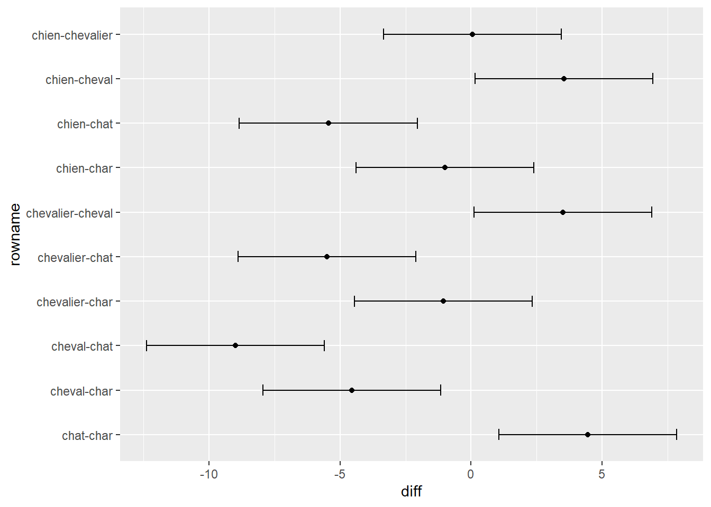
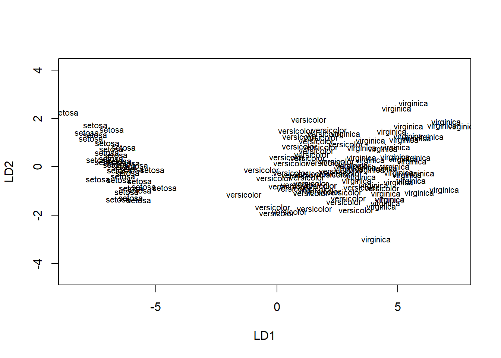

# (PART) Modèles linéaires {-}
# Comparer

Les expérimentateurs souhaitent svouent tester plus que deux moyennes. L'analyse de variance, souvent appelée ANOVA (*ANalysis Of VAriance*), permet de comparer une variable continue sur plusieurs groupes ou traitements. Il s'agit d'une extension du test-$t$ indépendant qui compare une variable continue auprès de deux groupes. À plus de deux groupes, l'analyse de variance entre en jeu.

**Attention!** Cette section se limite au cas où les groupes sont de tailles identiques (même nombre de participants par groupe, le symbole $n_k$ pour référer à cette quantité) afin d'en simplifier la présentation. 

## La logique de l'analyse de variance

Comme il a été présenté dans la section sur [le test-$t$ indépendant], le modèle sous-jacent à l'analyse de variance à un facteur est une extension de ce modèle pour $k$ groupes. Chaque groupe est associé à une différence de moyennes $\mu_i$, pour $i = 1,2, ...k$ par rapport à la moyenne groupe référent, $\mu_0$. Les variables $x_i$ définissent l'appartenance au groupe $i$ par la valeur 1 et 0 pour les autres groupes (codage factice ou *dummy coding*).

$$y = \mu_0 + \mu_1x_1 + \mu_2x_2+ ... +\mu_kx_k + \epsilon$$
L'hypothèse nulle est la suivante. 
$$\sigma^2_1=\sigma^2_2=...=\sigma^2_k$$
L'analyse de variance est un test omnibus (global) qui ne teste pas où est la différence, mais bien *s'il y a au moins une différence* entre les groupes. L'hypothèse nulle peut s'avérer fausse de plusieurs façons. Il peut y avoir une ou plusieurs inégalités pour rejeter l'hypothèse nulle. 

La logique sous-jacente est basée sur l'idée selon laquelle les moyennes des groupes proviennent d'une même population. Elle compare les hypothèses suivantes : l'hypothèse nulle : les données (les moyennes) proviennent d'une même population; et l'hypothèse opposée : les données ne proviennent pas d'une même population. 

Elle suggère ainsi deux types de variances (ou carré moyen, CM, dans ce contexte) : le CMI, carré moyen intergroupe, lorsque l'hypothèse nulle est vraie (la variabilité des moyennes); et le CMR, carré moyen résiduel, lorsque l'hypothèse nulle n'est ni vraie, ni fausse (la variabilité des données). 

Pour calculer le CMI, la variance des moyennes des groupes est 
$$s^2_{\bar{x}}=\sum_{i=1}^k\frac{(\bar{x_i}-\overline{\overline{x}})^2}{k-1}$$ 

où $\overline{\overline{x}}$ est la grande moyenne (la moyenne de toutes les unités). Cette statistique se retrouve sur la plan des distributions d'échantillonnage (comment les moyennes se distribuent). Il faut ainsi multiplier cette valeur par $n_k$, le nombre d'unités par groupes, pour obtenir une estimation de la variance de la population. Ainsi, $\text{CMI} = s^2_{\bar{x}}n_k$.

Il y a plusieurs méthodes pour calculer le CMR, comme le CMR est envisagé comme la moyenne des variances de groupes, il est pratique d'en référer le calcul à sa définition.  

$$
\text{CMR} = \bar{s^2} = \frac{1}{k}\sum_{i=k}^k\sigma_k^2 
$$
Lorsque l'hypothèse nulle est vraie, les variances des groupes sont traitées comme le résultat d'une étude sur une même population, comme si $k$ petites études avaient été réalisées. L'estimation du CMI est de l'ordre d'une distribution d'échantillonnage connue par le théorème central limite définissant le comportement des moyennes lorsqu'elles proviennent d'une même population (c'est ce que pose comme hypothèse l'analyse de variance). Toutefois, la valeur du CMI est relative au CMR, la quantité de bruit dans les données. 

L'analyse de variance pose alors la question : la variance attribuable aux différentes moyennes des groupes est-elle supérieure à la variance résiduelle? Pour tester cette question, une possibilité est de tester le ratio $\frac{\text{CMI}}{\text{CMR}}$, ce qui donne une valeur-$F$. Le ratio de deux variances suit une distribution-$F_{dl_1, dl_2}$ avec deux degrés de liberté différents qui lui sont associés. Autrement dit, la distribution-$F$ est la distribution d'échantillonnage du ratio deux variances.

$$F_{dl_1,dl_2} = \frac{n_ks^2_{\bar{x}}}{\bar{s^2}} = \frac{\text{CMI}}{\text{CMR}}$$
où $dl_1 = k-1$, et $dl_2 = k(n_k-1)$. L'interprétation du ratio est ainsi :

* si $\text{CMI}>\text{CMR}$, alors $\text{CMI}/\text{CMR}>1$;
* si $\text{CMI}=\text{CMR}$, alors $\text{CMI}/\text{CMR}=1$;
* si $\text{CMI}<\text{CMR}$, alors $\text{CMI}/\text{CMR}<1$.

Plus les moyennes sont variables, plus la valeur du CMI est élevée. Plus les unités sont variables, plus le CMR est élevé. S'il existe au moins une différence entre les groupes, le ratio est en faveur du CMI. En fait, plus $F$ est élevée, toutes autres choses étant égales (les degrés de libertés, p. ex.), plus la probabilité de rejeter l'hypothèse nulle est grande. Ainsi, lorsque, la valeur-$F$ est obtenue, il est possible de calculer une valeur-$p$, et le test d'hypothèse se déroule tel qu'auparavant.

## La création de données

Dans un jeu de données commun, une variable désigne les groupes et une autre leur score sur une certaine mesure. La syntaxe suivante montre trois façons pour créer une variable facteur.


```r
nk <- 5 # nombre d'unités par groupe
k <- 4  # nombre de groupes
# En ordre
groupe1 <- rep(1:k, each = nk)
# En alternance
groupe2 <- rep(1:k, times = nk)
# Aléatoire
set.seed(765)
groupe3 <- sample(x = 1:k, size = (k * nk), replace = TRUE)
cbind(groupe1, groupe2, groupe3)
>       groupe1 groupe2 groupe3
>  [1,]       1       1       4
>  [2,]       1       2       2
>  [3,]       1       3       4
>  [4,]       1       4       3
>  [5,]       1       1       3
>  [6,]       2       2       4
>  [7,]       2       3       3
>  [8,]       2       4       1
>  [9,]       2       1       4
> [10,]       2       2       3
> [11,]       3       3       3
> [12,]       3       4       2
> [13,]       3       1       3
> [14,]       3       2       3
> [15,]       3       3       2
> [16,]       4       4       4
> [17,]       4       1       4
> [18,]       4       2       2
> [19,]       4       3       1
> [20,]       4       4       1
```

Il est aussi possible de remplacer les arguments, `1:k` par des chaînes de caractères (des catégories au lieu de nombres).


```r
categorie <- c("char", "chat", "cheval", "chevalier", "chien")
nk <- 2
groupe <- as.factor(rep(categorie, each = nk)) # Déclarer comme facteur
groupe
>  [1] char      char      chat      chat      cheval   
>  [6] cheval    chevalier chevalier chien     chien    
> Levels: char chat cheval chevalier chien
```
Une bonne pratique dans le contexte des comparaisons de moyenne est de déclarer les variables catégorielles comme facteur avec `as.factor()`.

Pour créer des valeurs à ces catégories, une stratégie simple est de créer des valeurs pour chacun des groupes et de les combiner. 


```r
# Pour la reproductibilité
set.seed(2602)
char      <- rnorm(n = nk, mean = 15, sd = 4) 
chat      <- rnorm(n = nk, mean = 20, sd = 4) # Différences ici
cheval    <- rnorm(n = nk, mean = 10, sd = 4) # et ici
chevalier <- rnorm(n = nk, mean = 15, sd = 4)
chien     <- rnorm(n = nk, mean = 15, sd = 4) 
# Combinés
score <- round(c(char, chat, cheval, chevalier, chien))
# Conserver toutes les informations en un jeu de données
donnees <- data.frame(groupe, score)
head(donnees)
>   groupe score
> 1   char    14
> 2   char    12
> 3   chat    17
> 4   chat    21
> 5 cheval    14
> 6 cheval    10
```

## Codage factice

La plupart du temps, les variables de regroupement, les variables identifiant l'appartenance aux groupes, sont construites avec une variable de type facteur, c'est-à-dire une colonne avec différentes valeurs ou libellés. C'est d'ailleurs ce qui a été fait dans l'exemple précédent. Cette méthode d'identification de groupement implique une programmation plus intensive, surtout pour la création de valeurs. En termes de programmation, il est plus élégant de recourir à une fonction de codage factice (*dummy coding*). Cela permettra de représenter fidèlement le modèle sous-jacent. Étrangement, il n'y a pas de fonction de base avec **R** pour du codage factice. Une fonction maison permettra d'automatiser la réassignation des groupes (en une seule variable) sur plusieurs variables désignant leur appartenance.


```r
dummy.coding <- function(x){
  # Retourne un codage factice de x
  # avec les facteurs en ordre alphabétique
  W <- sapply(unique(x), 
              USE.NAMES = TRUE,
              FUN = function(v) {x == v}) * 1 
  return(W)
}
```


La plupart du temps, les variables de regroupement, les variables identifiant l'appartenance aux groupes, sont construites avec une variable de type facteur, c'est-à-dire une colonne avec différentes valeurs ou libellés. C'est d'ailleurs ce qui a été fait dans l'exemple précédent. Cette méthode d'identification de groupement implique une programmation plus intensive, surtout pour la création de valeurs. En termes de programmation, il est plus élégant de recourir à une fonction de codage factice. Cela permettra de représenter fidèlement le modèle sous-jacent. Étrangement, il n'y a pas de fonction de base avec **R** pour du codage factice. Une fonction maison permettra d'automatiser la réassignation des groupes (en une seule variable) sur plusieurs variables désignant leur appartenance.

<!-- ```{r} -->
<!-- dummy.coding <- function(x){ -->
<!--   # Retourne un codage factice de x -->
<!--   # avec les facteurs en ordre alphabétique -->

<!--   tab <- table(x)    # Extraire une table -->
<!--   k <- length(tab)   # Nombre de groupes -->
<!--   n <- length(x)     # Nombre d'unités -->
<!--   X <- matrix(0, nrow = n, ncol = k) # Création d'une nouvelle variable  -->
<!--   xlev <- as.factor(x) -->
<!--   for (i in 1:n) { -->
<!--     X[i, xlev[i]] <- 1 # Identification des groupes -->
<!--   } -->
<!--   colnames(X) <- names(tab) -->
<!--   return(X) -->
<!-- } -->
<!-- ``` -->

La fonction maison retourne un codage factice pour les $k$ groupes. **Attention**, le codage factice est fait en ordre alphabétique. Comme il est redondant d'avoir $k$ groupes (identifier $k$ groupes nécessite $k-1$ variables), un groupe référent est désigné. Ce dernier aura 0 sur tous les scores. Pour retirer un groupe, l'utilisation des crochets et une valeur négative associés à la colonne du groupe référent feront l'affaire, p. ex. `dummy.coding(x)[,-k]` déclare le $k$^e^ groupe comme le groupe référent.


```r
# Pour la reproductibilité
set.seed(2602)

# Facteur de groupe
k <- length(categorie)
nk <- 2
groupe <- rep(categorie, each = nk)

# Groupement
X <- dummy.coding(groupe)[,-5] # groupe 4 "chien" comme référent

# Spécifications des paramètres
mu0 <- 15
mu <- c(0, 5, -5, 0)
e <- rnorm(n = k * nk, sd = 4)

# Création des scores
score <- round(mu0 + X %*% mu + e)

# Comparaison des valeurs
cbind(donnees, score)
>       groupe score score
> 1       char    14    14
> 2       char    12    12
> 3       chat    17    17
> 4       chat    21    21
> 5     cheval    14    14
> 6     cheval    10    10
> 7  chevalier    12    12
> 8  chevalier    17    17
> 9      chien    21    21
> 10     chien    18    18
```

L'expression `X %*% mu` est une multiplication d'algèbre matricielle qui multiplie la matrice $n \times p$ de codage factice $X$ à une matrice $p\times 1$ de moyennes $\mu$. L'opération multiple les $p$ éléments d'une ligne de $X$ à la colonne $p$ correspondante de $\mu$. En algèbre matricielle Le résultat est une matrice $n \times 1$ qui contient les différences de moyennes pour chaque unité. Dans la même ligne de syntaxe, la moyenne de la population (groupe référent), $\mu_0$ est ajoutée et la variation individuelle, $\epsilon$.

Les scores produits sont identiques. Dans cet exemple par contre, l'origine des différences entre groupes est plus évidente, spécialement en comparant le modèle sous-jacent à l'analyse de variance. La source d'erreur est visible ainsi que les différences de moyennes. La force de cette deuxième méthode est qu'elle peut facilement être automatisée pour créer des jeux de données, alors que la première est plus compliquée. La seconde méthode nécessite six arguments ($n_k$, $\mu_0$, $\mu_{1:k}$, et $\sigma_{e}$ en plus de catégories et définir le groupe référent), la première aurait de la difficulté à spécifier tous les arrangements de différence de moyennes automatiquement, quoiqu'elles sont plus personnalisables.

## Analyse


À toute fin pratique, un jeu de données est recréé avec les catégories et paramètres précédents, mais avec $n_k=20$ unités par groupe. La fonction **R** de base est `aov()`. Elle prend comme argument une formule, de forme `VD ~ VI` (variable dépendante prédite par variable indépendante) et un jeu de données duquel prendre les variables. Il existe également une fonction `anova()`, une fonction un peu plus complexe que `aov()`. Pour obtenir toute l'information désirée de la sortie de la fonction, il faut demander un sommaire de la sortie avec `summary()`.


```r
# Anova de base
res <- aov(score ~ groupe, data = donnees)
summary(res)
>             Df Sum Sq Mean Sq F value  Pr(>F)    
> groupe       4    834   208.4      14 5.1e-09 ***
> Residuals   95   1414    14.9                    
> ---
> Signif. codes:  
> 0 '***' 0.001 '**' 0.01 '*' 0.05 '.' 0.1 ' ' 1

# Fonction maison
gr <- table(donnees$groupe)
k  <- length(gr)          # Nombre de groupes
nk <- dim(donnees)[1] / k # Nombre de participants par groupe

# Moyennes et variance par (`by()`) groupes
moyenne  <- by(donnees$score, donnees$groupe, mean)
variance <- by(donnees$score, donnees$groupe, var)

# Statistiques
CMI <- nk * var(moyenne)
CMR <- mean(variance)
dl1 <- k - 1
dl2 <- k * (nk - 1)
vf <- CMI / CMR 
vp <- (1 - pf(vf, df1 = dl1, df2 = dl2)) 

# Création du tableau
resultats <- matrix(0,2,5) # Tableau vide

# Ajouter noms
colnames(resultats)  <- c("dl", "SS", "CM", "F", "p")
row.names(resultats) <- c("groupe", "residu")

# Ajouter valeurs
resultats[1,] <- c(dl1, CMI * dl1, CMI, vf, vp)
resultats[2,] <- c(dl2, CMR * dl2, CMR, 0, 0)
resultats
>        dl   SS    CM  F        p
> groupe  4  834 208.4 14 5.15e-09
> residu 95 1414  14.9  0 0.00e+00
```

Les résultats sont identiques, les seules différences étant dues à l'arrondissement. Comme la valeur-$p$ est de 5.145\times 10^{-9}, ce qui est extrêmement plus petit que l'usuel .05 (ou un autre taux d'erreur de type I fixé à l'avance), l'hypothèse nulle est rejetée, il y a vraisemblablement une différence entre les groupes, ce qui est déjà connu. La Figure\ \@ref(fig:ft) illustre très bien la rareté d'un tel jeu de données sous l'hypothèse nulle.

<div class="figure">

<p class="caption">(\#fig:ft)Valeur-$F$ de la comparaison des moyennes</p>
</div>


## Rapporter l'ANOVA

Voici comment commander une anova avec **R**. Il faut utilise la formule, `VD ~ VI` où la VD est la variable dépendante qui est d'échelle continue, la ou les VI, les variables indépendantes, contiennent les variables de groupement, mais aussi des variables continues, si besoin est.


```r
res <- aov(score ~ groupe, data = donnees)
summary(res)
>             Df Sum Sq Mean Sq F value  Pr(>F)    
> groupe       4    834   208.4      14 5.1e-09 ***
> Residuals   95   1414    14.9                    
> ---
> Signif. codes:  
> 0 '***' 0.001 '**' 0.01 '*' 0.05 '.' 0.1 ' ' 1
```

Voici comment rapporter l'ANOVA dans un article scientifique.


> Une ANOVA est réalisée pour comparer les groupes sur un certain score. Les résutats montrent une différence significative (pour un $\alpha = .05$), $F(4, 95) = 13.998, p < .001$.

### La sortie de `aov()`

Une petite digression pour parler de la sortie de `aov()`. Normalement, **R** produit [des listes][Créer des listes] comme sortie, particulièrement en ce qui a trait aux analyses statistiques. Le cas de `aov()` est différent : le sommaire est une liste vide. 


```r
sommaire <- summary(res)
# Extraire les éléments de la sortie `sommaire`
names(sommaire)
> NULL
```
Pour avoir accès directement au tableau de résultats du sommaire pour le manipuler, il faut ajouter `[[1]]` à la suite du code, ce qui permet d'atteindre les résultats. Les manipulations usuelles d'une liste sont maintenant réalisables.


```r
sommaire <- summary(res)[[1]]
names(sommaire)
> [1] "Df"      "Sum Sq"  "Mean Sq" "F value" "Pr(>F)"
```
Le symbole `[[1]]` indique que seulement le premier élément de la liste est désiré. Il s'agit d'une formule renforcée [des crochets][Référer à des sous-éléments] pour ne choisir qu'un seul élément de la liste. Et dans cette liste, on retrouve la liste contenant des résultats. En d'autres termes, la sortie de `aov()` est une liste. Il y a bien deux niveaux de liste dans cette sortie, la première rendant plus difficile à la seconde. Une petit idiosyncrasie de **R**.

## Les tests posthoc

Une fois que le test général montre une différence à laquelle l'expérimentateur juge pertinent de s'y pencher^[Pour ne pas dire *significative*], ce dernier désire généralement connaître d'où origine cette différence globale entre les groupes. Autrement, il cherche à identifier spécifiquement les groupes qui diffère des autres.

La première étape est évidement de rouler l'ANOVA globale, voir la section précédente [Rapporter l'ANOVA]. En deuxième étape, une façon simple de demander les comparaisons posthoc est d'utiliser la fonction `TukeyHSD()`, soit la différence significative honnête, ou plus simplement la méthode de Tukey, en y introduisant comme argument la sortie de l'ANOVA.


```r
TukeyHSD(res)
>   Tukey multiple comparisons of means
>     95% family-wise confidence level
> 
> Fit: aov(formula = score ~ groupe, data = donnees)
> 
> $groupe
>                   diff     lwr   upr p adj
> chat-char         4.45   1.057  7.84 0.004
> cheval-char      -4.55  -7.943 -1.16 0.003
> chevalier-char   -1.05  -4.443  2.34 0.910
> chien-char       -1.00  -4.393  2.39 0.924
> cheval-chat      -9.00 -12.393 -5.61 0.000
> chevalier-chat   -5.50  -8.893 -2.11 0.000
> chien-chat       -5.45  -8.843 -2.06 0.000
> chevalier-cheval  3.50   0.107  6.89 0.040
> chien-cheval      3.55   0.157  6.94 0.036
> chien-chevalier   0.05  -3.343  3.44 1.000
```
Dans cette sortie, chaque paire de groupes est indiquer à gauche, les différences et les intervalles de confiance sont produites. La dernière colonnes (`p adj`) contient la valeur-$p$ indiquant si la paire est significativement différente ou non. Par exemple, la première ligne porte sur la comparaison `chat-char` et ces deux groupes sont vraisemblablement différents avec une valeur-$p$ de 0.004. Il est possible de définir différents arguments, comme l'ordre des paires avec `ordered = TRUE` qui ordonne les moyennes des groupes de la plus petite à la plus grandes, ou encore le degré de confiance `conf.level = 0.95` par défaut. Enfin, il est possible de sélectionner spécifiquement la variable de groupement avec l'argument `which`.

La fonction `TukeyHSD()` est aussi lié à une figure qu'il est possible de commander avec `plot()` en y mettant comme argument la sortie de `TukeyHSD()`.


```r
plot(TukeyHSD(res))
```

<div class="figure" style="text-align: center">

<p class="caption">(\#fig:tukey)Illustration du test de comparaisons multiples de Tukey</p>
</div>

Malheureusement la Figure\ \@ref(fig:tukey) n'est pas parfaite, car elle n'affiche pas toutes les libellées de chaque ligne. Toutefois, chaque ligne de la Figure\ \@ref(fig:tukey) correspond à une ligne de la figure. Avec le package `ggplot2`(voir [Visualier]), il est possible de remédier à la situation.


D'abord, il faut importer le `tidyverse`. Ensuite, la prochaine étape consiste à extraire les résultats de `TukeyHSD()`, de les transformer en jeu de données avec `as.data.frame()` et de rendre le nom des lignes manipulables avec `add_rownames_to_column()`. Comme pour toutes les figures, il faut indiquer l'abscisse et l'ordonnée, ici le nom des lignes (`x`) et la différence entre les groupes(`y`), respectivement. Ensuite, comme la figure avec [les barres d'erreurs], il faut associer dans `geom_errorbar` les intervalles de confiance `lwr` et `upr` à `ymin` et `ymax`. Enfin, il est possible d'ajouter la moyenne sous forme de point (`geom_point()` et de tourner la figure avec `coord_flip`, ce qui permet de répliquer la figure originale.


```r
TukeyHSD(res)[[1]] %>%   # Extraire les résultats
  as.data.frame() %>%    # Transformer en jeu de données
  rownames_to_column() %>%     # Ajouter les noms des lignes
  ggplot(mapping = aes(x = rowname, 
                       y = diff)) + 
  geom_errorbar(aes(ymin = lwr,
                    ymax = upr),
                width = .25) + 
  geom_point() + 
  coord_flip()
```

<div class="figure" style="text-align: center">

<p class="caption">(\#fig:tukey2)Illustration corrigée du test de comparaisons multiples de Tukey</p>
</div>

La Figure\ \@ref(fig:tukey2) montre une illustration des comparaisons de Tukey plus adéquate.

Une autre technique permet d'obtenir une table de comparaisons. Il s'agit de `pairwise.t.test()`. Cette fonction prend en argument deux vecteurs, la variable continue et la variable de groupement, et un troisième argument, soit la correction à appliquer avec l'argument `p.adj`.


```r
pairwise.t.test(donnees$score, donnees$groupe, p.adj = "none")
> 
> 	Pairwise comparisons using t tests with pooled SD 
> 
> data:  donnees$score and donnees$groupe 
> 
>           char  chat  cheval chevalier
> chat      4e-04 -     -      -        
> cheval    3e-04 6e-11 -      -        
> chevalier 0.392 2e-05 0.005  -        
> chien     0.415 2e-05 0.005  0.967    
> 
> P value adjustment method: none
```

Cette technique à l'avantage d'être prête pour la plupart corrections, par exemple `p.adj = "bonferroni"` ou `p.adj = "holm"`.

TODO

## ANOVA à mesures répétées


```r
# Un exemple d'ANOVA à mesures répétées
res.aov.r <- aov(circumference ~ age + Error(Tree/age), data = Orange)
res.aov.r
> 
> Call:
> aov(formula = circumference ~ age + Error(Tree/age), data = Orange)
> 
> Grand Mean: 116
> 
> Stratum 1: Tree
> 
> Terms:
>                 Residuals
> Sum of Squares      11841
> Deg. of Freedom         4
> 
> Residual standard error: 54.4
> 
> Stratum 2: Tree:age
> 
> Terms:
>                   age Residuals
> Sum of Squares  93772      4043
> Deg. of Freedom     1         4
> 
> Residual standard error: 31.8
> Estimated effects are balanced
> 
> Stratum 3: Within
> 
> Terms:
>                 Residuals
> Sum of Squares       2711
> Deg. of Freedom        25
> 
> Residual standard error: 10.4
summary(res.aov.r)
> 
> Error: Tree
>           Df Sum Sq Mean Sq F value Pr(>F)
> Residuals  4  11841    2960               
> 
> Error: Tree:age
>           Df Sum Sq Mean Sq F value  Pr(>F)    
> age        1  93772   93772    92.8 0.00065 ***
> Residuals  4   4043    1011                    
> ---
> Signif. codes:  
> 0 '***' 0.001 '**' 0.01 '*' 0.05 '.' 0.1 ' ' 1
> 
> Error: Within
>           Df Sum Sq Mean Sq F value Pr(>F)
> Residuals 25   2711     108
```

<!-- ## Anova avec facteur intersujet et intrasujet -->

<!-- ```{r} -->
<!-- jd <- data.frame( -->
<!--   Sujet = factor(rep(1:10, each = 4)),             # 10 sujets, chacun mesuré 4 fois -->
<!--   Facteur_Intersujet = factor(rep(c("A", "B"), each = 20)),  # Facteur intersujet (A et B) -->
<!--   Facteur_Intrasujet = factor(rep(c("T1", "T2"), times = 10)), # Facteur intrasujet (T1 et T2) -->
<!--   Reponse = rnorm(40)                              # Variable de réponse simulée -->
<!-- ) -->

<!-- model <- aov(Reponse ~ Facteur_Intersujet * Facteur_Intrasujet +  -->
<!--              Error(Sujet/Facteur_Intrasujet), data = jd) -->

<!-- # Afficher les résultats -->
<!-- summary(model) -->

<!-- ``` -->


## MANOVA : analyse de variance multivariée


```r
# Un example d'ANOVA multivarié

res.maov <- manova(cbind(Sepal.Length, Petal.Length) ~ Species, data = iris)
res.maov
> Call:
>    manova(cbind(Sepal.Length, Petal.Length) ~ Species, data = iris)
> 
> Terms:
>                 Species Residuals
> Sepal.Length         63        39
> Petal.Length        437        27
> Deg. of Freedom       2       147
> 
> Residual standard errors: 0.515 0.43
> Estimated effects may be unbalanced
summary(res.maov)
>            Df Pillai approx F num Df den Df Pr(>F)    
> Species     2  0.989     71.8      4    294 <2e-16 ***
> Residuals 147                                         
> ---
> Signif. codes:  
> 0 '***' 0.001 '**' 0.01 '*' 0.05 '.' 0.1 ' ' 1

summary.aov(res.maov)
>  Response Sepal.Length :
>              Df Sum Sq Mean Sq F value Pr(>F)    
> Species       2   63.2   31.61     119 <2e-16 ***
> Residuals   147   39.0    0.27                   
> ---
> Signif. codes:  
> 0 '***' 0.001 '**' 0.01 '*' 0.05 '.' 0.1 ' ' 1
> 
>  Response Petal.Length :
>              Df Sum Sq Mean Sq F value Pr(>F)    
> Species       2    437   218.6    1180 <2e-16 ***
> Residuals   147     27     0.2                   
> ---
> Signif. codes:  
> 0 '***' 0.001 '**' 0.01 '*' 0.05 '.' 0.1 ' ' 1

res.lda <- MASS::lda(Species ~ Sepal.Length + Petal.Length, data = iris)
res.lda 
> Call:
> lda(Species ~ Sepal.Length + Petal.Length, data = iris)
> 
> Prior probabilities of groups:
>     setosa versicolor  virginica 
>      0.333      0.333      0.333 
> 
> Group means:
>            Sepal.Length Petal.Length
> setosa             5.01         1.46
> versicolor         5.94         4.26
> virginica          6.59         5.55
> 
> Coefficients of linear discriminants:
>                LD1    LD2
> Sepal.Length -1.66  2.462
> Petal.Length  3.43 -0.928
> 
> Proportion of trace:
>    LD1    LD2 
> 0.9987 0.0013

plot(res.lda)
```



```r

# iris %>% 
#   ggplot(mapping = aes(x = Sepal.Length,
#                        y = Petal.Length, 
#                        color = Species)) + 
#            geom_point()
```

