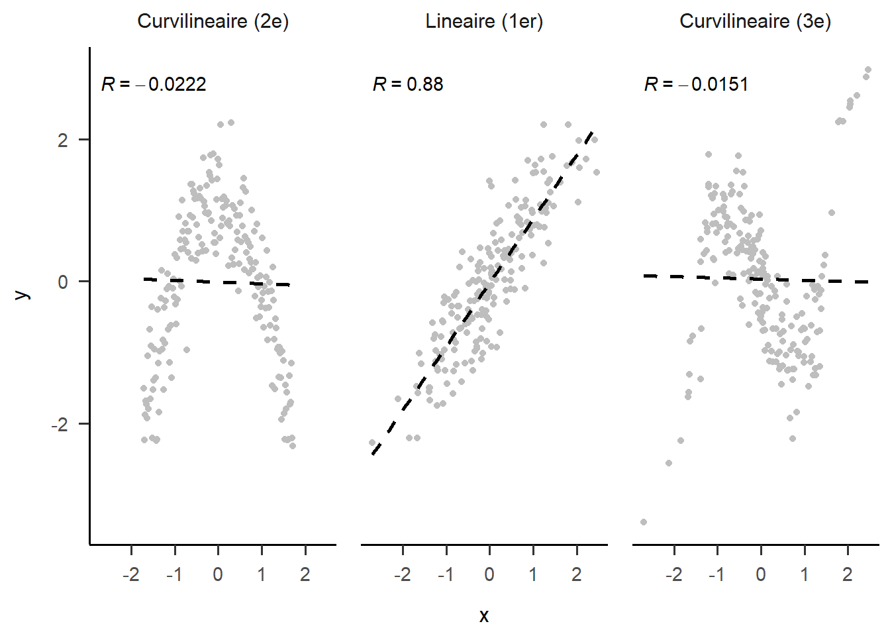

# Prédire

Un objectif des expérimentateurs est généralement de développer des modèles afin de faire des prédictions à partir d'un échantillon. Les statistiques sont des outils idéaux pour développer ces modèles. La régression est l'une des analyses fondamentales pour réaliser cet objectif et constitue en quelques sortes les fondements de biens des méthodes récentes (comme l'apprentissage machine). 

L'objectif de la régression est de décrire la relation entre un variable dépendante et un ensemble de variables indépendantes. Un aperçu est donnée à la section sur [l'association linéaire] dans le chapitre [Analyser]. Ce présent chapitre débute avec la notion de covariance et l'étend jusqu'à celle de régression. Des techniques rudimentaires de création de données sont présentées. Par la suite, les mathématiques et la programmation sous-jacente au modèle linéaire sont illustrées. 

## Retour sur l'association linéaire

Une première méthode de mesure d'association est [la covariance] qui est représentée par l'équation \@ref(eq:cov1).

\begin{equation}
s_{xy}=\frac{1}{n-1}\sum_{i=1}^n(x_i-\bar{x})(y_i-\bar{y})
(\#eq:cov1)
\end{equation}

L'équation \@ref(eq:cov1) représente la somme des produits des écarts à la moyenne de deux variables.

Comment généraliser cette équation à un ensemble de plus de deux variables? 

Pour débuter, les variables sont mises sur un même pied d'égalité. Plutôt que de recourir à des lettres différentes ($x$ et $y$), il faut toutes les considérées comme des $x_{i,j}$, où l'indice $i$ identifie le $i$^e^ participant, comme pour l'équation \@ref(eq:cov1), et l'indice $j$ indique la $j$^e^ variable parmi $p$. Le calcul pour chacune des paires de variables $j$ et $k$ est réalisé pour les $p$ variables; l'équation de la covariance devient ainsi l'équation\ \@ref(eq:cov2).

\begin{equation}
s_{x_j,x_k}=\frac{1}{n-1}\sum_{i=1}^n(x_{i,j}-\bar{x_j})(x_{i,k}-\bar{x_k})
(\#eq:cov2)
\end{equation}

Si les variables sont centrées, l'équation \@ref(eq:cov2) devient, pour faciliter l'intuition, l'équation \@ref(eq:cov3), soit la somme des produits entre deux variables. 

\begin{equation}
s_{x_j,x_k}=\frac{1}{n-1}\sum_{i=1}^n(x_{i,j})(x_{i,k})
(\#eq:cov3)
\end{equation}

Avantageusement, lorsque $j=k$, les équations \@ref(eq:cov2) et \@ref(eq:cov3) calculent la variance de la variable correspondante. En syntaxe **R,** ces équations s'écrivent dans une fonction comme la suivante. Pour rappel, la fonction `cov()` dans laquelle une matrice de données est passée comme argument fournit la matrice de covariance.


```r
covariance1 <- function(X){ 
  # X est un jeu de données
  Xc <- scale(X, scale = FALSE)  # Centrées les variables
  p  <- ncol(X)                  # Nombre de variables 
  n  <- nrow(X)                  # Nombre de sujets
  S  <- matrix(0, p, p)          # Matrice vide pour enregistrer
  
  for(j in 1:p) {
    for(k in 1:p) {
      S[j, k] <- sum(Xc[ ,j] * Xc[ ,k])
    }
  }
  
  S <- S / (n-1)
  
  # S est la matrice de covariance
  return(covariance = S)
}
```

Dans le code **R** ci-dessus, les fonctions `ncol()` et `nrow()` extraient le nombre de dimensions de la base de données, soit le nombre de variables et le nombre d'unités. La fonction `scale()` permet de centrer les variables de `X` et de les retourner dans `Xc`. Par défaut, l'argument pour centrer est `center = TRUE`, ce pourquoi l'argument n'est pas explicité, mais la fonction ne standardise pas les valeurs, car `scale = FALSE`. Une variable vide `S` est créé pour enregistrer les résultats. La boucle, quant à elle, calcule l'addition de l'équation\ \@ref(eq:cov3) pour enfin diviser la somme par $n-1$. Le résultat est `S`, la matrice de covariance.

### Illustration de la covariance

Il est relativement aisé d'exprimer graphiquement la covariance bivariée. L'équation\ \@ref(eq:cov3) rappelle l'aire d'un rectangle. Pour chaque paire $(x_i,y_i)$, un rectangle peut être dessiner à partir du centre $(0, 0)$ jusqu'au $(x_i,y_i)$. La Figure\ \@ref(fig:covfig) montre quatre exemples de ces rectangles. Lorsque la moyenne d'une variable est soustraite, les données deviennent centrées sur le point $(0, 0)$. L'expression $xy$ ou $x_ix_j$ rappelle le calcul de l'aire d'un rectangle. C'est effectivement ce qui se produit pour la covariance. L'équation calcule l'aire du rectangle formé par les points $(0,0)$ et $(x_i,y_i)$. En fait, l'équation\ \@ref(eq:cov1) calcule le rectangle *moyen* dont la somme des produits est divisée par le nombre de rectangles moins 1, soit $(n-1)$.


<div class="figure" style="text-align: center">

<p class="caption">(\#fig:covfig)Illustration de la covariance</p>
</div>


<div class="figure" style="text-align: center">

<p class="caption">(\#fig:covfig2)Illustration des produits (rectangles) pour différentes valeurs de covariance</p>
</div>

Les Figures\ \@ref(fig:covfig)\ et\ \@ref(fig:covfig2) permettent d'inférer quelques propriétés de la covariance.

* Comme la quantité de surface blanche (ou de noire) dépend de la taille de la figure, la covariance est directement proportionnelle aux échelles à l'abscisse et l'ordonnée. 

* La covariance augmente lorsque les points s'approchent d'une ligne à pente ascendante et diminue lorsque les points s'approchent d'une ligne à pente descendante. 

* Comme les associations non linéaires peuvent créer des amalgames de rectangles positifs et négatifs, elles conduisent à des covariances imprévisibles et peu pertinentes.

* La covariance (et la corrélation) est sensible aux valeurs aberrantes. Un point éloigné de la masse créera une aire rectangulaire bien plus grande que les autres points. À lui seul, il peut créer une quantité substantielle positive ou négative de surface blanche (ou noire) dans la figure.

* Si une variable est multipliée par elle-même, il s'agit de l'aire d'un carré, ce qui équivaut au calcul d'une variance. Par extension, si le produit de deux variables se rapproche davantage d'un carré que d'un rectangle (en moyenne), alors les deux variables sont fortement liées.

* Le paramètre de la corrélation de la population peut être conceptualisé comme un carré déformé en rectangle à cause de l'erreur de mesure des axes.


### La covariance en termes d'algèbre matricielle

L'équation de la covariance peut aussi se calculer en termes d'algèbre matricielle. En plus d'accélérer le calcul des résultats, il simplifie énormément les mathématiques sous-jacente (pourvu que l'utilisateur connaisse l'algèbre matricielle).

Une matrice est un ensemble de variables représenté sous une seule variable mathématique. Dans les équations mathématiques, une matrice est désignée par une lettre majuscule en gras: $x$ devient $\mathbf{X}$ et $\sigma$ devient $\mathbf{\Sigma}$. Dans une matrice, chaque colonne est une variable, chaque ligne correspond à un sujet différent mesuré sur toutes les variables. Une matrice est définie en partie par son nombre de lignes ($n$, nombre d'unités) et son nombre de colonnes ($p$, nombre de variables), dont voici une illustration à l'équation\ \@ref(eq:matex1).

\begin{equation}
\mathbf{X} = \left(\begin{array}{cccc} 
x_{1,1} & x_{1,2} & ...&x_{1,p}\\
x_{2,1} & x_{2,2} & ...&x_{2,p}\\
... & ...& ...& ... \\
x_{n,1} & x_{n,2} & ... &x_{n,p}\\
\end{array}\right)
(\#eq:matex1)
\end{equation}

En syntaxe **R**, il ne s'agit rien de plus que de [concaténer] des variables (mesurant les mêmes individus) ensembles par des colonnes, comme il est fait avec des jeux de données `data.frame()`. Un jeu de données est, à peu de chose près, une matrice (voir [Concaténer]). Pour créer une matrice `X` à partir des variables `x`, `y`, et `z` avec **R**, par exemple, la ligne `X = cbind(x, y, z)` joindra les trois variables ensemble. La fonction `cbind()` et une fonction pour concaténer des colonnes. Il existe aussi `rbind()` pour les lignes.

Pour réaliser le calcul de la covariance, il faut multiplier la matrice des données centrées (les variables concaténées) par elle-même puis diviser par $n-1$. Le symbole $X$ représente la concaténation des variables. Par simplicité, l'équation utilise des **variables centrées**.

\begin{equation}
\mathbf{S} = (n-1)^{-1}\mathbf{X}^\prime \mathbf{X}
(\#eq:covmat1)
\end{equation}

Le symbole $\mathbf{S}$ représente la matrice de variance-covariance. La diagonale de cette matrice représente les variances des données et les éléments hors diagonales sont les covariances, soulignant le lien entre la variance et la covariance. Le symbole $\prime$ (prime) correspond à l'opération de transposer une matrice, soit d'échanger les lignes par ces colonnes. Cette procédure est nécessaire pour produire la multiplication d'une matrice par elle-même. Noter que l'expression $(n-1)^{-1}=\frac{1}{n-1}$.

\begin{equation}
\begin{aligned}
\mathbf{S} & = (n-1)^{-1}
\left(\begin{array}{cccc} 
x_{1,1} & x_{2,1} & ... & x_{n,1} \\
x_{1,2} & x_{2,2} & ... & x_{n,2} \\
\end{array}\right) 
\left(\begin{array}{cc} 
x_{1,1} & x_{1,2} \\
x_{2,1} & x_{2,2}\\
... & ...  \\
x_{n,1} & x_{n,2} \\
\end{array}\right) \\
& = (n-1)^{-1}
\left(\begin{array}{cc}
\sum_{i=1}^n(x_{i,1})(x_{i,1}) & \sum_{i=1}^n(x_{i,1})(x_{i,2})\\
\sum_{i=1}^n(x_{i,2})(x_{i,1}) & \sum_{i=1}^n(x_{i,2})(x_{i,2})
\end{array}\right)
\end{aligned}
(\#eq:covmat2)
\end{equation}

L'équation \@ref(eq:covmat2) illustre l'équation \@ref(eq:covmat1) qui sont toutes les deux équivalentes à \@ref(eq:cov3). En termes de syntaxe **R**, elles peuvent être traduites comme suit.


```r
covariance2 = function(X){
  # X est une jeu de données ou matrice de n sujets par p variables
  n <- nrow(X)
  Xc <- scale(X, scale = FALSE)
  
  # L'algèbre matriciel permet de calculer le
  # produit d'une colonne avec les autres colonnes
  cov.X <- t(Xc) %*% Xc / (n - 1)
  return(cov.X)
}
```

La fonction `t()` opère la transpose (représentée par $\prime$) et le symbole `%*%` signifie le produit matriciel des variables. Il faut bien distinguer `*` et `%*%`. L'usuel symbole de multiplication `*` de **R** opère une multiplication cellule par cellule (avec recyclage) plutôt que l'opération matricielle (multiplication des colonnes de la première matrice avec les lignes de la seconde matrice).

L'utilisation de l'algèbre matricielle est plus simple et efficace. Elle nécessite cinq lignes de code, élimine deux boucles, prend moins de temps à calculer, en plus de produire toutes les variances et covariances.

Une matrice de covariance possède plusieurs propriétés importantes. Elle est toujours carrée soit $p \times p$ pour $p$ variables et contient $p^2$ éléments. Parmi ces éléments, les $p$ éléments de la diagonale sont des variances, ce pourquoi elle est parfois appelée matrice de variance-covariance. Les éléments triangulaires inférieurs hors diagonale sont un parfait reflet des éléments supérieurs, p.ex. $\sigma_{1,2} = \sigma_{2,1}$. Il y a ainsi $\frac{p(p-1)}{2}$ covariances uniques dans une matrice et $p(p+1)/2$ éléments uniques (variances et covariances). En plus, de ces caractéristiques, la matrice doit être *positive semi-définie*, ce qui est un terme mathématique impliquant, pour les fins de ce chapitre, que les variances ne peuvent être nulle^[C'est plus complexe que cela, mais il suffit d'accepter cette affirmation pour procéder.]. La Figure\ \@ref(eq:sigma123) illustre la matrice de covariance $\mathbf{\Sigma}$ de la population.

\begin{equation}
\mathbf{\Sigma} = \left( 
\begin{array}{cccc}
\sigma_{1,1}^2 & \sigma_{1,2} & ... &  \sigma_{1,p}\\
\sigma_{2,1} & \sigma_{2,2}^2 & ... &  \sigma_{2,p}\\
...& ...& ... &  \sigma_{3,p}\\
\sigma_{p,1} & \sigma_{p,2} & ... &  \sigma_{p,p}^2\\
\end{array}
\right)
(\#eq:sigma123)
\end{equation}

### La matrice de corrélation en termes d'algèbre matricielle

Une matrice de corrélation est une matrice de covariance dont les variables sont standardisées. Cela implique de transformer la matrice afin que toute la diagonale soit à l'unité, c'est-à-dire que toutes les variances soient égalent à 1. Cela permet d'avoir une interprétation *standardisée* des corrélations, car celles-ci sont indépendantes des métriques originales. Les autres éléments conceptuels de la matrice de covariance s'appliquent pour la matrice de corrélation.

Pour transformer la matrice de covariance en matrice de corrélation, trois techniques sont possibles. 

La première est de standardiser $\mathbf{X}$ préalablement au calcul de la covariance.


```r
Xz <- scale(X)
n <- nrow(x)
cor.X <- t(Xz) %*% Xz / (n - 1)
```

La deuxième méthode est de standardiser la matrice de covariance en utilisant l'algèbre matricielle, où $\mathbf{S}$ est la matrice de covariance. Pour ce faire, on pré et post multiplie $\mathbf{S}$ par $\mathbf{D}$, comme l'équation \@ref(eq:obtD1).

\begin{equation}
\mathbf{R}=\mathbf{D_{S}}\mathbf{S}\mathbf{D_{S}}
(\#eq:obtD1)
\end{equation}

Pour obtenir $\mathbf{D_S}$, il faut :

1. extraire de la matrice les variances de la diagonale (avec la fonction mathématique $\text{diag}$);

2. faire la racine carrée pour obtenir des écarts types;

3. recréer une matrice carrée avec la fonction mathématique $\text{diag}$, et;

4.  finalement inverser la matrice.

Autrement dit, $\mathbf{D_S}$ correspond à l'équation\ \@ref(eq:obtD2).

\begin{equation}
\mathbf{D}_{\mathbf{S}} = (\text{diag}(\sqrt{\text{diag}(\mathbf{S})})^{-1}) 
(\#eq:obtD2)
\end{equation}

Le calcul complet de l'équation\ \@ref(eq:obtD1) en ajoutant \@ref(eq:obtD2) est représenté par l'équation\ \@ref(eq:cov2cor).

\begin{equation}
\mathbf{R} = (\text{diag}(\sqrt{\text{diag}(\mathbf{S})})^{-1}) \mathbf{S} (\text{diag}(\sqrt{\text{diag}(\mathbf{S})})^{-1})
(\#eq:cov2cor)
\end{equation}

En code **R**, l'équation \@ref(eq:cov2cor) se traduit ainsi. 

```r
R = solve(diag(sqrt(diag(S)))) %*% S %*% solve(diag(sqrt(diag(S))))
```

Lorsqu'une matrice est passée comme argument à `diag()`, elle extrait les éléments de la diagonale pour en faire un vecteur. Si un vecteur est passé en argument, alors `diag()` retourne une matrice avec les éléments du vecteur en diagonale. La fonction `solve()` calcule l'inverse d'une matrice, comme l'utilisateur pourrait attendre de $\mathbf{X}^{-1}$. Il s'agit certainement de l'aspect le plus biscornu de **R**.  Enfin, l'opérateur `%*%` est le produit matriciel. 

La troisième méthode est d'utiliser la fonction de base `cov2cor()` pour transformer la matrice de covariance en matrice de corrélation, ce qui est plus simple et plus rapide que la deuxième option, mais qui cache ce qui se réalise vraiment, soit l'équation\ \@ref(eq:cov2cor).

## La régression

Jusqu'à présent, des rudiments de la covariance et de la corrélation ont été présentés dans le but d'introduire graduellement l'algèbre matricielle. L'objectif étant atteint, le regard porte maintenant sur la régression en tant que moyen de prédire une variable $y$ à partir d'un ensemble de variables $\mathbf{X}$.

Quelle est la différence entre les analyses de covariance et corrélation comparativement à l'analyse de régression? Bien que la logique sous-jacente soit très similaire, il faut maintenant déterminer une variable *différente* de l'autre, c'est-à-dire distinguer une variable dépendante, des variables indépendantes. Les variables indépendantes prédisent la variable dépendante  un peu comme dans un modèle *déterministe*, il faut décider de la *cause* (variables indépendantes) et l'*effet* (variable dépendante), ce dernier étant généré par les premiers. 

Plutôt que de traiter chaque paire de variable comme c'est le cas avec l'analyse de corrélation, la régression étudie la relation entre la variable dépendante et **toutes** les variables indépendantes, et ce, simultanément. Ainsi, les variables indépendantes sont contrôlées entre elles pour évaluer leur effet sur la variable dépendante et un modèle de prédiction plus juste est obtenu (autant que faire ce peut avec un modèle statistique).

### Le modèle de régression simple 

L'équation pour un modèle de régression simple se résume au cas bivarié, soit la prédiction de $y$ par une seule variable $x$.

\begin{equation}
y_i = \beta_0 + \beta_1 x_i + \epsilon_i
(\#eq:modlin)
\end{equation}

Dans ce modèle, $y$ est la variable prédite, $x$ est le seul prédicteur, $\beta_0$ est l'ordonnée à l'origine, $\beta_1$ est le coefficient de régression et $\epsilon$, l'erreur dans la variable $y$ indépendante (non corrélée, ni fonctionnellement liée) de $x$.

Il vaut la peine de se pencher un peu plus sur ces paramètres. L'ordonnée $\beta_0$ est la moyenne de $y$ lorsque $x=0$, autrement dit, contrôlée par la variable indépendante. Si $x$ est centrée, alors $\beta_0$ égale la moyenne de $y$; si $x$ et $y$ sont centrées, alors $\beta_0=0$. La pente $\beta_1$ est le coefficient de régression, le degré selon lequel $x$ prédit $y$. Ce paramètre dépend de la corrélation entre ces deux variables. En fait, si $x$ et $y$ sont standardisées, alors $\beta_1$ correspond à la corrélation entre les deux^[Uniquement dans le cas bivarié.]. Le paramètre $\epsilon$ est l'erreur du modèle. Par définition, l'erreur est normalement distribuée et sa moyenne est de $0$. Seule l'erreur standard (l'écart type de l'erreur) change.

La Figure\ \@ref(fig:modlinf) illustre ces paramètres. L'ordonnée $\beta_0$ est représentée en pointillé du centre $(0,0)$ jusqu'à la valeur de $y$ lorsque $x = 0$. La pente $\beta_1$ correspond à l'inclinaison de la pente (droite oblique pointillé). La droite oblique pointillée représente la prédiction de $y$, soit $\hat{y}$ par $x$. qui correspond à l'équation\ \@ref(eq:modlin), mais en excluant $\epsilon$.

\begin{equation}
\hat{y_i} = \beta_0 + \beta_1 x_i
(\#eq:modlin2)
\end{equation}

L'équation\ \@ref(eq:modlin2) exprime toute la ligne pointillée, soit la meilleure prédiction possible. Celle-ci n'est pas parfaite et contient des erreurs, des *résidus*, autrement dit, ce qui n'est pas prédit par $x$. Les courtes lignes verticales grises représentent les résidus des participants, soit $\epsilon_i$, la part de $y$ qui n'est pas prédite par $x$ pour la participant $i$. Les résidus se distribuent normalement avec une moyenne de $0$ et un écart type de $\sigma_{\epsilon}$. Plus $\sigma_{\epsilon}$ est petit (tend vers 0), plus les points seront près de la droite. 

Une façon de connaître la qualité de la droite est le **coefficient de détermination**. Ce coefficient correspond à l'équation\ \@ref(eq:r2).

\begin{equation}
R^2 = 1-\frac{\sigma^2_{\epsilon}}{\sigma^2_y}
(\#eq:r2)
\end{equation}

Le ratio $\frac{\sigma^2_{\epsilon}}{\sigma^2_y}$ représente la proportion de variance de $y$ non expliquée par les variables indépendantes. Cette proportion s'étend de 0 à 1. La différence $1-\frac{\sigma^2_{\epsilon}}{\sigma^2_y}$ donne l'inverse de cette proportion... **la variance expliquée**! Allant de 0 à 1, le coefficient de détermination indique la qualité de la prédiction, 1 étant une relation parfaite. 

Pour aller un peu plus loin, dans un modèle bivarié, le coefficient de détermination correspond au coefficient de corrélation au carré, $r^2$, la force du lien entre $x$ et $y$. La valeur $1-r^2$ correspond donc la variance des résidus standardisés, $\sigma^2_{\epsilon}$.


<div class="figure" style="text-align: center">

<p class="caption">(\#fig:modlinf)Diagramme de dispersion</p>
</div>


### L'analyse de régression

Lorsque le jeu de données est obtenu, il est temps de procéder à l'analyse de régression. Essentiellement, l'analyse de régression produit à peu près ceci en algèbre matricielle.

Pour aider la compréhension, voici une explication avec le modèle linéaire simple assumant des variables centrées. Le modèle correspond à 

$$
y = \beta x
$$

où l'erreur, $\epsilon$ n'est pas explicitée. Il faut isoler $\beta$ afin de l'estimer, soit l'opération suivante,

$$
\beta = \mathbb{E}(\frac{y}{x})
$$

où le symbole $\mathbb{E}$ signifie l'espérance (la moyenne). En multipliant par $\frac{x}{x}$ de chaque côté de l'équation, cela produit l'équation suivante.

\begin{equation}
\beta = \mathbb{E}(\frac{xy}{xx}) = \frac{\sigma_{xy}}{\sigma^2_x}
(\#eq:beta2)
\end{equation}

Dans l'équation \@ref(eq:beta2), le numérateur rappelle la covariance et au dénominateur la variance de $x$. Comment généraliser pour $k$ variables? En algèbre matricielle et dans la mesure où les variables contenues dans $\mathbf{X}$ sont centrées, cela revient au même que de calculer l'équation \@ref(eq:beta).

\begin{equation}
\hat{\mathbf{B}} = (\mathbf{X}^{\prime} \mathbf{X})^{-1} \mathbf{X}^{\prime} y
(\#eq:beta)
\end{equation}

Comme pour l'équation \@ref(eq:beta2), la composante $(X^{\prime} X)^{-1}$ agit en dénominateur (par l'exposant $-1$) et correspond à la matrice de variance-covariance des variables de $X$ ensemble, alors que $X^{\prime} y$ agit comme le numérateur, soit la covariance entre les variables de $X$ avec $y$.

Pour l'erreur standard, il s'agit de calculer l'équation\ \@ref(eq:errtype1).

\begin{equation}
\text{var}(\hat{B}) = \sigma^2 \left(\mathbf{X}^{\prime}\mathbf{X}\right)^{-1}
(\#eq:errtype1)
\end{equation}

La racine carrée de ce résultat donne l'erreur standard (*standard error*) ou erreur type.

Le ratio $\frac{B}{\text{se}_B} \sim t_{n-p-1}$, soit le quotient d'un estimateur par son erreur type, suit une distribution-$t$ avec $n-p-1$ degrés de liberté.

Quelques détails sont importants à considérer pour la programmation. Afin d'ajouter l'intercepte (pour estimer $\beta_0$), la solution la plus simple est d'ajouter un vecteur d'unité (un vecteur ne contenant que des $1$) à la matrice $\mathbf{X}$. En programmation **R**, l'inversion de matrice se fait par la fonction `solve()` et non pas avec un signe d'exposant. En syntaxe **R**, la régression s'écrit comme ceci.


```r
regression <- function(y, X){
  # Taille d'échantillon 
  n <- nrow(X)
  
  # Centrer la matrice
  X <- scale(X, scale = FALSE)

  
  # Joindre un intercepte
  X <- cbind(intercept = 1, X)
  X <- as.matrix(X)
  
  # Nombre de variables
  p <- ncol(X)
  
  # Calculer les coefficients de régression
  B <- solve(t(X) %*% X) %*% t(X) %*% y
  
  #Calculer la variance résiduelle
  var.e <- sum((y - X %*% B)^2) / (n-p)
  
  # Calculer les erreurs standards des beta
  se.B <- sqrt(c(var.e) * diag(solve(t(X) %*% X)))
  
  # Valeurs-t
  vt <- B / se.B
  
  # Valeurs-p
  vp <- pt(abs(vt), df = n - p - 1, lower.tail = FALSE) * 2
  
  # Création d'un tableau de sortie
  resultats <- data.frame(Estimate = B, 
                          Std.Error = se.B, 
                          t.value = vt, 
                          p.value = vp) 
  return(resultats)
}  
```

Le modèle linéaire peut aussi contenir des variables nominales dans la mesure où celle-ci sont transformées en données factices (*dummy coding*). En fait, une analyse de variance n'est au fond qu'une régression dans laquelle les variables nominales sont transformées en données factices, puis utilisées en variable indépendante. Les $\beta$ de la régression correspondent aux moyennes $\mu$, si le participant appartient (1) à tel ou tel autre groupe ou (0) autrement. Bien que les logiciels produisent souvent des sorties statistiques différentes en fonction de l'analyse demandée, les mathématiques sous-jacentes sont les mêmes.

### La création de données

Une façon simple et efficace de créer des données à ce stade est la package `MASS` dont un aperçu a été donné dans le chapitre [Analyser].


```r
# Création de la matrice de covariance pour p = 3
p <- 3   # Nombre de variables
Sigma <- matrix(c(s11, s12, s13,
                  s12, s22, s23,
                  s13, s23, s33), 
                nrow = p, ncol = p)

# Création des données 
donnees <- data.frame(MASS::mvrnorm(n = n, 
                                    mu = rep(0, p), 
                                    Sigma = Sigma))
```

La matrice de covariance, $\mathbf{\Sigma}$, pour $p=3$, s'écrit comme l'équation \@ref(eq:covp3).

\begin{equation}
\mathbf{\Sigma} = \left( 
\begin{array}{ccc}
\sigma_{1,1}^2 & \sigma_{1,2} & \sigma_{1,3}\\
\sigma_{2,1} & \sigma_{2,2}^2 & \sigma_{2,3}\\
\sigma_{3,1} & \sigma_{3,2} & \sigma_{2,3}^2
\end{array}
\right)
(\#eq:covp3)
\end{equation}

Il convient d'écrire $\mathbf{\Sigma}$ (sigma majuscule) et $\sigma$ (sigma minuscule) plutôt que $\mathbf{S}$, car il s'agit de la matrice de covariance de la population. Le résultat de `S = cov(donnees)` est empirique et la notation $\mathbf{S}$ est plus appropriée. Comme il y a $p=3$ variables dans la syntaxe, il faudra préalablement spécifier $3*4/2 = 6$ arguments : $p = 3$ variances $\sigma_{1,1},\sigma_{2,2},\sigma_{3,3}$ et $\frac{p(p-1)}{2}=3(2)/2 = 3$ covariances $\sigma_{1,2},\sigma_{1,3},\sigma_{2,3}$.

Une autre façon de créer des données en fonction d'un modèle linéaire plutôt qu'à partir de la matrice de corrélation (comme avec `MASS`) est de reprendre l'équation \@ref(eq:modlin) et de spécifier les paramètres libre. D'abord, il faut  remplacer les paramètres du modèle par des valeurs, $\beta_0$ et $\beta_1$, pour ensuite créer deux variables aléatoires de taille $n$ (la taille d'échantillon), une première pour $x$ et une seconde pour $\epsilon$. Les hypothèses sous-jacentes aux modèles linéaires assument que l'erreur ($\epsilon$) est distribuée normalement (avec implicitement une moyenne de 0), la fonction `rnorm()` pourra jouer le rôle. Pour $x$, il n'y a pas de distribution à respecter, mais une distribution normale fait très bien l'affaire. Voici un exemple de code **R**. En spécifiant une taille d'échantillon très grande `n = 10000`, l'erreur échantillonnalle est considérablement réduite.


```r
n <- 10000 # Taille d'échantillon
# Les betas
beta0 <- 5
beta1 <- 1

# Deux variables aléatoires tirées de distributions normales.
# Les moyennes sont nulles et 
# les écarts types sont spécifiés
x <- rnorm(n = n, sd = 1)
e <- rnorm(n = n, sd = 3)

# Création de la variable dépendante
y <- beta0 + beta1 * x + e
```

Si l'utilisateur souhaite ajouter une autre variable, il lui suffit d'ajouter un $\beta$ supplémentaire et de créer une autre variable aléatoire. 

Cette méthode de création de données possède toutefois des limites. Principalement, elle ne spécifie pas les propriétés statistiques désirables, comme la corrélation entre les variables. Quelle est la corrélation entre `x`et `y` dans l'exemple précédent? Il est bien sûr possible de déterminer ces valeurs pour la population a posteriori. Il faut résoudre l'équation \@ref(eq:eqrho).

\begin{equation}
\rho_{x,y} = \beta_1 \frac{\sigma_x}{\sigma_y} 
(\#eq:eqrho)
\end{equation}

Certaines valeurs sont déjà connues, car préspécifiées par l'utilisateur, $\beta_1 = 1$ et $\sigma_x = 1$. Qu'en est-il de $\sigma_y$? L'utilisateur n'a pas spécifié la valeur de la variance de $y$, il a plutôt choisi la valeur de la variance de l'erreur résiduelle, $\sigma^2_{\epsilon}$. [La loi de la somme des variances] permet de calculer cette valeur. Pour le lecteur intéressé, les réponses sont $\sigma^2_y = \beta_1^2\sigma^2_x+\sigma^2_{\epsilon} = 10$ et donc $\rho_{x,y} = \frac{\beta_1 \sigma_x}{\sigma_y} = 0.316$ (les détails sont présentés dans le chapitre [Créer]).

La limite liée à la méthode de création de données est maintenant flagrante. En plus de ne pas connaître la corrélation entre les variables, la variance de $y$ n'est pas connue a priori. La stratégie de spécification est ainsi de choisir des valeurs et d'espérer qu'elles soient conformes aux attentes. Pire, s'il y avait plusieurs variables indépendantes, elles seraient toutes non corrélées entre elles, alors que l'utilisateur pourrait vouloir autrement, mais cette première technique ne le permet pas.

Pour l'utilisateur qui crée son propre jeu de données, ces caractéristiques sont souvent plus essentielles que de spécifier à l'avance la variance résiduelle. Pour résoudre cette situation, la solution est de spécifier un modèle standardisé, puis de le *déstandardiser* (ajouté des moyennes et des variances a posteriori).

La philosophie de modélisation de cet ouvrage repose sur l'idée selon laquelle, un modèle doit être standardisé au départ puis *déstandardisé*. Cette logique ne se prêtera pas à tous les contextes. Pour certains la difficulté sera immense; pour d'autres, cela ne respectera pas les objectifs. En partant d'un modèle standardisé toutefois, la matrice de corrélation est connue à l'avance et la variance est spécifiée directement par l'utilisateur. Les tailles d'effets attendues sont également assurées. Il suffit de dériver la variance résiduelle du modèle plutôt que de la spécifier.

En assumant un modèle linéaire,

\begin{equation}
y = \beta_0 + \beta_1 x_1 + ... +\beta_k x_k + \epsilon
(\#eq:modling)
\end{equation}

où l'équation \@ref(eq:modling) correspond à la généralisation de l'équation \@ref(eq:modlin) pour $k$ variables indépendantes, il est possible d'isoler $\epsilon$. La variance se calcule alors comme l'équation \@ref(eq:emat), pour le cas générale. 

\begin{equation}
\sigma^2_{\epsilon} = \sigma^2_y - \mathbf{B}^{\prime}\mathbf{R}\mathbf{B}
(\#eq:emat)
\end{equation}

où $\mathbf{R}$ est la matrice de corrélation et $\mathbf{B}$ est le vecteur contenant tous les $\beta$ standardisés. Pour assurer un scénario standardisé $\sigma^2_y = 1$. La seule condition sous-jacente à l'équation \@ref(eq:emat) est de s'assurer que $\sigma^2_{\epsilon} > 0$, c'est-à-dire en vérifiant que $\mathbf{B}^{\prime}\mathbf{R}\mathbf{B} < \sigma^2_y$, autrement la variance est négative, ce qui est impossible. En termes de syntaxe **R**, l'équation \@ref(eq:emat) correspond à ceci.


```r
# Calculer la variance de epsilon
var_e <-  var_y - t(B) %*% R %*% B
```

L'avantage de cette technique est (a) de pouvoir spécifier les corrélations entre les variables indépendantes avec la matrice $\mathbf{R}$; (b) de déterminer à l'avance la variance de $y$ et (c) que le vecteur $\mathbf{B}$ contient les $\beta$ standardisés qui sont dans ce contexte les corrélations partielles qui relient chacune des variables indépendantes à la variable dépendante (des tailles d'effet) en contrôlant pour chacune d'elles. 

L'utilisateur crée par la suite les données en spécifiant le vecteur $\mathbf{B}$ et en créant une variable basée sur la matrice de corrélation. Voici un exemple pour $k=3$ variables centrées suivant une distribution normale multivariée avec la matrice de corrélation $\mathbf{R}$.

$$
\mathbf{R} = \left( 
\begin{array}{ccc}
1 & .2 & .3\\
.2 & 1 & .1\\
.3 & .1 & 1
\end{array}
\right)
$$
Une fois les données de $\mathbf{X}$ créées, avec la fonction `MASS::mvrnorm()`, comme il a été fait précédemment, il suffit de multiplier $\mathbf{X}$ avec $\mathbf{B}$ et d'ajouter la variable aléatoire $\epsilon$ avec la variance appropriée pour obtenir la variable dépendante $y$.


```r
set.seed(42)  # Pour reproductibilité
n <- 1000      # Taille d'échantillon
k <- 3         # Nombre de variables indépendantes

# Matrice de corrélation
R <- matrix(c(1, .2, .3,
             .2, 1, .1,
             .3, .1, 1), k, k)
# Moyennes
mu <- rep(0, k)

# Choix des betas standardisés
B <- c(beta1 = .2, beta2 = -.5, beta3 = .3)

# Variance de epsilon
var_e <- 1 - t(B) %*% R %*% B

# Créations des variables aléatoires
X <- MASS::mvrnorm(n = n, mu = mu, Sigma = R)
e <- rnorm(n = n, sd = sqrt(var_e))

# Création de la variable dépendante
y <- X %*% B + e

# Création du jeu de données
jd <- data.frame(y = y, X = X)

# Quelques vérifications
# Les données
head(jd)
>        y    X.1    X.2     X.3
> 1  0.635 -0.956 -2.567  0.3239
> 2 -0.264  0.672 -0.172  0.5200
> 3  0.341  0.885 -1.369 -0.6387
> 4 -0.602  0.778 -1.104 -1.2678
> 5  0.401  0.360  0.286 -1.4336
> 6 -1.076 -0.210  0.621 -0.0399

# La matrice de corrélation entre les variables indépendantes
# Très près des valeurs choisies à la troisième décimale
cor(X)
>       [,1]  [,2]  [,3]
> [1,] 1.000 0.188 0.279
> [2,] 0.188 1.000 0.136
> [3,] 0.279 0.136 1.000

# La variance de y (encore une fois très près)
var(y)
>      [,1]
> [1,] 1.03
```

Maintenant, il est possible de *déstandardisé* `X` et `y` en additionnant des moyennes ou multipliant par des écarts types à chaque variable.

### Conditions d'application de la régression

La régression possède quatre hypothèses sous-jacentes :

* La vraie relation est linéaire;

* Les observations sont indépendantes.

* Les résidus sont normalement distribués;

* La variance résiduelle est homoscédastique.

Les deux premiers points sont davantage méthodologiques que statistiques bien que leurs conséquences soient réelles. La relation entre les variables doit être linéaire. La régression tient compte des relations en ligne droite, si la relation entre deux variables suit une courbe, elle ne pourra être adéquatement analysée. La Figure\ \@ref(fig:courbe) montre trois relations possibles entre deux variables. Bien que la relation soit très forte, peu importe la forme de la relation (les données suivent un parton très évident), seule celle au centre (relation linéaire) donne un résultat indiquant un lien fort. Il existe des techniques de transformation de données lorsqu'elles sont *théoriquement* justifiées. La relation quantitative entre l'âge et la quantité de rapport sexuel est un exemple (caricatural) de relation non linéaire : elle débute à l'adolescence, atteint son apogée à l'âge de jeune adulte, puis décroît progressivement. La seconde hypothèse est que les unités d'observation doivent être indépendantes. Techniquement, chaque unité devrait avoir une chance égale et indépendante d'être choisie.  La régression est robuste à ce genre de violation, mais il faut toujours conserver cette idée en tête lorsque le devis d'étude est conceptualisé et lors des analyses. Les élèves dans une même salle de classe ne sont techniquement pas indépendants puisqu'ils sont tous corrélés. Ils ont le même enseignant, les mêmes pairs, les mêmes locaux, etc. Ce sont des variables qui peuvent toutes à leur façon avoir des effets sur les comportements des élèves. Dans ce cas, recourir à des analyses multiniveaux sera la seule possibilité pour tenir compte de cette violation et bien représenter les modèles. Un autre exemple est la corrélation entre différents temps de mesure sur une même unité (qui est corrélée avec elle-même). Dans ce cas, ce sera des analyses pour des devis temporels (les analyses multiveaux peuvent également tenir compte du temps).

Les deux autres considérations, qui sont elles d'ordre statistique, concernent les résidus (l'écart entre la prédiction et les valeurs réelles de $y$). Les distributions des variables n'ont pas à être normales;  elles peuvent suivre différentes distributions de probabilités. Par contre, l'erreur résiduelle, elle, doit être normalement distribuées. Il s'agit d'un postulat de l'estimation des moindres carrés. La dernière hypothèse concerne la variance résiduelle homoscédastique, c'est-à-dire que l'écart entre les résidus et les valeurs prédites restent *constantes,* peu importe le niveau sur la droite de régression. Si ce n'est pas le cas pour l'une ou l'autre, c'est qu'une variable théorique important est vraisemblablement négligée ou qu'une des relations n'est pas linéaire entre les variables. 

<div class="figure" style="text-align: center">

<p class="caption">(\#fig:courbe)Différentes formes de relation</p>
</div>


### L'analyse de régression avec **R**

**R** de base offre la fonction `lm()` pour *linear model* (modèle linéaire) afin de réaliser une régression. Pour réaliser l'analyse, deux éléments sont primordiaux : le jeu de données et le modèle. Le jeu de données est en soi assez évident. Le modèle linéaire est quant à lui représenté par l'équation \@ref(eq:modling). 

<!-- \begin{equation} -->
<!-- y = \beta_0 + \beta_1 x_1 + ... +\beta_k x_k + \epsilon -->
<!-- (\#eq:modling) -->
<!-- \end{equation} -->

<!-- où l'équation \@ref(eq:modling) correspond à la généralisation de l'équation \@ref(eq:modlin) pour $k$ variables indépendantes. -->

Pour écrire le modèle en syntaxe **R**, il faut remplacer les $x$ par le nom des variables dans le jeu de données, utiliser le `~` (tilde) pour délimiter les variables dépendantes à gauche des variables indépendantes à droite. Les variables indépendantes sont délimitées, comme dans l'équation \@ref(eq:modling), par des signes d'addition `+`. Il est aussi de définir des effets d'interaction (modération) avec le signe de multiplication `*` (la section [Modérer] approfondie davantage ce sujet). Les symboles `-` (soustraction) et `/` (division) ne fonctionnent pas. L'intercepte ($\beta_0$) est ajouté par défaut. La fonction n'exige pas de mettre la formule entre guillemets^[Il faudrait le faire par contre si la formule est utilisée comme variable, par exemple, `formule = "y ~ x1 + x2 + x3" ` pour indiquer qu'il s'agit de texte.].


```r
# Créer un jeu de données à partir 
# des variables de la syntaxe précédente
res.lm <- lm(formula = y ~ X.1 + X.2 + X.3, data = jd)

# Les résultats
res.lm
> 
> Call:
> lm(formula = y ~ X.1 + X.2 + X.3, data = jd)
> 
> Coefficients:
> (Intercept)          X.1          X.2          X.3  
>     -0.0171       0.2139      -0.5520       0.3095

# Sommaire des résultats
summary(res.lm)
> 
> Call:
> lm(formula = y ~ X.1 + X.2 + X.3, data = jd)
> 
> Residuals:
>     Min      1Q  Median      3Q     Max 
> -2.5227 -0.5546 -0.0119  0.5513  2.5762 
> 
> Coefficients:
>             Estimate Std. Error t value Pr(>|t|)    
> (Intercept)  -0.0171     0.0253   -0.68      0.5    
> X.1           0.2139     0.0266    8.03  2.7e-15 ***
> X.2          -0.5520     0.0258  -21.42  < 2e-16 ***
> X.3           0.3095     0.0263   11.76  < 2e-16 ***
> ---
> Signif. codes:  
> 0 '***' 0.001 '**' 0.01 '*' 0.05 '.' 0.1 ' ' 1
> 
> Residual standard error: 0.8 on 996 degrees of freedom
> Multiple R-squared:  0.383,	Adjusted R-squared:  0.381 
> F-statistic:  206 on 3 and 996 DF,  p-value: <2e-16
```

Pour ajouter une variable, il suffit de `VD ~ VI1 + VI2`; pour ajouter un effet d'interaction, il est possible de faire `VD ~ VI1 * VI2`. Pour ajouter une variable nominale (catégorielle), il suffit d'ajouter la variable comme n'importe quelles autres `x`, mais en s'assurant bien qu'elle soit désignée comme un facteur dans le jeu de données. Si ce n'était pas le cas, la fonction `as.factor()` corrige la situation.

La fonction `lm()` en elle-même n'imprime que peut de résultats. Pour obtenir l'information complète, il faut requérir le sommaire avec la fonction `summary()`. Le sommaire des résultats contient toute l'information qu'un expérimentateur peut désirer. Il y a les coefficients de régression `Estimate`, leur erreur standard `Std. Error`, leur valeur-$t$ `t value` et leur valeur-$p$ `Pr(>|t|)`. Au-dessous de la sortie imprimée, il y a également le coefficient de détermination ($R^2$, `R-squared`), les degrés de liberté et la valeur-$p$ associé au modèle. 

Tous les éléments peuvent être extraits avec `summary(res.lm)$...` en remplaçant `...` par les éléments désirés. Par exemple, le coefficient de détermination peut être extrait indépendamment avec la syntaxe `summary(res.lm)$r.squared`.

Les résultats de `lm()` sont comparables avec la fonction maison `regression()` expliquée auparavant à la section [L’analyse de régression].


```r
regression(y = jd$y, X = jd[ ,2:4])
>           Estimate Std.Error t.value  p.value
> intercept   -0.018    0.0253  -0.713 4.76e-01
> X.1          0.214    0.0266   8.034 2.66e-15
> X.2         -0.552    0.0258 -21.417 5.52e-84
> X.3          0.310    0.0263  11.757 5.63e-30
```


### Rapporter la régression


Suite à l'analyse qui se commande, comme mentionné ci-haut, avec la syntaxe suivante.


```r
# La régression
res.lm <- lm(formula = y ~ X.1 + X.2 + X.3, data = jd)

# Les résultats
res.lm
> 
> Call:
> lm(formula = y ~ X.1 + X.2 + X.3, data = jd)
> 
> Coefficients:
> (Intercept)          X.1          X.2          X.3  
>     -0.0171       0.2139      -0.5520       0.3095

# Sommaire des résultats
summary(res.lm)
> 
> Call:
> lm(formula = y ~ X.1 + X.2 + X.3, data = jd)
> 
> Residuals:
>     Min      1Q  Median      3Q     Max 
> -2.5227 -0.5546 -0.0119  0.5513  2.5762 
> 
> Coefficients:
>             Estimate Std. Error t value Pr(>|t|)    
> (Intercept)  -0.0171     0.0253   -0.68      0.5    
> X.1           0.2139     0.0266    8.03  2.7e-15 ***
> X.2          -0.5520     0.0258  -21.42  < 2e-16 ***
> X.3           0.3095     0.0263   11.76  < 2e-16 ***
> ---
> Signif. codes:  
> 0 '***' 0.001 '**' 0.01 '*' 0.05 '.' 0.1 ' ' 1
> 
> Residual standard error: 0.8 on 996 degrees of freedom
> Multiple R-squared:  0.383,	Adjusted R-squared:  0.381 
> F-statistic:  206 on 3 and 996 DF,  p-value: <2e-16
```

Un article scientifique rapporte les résultats à peu près comme ceci.

> Le modèle tester obtient un coefficient de détermination de $R^2(996) = 0.383, p < .001$. Les trois prédicteurs sont liés significativement à la variable dépendante, respectivement $X_1: \beta_1 = 0.214$, $p = < .001$, $X_2: \beta_2 = 0.214$, $p = < .001$, $X_3: \beta_3 = 0.31$, $p = < .001$. 

Évidemment, comme l'exemple est artificiel, il y a peu de chose à dire sans devoir fabriquer de toutes pièces des interprétations alambiquées bien que cela s'avère bénéfique pour la carrière de certains.

Pour vérifier la qualité des résultats, il faut vérifier la distribution des résidus. Pour ce faire, il faut extraire les résidus et les valeurs prédites. Pour la création de graphiques, il est plus simple d'ajouter ces scores au jeu de données. Les fonctions `resid()` et `predict()` extraient les résidus et les prédictions en y insérant comme argument le sommaire de la fonction `lm()` obtenu avec les données.


```r
# Ajouter les résidus et scores prédits à la base de données
# avec la fonction `resid()`
jd$residu <- resid(res.lm)
jd$predit <- predict(res.lm)
```

Une fois ces valeurs extraites, le package `ggplot2` permet de réaliser rapidement des graphiques (voir  [Visualiser]), comme le diagramme de dispersion à la Figure\ \@ref(fig:respred) ou l'histogramme des résidus à la Figure\ \@ref(fig:reshist). Dans les meilleures situations, les résidus sont distribués normalement dans l'histogramme et aucune tendance n'est discernable dans le diagramme de dispersion. Si ce n'est pas le cas, il faut étudier davantage la situation, par exemple, une relation non linéaire imprévue. Les Figures\ \@ref(fig:respred)\ et\ \@ref(fig:reshist) ne signalent aucun problème, ce qui est attendu considérant la création des données employées.


```r
# Diagramme de dispersion prédits par résidus
jd %>% 
  ggplot(mapping = aes(x = predit, y = residu)) + 
  geom_point() 
```

<div class="figure" style="text-align: center">

<p class="caption">(\#fig:respred)Relation entre prédicitons et résidus</p>
</div>


```r
# Histogramme des résidus
jd %>% 
  ggplot(mapping = aes(x = residu)) + 
  geom_histogram()
```

<div class="figure" style="text-align: center">

<p class="caption">(\#fig:reshist)Histogramme des résidus</p>
</div>

## La matrice de corrélation partielle et semi partielle

En plus de la matrice de corrélation, deux autres types de corrélation peuvent intéressés l'expérimentateur : les corrélations partielles et les corrélations semi partielles. La présentation est faite en terme d'algèbre matricielle, ce qui facilite substantiellement les calculs et la programmation.

### Les corrélations partielles

La corrélation partielle mesure le degré d'association *symétrique* entre deux variables en contrôlant pour toutes les autres variables. La contribution des autres variables est retirée sur les deux variables cibles. Conceptuellement, pour une paire de variables, il s'agit de retirer l'effet d'un ensemble de variables *contrôles* sur chacune d'elle, puis de corréler les résidus de la paire. L'équation\ \@ref(eq:partielle) montre le calcul de la matrice de corrélation partielle.

\begin{equation}
\mathbf{R}_{\text{partielle}} = -\mathbf{D}_{\mathbf{S}^{-1}}\mathbf{S}^{-1}\mathbf{D}_{\mathbf{S}^{-1}}
(\#eq:partielle)
\end{equation}

La formule pour calculer $\mathbf{D}_{\mathbf{S}^{-1}}$ est la même que l'équation\ \@ref(eq:obtD2), mais où $\mathbf{S}$ est remplacée par $\mathbf{S}^{-1}$. En code **R**, l'équation\ \@ref(eq:partielle) devient la syntaxe suivante.


```r
# La matrice de corrélation partielle
Rp <- -cov2cor(solve(S))
```

Par souci esthétique la diagonale de $\mathbf{R}_{\text{partielle}}$ est souvent remplacée par l'unité, comme `diag(Rp) = 1`. 

### Les corrélation semi partielles

La corrélation semi partielle mesure le degré d'association *asymétrique* entre une variable indépendante et dépendante en contrôlant pour toutes les autres. Conceptuellement, il s'agit de retirer l'effet d'un ensemble de variables *contrôles* sur la variable dépendante, puis d'utiliser la variable indépendante comme nouveau prédicteur. Autrement dit, il s'agit de la **contribution ajouté** d'une variable sur une autre.

Le calcul de la matrice de corrélation semi partielle part de la matrice de corrélation partielle et applique un dénominateur pondérant les contributions des autres variables dans la matrice [@Seongho15]. La formule est représentée par l'équation\ \@ref(eq:semipartielle).

\begin{equation}
\frac{\mathbf{R}_{\text{partielle}}}{{\sqrt{\text{diag}(\mathbf{S})}\sqrt{|\mathbf{S}^{-1}-(\frac{((\mathbf{S}^{-1})^2)^{\prime}}{\text{diag}(\mathbf{S}^{-1})}})^{\prime}|}}
(\#eq:semipartielle)
\end{equation}

Voici l'équation en code **R**.


```r
# La matrice de corrélation semi partielle
iS <- solve(S)
Rsp <- -cov2cor(iS) / 
         sqrt(diag(S)) /
          sqrt(abs(diag(iS) - t(t(iS^2) / diag(iS))))
```

### Une comparaison entre partielle et semi partielle 

La section suivante développe un exemple afin de comparer la corrélation partielle et la corrélation semi partielle. L'équation\ \@ref(eq:covp3ex) présente un  exemple de matrice de corrélation.

\begin{equation}
\mathbf{\Sigma} = \left( 
\begin{array}{ccc}
1 & .2 & 0\\
.2 & 1 & .8\\
0 & .8 & 1
\end{array}
\right)
(\#eq:covp3ex)
\end{equation}

Le code suivant calcule la matrice de corrélation partielle et semi partielle en fonction des équations\ \@ref(eq:partielle)\ et\ \@ref(eq:semipartielle).


```r
# Créer une matrice de covariance
# avec des libellées
Sigma <- matrix(c( 1, .2,  0,
                  .2,  1, .8,
                   0, .8,  1), 
                nrow = 3, 
                dimnames = list(col <- c("x", "y", "z"), 
                                row <- col))

# Calculer la matrice de corrélation partielle
Rp <- -cov2cor(solve(Sigma))
diag(Rp) <- 1

# Calculer la matrice de corrélation semi-partielle
iS <- solve(Sigma)
Rsp <- Rp / sqrt(diag(Sigma)) /
          sqrt(abs(diag(iS) - t(t(iS^2) / diag(iS))))
diag(Rsp) <- 1

# Sortie
Rp
>        x     y      z
> x  1.000 0.333 -0.272
> y  0.333 1.000  0.816
> z -0.272 0.816  1.000
Rsp
>        x     y      z
> x  1.000 0.333 -0.267
> y  0.200 1.000  0.800
> z -0.163 0.816  1.000
```

Les matrices `Rp` et `Rsp` se lisent comme suit : La ligne (variable indépendante) prédit la colonne (variable dépendante). Cette distinction n'est pas importante pour la matrice `Rp` (corrélations partielles), car les variables sont symétriques, mais est très importantes pour la matrice `Rsp` (corrélations semi partielles), car la relation est asymétrique. Par exemple, la corrélation semi partielle de $x$ prédit $y$ est de 0.333, mais l'inverse est de 0.2.

Plusieurs observations sont possibles.

Pour une même paire de variable, une même corrélation partielle et semi partielle sont de même signe et de magnitude comparable. 

Pour une même paire de variable, la corrélation partielle est toujours plus grande ou égale que la corrélation semi partielle.

La matrice de corrélation partielle est symétrique alors que la matrice de corrélation semi partielle ne l'est pas. Cela s'explique du fait que la corrélation semi partielle attribue un rôle (indépendant et dépendant) pour une paire de variable. La contribution des autres variables est retirée de la variable dépendante, puis c'est l'ajout de la variable indépendante qui est d'intérêt. Par exemple, l'effet de la variable `x` prédite par `y` en contrôlant par `x` est de 0.2. Ce lien est limité à cause de l'effet de `z` sur `x`. 

Une dernière observation : Les explications basées sur les diagrammes de Venn pour distinguer les corrélations partielles et semi partielles portent plus souvent à confusion (à long terme) qu'elles n'apportent d'éclaircissement (à court terme), bien qu'elles se retrouvent abondamment dans les manuels. 

<div class="figure" style="text-align: center">

<p class="caption">(\#fig:venn)Diagramme représentant l'agencement des variables</p>
</div>

Dans la Figure\ \@ref(fig:venn), tirée de l'exemple avec `Sigma` ci-haut, la zone $a$ illustre la covariance entre $x$ et $y$ au carré^[Il faut mettre les corrélations partielles, semi partielles et les covariances au carré pour expliquer en termes d'aire.], soit $\sigma_{xy}^2 = a$, et de façon équivalente, $\sigma^2_{yz} = .8^2$ et $\sigma^2_{xz} = 0$. Chaque cercle possède une aire de 1, par exemple, l'aire du cercle en bas à gauche est $a+x=.2^2+.96 =1$. Par simplicité, les autres aires sont précalculées. Les ouvrages indiquent souvent que la corrélation partielle au carré entre $x$ vers $y$ est égale à $a/(a+y)=.2^2/(.2^2+.32)=.111$ dont la racine carré donne $.333$, comme prévu. L'inverse, la corrélation partielle au carré entre $y$ vers $x$, devrait être $a/(a+x)$, mais cela donne $a/(a+x)=.2^2/(.2^2+.96)=.04$. La racine carré donne $.2$... la corrélation semi partielle!? L'équation calcule plutôt la corrélation semi partielle et non la partielle. En plus, des zones comme la corrélation semi partielles entre $x$ vers $z$, qui est de -0.267 et au carré donne 0.071, ne sont étrangement pas illustrées. Où est la zone d'aire correspondante? Le pire est certainement que les ouvrages utilisent souvent des agencements de variables plus compliquées que celui-ci, un modèle simple avec deux variables non-corrélées, qui cache réduit les potentielles ambiguïtés.

Qu'est-ce qui explique ces divergences? Il revient au fait que les corrélations partielles et semi partielles se basent sur l'inverse de la matrice de covariance, $\mathbf{\Sigma}^{-1}$ ou `solve(Sigma)`, la matrice de précisions. Elles se retrouvent dans un espace différent de celle de la matrice de covariance qui, elle, est bien illustrée dans le diagramme de Venn. 

Il faut toujours contre-vérifier.

<!-- # L'analyse de régression en modélisation par équations structurelles -->

<!-- # Exercices -->

