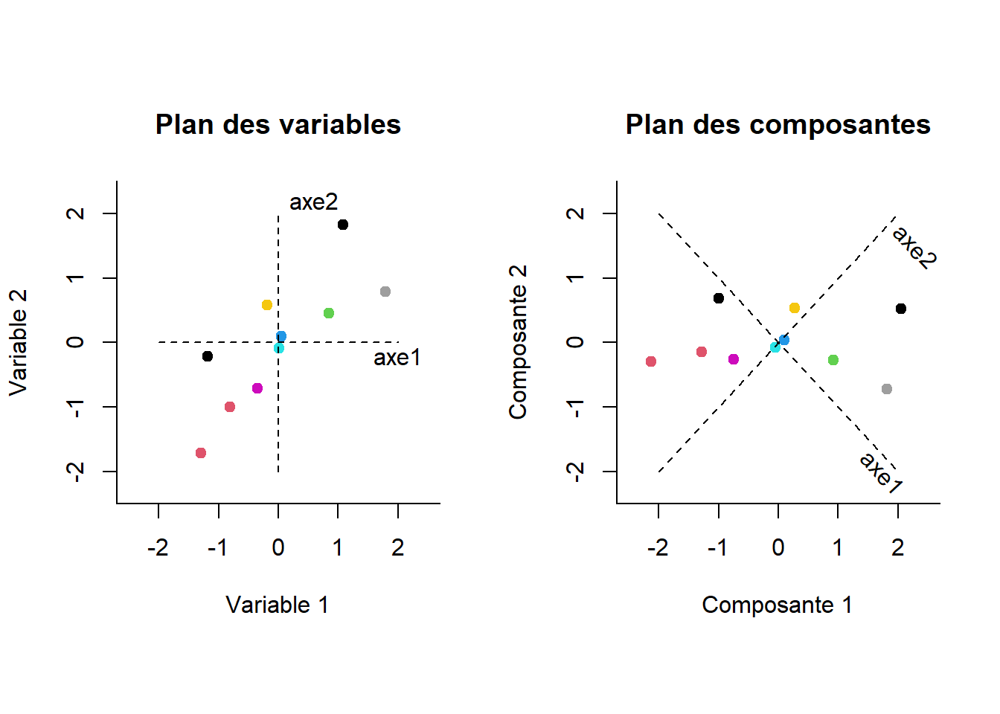
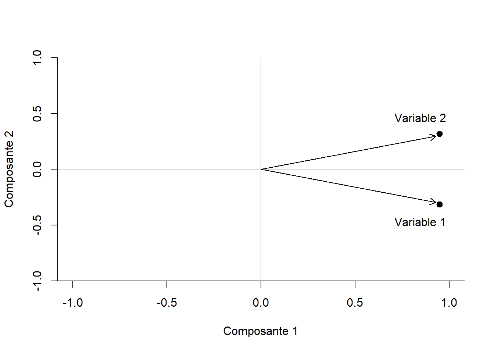

# (PART) Analyses factorielles {-}

# Décomposer

Prédire une variable dépendante à partir de variables indépendantes n'est pas la seule façon de décortiquer des données. Il existe des techniques statistiques qui réorganisent l'information (les corrélations) des variables. Il s'agit des **analyses factorielles**. Elles s'intéressent plus à la *structure* des corrélations plutôt qu'aux *systèmes* qui les lient. Bien qu'il s'agisse de nuances sur le plan statistique, deux côtés d'une même médaille, les différences sont importantes sur le plan théorique. Plutôt que de parler de *cause* à *effet* entre les variables, ce sera plutôt la structure sous-tendant les variables qui sera d'intérêt.

À titre de comparaison illustrative, la Figure\ \@ref(fig:regaf) présente à gauche la régression, $x_1$ prédit $x_2$, et à droite le facteur $F$ qui est la source de $x_1$ et $x_2$. 

<div class="figure" style="text-align: center">

<p class="caption">(\#fig:regaf)Représentations de la régression et l'analyse factorielle</p>
</div>

Plusieurs éléments permettent de mieux mettre en évidence les différences entre les deux modèles. Les **variables manifestes** $x_i$ sont des mesures empiriques mesurées auprès d'unités d'observations. Elles sont représentées pas des rectangles. Le facteur $F$ est représentée par un cercle. Il s'agit d'une **variable latente**, une variable non observée et inférée à partir des variables manifestes. Par exemple, les habiletés de lecture $x_1$ sont liées aux habiletés en mathématiques $x_2$. Mieux le participant sait lire, plus rapidement et plus exactement il peut répondre aux questions de mathématiques. De l'autre côté, les habiletés de mathématiques et de lectures peuvent aussi être liées à  un facteur commun, l'intelligence. Les habiletés de mathématiques et de lectures sont observables par des évaluations, mais l'intelligence est inférée à partir de ces tests^[Il est particulièrement important d'identifier le facteur comme variable latente. Autrement, le modèle à droite pourrait représenté une **variable confondante**, la variable qui cause *accidentellement* la corrélation entre deux autres, comme l'intelligence et la grandeur des pieds dont le lien provient de l'effet de l'âge.]. C'est là que les analyses factorielles entre en jeu.

Les analyses factorielles sont utiles, par exemple, lorsqu'un test psychométrique est créé. Le psychométricien s'intéresse à connaître quels items (variables) sont liés sur quelle dimension et à quel degré. Les items communs sont liés sur certains facteurs et pas ou peu sur les autres. Le facteur à un fort potentiel explicatif pour les items qui lui sont fortement liés, voire même représente un thème commun partagé entre ces items.

<!-- L'ACP a une optique d'utilisation beaucoup plus grande que l'analyse factorielle exploratoire. L'expérimentateur pourrait s'intéresser à seulement réorganiser la variance sans aucune visée *factorielle*. Il pourrait vouloir identifier l'ensemble des meilleurs prédicteurs ou encore résumer l'information de façon à générer des figures qui seraient autrement trop complexes. Enfin, l'ACP peut aussi être conceptualisé comme une forme de compression comme en informatique. Puisque l'information se trouve dans les premières composantes, les moins informatives peuvent être discartées afin de résumer un maximum d'informations sur les données avec le minimum de facteurs. -->


Dans ce livre, deux types d'analyse factorielle sont abordées : l'**analyse en composantes principales** et l'**analyse factorielle**. La première est un modèle athéorique (sans hypothèses sous-jacentes) à la structure des données, alors que la seconde présuppose, comme hypothèse, un ou des facteurs latents communs. Sur le plan computationnel, l'analyse en composantes principales réorganise tous les facteurs, alors que l'analyse factorielle extrait un nombre donné de facteurs. Les analyses factorielles se distinguent également en deux catégories : **exploratoire** et **confirmatoire**. Ces termes distinguent si l'analyse contraint ou non la structure factorielle. Tout cela sera abordé plus en détails dans les prochains chapitres.

## L'analyse en composantes principales

L'analyse en composantes principales (ACP) fait partie de la famille des analyses factorielle exploratoire. Elle consiste à réorganiser des variables corrélées (une matrice de covariance) en nouvelles variables orthogonales (décorrélées) les unes des autres. Ces nouvelles *variables* sont des composantes principales, axes principaux ou encore des dimensions. Il s'agit d'une technique à la fois géométrique et statistique dont les champs d'application vont de la psychologie, la sociologie, la biologie, la chimie et la physique quantique ou encore les mathématiques pures. Elle ne se limite donc pas qu'à la psychométrie.

L'ACP prend comme base la matrice de corrélation^[Afin de simplifier le propos, seule l'analyse en composantes principales sur une matrice corrélation sera présentée.] et la réorganisation (essentiellement une rotation géométrique) afin que les nouvelles dimensions sont indépendantes l'une de l'autre. L'ACP procure trois informations cruciales sur une matrice de corrélation, les valeurs propres, les vecteurs propres et les *loadings*`[Souvent traduit par *charge*, mais le terme loading semble plus approprié.].

### Les valeurs propres

Les valeurs propres (*eigenvalues*) représentent l'aspect crucial de l'ACP, soit l'importance de chaque composante à représenter les variables. Plus les variables sont liées sur un même axe (en nombre et en poids), plus la valeur propre sera élevée. Mathématiquement, les valeurs propres sont représentées par un vecteur $\Lambda$ ou une matrice diagonale $\text{diag}(\Lambda) = \mathbf{\Lambda}$.

La somme des valeurs propres égale la somme des variances, ce qui équivaut en matrice de corrélation à $p$, le nombre de variables. Comme il s'agit du potentiel maximal de ce qui peut être expliqué et que les valeurs sont une part de ce total, il est possible de calculer leur importance relative et même d'en tirer des pourcentage. Par exemple une valeur propre de 5 sur un total de $p=10$ variables signifie que l'axe correspondant explique $5/10  \times 100 = 50$% de la variance de la matrice de corrélation. En d'autres termes, la valeur propre est une bonne métrique de l'importance d'une dimension.

En identifiant les composantes principales, l'ACP révèle du même coup l'importance de chacune d'elle. Il devient ainsi tout naturel de les classer en ordre décroissant.

### Les vecteurs propres

Les vecteurs propres (*eigenvectors*) sont les axes d'orientation des valeurs propres dans le plan de la matrice de corrélation originale. Chaque axe représenté est orthogonal (indépendant) aux autres. Ils sont également normalisés, c'est-à-dire des vecteurs unitaires (la somme de leur carré égale 1). Mathématiquement, les vecteurs propres sont représentés par une matrice $\mathbf{V}$.

### Les loadings

Les vecteurs propres avec les valeurs propres permettent de calculer les loadings. Ils correspondent au lien entre chaque axe et les variables. En d'autres termes, les loadings correspondent au degré selon lequel une variable corrèle avec un facteur. C'est l'importance relative de chaque variable sur chaque axe. Par exemple, les variables très associées avec un certain axe ont de très forts loadings en lien avec cet axe, mais des loadings beaucoup plus faibles avec les axes avec lesquels ils sont moins associés. L'équation\ \@ref(eq:loadings) détaille l'équation.

\begin{equation}
\mathbf{L} =\mathbf{V}\mathbf{\Lambda^{\frac{1}{2}}}
(\#eq:loadings)
\end{equation}

Lorsque dérivés d'une matrice de corrélations, les loadings sont les corrélations entre l'axe et la variable. C'est la force des liens de la Figure\ \ref(fig:regaf) allant de $F$ aux $x$. En termes d'analyse factorielle, il s'agit de scores factoriels.

Pour mieux illustrer, les valeurs propres, les vecteurs propres, les loadings, mais surtout la décomposition en axes principaux, la section suivante présente un exemple pour mettre le tout en commun.

## Création de données

La création de données pour une ACP est très simple. Il suffit de créer une matrice de covariance ou de corrélation. Dans cet exemple, 10 participants sont mesurés sur deux variables ayant une corrélation de .80 entre elles.


```r
# Pour la reproductibilité
set.seed(42)

# Quelques paramètres
n <- 10
rho <- .80
S <- matrix(c( 1, rho,
              rho, 1),
            ncol = 2, nrow = 2,
            dimnames = list(nom <-c("x1", "x2"), nom))

jd.acp <- MASS::mvrnorm(n = n, 
                        mu = rep(0, 2), 
                        Sigma = S, 
                        empirical = TRUE)
```

L'argument `empirical = TRUE` assure que la matrice de corrélation de la population est identique à celle de l'équation, $\mathbf{\Sigma} = \mathbf{S}$, ce qui facilite l'interprétation de cet exemple.

La Figure\ \@ref(fig:plotacp) illustre la répartition des 10 participants par rapport aux variables\ 1\ et\ 2. La ligne pointillée désigne la droite de régression qui les relient, soit la pente $\beta = .8$.

<div class="figure" style="text-align: center">

<p class="caption">(\#fig:plotacp)Présentation des données (`jd.acp`)</p>
</div>

## Analyse

Il existe plusieurs fonctions dans **R**, mais aussi dans des packages, pour réaliser l'ACP. L'analyse en soi n'a rien de sorcier (en autant que les statisticiens ne font pas de la magie), c'est surtout l'emballage (arguments, graphiques et sorties) qui change de l'une à l'autre des méthodes. Ces fonctions précalculent et extraient les statistiques désirées, rien que l'utilisateur ne peut faire lui-même.

Il existe quatre fonctions de base **R** pour faire l'analyse en composantes principales. Les deux principales, `eigen()` et `svd()`, fournissent des résultats identiques, mais sont différentes sur l'étendue des analyses qu'elles peuvent faire. Les deux autres, `princomp` et  `prcomp()`, sont leur emballage respectif. Les détails des calculs seront présentées dans une autre section, la section [Calculs derrières l'analyse en composantes principales].

### `eigen()`

La fonction `eigen()` est celle des puristes. Rudimentaire, elle prend en argument une matrice de covariance ou de corrélation et calculent les valeurs propres (`values`) et les vecteurs propres (`vectors`).


```r
# L'analyse de la matrice de corrélation 
res.eig <- eigen(cor(jd.acp))

# Les valeurs propres
res.eig$values
> [1] 1.8 0.2

# Les vecteurs propres
res.eig$vectors
>       [,1]   [,2]
> [1,] 0.707 -0.707
> [2,] 0.707  0.707

# Les loadings
res.eig$vectors %*% diag(sqrt(res.eig$values))
>       [,1]   [,2]
> [1,] 0.949 -0.316
> [2,] 0.949  0.316
```

La fonction `eigen()` ne fonctionne qu'avec des matrices carrées et est donc très robuste afin d'éviter de mauvais arguments.

### `svd()`

L'analyse de décomposition en valeurs singulières (*singular value decomposition*, SVD) est généralement davantage recommandée, car elle est computationnellement plus robuste que `eigen()`. Un puriste **R** choisirait probablement la fonction `eigen()` même si, de toute façon, les résultats demeurent virtuellement identiques.


```r
# L'analyse de la matrice de corrélation
res.svd = svd(cor(jd.acp))

# Les valeurs propres
res.svd$d
> [1] 1.8 0.2

# Les vecteurs propres
res.svd$v
>        [,1]   [,2]
> [1,] -0.707 -0.707
> [2,] -0.707  0.707

# Les loadings
res.svd$v %*% diag(sqrt(res.svd$d))
>        [,1]   [,2]
> [1,] -0.949 -0.316
> [2,] -0.949  0.316
```

Les résultats sont identiques à la fonction `eigen()`. Le lecteur attentif aura toutefois remarqué que `res.svd$v` n'égale pas exactement `res.eig$vectors` à cause des signes négatifs du premier vecteur propre. Toutefois, il convient d'affirmer que c'est seulement la polarité qui est différente, comme si un vecteur propre indiquait le nord et l'autre le sud, alors que les deux sont dos à dos, exactement à $180^{\circ}$.


La fonction `svd()` est plus générale et peut utiliser des matrices rectangulaires. Il faut faire attention de ne pas lui fournir le jeu de données et bien la matrice de covariance ou de corrélation.

Il convient également d'ajouter que, comme $\mathbf{\Sigma} = \mathbf{S}$ (à l'aide de l'argument `empirical = TRUE` de `MASS::mvrnorm()`), il n'était pas nécessaire de générer de données à proprement parler pour réaliser les analyses, car `svd(S)` ou `eigen(S)` offre les mêmes résultats. C'est la matrice de corrélation qui est décomposée et non les participants. Remarquez d'ailleurs comment l'ACP est indépendante de la taille d'échantillon dans son fonctionnement.

## Représentations des résultats

La Figure\ \@ref(fig:acpsuj) montre à gauche les données originales sur les axes représentées par les deux variables (une reprise de la Figure\ \@ref(fig:plotacp)). À droite, il s'agit de la rotation trouvée par l'ACP (`eigen()` ou `svd()`). Les participants conservent entre eux les mêmes distances par rapport aux autres, mais aussi par rapport aux axes originaux représentées par des lignes pointillées. C'est vraiment l'orientation du plan qui change^[Tout problème de distance, s'il y a lieu, est dû à l'échelle des figures.].

<div class="figure" style="text-align: center">

<p class="caption">(\#fig:acpsuj)Représentations des participants selon les variables (gauche) ou les composantes principales (droite).</p>
</div>

La première composante retrouvée correspond à la droite de régression de la Figure\ \@ref(fig:plotacp). Il s'agit de l'informations partagées par les deux variables : c'est leur axe commun. L'erreur résiduelle correspond au deuxième axe (l'axe vertical). Cette intuition est fondamentale : une valeur propre élevée implique une dimension où de la variance est partagée entre les variables, alors qu'une valeur propre plus faible aura tendance a représenté une dimension de résidus, et par définition, d'informations non partagées. 

La Figure\ \@ref(fig:varacp) offre une vue de l'agencement des variables sur les deux axes. Il s'agit des loadings des variables dans l'espace des composantes. Cette représentation est assez triviale pour deux variables, mais peut devenir très pertinente lorsque plusieurs variables (ou items) sont concernées. Il est possible d'observer alors des regroupements d'items sur les facteurs. Elle se limite toutefois à une ou deux composantes étant donné la complexité de réaliser et d'interpréter des figures de trois dimensions et plus.

<div class="figure" style="text-align: center">

<p class="caption">(\#fig:varacp)Représentations des vraiables selon les composantes principales.</p>
</div>

## Les calculs de l'analyse en composantes principales

Il existe plusieurs techniques mathématiques pour retrouver les valeurs propres. Elles ont leur forces et avantages. Elles ont certainement tous en commun que, plus le nombre de variables augmente, plus le désir de les calculer par ordinateur est grand. Ici, une technique est présentée dans l'optique de bien vérifier qu'aucun sortilège computationnel n'opère derrière le logiciel^[Et non de rendre le lecteur un expert en algèbre matricielle.]. 

### Le polynôme caractéristique

L'objectif du polynôme caractéristique est de retrouver tous les inconnus, $\lambda$ (les valeurs propres), de l'équation\ \@ref(eq:polnom) 

\begin{equation}
|\mathbf{S} - \lambda \mathbf{I}| = 0
(\#eq:polnom)
\end{equation}

qui représente le déterminant (indiqué par les $||$) nul de la matrice.

En conservant l'exemple précédent, on remplace la matrice symétrique

$$
\mathbf{S} = \left(
\begin{array}{cc}
1 & .8 \\
.8 & 1
\end{array} 
\right)
$$

dans l'équation\ \@ref(eq:polnom), ce qui donne,

$$
\left| \left(
\begin{array}{cc}
1 & .8 \\
.8 & 1
\end{array} 
\right)
-\lambda \left(\begin{array}{cc}
1 & 0 \\
0 & 1
\end{array} 
\right) \right| = 0
$$

et ainsi
 
$$
\left| \left(
\begin{array}{cc}
1 & .8 \\
.8 & 1
\end{array} 
\right)
- \left(\begin{array}{cc}
\lambda & 0 \\
0 & \lambda
\end{array} 
\right) \right| = 0
$$

et ainsi

$$
\left| \left(
\begin{array}{cc}
1 - \lambda & .8 \\
.8 & 1 - \lambda
\end{array} 
\right)
 \right| = 0
$$

Le polynôme caractéristique est retrouvé en calculant le déterminant de la matrice, soit le produit de la diagonale moins le produit des valeurs hors diagonale^[Dans le cas d'une matrice $2 \times 2$. C'est beaucoup compliqué pour de plus grande matrice.],

$$
(1-\lambda)(1-\lambda) - (.8)(.8) = 0
$$
 
ce qui donne

\begin{equation}
\lambda^2 - 2 \lambda +.36 = 0
(\#eq:polycar2)
\end{equation}

où il est maintenant possible de résoudre $\lambda$ avec la très célèbre équation\ \@ref(eq:sec).

\begin{equation}
a\lambda^2+b\lambda+c=0 \implies \lambda=\frac{-b \pm \sqrt{b^2-4ac}}{2a}
(\#eq:sec)
\end{equation}

Les solutions sont $.2$ et $1.8$. Graphiquement, la Figure\ \@ref(fig:polycarf) illustre l'équation polynomiale caractéristique \@ref(eq:polycar2).

<div class="figure" style="text-align: center">

<p class="caption">(\#fig:polycarf)L'équation du polynôme caractéristique</p>
</div>

Cela fait beaucoup de mathématiques. Est-il possible d'y arriver plus simplement avec **R**? Le package `pracma` [@pracma] offre une fonction `charpoly()` qui permet de trouver le polynôme caractéristique d'une matrice. **R** de base a aussi une fonction permettant de résoudre des polynômes, `polyroot()`. Avec ces deux fonctions, il est possible de refaire toute la présente section. Il faut toutefois noter que les coefficients polynomiaux donnés par `charpoly()` doivent être inversés pour `polyroot()`. À noter l'ajout de la fonction`Re()` assure que les valeurs propres sont ne nombre réels et non imaginaire. Par convention, les valeurs propres sont ordonnées de façon décroissantes, bien qu'elle n'est originalement pas d'ordre particulier.


```r
# Trouver les coefficients polynomiaux
coef.poly <- pracma::charpoly(S)

# Inverser l'ordre
coef.poly <- coef.poly[length(coef.poly):1]

# Trouver les valeurs à 0 (valeurs propres, E)
E <- Re(polyroot(coef.poly))

# Mettre en ordre décroissant
E <- sort(E, decreasing = TRUE)
```

Et voilà! Les valeurs propres sont retrouvées. Pour les vecteurs propres, c'est un peu plus compliqué. 

L'objectif est de trouver pour chaque valeur propre la solution de l'équation\ \@ref(eq:vec11)

\begin{equation}
\left(\mathbf{S} - \lambda_i \mathbf{I} \right) v_i= 0
(\#eq:vec11)
\end{equation}

soit

\begin{center}
\begin{tabular}{c | c}
$\lambda = 1.8$ & $\lambda = .2$ \\
& \\
$\left[ \left(
\begin{array}{cc}
1 & .8 \\
.8 & 1
\end{array} 
\right)
- 1.8 \left(\begin{array}{cc}
1 & 0 \\
0 & 1
\end{array} 
\right) \right]\left[
\begin{array}{c}
v_{11} \\
v_{21}
\end{array} 
\right] = 0 $ & $
\left[ \left(
\begin{array}{cc}
1 & .8 \\
.8 & 1
\end{array} 
\right)
- .2 \left(\begin{array}{cc}
1 & 0 \\
0 & 1
\end{array} 
\right) \right]\left[
\begin{array}{c}
v_{12} \\
v_{22}
\end{array} 
\right] = 0$ \\
 & \\
 $\left[ \left(
\begin{array}{cc}
-.8 & .8 \\
.8 & -.8
\end{array} 
\right)
\right]\left[
\begin{array}{c}
v_{11} \\
v_{21}
\end{array} 
\right] = 0 $ & $
\left[ \left(
\begin{array}{cc}
.2 & .8 \\
.8 & .2
\end{array} 
\right)
\right]\left[
\begin{array}{c}
v_{12} \\
v_{22}
\end{array} 
\right] = 0$\\
 & \\
$\begin{aligned}
-.8v_{11} + .8 v_{21}=0 \\
.8v_{11} - .8 v_{21}=0 
\end{aligned}$ & 
$\begin{aligned}
.8v_{12} + .8 v_{22}=0\\
 .8v_{12} + .8 v_{22}=0
\end{aligned}$ 
\end{tabular}
\end{center}

Ce système d'équation est toujours indéterminé. Pour le résoudre, la solution est de fixer arbitrairement à l'un des éléments de $\mathbf{V}$, comme $v_{11} = v_{12} = 1$ 
\begin{center}
\begin{tabular}{l | r}
$\begin{aligned}
v_{11} = 1 \\
-.8(1)+.8v_{21} = 0\\
-.8 + .8v_{21} = 0\\
v_{21} = 1
\end{aligned}$ &
$\begin{aligned}
v_{12} = 1 \\
.8(1)+.8v_{22} = 0\\
.8+ .8v_{22} = 0\\
v_{22} = -1
\end{aligned}$
\end{tabular}
\end{center}

Ainsi, la matrice $\mathbf{V}$ est

$$
\mathbf{V} = \left[
\begin{array}{cc}
1 & 1 \\
1 & -1
\end{array} \right]
$$
Il ne reste qu'à normaliser les colonnes (vecteurs) pour que leur longueur soit l'unité. Pour ce faire, il faut diviser chaque élément du vecteur et le diviser par racine carré de la somme des carrés des éléments du vecteur. 

$$
\mathbf{V_{ij}} = \frac{v_{ij}}{ \sqrt{\sum_{i = 1}^p v_{i}}}
$$
ce qui donne

$$
\mathbf{V} = \left[
\begin{array}{cc}
.707 & .707 \\
.707 & -.707
\end{array} \right]
$$
Les résultats sont reproduits.

Pour un grand nombre de variables, il est préférable d'utiliser une fonction d'optimisation. La logique demeure similaire. En fixant un élément du vecteur propre, la fonction tente de trouver la meilleur solution pour résoudre l'équation\ \@ref(eq:vec11).

Pour ce faire, à chaque vecteur propre, la fonction reçoit la valeur propre associée, la matrice de corrélation et une série d'estimateur (le vecteur propre) à trouver.

La fonction maison `cherche.vecteur()` calcule la sommes (`sum()` des écart absolus (`abs()`) entre les estimateurs et la valeur cible de 0 de l'équation\ \@ref(eq:vec11). La fonction **R** `optim()`, prend cette fonction et tente de minimiser les distances, c'est-à-dire d'arriver au résultats de 0 en variant les estimateurs. Noter comment un estimateur est déjà fixé à 1 dans `matrix(c(1, est))` qui correspond à $v_j$ où $v_{1j}=1$. La fonction `optim()` prend un argument d'estimateur `par`, les paramètres à trouver et `fn` la fonction à optimiser et une méthode d'optimisation appropriée, `method = "BDGS` dans ce cas-ci. Les deux autres arguments sont pour la fonction à optimiser `cherche.vecteur()`, soit la matrice de covariance et la valeur propre.


```r
# Fonction à optimiser
cherche.vecteur <- function(est, Ep, M) {
  # est = estimateur
  # Ep = valeur propre
  # M =  matrice de corrélation
  sum(abs((M - diag(Ep, nrow(M))) %*% matrix(c(1, est))))
}

# Variable pour enregistre les résultats
V = matrix(0, nrow(S), ncol(S))

# Boucle d'optimisation pour chaque
# valeur propre
for (i in 1:length(E)) {
  V[,i] <- c(1, optim(par = rep(0, ncol(S)-1),
                      fn = cherche.vecteur,
                      method = "BFGS",
                      Ep = E[i], # valeur.prpore
                      M = S)$par
  )
}

# Normaliser les vecteurs
V <- t(t(V) / sqrt(colSums(V^2)))
```

Il suffit maintenant de jumeler la syntaxe pour trouver les valeur propre et celle ci-haut pour créer sa propre fonction d'analyse en composantes principales. 


```r
acp.maison <- function(S){
  # Trouver les coefficients polynomiaux
coef.poly <- pracma::charpoly(S)

# Inverser l'ordre
coef.poly <- coef.poly[length(coef.poly):1]

# Trouver les valeurs à 0 (valeurs propres, E)
E <- Re(polyroot(coef.poly))

# Mettre en ordre décroissant
E <- sort(E, decreasing = TRUE)

# Fonction à optimiser
cherche.vecteur <- function(est, Ep, M) {
  sum(abs((M - diag(Ep, nrow(S))) %*% matrix(c(1, est))))
}

# Variable pour enregistre les vecteurs propres
V = matrix(0, nrow(S), ncol(S))

# Boucle d'optimisation pour chaque
# valeur propre
for (i in 1:length(E)) {
  V[,i] <- c(1, optim(par = rep(0, ncol(S)-1),
                      fn = cherche.vecteur,
                      method = "BFGS",
                      Ep = E[i], 
                      M = S)$par
  )
}

# Normaliser les vecteurs
V <- t(t(V) / sqrt(colSums(V^2)))

return(list(valeur.propre = E, 
            vecteur.propre = V))

}
```

Pour terminer, la fonction est mis à l'épreuve.


```r
acp.maison(S)
> $valeur.propre
> [1] 1.8 0.2
> 
> $vecteur.propre
>       [,1]   [,2]
> [1,] 0.707  0.707
> [2,] 0.707 -0.707
```

Les résultats sont virtuellement identiques.

<!-- ### Décomposition QR -->


<!-- ## Créer des données à partir de valeur propres -->


<!-- ## Un exemple avec plus de variables -->

<!-- ## Rotation varimax -->
<!-- ```{r, echo = FALSE, eval = FALSE} -->
<!-- res.rot <- varimax(ld) -->
<!-- # plot(res.rot$loadings, xlim = c(-2,2), ylim = c(-2,2), pch = 19, bty = "n", lwd = 2, yaxs="i") -->
<!-- # segments(x0 = -2, y0 = 0, y1 = 0, x1 = 2, col = "grey") -->
<!-- # segments(x0 = 0, y0 = -2, y1 = 2, x1 = 0, col = "grey") -->
<!-- ``` -->
