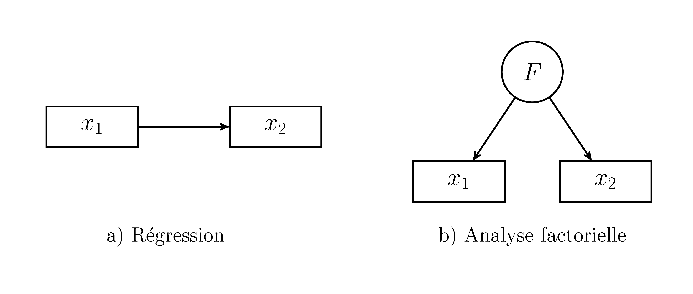
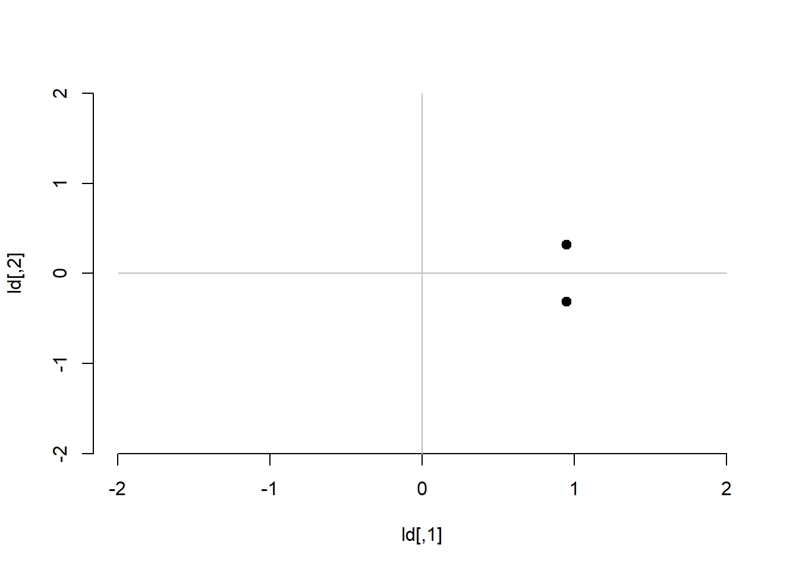
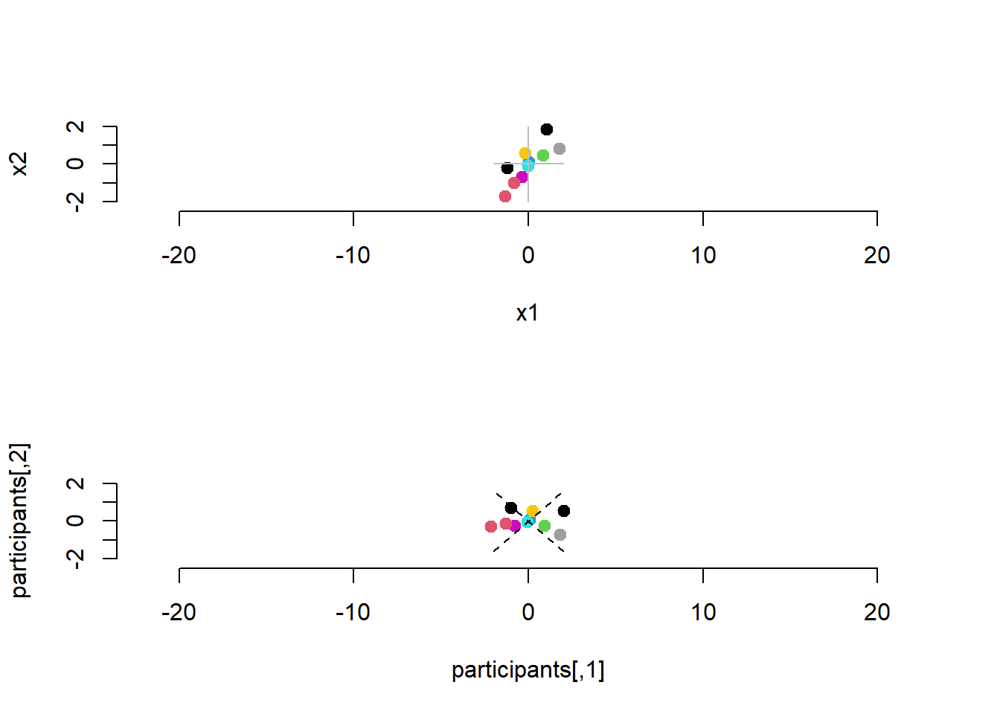

# (PART) Analyse factorielle {-}
# Explorer

Prédire une variable dépendante à partir de variables indépendantes n'est pas la seule technique statistique possible. Il existe des techniques qui réorganise l'information (les corrélation) des variables. Elles s'intéressent plutôt à la *structure* des corrélations qu'aux *systèmes* qui les lient. À titre illustratif, la Figure\ \@ref(fig:regaf) présente à gauche la régression, $x_1$ prédit $x_2$ et à droite le facteur $F$ qui est la source de $x_1$ et $x_2$. 

<div class="figure" style="text-align: center">

<p class="caption">(\#fig:regaf)Représentations de la régression et l'analyse factorielle</p>
</div>

Plusieurs éléments permettent de mieux mettre en évidence les différences entre les deux. Les **variables manifestes** $x_i$ sont des mesures empiriques mesurées auprès d'unités d'observations. Elles sont représentées pas des carrés. Le facteur $F$ est représentée par un cercle. Il s'agit d'une **variable latente**, une variable non observée et inférée à partir des variables manifestes. Par exemple, les habiletés de lecture $x_1$ sont liées aux habiletés en mathématiques $x_2$. Mieux le participant sait lire, plus rapidement et plus exactement il peut répondre aux questions de mathématiques. De l'autre côté, les habiletés de mathématiques et de lectures peuvent aussi être lié à  un facteur commun, l'intelligence par exemple. Les habiletés de mathématiques et de lectures sont observables par des évaluations, mais l'intelligence est inféré à partir de ces tests.

## L'analyse en composantes principales


## Création de données

La création de données pour une ACP est très simple. Il suffit de créer une matrice de covariance ou de corrélation.


```r
# Pour la reproductibilité
set.seed(42)

# Quelques paramètres
n <- 10
rho <- .80
S <- matrix(c( 1, rho,
              rho, 1),
            ncol = 2, nrow = 2,
            dimnames = list(nom <-c("x1", "x2"), nom))

jd.acp <- MASS::mvrnorm(n = n, 
                        mu = rep(0, 2), 
                        Sigma = S, 
                        empirical = TRUE)
```

La Figure\ \@ref(fig:plotacp)


```r
jd.acp <- as.data.frame(jd.acp)
res <- coef(lm(x2~x1, data = jd.acp))
plot(jd.acp, xlim = c(-2,2), ylim = c(-2,2), pch = 19, bty = "n", lwd = 2, yaxs="i")
segments(x0 = -2, y0 = 0, y1 = 0, x1 = 2, col = "grey")
segments(x0 = 0, y0 = -2, y1 = 2, x1 = 0, col = "grey")
segments(x0 = -4, y0 = res[1]+res[2] * -4, x1 = 3, y1 = res[1]+res[2]*3, lwd = 2, lty = "dashed")
```

<div class="figure" style="text-align: center">

<p class="caption">(\#fig:plotacp)Présentation des données (`jd.acp`)</p>
</div>

```r
# jd.acp %>% 

#   ggplot(aes(x = x1, y = x2)) + 
#   geom_point()
```


## Analyse


```r
res.acp <- eigen(cor(jd.acp))
res.acp$values
> [1] 1.8 0.2
res.acp$vectors
>       [,1]   [,2]
> [1,] 0.707 -0.707
> [2,] 0.707  0.707
```

La Figure\ \@ref(fig:varacp) offre une vue de l'agencement des variables sur les deux axes.


```r
ld <- res.acp$vectors %*% diag(sqrt(res.acp$values))
plot(ld, xlim = c(-2,2), ylim = c(-2,2), pch = 19, bty = "n", lwd = 2, yaxs="i")
segments(x0 = -2, y0 = 0, y1 = 0, x1 = 2, col = "grey")
segments(x0 = 0, y0 = -2, y1 = 2, x1 = 0, col = "grey")
```




```r
r.svd <- svd(jd.acp)
participants <- r.svd$u %*% diag(r.svd$d)
axes <- r.svd$v %*% diag(r.svd$d)
par(mfrow = c(2, 1))
plot(jd.acp, xlim = c(-2.5,2.5), ylim = c(-2.5,2.5), pch = 19, bty = "n", lwd = 2, yaxs="i", col=(1:n), asp = 1)
segments(x0 = -2, y0 = 0, y1 = 0, x1 = 2, col = "grey")
segments(x0 = 0, y0 = -2, y1 = 2, x1 = 0, col = "grey")
plot(participants, xlim = c(-2.5,2.5), ylim = c(-2.5,2.5), pch = 19, bty = "n", lwd = 2, yaxs="i",col=(1:n), asp = 1)
segments(x0 = -2, y0 = res[1]+res[2]*-2, x1 = 2, y1 = res[1]+res[2]*2, lty = "dashed")
segments(x0 = 2, y0 = -2 * res[2], x1 = -2, y1 = 2*res[2], lty = "dashed")
```



```r
#segments(x0 = -axes[1,1], y0 = -axes[1,2], y1 = axes[1,2], x1 = axes[1,1], col = "grey")
#segments(x0 = -axes[2,1], y0 = -axes[2,2], y1 = axes[2,2], x1 = axes[2,1], col = "grey")
```


```r
res.rot <- varimax(ld)
# plot(res.rot$loadings, xlim = c(-2,2), ylim = c(-2,2), pch = 19, bty = "n", lwd = 2, yaxs="i")
# segments(x0 = -2, y0 = 0, y1 = 0, x1 = 2, col = "grey")
# segments(x0 = 0, y0 = -2, y1 = 2, x1 = 0, col = "grey")
```


## Calculs
#### Décomposition QR
#### Équation caractéristique polynomiale


