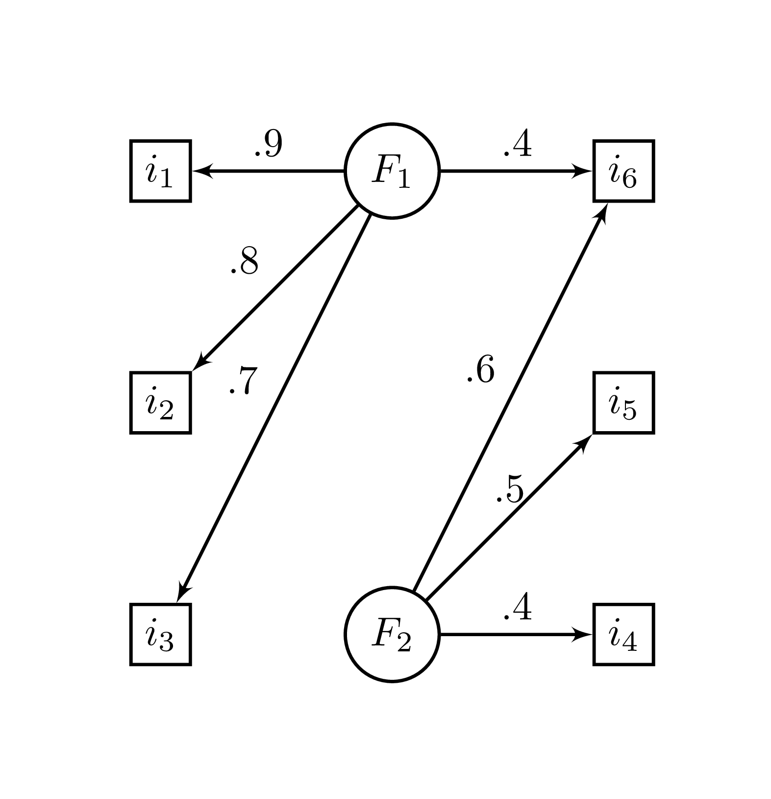

# Explorer

Comme il a été vu, l'analyse en composantes principales (ACP) fait partie de la famille des analyses factorielle exploratoire. Elle consiste à réorganiser des variables corrélées (une matrice de covariance) en nouvelles variables orthogonales (décorrélées) les unes des autres. Il s'agit d'une technique de réorganisation de la variance. Elle procure du même coup [des valeurs propres][Les valeurs propres] qu'il est possible d'ordonner en ordre décroissant et qui représentent la variance partagée entre les variables sur les composantes. Il est par conséquent justifié d'utiliser les valeurs propres comme indices de la qualité d'une composante à représenter les liens entre les variables.

Dans

## Création de données


Pour construire une un jeu de données ayant une structure factorielle, il faut d'abord concevoir cette structure. Il s'agit [des loadings][Les loadings] des facteurs^[Ne pas se tromper avec les vecteurs propres]. Il s'agit d'une matrice $k \times p $, c'est-à-dire nombre de facteurs par nombre de variables. 

<!-- Les lettres grecques sont préférées ici, car il s'agit de paramètres de la population. -->

<!-- Il s'agit des recettes de fabrications des variables : beaucoup de facteur 1 pour la variable 3, un peu du facteur 1 sur la variable 2, etc. Chaque composante, dont il y a un nombre de $k$, s'exprime sur toutes les $p$ variables. Il s'agit en quelques sorte de la quantité de facteur qu'il faut attribuer à telle et telle variable. Ainsi, une matrice $k \times p$ agira comme recette de fabrication pour les variables. Par exemple, s'il y a $2$ facteurs et $6$ variables, les dimensions de la matrice de fabrication est $2 \times 6$. -->


Il est plus simple de considérer pour l'instant une structure standardisée, c'est-à-dire que les variables produites auront des variances de 1 (les moyennes sont écartés, car elles ne sont pas nécessaire, mais pour être plus explicite elles sont nulles). Lors de la spécification de la structure factorielle, il faudra s'assurer que la somme des carrés des loadings de chaque variable ne dépasse pas $1$, soit la variance désirée des variables. Ne pas respecter cette limite ne créera pas forcément une erreur ou un problème. Seulement, le scénario ne sera plus standardisé.

La Figure \@ref(fig:FactStruct) illustre un exemple de modèle. Les rectangles sont des variables manifestes (observées) à partir des quelles les variables encerclées représentent des facteurs sous-jacents, soit des variables latentes (retrouvées à partir des variables manifestes.


<div class="figure" style="text-align: center">

<p class="caption">(\#fig:FactStruct)Structure Factorielle</p>
</div>

La syntaxe ci-dessous reconstruit le modèle de la Figure \@ref(fig:FactStruct). La variable `phi` pour $\Phi$ contient les loadings des deux composantes pour créer les six variables. Les lignes (les variables) sont identifiées par `i` et les colonnes (les facteurs) sont identifiées par `F`.


```r
# Création de la matrice de recette de fabrication
phi = matrix(c(.9, .8, .7,  0,  0, .4,
               0,  0,  0, .6, .5, .4), 
             nrow = 6, ncol =  2)

# Identification des variables et facteurs
colnames(phi) = c("F1", "F2")
rownames(phi) = paste0(rep("i",6), 1:6)
phi
>     F1  F2
> i1 0.9 0.0
> i2 0.8 0.0
> i3 0.7 0.0
> i4 0.0 0.6
> i5 0.0 0.5
> i6 0.4 0.4
```

### Première technique

À partir de `phi`, il est possible d'obtenir la matrice de corrélation de la population $\text{P}$ ($\rho majuscule$) par l'équation \@ref(eq:fact2cor)

\begin{equation}
\text{P} = \Phi \Phi^{\prime}
(\#eq:fact2cor)
\end{equation}

ou en code **R**.


```r
R = phi %*% t(phi)
R
>      i1   i2   i3   i4   i5   i6
> i1 0.81 0.72 0.63 0.00 0.00 0.36
> i2 0.72 0.64 0.56 0.00 0.00 0.32
> i3 0.63 0.56 0.49 0.00 0.00 0.28
> i4 0.00 0.00 0.00 0.36 0.30 0.24
> i5 0.00 0.00 0.00 0.30 0.25 0.20
> i6 0.36 0.32 0.28 0.24 0.20 0.32
```

Le lecteur attentif aura remarqué qu'il ne s'agit pas encore d'une matrice de corrélation. La diagonale n'est pas constitué de 1. Il reste à ajouter le bruit, la variance résiduelle, ce qui est fait en changeant la diagonale de $R$ pour l'unité l'unité, $\text{diag}(R) = 1$. D'ailleurs, si une valeur de la diagonale `R` dépasse 1, alors le scénario standardisé n'est pas respecté. C'est la façon de s'en assurer.


```r
diag(R) <- 1
R
>      i1   i2   i3   i4  i5   i6
> i1 1.00 0.72 0.63 0.00 0.0 0.36
> i2 0.72 1.00 0.56 0.00 0.0 0.32
> i3 0.63 0.56 1.00 0.00 0.0 0.28
> i4 0.00 0.00 0.00 1.00 0.3 0.24
> i5 0.00 0.00 0.00 0.30 1.0 0.20
> i6 0.36 0.32 0.28 0.24 0.2 1.00
```

Avec la matrice `R` calculée, il est évidemment possible, comme il a été fait précédemment de recourir à la fonction `MASS::mvrnorm()` avec comme argument `Sigma = R` pour la matrice de corrélation afin de créer `n` participants. Il ne reste qu'à choisir une taille d'échantillon.


```r
# Pour la reproductibilité
set.seed(33)

# Création du jeu de données
jd <- MASS::mvrnorm(n = 50, 
                    mu = rep(0, ncol(R)), 
                    Sigma = R)
head(jd)
>          i1     i2     i3      i4     i5     i6
> [1,]  0.378  0.396 -0.455 -0.0367  1.209 -0.146
> [2,] -0.311  0.057 -0.439  1.1648  1.058  0.768
> [3,] -0.934 -0.450 -1.221 -0.1498 -0.662 -0.443
> [4,] -0.456  0.250  0.287  0.5350 -0.986  0.686
> [5,]  1.105  2.319  2.236  0.2671  2.468  0.647
> [6,] -0.735 -0.787 -0.825  1.6026 -1.382  1.201
```

### Deuxième technique

Passer par `MASS::mvrnorm()` est toutefois contre productif, puisque la fonction `mvrnorm()` utilise l'ACP pour extraire une structure factorielle pour ensuite générer les données. Une autre façon de créer des données est en passant par [la loi de la somme des variances]. Chaque $k$ loading, $\phi_k$ est dans ce contexte [une constante d'échelle][Ajout des constantes d'échelle $\beta$] joins à un score factorielle normalement distribuée $z_k$. L'équation\ \@ref(eq:fact2var) représente cette relation.

\begin{equation}
x_i = \phi_1 z_1 + ... + \phi_k z_k + \epsilon 
(\#eq:fact2var)
\end{equation}

Ce qui rappelle le modèle linéaire générale de l'équation \@ref(eq:modling) (section [Prédire]). La variable $\epsilon$ correspond à la variance résiduelle, c'est-à-dire la part de variance de la variable non expliquée par les facteurs.

En désirant [le scénario standardisé], la variance de $x$ est fixée à 1 et isoler $\epsilon$ pour en déterminer la variance garantit ce scénario. Cela revient à calculer l'équation\ \@ref(eq:resvarfact).

\begin{equation}
\sigma^2_\epsilon =  1 - (\phi_1^2 + ... + \phi_k^2)  
(\#eq:resvarfact)
\end{equation}

Les écarts types des $\epsilon$ de chaque $p$ variable de la structure factorielle `phi` se calculent simplement avec **R**.


```r
sd.eps <- sqrt(1 - rowSums(phi^2))
```

Maintenant, il faut ajouter cette variable à la structure factorielle. Comme les résidus sont tous indépendants par définition, ils sont techniquement tous leur propre facteur, chacun sa colonne, ce qui se fait bien avec la syntaxe suivante.


```r
diag(sd.eps)
>       [,1] [,2]  [,3] [,4]  [,5]  [,6]
> [1,] 0.436  0.0 0.000  0.0 0.000 0.000
> [2,] 0.000  0.6 0.000  0.0 0.000 0.000
> [3,] 0.000  0.0 0.714  0.0 0.000 0.000
> [4,] 0.000  0.0 0.000  0.8 0.000 0.000
> [5,] 0.000  0.0 0.000  0.0 0.866 0.000
> [6,] 0.000  0.0 0.000  0.0 0.000 0.825
```

Il suffit maintenant de joindre cette matrice à `phi`.


```r
phi2 <- cbind(phi, diag(sd.eps))
```

Il est tentant de joindre directement le vecteur `sd.eps` à `phi`. Par contre, joindre ce vecteur comme `cbind(phi, sd.eps)` implique une structure à trois facteurs et que les résidus sont corrélés par les loadings de ce troisième facteur. En utilisant `diag(se.eps)`, chaque résidu à sont propre facteurs et est indépendants des autres. La structure finale possède $k$ (nombre de facteurs, 2 dans cet exemple) communs en plus de $p$ (nombre de variables, 6 dans cet exemple) facteurs résiduels et ainsi $k + p$ dimensions.

Comme auparavant à l'équation\ \@ref(eq:fact2cor), `phi2` permet d'obtenir la matrice de corrélation de la population.


```r
R2 = phi2 %*% t(phi2)
R2
>      i1   i2   i3   i4  i5   i6
> i1 1.00 0.72 0.63 0.00 0.0 0.36
> i2 0.72 1.00 0.56 0.00 0.0 0.32
> i3 0.63 0.56 1.00 0.00 0.0 0.28
> i4 0.00 0.00 0.00 1.00 0.3 0.24
> i5 0.00 0.00 0.00 0.30 1.0 0.20
> i6 0.36 0.32 0.28 0.24 0.2 1.00
```

Exactement le même résultat que l'autre méthode, et ce, sans avoir à modifier la diagonale. Les variances résiduelles sont déjà calculées.

Une fois la structure factorielle obtenue, il faut générer les scores des participants (les valeurs $z$ de l'équation\ \@ref(eq:fact2var)). Une technique usuelle est de créer une matrice $(k + p)  \times n$ de scores normaux, soit le nombre de facteur plus le nombre de variables (pour les résidus) en ligne par $n$ le nombre d'unités en colonnes. Cette matrice représente les scores factoriaux de chaque unité pour chacun des scores et sont multipliés avec la structure factorielle. Autrement dit, chaque poids (loadings) est multiplié à une distribution normale qui représente le score du participant pour ce facteur. 


```r
n <- 500; k <- 2; p <- 6
score.ind = matrix(rnorm(n * p * k), 
                   nrow = (k + p), 
                   ncol = n)
```

Il ne reste plus qu'à faire le produit matricielle de `phi2` ($\left[ \Phi, \text{diag}(\epsilon) \right]$) et des scores individuelles (`score.ind`). -->


```r
jd2 <- phi2 %*% score.ind
```

La variable `jd2` contient tous les scores des $n$ participants sur les $p$ variables. Pour obtenir la base de données dans le sens usuel, il suffit de faire une transpose à `jd` avec la fonction `t()`.


```r
jd2 <- t(jd2)
head(jd2)
>          i1     i2      i3     i4     i5     i6
> [1,]  0.111 -0.886 -0.9769  0.819  1.562  1.566
> [2,] -1.332 -0.808 -1.0043  0.292  0.372 -1.451
> [3,] -1.451 -1.331 -1.7075 -0.111 -1.145 -1.925
> [4,]  0.439 -0.528  1.4282 -0.708  0.437 -0.253
> [5,] -0.387 -0.488 -0.0509  0.606  0.346 -0.453
> [6,]  0.526  1.163  0.2766  0.371  0.747  0.767
```

Voilà une base de données prêtes à être utiliser pour une analyse factorielle. En pratique, pour donner un peu plus de réalisme, il est possible d'ajouter une moyenne (additionner), de modifier l'écart type (multiplier) de chacune des variables, d'arrondir les scores, et plus en fonction des besoins.

## L'analyse factorielle

Voici les résultats de l'analyse en composantes principales.


```r
# Analyse en composantes principales
res <- eigen(cor(jd))
res
> eigen() decomposition
> $values
> [1] 2.333 1.423 0.877 0.566 0.531 0.269
> 
> $vectors
>         [,1]   [,2]     [,3]   [,4]    [,5]     [,6]
> [1,]  0.5816 -0.106  0.15818  0.123 -0.0164  0.78104
> [2,]  0.5189 -0.204  0.00958  0.531  0.4078 -0.49124
> [3,]  0.4933 -0.247  0.08421 -0.453 -0.5954 -0.35871
> [4,] -0.3277 -0.545  0.01432  0.569 -0.5165  0.06634
> [5,] -0.2038 -0.488  0.71792 -0.281  0.3541 -0.00809
> [6,] -0.0186 -0.592 -0.67244 -0.308  0.2945  0.12457

# Les deux premières valeurs propres

# Les loadings des deux premières composantes
ld <- res$vectors[,1:2] %*% diag(sqrt(res$values)[1:2])
ld
>         [,1]   [,2]
> [1,]  0.8884 -0.126
> [2,]  0.7926 -0.243
> [3,]  0.7535 -0.295
> [4,] -0.5005 -0.650
> [5,] -0.3114 -0.583
> [6,] -0.0285 -0.706
```

Elle est assez près de la structure originale, mais pas exactement. Et ce n'est pas à cause du relativement petit `n` ou de [la graine][Les graines]. La cause est bel et bien que **l'ACP réorganise la variance plutôt que rechercher une structure factorielle**. L'ACP ne sait pas que la *vraie* structure contient des facteurs communs entre les variables. Pour tester la présence de facteurs commun, il faut procéder avec una autre analyse : l'**analyse factorielle exploratoire (AFE)**.

### Analyse factorielle exploratoire

Pour réaliser une analyse factorielle exploratoire, la fonction de base **R** `factanal()` prend un jeu de donnée et le nombre de facteur à tester.


```r
res1 <-  factanal(jd2, factors = 1)
res1
> 
> Call:
> factanal(x = jd2, factors = 1)
> 
> Uniquenesses:
>    i1    i2    i3    i4    i5    i6 
> 0.157 0.376 0.487 0.999 1.000 0.835 
> 
> Loadings:
>    Factor1
> i1  0.918 
> i2  0.790 
> i3  0.716 
> i4        
> i5        
> i6  0.406 
> 
>                Factor1
> SS loadings      2.147
> Proportion Var   0.358
> 
> Test of the hypothesis that 1 factor is sufficient.
> The chi square statistic is 72.2 on 9 degrees of freedom.
> The p-value is 5.7e-12
```

C'est aussi simple que l'ACP (même plus!). La sortie procure trois statistiques d'intérêts : les loadings, la proportion de variance expliquée (`Proportion Var`) et un test de $\chi^2$ avec sa valeur-$p$. Les loadings entre -.1 et .1 ne sont pas affichés afin d'attirer l'attention sur la structure. Les loadings peuvent être extraits avec la fonction `loadings()` ou en élément de liste. L'utilisation de `[]` permet d'affichier complètement la matrice de loadings.


```r
loadings(res1)
> 
> Loadings:
>    Factor1
> i1  0.918 
> i2  0.790 
> i3  0.716 
> i4        
> i5        
> i6  0.406 
> 
>                Factor1
> SS loadings      2.147
> Proportion Var   0.358
res1$loadings[]
>    Factor1
> i1  0.9183
> i2  0.7902
> i3  0.7164
> i4 -0.0340
> i5 -0.0186
> i6  0.4060
```
Comme la valeur-$p$ est significative à un facteur, $p < .001$, il est possible de tester pour 2 facteurs.


```r
res2 <-  factanal(jd2, factors = 2)
res2
> 
> Call:
> factanal(x = jd2, factors = 2)
> 
> Uniquenesses:
>    i1    i2    i3    i4    i5    i6 
> 0.156 0.376 0.487 0.709 0.815 0.667 
> 
> Loadings:
>    Factor1 Factor2
> i1  0.918         
> i2  0.790         
> i3  0.716         
> i4          0.538 
> i5          0.430 
> i6  0.417   0.398 
> 
>                Factor1 Factor2
> SS loadings      2.155   0.635
> Proportion Var   0.359   0.106
> Cumulative Var   0.359   0.465
> 
> Test of the hypothesis that 2 factors are sufficient.
> The chi square statistic is 5.45 on 4 degrees of freedom.
> The p-value is 0.244
```
Les mêmes statistiques, mais pour deux facteurs, sont obtenues. Les résultats sont très près de la structure originale. La valeur-$p$ n'est plus significatif ce qui suggère que le modèle semble construits sur deux facteurs. 


## Calculs de l'analyse factorielle exploratoire

Il existe deux techniques plus connues pour réaliser l'analyse factorielle exploratoire : la **factorisation en axes principaux** (PAF; *principal axis factoring*) et l'**analyse factorielle par maximum de vraisemblance** (MLFA; *maximum likelihood factor analysis*). 

La PAF tente de retrouver la matrice de corrélation originale sans bruit, c'est-à-dire la **matrice de corrélation réduite** dans laquelle la diagonale n'est pas constituée de $1$ soit `phi %*% t(phi)` $\Phi\Phi^\prime$. 

La logique est de prendre les loadings, $\phi$ d'un nombre arbitraire de facteurs, puis de calculer la communalité des variables, soit l'équation\ \@ref(eq:com) pour la variable $i$.

\begin{equation}
C_i = \sum_{i=1}^k \Phi_i^2
(\#eq:com)
\end{equation}

L'étape suivante est de faire la différence entre deux communalités subséquentes jusqu'à ce que la différence est convergée.

Pour ce faire, il faut utiliser une technique itérative. Lorsqu'il faut programmer de l'optimisation, il faut prendre quelques précautions pour s'assurer du bon fonctionnement de tout logiciel : 

* fixer un maximum d'itérations afin de s'assurer que dans une boucle interminable duquel le logiciel ne peut s'échapper;

* fixer un seuil de convergence à atteindre afin de déterminer une fin à l'optimisation.

Ces deux règles évitent aux programmeurs de fixer son écran pendant des heures pendant que le programme calcule des résultats dans des boucles interminables.

Ces deux recommandations se retrouvent en arguments et peuvent être modifiées


```r
paf <- function(covmat, 
                nfactors, 
                converge = .000001, 
                max.iter = 100){
  
  # Nombre de variables
  p <- ncol(covmat)
  
  # Boucle d'estimation avec itérations
  # maximales (max.iter)
  for(i in 1:max.iter){
    
    # ACP de la matrice
    res <- eigen(covmat)
    
    # Les loadings
    ld <- res$vector[,1:nfactors] %*% 
      sqrt(diag(res$values[1:nfactors], ncol = nfactors))
    
    # Les communalités
    co <- rowSums(ld^2)
    
    # La différence à optimiser
    diff <- diag(covmat) - co
    
    # Si toutes les différences sont plus petites que
    # convergence, alors `break` cesse la boucle
    if (all(abs(diff) < converge)) break
    
    # Si non,
    # Mettre à jour la nouvelle diagonale
    # de la matrice
    covmat <- covmat - diag(diff)
  }
  
  # Sortie
  return(list(uniquenesses = 1-co,
              loadings = ld,
              covmat = covmat))
}
```

Noter l'ajout de `ncol = ` dans la fonction `diag()`. Cela a pour but de forcer *R* à créer une matrice $1 \times 1$^[Essayer `diag(1.5)` pour observer le comportement de **R**. Ce n'est pas le résultat attendu.]. Enfin, noter l'introduction de `break` (aperçu dans la section [Les variables]) qui permet une boucle lorsque une condition est atteinte.

À toute fin de comparaison, voici la technique PAF maison (`paf()`) et l'analyse factorielle de **R**.


```r
factanal(covmat = R, n.obs = n, factors = 2)
> 
> Call:
> factanal(factors = 2, covmat = R, n.obs = n)
> 
> Uniquenesses:
>   i1   i2   i3   i4   i5   i6 
> 0.19 0.36 0.51 0.64 0.75 0.68 
> 
> Loadings:
>    Factor1 Factor2
> i1  0.900         
> i2  0.800         
> i3  0.700         
> i4          0.600 
> i5          0.500 
> i6  0.392   0.408 
> 
>                Factor1 Factor2
> SS loadings      2.093   0.777
> Proportion Var   0.349   0.129
> Cumulative Var   0.349   0.478
> 
> Test of the hypothesis that 2 factors are sufficient.
> The chi square statistic is 0 on 4 degrees of freedom.
> The p-value is 1
paf(covmat = R, nfactors = 2)
> $uniquenesses
> [1] 0.19 0.36 0.51 0.64 0.75 0.68
> 
> $loadings
>        [,1]    [,2]
> [1,] 0.8937 -0.1060
> [2,] 0.7944 -0.0942
> [3,] 0.6951 -0.0824
> [4,] 0.0707  0.5958
> [5,] 0.0589  0.4965
> [6,] 0.4443  0.3501
> 
> $covmat
>      i1   i2   i3   i4   i5   i6
> i1 0.81 0.72 0.63 0.00 0.00 0.36
> i2 0.72 0.64 0.56 0.00 0.00 0.32
> i3 0.63 0.56 0.49 0.00 0.00 0.28
> i4 0.00 0.00 0.00 0.36 0.30 0.24
> i5 0.00 0.00 0.00 0.30 0.25 0.20
> i6 0.36 0.32 0.28 0.24 0.20 0.32
```

Les résultats sont très près, beaucoup plus que l'ACP de la matrice `R`. La sortie `uniqueness` correspond à `1-C`, la variance résiduelle. Dans les cas, elles sont virtuellement identiques. Dans la sortie de `paf()`, la matrice de corrélation réduite de `R` est sortie et montre qu'elle correspond à ce qui est attendu soit $\Phi\Phi^{\prime}$.


```r
phi%*%t(phi)
>      i1   i2   i3   i4   i5   i6
> i1 0.81 0.72 0.63 0.00 0.00 0.36
> i2 0.72 0.64 0.56 0.00 0.00 0.32
> i3 0.63 0.56 0.49 0.00 0.00 0.28
> i4 0.00 0.00 0.00 0.36 0.30 0.24
> i5 0.00 0.00 0.00 0.30 0.25 0.20
> i6 0.36 0.32 0.28 0.24 0.20 0.32
paf(covmat = R, nfactors = 2)$covmat
>      i1   i2   i3   i4   i5   i6
> i1 0.81 0.72 0.63 0.00 0.00 0.36
> i2 0.72 0.64 0.56 0.00 0.00 0.32
> i3 0.63 0.56 0.49 0.00 0.00 0.28
> i4 0.00 0.00 0.00 0.36 0.30 0.24
> i5 0.00 0.00 0.00 0.30 0.25 0.20
> i6 0.36 0.32 0.28 0.24 0.20 0.32
```

Les résultats sont toutefois légèrement différent pour les loadings. Cela est dû au fait que `factanal()` n'utilise pas la méthode PAF, mais bien le MLFA. Cette technique n'est pas détaillé ici. La technique est très similaire à PAF à l'exception qu'elle focalise sur l'estimation des loadings pour dériver les communalités, plutôt que de seulement les communalités comme la méthode PAF. Pour produire une fonction similaire, il faut passer par l'optimisation avec `optim()` (vu dans [Les calculs de l'analyse en composantes principales]).


