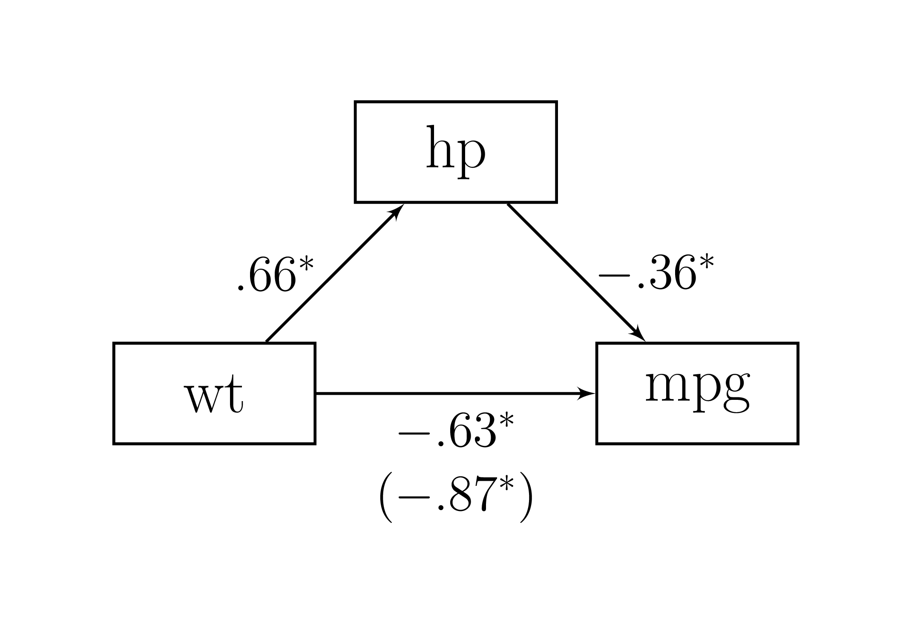

# Médier


Outre les *liens directs* entre deux variables (ce qu'une [régression][Prédire] permet de découvrir), il existe également des *liens indirects*, une relation sous-jacente entre une variable indépendante et une variable dépendante expliquée par l'inclusion d'une troisième variable. L'attrait d'une telle analyse est patent : les expérimentateurs  s'intéressent souvent à expliquer les mécanismes biologiques, psychologiques, cognitifs, etc., qui sous-tendent la relation entre deux variables. 

L'analyse de médiation permet de découvrir et tester des liens indirect. Elle est une analyse statistique de plus en plus populaire parmi les expérimentateurs, peu importe leur discipline, puisqu'elle quantifie le degré selon lequel une variable participe à la transmission du changement d'une *cause* vers son *effet*. L'analyse de médiation peut contribuer à mieux comprendre la relation entre une variable indépendante et une variable dépendante lorsque ces variables n'ont pas de lien direct évident. 

L'analyse de médiation est un sous-ensemble de l'analyse de trajectoire dans lequel le statisticien s'intéresse à la relation entre la variable indépendante $x$ sur la variable dépendante $y$ par l'intermédiaire de la variable médiatrice $m$. Elle s'inscrit dans un système d'équations. L'analyse de médiation se base sur les *liens indirects* qui existent dans ce système d'équations. Ces liens indirects sont ces relations intermédiaires qui intéressent le statisticien. 

Il est plus aisé de concevoir ce qu'est un lien indirect en le comparant aux liens directs. Un **lien direct**, c'est la relation entre une variable indépendante et une dépendante, comme le coefficient de régression, par exemple. Le **lien indirect**, c'est la relation qui existe entre une variable indépendante et une dépendante à travers une ou plusieurs autres variables. 

Pour les fins de ce chapitre^[La section est partiellement basée sur @Caron18.], l'analyse à un seul médiateur est présentée (aussi nommé l'analyse de médiation simple). Il existe de nombreuses extensions (parallèle, sérielle, modérée, etc.) dont les fondements reposent ultimement sur la même logique que celle présentée.

## Analyse de médiation simple

La Figure\ \@ref(fig:simplemed) présente le diagramme de trajectoire correspondant au modèle de médiation simple (un seul médiateur) dans le panneau supérieur. 

<div class="figure" style="text-align: center">

<p class="caption">(\#fig:simplemed)Modèle de médiation simple</p>
</div>

Le cadran supérieur devrait être familier aux lecteurs, car il a été abordé dans le chapitre [Créer], dans une orientation légèrement différente. La Figure\ \@ref(fig:simplemed) peut également être représentée avec une matrice de coefficients de régression $\mathbf{B}$ dans laquelle se retrouvent les coefficients de régression qui relient les variables.

\begin{equation}
\mathbf{B} = 
\left( \begin{array}{ccc}
0 & 0 & 0 \\
\beta_{2,1} & 0 & 0 \\
\beta_{3,1} & \beta_{3,2} & 0 \\
\end{array} 
\right)
(\#eq:B)
\end{equation}

Dans ce cas-ci, $\beta_{2,1}$ signifie que la variable $x$ prédit le médiateur $m$, $\beta_{3,2}$ signifie que le médiateur prédit la variable $y$ et $\beta_{3,1}$ signifie que la variable $x$ prédit la variable $y$. En analyse de médiation, ces effets sont nommés des *effets directs*, comme l'effet direct de $x$ sur $y$, ou l'effet direct de $m$ sur $y$. Pour identifier un effet médiateur, le statisticien cherche l'*effet indirect* de $x$ sur $y$, c'est-à-dire l'effet de $x$ *passant* par $m$ et allant à $y$. L'effet indirect est le produit des deux effets directs concernés et correspond à l'équation\ \@ref(eq:indi1).

\begin{equation}
\beta_{2,1}\times\beta_{3,2}
(\#eq:indi1)
\end{equation}

Ce résultat est dérivé notamment des travaux de @Wright34 sur la méthode de coefficients de trajectoires (*path coefficients*) qui est un moyen flexible de relier les coefficients de régression entre les variables d'un système d'équations.

Lorsqu'il n'y a pas de $m$, la relation existante entre $x$ et $y$ est nommée l'**effet total** représentée par $\sigma_{x,y}$ et est illustrée dans le cadran inférieur de la Figure\ \@ref(fig:simplemed). Ce lien correspond au coefficient de régression entre $x$ et $y$. Dans ce cas spécifique à deux variables, il s'agit également de la covariance entre $x$ et $y$. L'effet total peut être séparé en deux autres effets dont il fait la somme : l'effet direct de $x$ sur $y$ ($\beta_{3,1}$) et l'effet indirect $\beta_{2,1}\beta_{3,2}$. 

\begin{equation}
\sigma_{3,1} = \beta_{3,1} + \beta_{2,1} \beta_{3,2}
(\#eq:etot)
\end{equation}

Un avantage de l'équation\ \@ref(eq:etot) est qu'elle met en relation l'interdépendance des quatre composantes pour dériver un effet total, direct ou indirect. Si trois des mesures sont connues, la quatrième est dérivable avec un peu de réaménagement algébrique. Un autre avantage sur la plan statistique est également de montrer le lien intime qui existe entre la matrice de covariance et les coefficients de régression.

## Tester l'effet indirect

Qu'en est-il du test d'hypothèse de l'effet indirect? Il existe trois méthodes principales pour tester si l'effet indirect est significatif. Il s'agit de la méthode d'étape causale (*causal step method*), la plus populaire étant celle de Baron et Kenny [@BK], la méthode delta multivarié (*multivariate delta method*) [@Rao02] duquel le test de Sobel [@Sobel82] est un cas particulier et (c) les méthodes de bootstrap [@Efron79]. Chacune de ces méthodes sera détaillée ci-dessous.

### La méthode d'étape causale

La méthode d'étape causale aussi connue sous le nom de test de Baron-Kenny est un test séquentiel d'hypothèse afin de vérifier l'existence du lien indirect. Ce test est présenté à des fins historiques uniquement (certains expérimentateurs l'exigent et l'utilisent encore!). Par contre, dans la littérature méthodologique, il n'est plus recommandé, étant rejeté en faveur d'autres méthodes plus adéquates tant sur le plan statistique que conceptuel. La méthode provenant des années 80 lorsque les ordinateurs personnels n'étaient pas encore dans toutes les chaumières a certainement du mérite pour l'époque, mais n'est plus nécessaire aujourd'hui. En plus, c'est un bon exercice d'extraction de résultats avec **R**.

Pour réaliser le test en bonne et due forme, trois tests d'hypothèse sont réalisés en séries. 

1. Existe-t-il une relation entre $x$ et $y$ pour l'effet total? Autrement dit, avant de procéder à l'analyse du lien indirect, y a-t-il un lien entre les variables indépendantes et dépendantes?

2. Existe-t-il une relation directe entre $x$ et $m$? Y a-t-il un lien entre le variable indépendante et le médiateur?

3. Existe-t-il une relation directe entre $m$ et $y$? Y a-t-il un lien entre le médiateur et la variable dépendante?

Les étapes 2 et 3 visent à vérifier si le médiateur a bel et bien un rôle à jouer entre la variable indépendante et dépendante. Le rejet de l'une ou l'autre de ces trois hypothèses mènerait certainement à un statisticien à douter d'une relation entre les variables. Comment pourrait-il y avoir un lien indirect, si l'un de ces liens n'était pas soutenu par les données.

En guise de quatrième test, les expérimentateurs suivant cette tradition testent si la médiation est *complète* ou *partielle*. La **médiation complète** signifie que l'entièreté du lien total entre $x$ et $y$ est maintenant attribuable à l'ajout de $m$. Ce résultat s'observe lorsque le lien direct entre $x$ et $y$ (lorsque $m$ est inclus pour prédire $y$) n'est pas significatif en comparaison à la première étape où le lien total, lui, était significatif. Si le lien direct entre $x$ et $y$ est toujours significatif, même après avoir ajouté le $m$ dans la prédiction de $y$, alors la **médiation est partielle**.

La syntaxe montre comment la méthode d'étape causale pourrait être programmée dans **R**. Il y a trois régressions (`lm()`), une pour chaque test d'hypothèse et quatre étapes sous forme de conditionnel (les trois hypothèses plus le type de médiation). 

Si une des conditions (`if`) n'est pas respectée, le test retourne l'hypothèse nulle. À chacune des étapes, la valeur-$p$ du coefficient a testé est extraite et comparée à l'erreur de type\ I fixée à l'avance ($\alpha$). Le test doit être significatif pour procéder à l'étape suivante. À la toute fin, l'hypothèse nulle est rejetée et le type de médiation (complète ou partielle) est rapporté.

Pour chaque régression, il faut extraire la valeur-$p$ de l'estimateur concerné. La valeur-$p$ se trouve dans le sommaire (`summary()`) du résultat de la régression (`etape`) dans la liste `coefficients`. Dans cette liste, il faut identifier la ligne (`"estimateur"`) à la colonne `"Pr(>|t|)"` qui correspond aux valeurs-$p$. Au final, l'extraction se commande  `summary(etape)$coefficients["estimateur", "Pr(>|t|)"]`. Pour bien fonctionner, les variables du jeu de données doivent se nommer `x`, `m` et `y`. 


```r
BK <- function(donnees, alpha = .05){
  # alpha est l'erreur de type I
  
  # Créer l'hypothèse nulle
  decision = FALSE
  interpretation = "L'effet indirect est non significatif"
  
  # Première régression
  # Est-ce que l'effet total est significatif?
  etape1 <- lm(formula = y ~ x, data = donnees)
  pC <- summary(etape1)$coefficients["x", "Pr(>|t|)"]
  
  if (pC <= alpha){
    # Si le coefficient rho_31 est significatif, alors
    # Deuxième régression
    # Est-ce que l'effet direct de x vers m est significatif?
    etape2 <- lm(formula = m ~ x, data = donnees)
    pA <- summary(etape2)$coefficients["x", "Pr(>|t|)"]
    
    if (pA <= alpha){
      # Si le coefficient beta_21 est significatif, alors
      # Troisième régression
      # Est-ce que l'effet direct de m vers y est significatif?
      etape3 <- lm(formula = y ~ x + m, data = donnees)
      pB <- summary(etape3)$coefficients["m", "Pr(>|t|)"]
      
      # Enregistrer le résultats, si l'effet de médiation a lieu
      decision <- (pB <= alpha)
      
      if (decision){
        # S'il y médiation, est-elle partielle ou complète?
        # Est-ce que Beta_31 est significatif?
        if (summary(etape3)$coefficients["x", "Pr(>|t|)"] <= alpha){
          # Si oui,
          interpretation <- "L'effet indirect est significatif 
          et la médiation est partielle"
        } else {
          # Si non,
          interpretation <- "L'effet indirect est significatif 
          et la médiation est complète"
        }
      }
    }
  }
  cat(interpretation)
}
```

Plusieurs raisons suggèrent de ne pas utiliser la méthode d'étape causale. D'abord, comme une série de tests d'hypothèse est réalisée, l'erreur de type\ I est différente de celle fixée. Il y a trois hypothèses nulles à rejeter, chacune ayant un seuil $\alpha$. La vraie erreur de type I est égale la probabilité de rejeter toutes ces hypothèses nulles accidentellement. Cela correspond à $\alpha^3$. Avec $\alpha=.05$, cela signifie que le taux est de $\alpha^3=.05^3= 1.25\times 10^{-4}$, ce qui est  bien plus stricte que l'erreur de type\ I fixée. Cela entraîne une perte de puissance, c'est-à-dire de trouver des effets indirects lorsqu'ils sont vrais.

Une seconde raison est que l'absence d'effet total entre la variable indépendante et dépendante n'est pas une hypothèse obligatoire. Autrement dit, la première étape, tester si $x$ est lié à $y$ sans tenir de compte de $m$, n'est pas recommander. Il peut exister des effets indirects théoriquement valides sans effets totaux. De plus, les deux autres hypothèses (étapes) ne sont pas obligatoire non plus (quoi qu'elles sont un peu plus dures à justifier) d'ailleurs. Il est tout à fait possible d'avoir des effets indirects significatifs dont les effets directs qui le compose sont non-significatifs^[Quoique dans ces cas, les effets directs sont souvent près d'être significatifs.]. 

### La méthode delta multivarié 

La méthode delta multivarié souvent appelée le test de @Sobel82, auteur qui l'a popularisé pour l'analyse des effets indirects est une méthode ayant recours à l'erreur type approximative de l'effet indirect. 

Le test de Sobel se base sur le calcul selon lequel le ratio de l'effet indirect, $\beta_{2,1}\beta_{3,2}$ par son erreur standard asymptotique $\sqrt{\beta_{3,2}^2\sigma^2_{\beta_{2,1}} +\beta^2_{2,1}\sigma^2_{\beta_{3,2}}}$ se distribue selon une distribution gaussienne. L'équation\ \@ref(eq:sobel) représente ce calcule

\begin{equation}
z=\frac{\beta_{2,1}\beta_{3,2}}{\sqrt{\beta_{3,2}^2\sigma^2_{\beta_{2,1}} +\beta^2_{2,1}\sigma^2_{\beta_{3,2}}}}
(\#eq:sobel)
\end{equation}

où $z$ signifie qu'il s'agit d'un score-$z$, les $\beta$ sont les coefficients de régression et les $\sigma^2_\beta$ sont les erreurs standard des coefficients de régression.

La syntaxe suivante illustre une fonction qui calcule l'équation\ \@ref(eq:sobel). La syntaxe calcule deux régressions `m ~ x` et `m ~ x`. Du sommaire des résultats, elle extrait, les deux coefficients de régressions et leur erreur standard respective. Elle calcule enfin le score $z$ de l'équation\ \@ref(eq:sobel) avec la valeur-$p$ associée. Pour bien fonctionner avec cette fonction, les variables du jeu de données doivent se nommer `x`, `m` et `y`. 


```r
mdm <- function(donnees, alpha = 0.05){
  # alpha est l'erreur de type I
  
  # Réaliser les deux régressions
  etape1 <- lm(formula = m ~ x, data = donnees)
  etape2 <- lm(formula = y ~ x + m, data = donnees)
  
  # Extraire les statistiques
  # Les coefficients de régression
  beta_21 <- etape1$coefficients["x"]
  beta_32 <- etape2$coefficients["m"]
  # Les erreurs standards
  SEa <- summary(etape1)$coefficients["x", "Std. Error"]
  SEb <- summary(etape2)$coefficients["m", "Std. Error"]
  
  # Calcul du score z de l'effet indirect
  SE <- sqrt(beta_21^2 * SEb^2 + beta_32^2 * SEa^2)
  z <- beta_21 * beta_32 / SE
  
  # Décision
  if(abs(z) >= qnorm(1 - alpha/2)){
    cat("L'effet indirect est significatif")
    decision = TRUE
  } else {
    cat("L'effet indirect n'est pas significatif")  
    decision = FALSE
  }
}
```

La raison selon laquelle il ne faut pas recourir au test de Sobel est que le calcul est asymptotique. En fait, la distribution de l'effet indirect tend vers la normalité lorsque la taille d'échantillon est grande. Cela a poussé les statisciens à développer des corrections pour ce test afin de l'amélioré. La distribution des effets indirects peut facilement se programmer avec **R**. En se basant sur le chapitre [Simuler], il est possible de construire une petite illustration. D'abord, il faut créer une fonction qui crée des jeux de données, ici, `gen.ind.effect()` qui prend une matrice de covariance `Sigma` et une taille d'échantillon `n`. La fonction extrait ensuite les deux coefficients de régression et les multiplie. Noter la fonction `coef()` qui permet d'extraire plus simplement les coefficients de régression d'une sortie de `lm()` et `unname()` qui dénomme le résultat (facultatif, mais plus élégant pour la sortie)^[**R** conserve étrangement le nom des variables dans ce cas.]. 


```r
# Pour la reproductibilité
set.seed(1442)

# Matrice de covariance
Sigma <- matrix(c( 1, .2,  0,
                  .2,  1, .3,
                   0, .3,  1),
                ncol = 3, nrow = 3,
                dimnames = list(nom <- c("x", "m", "y"), 
                                nom))

# Créer une fonction qui génère des données
# selon une matrice de covariance `Sigma`
# et un nombre de participants `n`
gen.ind.effect <- function(Sigma, n){
  # Créer jeu de données
  jd <- as.data.frame(MASS::mvrnorm(n =  n, 
                                    Sigma = Sigma, 
                                    mu = rep(0, ncol(Sigma))))
  # Réaliser deux régressions
  etape1 <- lm(formula = m ~ x, data = jd)
  etape2 <- lm(formula = y ~ x + m, data = jd)
  
  # Extraire et multiplier les coefficients de régression
  unname(coef(etape1)["x"] * coef(etape2)["m"])
}
```


Par la suite, la fonction `replicate()` permet de répéter `n` fois la fonction `expr`. Il faut bien distinguer le `n` (nombre de participants) de `gen.ind.effect()` de celui de `replicate()` (nombre de réplications). Enfin, un histogramme est produit pour présenter les résultats.


```r
# Répliquer 5000 la fonction `gen.ind.effect`
test.ind <- replicate(n = 5000, expr = gen.ind.effect(Sigma, n = 50))

# Afficher l'histogramme des résultats
hist(test.ind, prob = TRUE)
```

La Figure\ \@ref(fig:sobelhist) montre la distribution des effets indirects obtenus avec la simulation. La ligne correspond à la distribution gaussienne sous-jacente au test de Sobel. Dans le cas `n = 50` testé, il appert évident que les effets ne suivent pas exactement la distribution attendue. La distribution est centrée sur la bonne valeur $0.2 \times 0.3 = 0.06$. La distribution est toutefois asymétrique.

<div class="figure" style="text-align: center">

<p class="caption">(\#fig:sobelhist)Distribution de l'effet indirect</p>
</div>

Le chapitre [Simuler] présente une technique statistique toute désignée lorsque la disbribution statistique n'est pas connue^[Celle des produits de variables aléatoires est connues, simplement fort complexe et soivent difficilement calculables [@Cui].], il s'agit du [bootstrap][Le bootstrap].

### La technique du bootstrap

La technique la plus recommandée dans la littérature méthodologique est la méthode du bootstrap. Elle a effectivement plusieurs avantages comparativement à ses adversaires. Elle ne présuppose par une distribution normale de l'effet indirect, ce que sous-entend la méthode delta multivarié. Elle a une erreur de type I et une puissance appropriée contrairement aux deux autres. Elle ne viole aucun postulat. Dans les faits, il est assez rare de voir des différences notables avec le test de Sobel. Elle demeure la technique recommandée.

[Le bootstrap] se base sur trois étapes :

1. Sélectionner aléatoirement et avec remplacement les unités d'un jeu de données;

2. Calculer l'indice statistique désirée;

3. Réitérer ces étapes un nombre très élevé de fois.

Le test d'hypothèse de l'effet indirect n'échappe pas à cette logique.


```r
boot <- function(donnees, alpha = .05, nreps = 5000){
  # alpha est l'erreur de type I
  # nreps  est le nombre de répétitions
  
  # Informations nécessaire au bootstrap
  # Nombre d'unités
  n <- nrow(donnees)
  # Variable vide pour enregistrer
  effet.indirect <- as.numeric()
  
  # La boucle
  for (i in 1:nreps){
    # Sélectionner aléatoirement et avec remplacement
    # les unités d'un jeu de données
    index <- sample(n, replace = TRUE)
    D <- jd[index,]
    
    # Calculer l'indice statistique désirée
    b21 <- coef(lm(m ~ x, data = D))["x"]
    b32 <- coef(lm(y ~ x + m, data = D))["m"]
    
    # Enregistrer les résultats de chaque boucle
    effet.indirect[i] <- b21 * b32
  }
  
  # Créer l'intervalle de confiance avec alpha 
  CI <- quantile(effet.indirect, 
                 probs = c(alpha/2, 1 - alpha/2))
  
  # Si l'intervalle ne contient pas 0, 
  # l'hypothèse nulle est rejetée.
  if(prod(CI) > 0){
    
    cat("L'effet indirect est significatif")
    decision = TRUE
    
  }else{
    
    cat("L'effet indirect est non significatif") 
    decision = FALSE
    
  }
}
```

## La création de données

La création de données d'un modèle de médiation est assez rudimentaire, particulièrement après la lecture du chapitre [Créer]. En fait, dans ce chapitre, un modèle de médiation simple (à trois variables) est utilisé. Par contre, le chapitre n'insiste pas sur les effets indirects, ce qui sera fait ici.

Pour l'exemple, $\mathbf{B}$ spécifie les coefficients de régression. 

\begin{equation}
\mathbf{B} = 
\left( \begin{array}{ccc}
0 &  0 & 0 \\
.5 &  0 & 0 \\
-.3 & .4 & 0 \\
\end{array} 
\right)
(\#eq:Bex)
\end{equation}


```r
# Pour la reproductibilité
set.seed(1102)

# Paramètres du modèle
# Taille d'échantillon
n <- 100

# Matrice de coefficients de régression
B <-  matrix(c( 0,  0, 0,
               .5,  0, 0,
               .3, .6, 0), 
             ncol = 3, nrow = 3,
             byrow = TRUE,
             dimnames = list(nom <- c("x", "m", "y"), 
                             nom))
# Variance des variables
V = c(1, 1, 1) 

# Première option : 
# Créer de la matrice de covariance à partir de B et V
# Vérifier que la fonction `beta2cov()` est 
# bien dans l'environnement sinon la ligne suivante
# ne fonctionne pas.
S <- beta2cov(B = B, V = V)   

# Créer le jeu de données avec la matrice de covariance
jd <- MASS::mvrnorm(n = n, mu = c(0, 0, 0), Sigma = S)
jd <- as.data.frame(jd)

# Deuxième option : 
# Création des données en système d'équations
# Première étape
x <- rnorm(n, sd = V[1])

# Deuxième étape
em <- rnorm(n = n, sd = sqrt(V[2] - B[2,1]^2 * V[1]))
m <- B[2,1] * x + em

# Troisième étape
sd_ey = sqrt(V[3] - (B[3,1]^2 * V[1] + 
                     B[3,2]^2 * V[2] + 
                     2 * B[3,1] * B[3,2] * 
                     V[1]^.5 * V[2]^.5 * B[2,1]))
ey <- rnorm(n = n, sd = sd_ey)
y <- B[3,1] * x + B[3,2] * m + ey

# Créer le de données avec les trois variables
jd <- data.frame(x = x,
                 m = m,
                 y = y)
```

Le jeu de données est créé en suivant les étapes de chapitre  [Créer]. Maintenant, il reste à déterminer l'effet indirect dans le jeu de données. Le jeu de données issu du système d'équations sera utilisé pour la suite.

Comme les fonctions maisons pour la méthode d'étape causale (`BK()`), la méthode delta multivarié (`mdm()`) et la méthode bootstrap (`boot()`), il est possible de les utiliser pour vérifier l'effet indirect.


```r
BK(donnees = jd)
> L'effet indirect est significatif 
>           et la médiation est partielle
mdm(donnees = jd)
> L'effet indirect est significatif
boot(donnees = jd)
> L'effet indirect est significatif
```

Toutes les analyses confirment la présence d'un effet indirect.

Le défaut des fonctions maison (`BK()`, `mdm()` et `boot()`) est certainement qu'elles ne font que rapporter **la décision** du tests des effets indirects. Une fonction plus intéressante serait d'afficher toutes les sorties, soit les coefficients de régressions, leur erreur type, leur intervalle de confiance ou toutes autres informations jugées pertinentes.

## Analyse complète

La fonction suivante extrait tous les coefficients de régression d'un modèle récursif. L'ordre des variables est ici d'une énorme importance, puisque c'est l'ordre des variables dans le jeu de données qui détermine l'ordre *causal* des variables: la première étant la *cause* de toutes, et la dernière l'*effet* de toutes.


```r
indirect <-  function(donnees){
  COV <- cov(donnees)   # Matrice de covariance
  p <- ncol(COV)        # Nombre de variables
  
  # Calculer la matrice des coefficients de
  # régression. Le lecteur assidu aura reconnu 
  # la fonction `cov2beta()`
  BETA <- matrix(0, p, p)  
  for(i in 1:(p-1)){
    R <- solve(COV[1:i,1:i], COV[1+i,1:i])
    BETA[i+1, 1:i] <- R
  }
  
  # Extraire les coefficients de régression en vecteur
  est <- as.matrix(BETA[lower.tri(BETA)])
  
  # Libellés des effets directs
  name <- colnames(COV)
  label <-matrix(name[combn(p, 2)], (p * (p-1) / 2), 2, byrow = TRUE)
  rname <- apply(FUN = paste, as.matrix(label[,1]), MARGIN = 2, "->")
  rname <- apply(FUN = paste, rname, label[,2], MARGIN = 2, "")
  row.names(est) <- rname
  
  # Lister tous les effets indirects possibles
  if(p != 3){
    # S'il y a plus de 3 variables, 
    # identifier les niveaux supérieurs
    # d'effets indirects (à 4 variables et plus)
    listeffects <- mapply(combn, p, 3:p)
  } else {
    # S'il y a 3 variables, il n'y a qu'un niveau
    listeffects <- list((matrix(1:3, 3, 1)))
  }
  
  
  # Extraire tous les effets indirects
  for(i in 1:length(listeffects)){    # Nombre de niveaux d'effet indirect
    J <- ncol(listeffects[[i]])       # Nombre d'effets du niveau i
    for(j in 1:J){                
      ide <- listeffects[[i]][,j]     # Identifier l'effet en cours
      B <- BETA[ide, ide]             # Leur coefficients de régression 
      B <- B[-1, -ncol(B)]            # Retirer les coefficients superflus
      e <- as.matrix(prod(diag(B)))   # Calculer l'effet indirect
      rownames(e) <- paste(name[ide], # Le libellé
                           collapse = " -> ")
      est <- rbind(est, e)            # Ajouter l'effet aux autres
    }
  }
  
  # Ajout les effets totaux
  # Calculs
  totald <- as.matrix(solve(COV[1,1], COV[p, 1]))
  totali <- as.matrix(totald - BETA[p, 1])
  
  # Libeller
  rownames(totali) <- paste("total indirect",
                            colnames(COV)[1],
                            "->",
                            colnames(COV)[p])
  rownames(totald) <- paste("total effect",
                            colnames(COV)[1],
                            "->",
                            colnames(COV)[p])
  
  # Mettre le tout en commun
  estimates <- rbind(est, totali, totald)
  return(estimates)
}
```

Pour tester ce code, il vaut la peine de tester chacune des étapes de la syntaxe précédente avec une matrice de covariance.


```r
# Nombre de variables
p <- 4

# Voici la matrice de covariance utilisée
COV <- matrix(c(3, 2, 1, 4,
                2, 6, 2, 5,
                1, 2, 5, 1,
                4, 5, 1, 4), ncol = p, nrow = p)
colnames(COV) <- letters[1:p]
rownames(COV) <- letters[1:p]

# Normalement, celle-ci serait obtenue d'un échantillon
COV
>   a b c d
> a 3 2 1 4
> b 2 6 2 5
> c 1 2 5 1
> d 4 5 1 4
```


1. Transformer la matrice de covariance en matrice de coefficient de régression.


```r
# Les prochaines calcules la matrice de coefficients
# régression. Le lecteur assidu aura reconnu 
# la fonction `cov2beta()`
BETA <- matrix(0, p, p)  
for(i in 1:(p-1)){
  R <- solve(COV[1:i,1:i], COV[1+i,1:i])
  BETA[i+1, 1:i] <- R
}
BETA
>       [,1]  [,2]   [,3] [,4]
> [1,] 0.000 0.000  0.000    0
> [2,] 0.667 0.000  0.000    0
> [3,] 0.143 0.286  0.000    0
> [4,] 1.033 0.567 -0.233    0
```

2. Vectoriser `BETA`. 


```r
# Extraire les coefficients de régression en vecteur
est <- as.matrix(BETA[lower.tri(BETA)])
est
>        [,1]
> [1,]  0.667
> [2,]  0.143
> [3,]  1.033
> [4,]  0.286
> [5,]  0.567
> [6,] -0.233
```

3. Libeller les effets directs.


```r
# Libellés des effets directs
name <- colnames(COV)
label <- matrix(name[combn(p, 2)], (p * (p-1) / 2), 2, byrow = TRUE)
rname <- apply(FUN = paste, as.matrix(label[,1]), MARGIN = 2, "->")
rname <- apply(FUN = paste, rname, label[,2], MARGIN = 2, "")
row.names(est) <- rname
# Beaucoup de syntaxe pour au final bien peu, mais
# le résultat est élégant
est
>           [,1]
> a -> b   0.667
> a -> c   0.143
> a -> d   1.033
> b -> c   0.286
> b -> d   0.567
> c -> d  -0.233
```

4. Lister tous les effets indirects possibles


```r
# Lister tous les effets indirects possibles
if(p != 3){
  # S'il y a plus de 3 variables, identifier les niveaux supérieurs
  # d'effets indirects (à 4 variables et plus)
  listeffects <- mapply(combn, p, 3:p)
} else {
  # S'il y a 3 variables, il n'y a qu'un niveau
  listeffects <- list((matrix(1:3, 3, 1)))
}
listeffects
> [[1]]
>      [,1] [,2] [,3] [,4]
> [1,]    1    1    1    2
> [2,]    2    2    3    3
> [3,]    3    4    4    4
> 
> [[2]]
>      [,1]
> [1,]    1
> [2,]    2
> [3,]    3
> [4,]    4
```

Dans cet exemple, il y a deux niveaux d'effets indirects : un niveau à trois variables dont il y a quatre combinaisons possibles et un second niveau à quatre variables dont il n'y a qu'une combinaison.

5. Extraire tous les effets indirects et les libeller adéquatement.


```r
# Extraire tous les effets indirects
for(i in 1:length(listeffects)){    # Nombre de niveaux d'effet indirect
  J <- ncol(listeffects[[i]])       # Nombre d'effet du niveau i
  for(j in 1:J){                
    ide <- listeffects[[i]][,j]     # Identifier l'effet en cours
    B <- BETA[ide, ide]             # Leur coefficients de régression 
    B <- B[-1, -ncol(B)]            # Retirer les coefficients superflus
    e <- as.matrix(prod(diag(B)))   # Calculer l'effet indirect
    rownames(e) <- paste(name[ide], # Le libellé
                         collapse = " -> ") 
    est <- rbind(est, e)            # Ajouter l'effet aux autres
  }
}
est
>                     [,1]
> a -> b            0.6667
> a -> c            0.1429
> a -> d            1.0333
> b -> c            0.2857
> b -> d            0.5667
> c -> d           -0.2333
> a -> b -> c       0.1905
> a -> b -> d       0.3778
> a -> c -> d      -0.0333
> b -> c -> d      -0.0667
> a -> b -> c -> d -0.0444
```

6. Calculer les effets totaux de la première variable et mettre le tout en commun.


```r
# Ajout les effets totaux
# Calculs
totald <-  as.matrix(solve(COV[1,1], COV[p, 1]))
totali <-  as.matrix(totald - BETA[p, 1])

# Libeller
rownames(totali) <- paste("total indirect",
                          colnames(COV)[1],
                          "->",
                          colnames(COV)[p])
rownames(totald) <- paste("total effect",
                          colnames(COV)[1],
                          "->",
                          colnames(COV)[p])

# Mettre le tout en commun
estimates <- rbind(est, totali, totald)
estimates
>                          [,1]
> a -> b                 0.6667
> a -> c                 0.1429
> a -> d                 1.0333
> b -> c                 0.2857
> b -> d                 0.5667
> c -> d                -0.2333
> a -> b -> c            0.1905
> a -> b -> d            0.3778
> a -> c -> d           -0.0333
> b -> c -> d           -0.0667
> a -> b -> c -> d      -0.0444
> total indirect a -> d  0.3000
> total effect a -> d    1.3333
```

Magnifique! Toutefois, le statisticien ne s'intéresse rarement qu'aux coefficients de régression. Il aime aussi connaître l'erreur type (erreur standard), la valeur-$p$, ou peut-être même souhaite-t-il calculer un intervalle de confiance. Une solution bien simple qui ne nécessitera que peu de syntaxe, en plus de respecter les postulats sous-jacents à l'analyse de médiation est le bootstrap. Les éléments fondamentaux du bootstrap sont toujours les mêmes : prendre un jeu de données avec des unités rééchantillonnées aléatoirement avec remplacement, calculer les indices désirés, et réitérer un nombre élevé de fois.

Avantageusement la fonction maison `indirect()` calcule tous les indices statistiques pertinents. Il ne reste que le rééchantillonnage et les réplications à programmer.


```r
# Le bootstrap de `indirect()` pour le 
# jeu de données en exemple (trois variables)
# Informations préliminaires
alpha <- .05         # Erreur de type I
n <- nrow(jd)        # Nombre d'unités
reps <- 5000         # Nombre de réplications

# Vérifier que la fonction `indirect()`  est bien 
# dans l'environnement
Est <- indirect(jd)

# Variable vide (Est) pour enregistrer les résultats
# avec comme 1ere colonne, les résultats originaux
Est <- data.frame(Est = Est, 
                   X = matrix(0, ncol = reps)) 

# La boucle
# Elle commence à 2 à cause de la première colonne
for(i in 2:(reps+1)){
  index <- sample(n, replace = TRUE)
  D <- jd[index,]
  Est[,i] <-  indirect(D)
}

# Mettre le tout en commun
Resultats <- data.frame(
  Estimates = Est$Est,
  S.E. = apply(Est, 1, FUN = sd), 
  CI.inf = apply(Est, 1, FUN = quantile, probs = alpha/2),
  CI.sup = apply(Est, 1, FUN = quantile, probs = 1-alpha/2)
)
Resultats
>                       Estimates   S.E. CI.inf CI.sup
> x -> m                    0.336 0.0930 0.1602  0.521
> x -> y                    0.312 0.0616 0.1974  0.442
> m -> y                    0.625 0.0731 0.4786  0.765
> x -> m -> y               0.210 0.0608 0.0976  0.333
> total indirect x -> y     0.210 0.0608 0.0976  0.333
> total effect x -> y       0.521 0.0843 0.3641  0.691
```

La variable `Resultats` contient tous les résultats pertinents. La colonne `Resultats$Estimates` retourne tous les coefficients de régression avec leur erreur type (erreur standard ou *standard error*) en deuxième colonne. Les dernières colonnes donnent les intervalles de confiance inférieurs et supérieurs. Comme aucune ne contient la valeur 0 au sein de son intervalle, alors elles sont toutes significatives.

<div class="figure" style="text-align: center">

<p class="caption">(\#fig:resmed)Résultats de l'analyse de  médiation</p>
</div>

Les résultats sont illustrés dans la Figure\ \@ref(fig:resmed). Les coefficients sont ajoutés à leurs trajectoires respectivement. Par bonnes mesures, des étoiles de significativité, *, l'ultime symbole de découvertes scientifiques,  sont ajoutés aux trajectoires dont les intervalles de confiance n'incluent pas 0. Il ne reste qu'à rapporter l'effet indirect dans le texte ou un tableau d'un article scientifique, comme le tableau \@ref(tab:res).

<table class=" lightable-classic table" style='font-family: "Arial Narrow", "Source Sans Pro", sans-serif; width: auto !important; margin-left: auto; margin-right: auto; margin-left: auto; margin-right: auto;'>
<caption>(\#tab:res)Résultats de l'analyse de médiation</caption>
 <thead>
  <tr>
   <th style="text-align:left;">   </th>
   <th style="text-align:center;"> Estimates </th>
   <th style="text-align:center;"> S.E. </th>
   <th style="text-align:center;"> CI.inf </th>
   <th style="text-align:center;"> CI.sup </th>
  </tr>
 </thead>
<tbody>
  <tr>
   <td style="text-align:left;"> x -&gt; m </td>
   <td style="text-align:center;"> 0.336 </td>
   <td style="text-align:center;"> 0.093 </td>
   <td style="text-align:center;"> 0.160 </td>
   <td style="text-align:center;"> 0.521 </td>
  </tr>
  <tr>
   <td style="text-align:left;"> x -&gt; y </td>
   <td style="text-align:center;"> 0.312 </td>
   <td style="text-align:center;"> 0.062 </td>
   <td style="text-align:center;"> 0.197 </td>
   <td style="text-align:center;"> 0.442 </td>
  </tr>
  <tr>
   <td style="text-align:left;"> m -&gt; y </td>
   <td style="text-align:center;"> 0.625 </td>
   <td style="text-align:center;"> 0.073 </td>
   <td style="text-align:center;"> 0.479 </td>
   <td style="text-align:center;"> 0.765 </td>
  </tr>
  <tr>
   <td style="text-align:left;"> x -&gt; m -&gt; y </td>
   <td style="text-align:center;"> 0.210 </td>
   <td style="text-align:center;"> 0.061 </td>
   <td style="text-align:center;"> 0.098 </td>
   <td style="text-align:center;"> 0.333 </td>
  </tr>
  <tr>
   <td style="text-align:left;"> total indirect x -&gt; y </td>
   <td style="text-align:center;"> 0.210 </td>
   <td style="text-align:center;"> 0.061 </td>
   <td style="text-align:center;"> 0.098 </td>
   <td style="text-align:center;"> 0.333 </td>
  </tr>
  <tr>
   <td style="text-align:left;"> total effect x -&gt; y </td>
   <td style="text-align:center;"> 0.521 </td>
   <td style="text-align:center;"> 0.084 </td>
   <td style="text-align:center;"> 0.364 </td>
   <td style="text-align:center;"> 0.691 </td>
  </tr>
</tbody>
</table>

Calculer les valeurs-$t$ et valeurs-$p$ est envisageable en utilisant les résultats déjà recueillis. La valeur-$t$ est le ratio entre l'estimateur et son erreur type, la valeur-$p$ est la rareté d'observer cette valeur-$t$ ou une valeur plus rare par rapport à l'hypothèse nulle avec un degré de liberté de `dl = n - p`, soit plus exactement le nombre d'unités moins le nombre de variables indépendantes.


```r
Resultats$t.value <- Resultats$Estimates / Resultats$S.E.
Resultats$p.value <- (1 - pt(abs(Resultats$t.value), df = n - p)) * 2

# Résultats arrondis à 2 décimales
round(Resultats, 2)
>                       Estimates S.E. CI.inf CI.sup t.value
> x -> m                     0.34 0.09   0.16   0.52    3.61
> x -> y                     0.31 0.06   0.20   0.44    5.06
> m -> y                     0.63 0.07   0.48   0.76    8.55
> x -> m -> y                0.21 0.06   0.10   0.33    3.45
> total indirect x -> y      0.21 0.06   0.10   0.33    3.45
> total effect x -> y        0.52 0.08   0.36   0.69    6.19
>                       p.value
> x -> m                      0
> x -> y                      0
> m -> y                      0
> x -> m -> y                 0
> total indirect x -> y       0
> total effect x -> y         0
```

Si les coefficients de régression standardisés sont préférés, ceux-ci s'obtiennent simplement en standardisant le jeu de données, puis en roulant l'analyse de médiation de nouveau. Pour standardiser rapidement, `z.donnees = apply(donnees, MARGIN = 2, FUN = scale)` applique (`apply()`) la fonction `FUN = scale` qui standardise les données (`donnees`) par colonne `MARGIN = 2`. 


## Les packages

Le présent chapitre ne fait que gratter la surface de ce qu'il est possible de faire avec l'analyse de médiation. Des articles comme @Caron18 et @Lemardeletsoumis donnent des exemples de syntaxe **R** en plus d'approfondir l'analyse. Il existe plusieurs packages **R** pour réaliser l'analyse de médiation, comme `mediation` [@mediation] et `Rmediation` [@Rmediation], tous les deux ayant leur propre documentation. Pour des analyses plus compliquées, les packages comme `lavaan` [@lavaan] permettent de faire des analyses de médiation avec la modélisation par équations structurelles, Toutefois, ce chapitre espère avoir convaincu le lecteur que l'analyse peut être relativement aisément *fait maison*.

## Rapporter l'analyse de médiation


Il existe une version préliminaire d’un package permettant de réaliser facilement l'analyse de médiation. Le package est `pathanalysis` [@CaronPA]. Il est disponible par GitHub et est importable sur **R** avec la syntaxe suivante.


```r
remotes::install_github(repo = "quantmeth/pathanalysis")
```

Comme à l'habitude, si le package est déjà téléchargé, il faut l’appeler dans l'environnement.


```r
library(pathanalysis)
```

Le package `pathanalysis` fourni la fonction `mediation()` qui permet d'obtenir le modèle saturé de l'analyse de médiation. Pour commander, le modèle désiré, il faut ordonner les variables de cette façon\ : des **variables endogènes** qui ne prédisent aucune variable, les variables endogènes qui prédisent des variables, jusqu'au **variables exogènes** (celles qui ne sont prédites par aucune variable). Il faut délimiter chaque variable avec le symbole `~`.

L'exemple suivant, basé sur le jeu de données `mtcars`, teste le lien indirect de `wt` (variable exogène) à `mpg` (variable endogène) par l'intermédiaire de `hp`. Les résultats standardisés sont demandés avec l'argument `standardized = TRUE`.


```r
mediation(model = mpg ~ hp ~ wt, 
          data = mtcars, 
          standardized = TRUE)
>                          Estimate  S.E. CI Lower 95 %
> wt -> hp                    0.659 0.099         0.524
> wt -> mpg                  -0.630 0.115        -0.874
> hp -> mpg                  -0.361 0.087        -0.558
> wt -> hp -> mpg            -0.238 0.065        -0.393
> total indirect wt -> mpg   -0.238 0.065        -0.393
> total effect wt -> mpg     -0.868 0.115        -1.135
>                          CI Upper 95 % p-value
> wt -> hp                         0.916       0
> wt -> mpg                       -0.414       0
> hp -> mpg                       -0.224       0
> wt -> hp -> mpg                 -0.138       0
> total indirect wt -> mpg        -0.138       0
> total effect wt -> mpg          -0.680       0
```

Voici comment ces résultats peuvent être rapportés dans un article scientifique.


> Une analyse de médiation avec bootstrap est effectuée pour tester le lien indirect le lien indirect de `wt` à `mpg` par l'intermédiaire de `hp`. Les résultats montrent un lien indirect significatif de -0.238, [95%IC\ -0.397,\ -0.137]. La Figure\ \@ref(fig:mtmed) présente les résultats.

<div class="figure" style="text-align: center">

<p class="caption">(\#fig:mtmed)Résultats de l'analyse de  médiation</p>
</div>

En plus de cets informations primordiales, certains domaines de recherche demanderont, en plus, de rapporter les deux régressions réalisées (voir [Rapporter la régression]), soit les liens directs pertinents et les modèles de régression, et également, l'aspect partiel ou complet de la médiation^[Même si cela n'est pas approprié].

<!-- ## TODO EXTENSION MATRICIELLE -->
