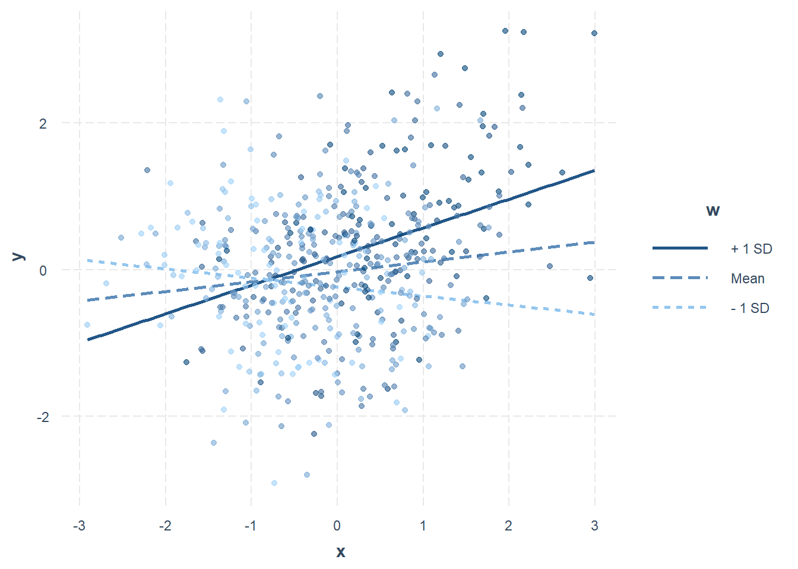
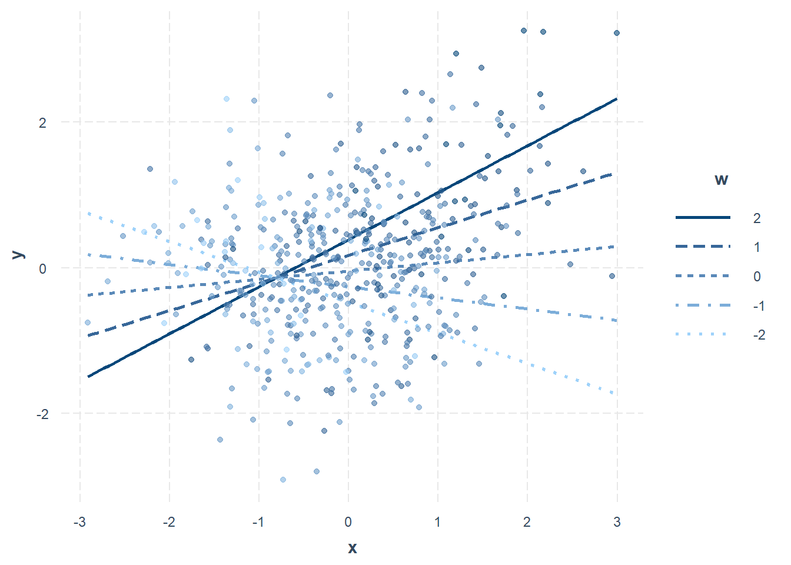
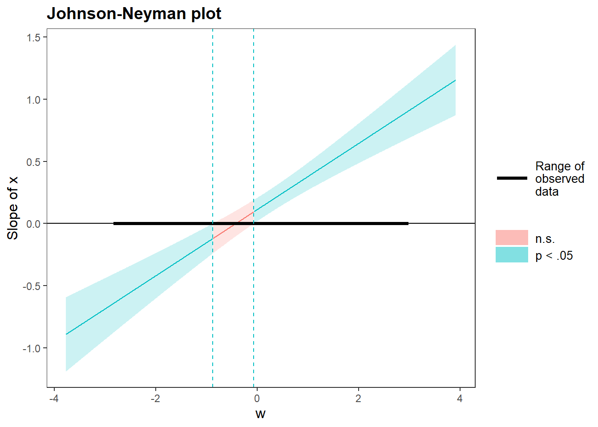

# Modérer

En plus des relations linéaires, c'est-à-dire des effets selon lesquels plus une variable (ou diminue) plus une seconde variables augmente (ou diminue), il existe des variables qui interagissent de sorte à accentuer ou amenuiser la force d'un effet, voire même à altérer sa direction. Ce type d'effet, appelée modérateur, est analysé à l'aide d'analyse de modération, analyse statistique très populaire dans laquelle la relation entre la variable dépendante ($y$) et la variable indépendante ($x$) est altérée par une tierce variable, la variable modératrice ($w$). 
Bien que la modération ait son chapitre désigné, elle a déjà été rencontrée dans ce livre, notamment, au chapitre [Prédire]. L'analyse de modération dans son essence correspond à étudier un effet d'interaction dans un modèle linaire, ou autrement dit, la multiplication entre deux variables, ici $x \times w$. Ainsi, en recourant aux fonctions `lm()` ou `aov()`, la modération se commande en employant le symbole `*` comme `lm(y ~ x * w)` ou `aov(y ~ x * w)`. Toutefois, ayant ses défis qui lui sont propres en création de données et en interprétation, le chapitre suivant propose une description approfondie de la modération^[La section est partiellement basée sur @Caron20.].

## L'analyse de modération

Sur le plan quantitatif, l'analyse de modération est un modèle linéaire général réalisé en une seule étape (soit une analyse de la variance ou une régression, en fonction des variables concernées) dans laquelle une variable dépendante, $y$, est prédite par trois variables, la variable variable indépendante, $x$, l'effet simple se la variable modératrice, $w$, et leur produit $x \times w=xw$. En termes du modèle linéaire général (ANOVA, régression), un modérateur se subsume à une interaction. Mathématiquement, la relation s'exprime comme l'équation \@ref(eq:moderation)

\begin{equation}
y = \beta_0 + \beta_1 x + \beta_2 w + \beta_3 (x \times w) + \epsilon
(\#eq:moderation)
\end{equation}

où les $\beta$ sont les coefficients de régression reliant la variable correspondante à la variable dépendante.  

<div class="figure" style="text-align: center">

<p class="caption">(\#fig:mod)Représentations de la modération</p>
</div>

L'analyse de modération est illustrée à la Figure\ \@ref(fig:mod). Le cadran a (gauche) montre une conceptualisation de l'effet attendu du modérateur, soit l'altération de l'effet entre $x$ et $y$. Le cadran b (droite) montre, quant à lui, la représentation statistique dans laquelle le lien direct entre $x$, $w$ et $xw$ par rapport à $y$.

Une façon de mettre l'accent sur l'effet de modération est de réarranger l'équation \@ref(eq:moderation) afin d'obtenir l'équation \@ref(eq:moderation2), ce qui met en évidence le rôle clé de $w$.

\begin{equation}
y = \beta_0 + \beta_1 x + (\beta_2 + \beta_3 x) w + \epsilon
(\#eq:moderation2)
\end{equation}

L'équation\ \@ref(eq:moderation2) montre comment $\beta_3$ altère la relation entre $w$ et $y$.

## Création de données

Une caractéristique fondamentale de la création d'interactions est qu'elles doivent être créées à partir de ces composantes. Autrement dit, le produit $xw$ comme variable n'est calculable que si $x$ ou $w$ sont d'abord créées. Il faut connaître deux des trois variables pour calculer la troisième. En conséquence, il n'est pas possible de créer des variables d'interaction, comme c'était le cas auparavant avec la fonction `MASS::mvrnorm()`, malgré que la matrice de covariance et les coefficients de régression soient calculables a priori.

La variance du produit de deux variables peut devenir rapidement compliquée. En fait, l'étude des produits de variables est si complexe, particulièrement lorsque les variables ont des moyennes non nulles qu'il n'y a eu que très dernièrement des développements mathématiques sur leur distribution formelle [@Nadarajah; @Cui], ce pourquoi les statisticiens préfèrent recourir généralement au bootstrap pour tester les effets médiateurs.

La variance du produit de deux variables standardisées [@Craig; @Haldane] correspond à l'équation\ \@ref(eq:varprod).

\begin{equation}
\sigma^2_{x \times w} = 1 + \rho_{xw}^2
(\#eq:varprod)
\end{equation}

Pour des variables centrées (non complètement standardisées), l'équation\ \@ref(eq:varprod) devient l'équation\ \@ref(eq:prodvar) [@Craig; @Haldane].

\begin{equation}
\sigma^2_{x \times w} = \mu_{x}\mu_{w}((\frac{\sigma_{x}}{\mu_{x}})^2+
2\rho_{xw}\frac{\sigma_{x}}{\mu_{x}}\frac{\sigma_{w}}{\mu_{w}} + (\frac{\sigma_{w}}{\mu_{w}})^2+\\(1+\rho^2)(\frac{\sigma_{x}}{\mu_{x}})^2(\frac{\sigma_{w}}{\mu_{w}})^2)
(\#eq:prodvar)
\end{equation}

Celle-ci n'est pas des plus attrayante à l'oeil, surtout pour les arithmophobes. L'essentiel : il faut porter une attention particulière à la variance de $xw$ lorsque la variable $y$ est générée, car celle-ci est dépendante de la moyenne et de la variance de ces composantes.

### Un modérateur continu

Dans le cas de deux variables continues (une variable indépendante $x$ et une modératrice $w$), celles-ci peuvent être créées par système d'équations ou bien avec la matrice de covariance (des deux variables). Une fois $x$ et $w$ générées, il faut les multiplier pour obtenir $xw$. C'est l'étape cruciale qui distingue la modération des autres analyses, car les deux variables doivent créer avant de créer l'interaction.

La variance de $xw$ suit l'équation \@ref(eq:prodvar) et les covariances avec les premières variables sont nulles dans la mesure où ces variables sont symétriques^[Si elles ne sont pas symétriques, il pourrait y avoir des corrélations causées par l'asymétrie]. La matrice de covariance (et de corrélation dans ce cas-ci) est ainsi calculable a priori.

\begin{equation}
\mathbf{\Sigma} = 
\left( \begin{array}{ccc}
1 & \rho_{xw} & 0 \\
\rho_{xw} & 1 & 0 \\
0 & 0 & 1+\rho_{xw}^2 \\
\end{array} 
\right)
(\#eq:S1)
\end{equation}

En spécifiant les coefficients de régression à l'avance avec $\mathbf{B}$, la variance résiduelle de la variable dépendante peut être calculée comme l'équation\ \@ref(eq:eq28) afin d'assurer un [scénario standardisé][Le scénario standardisé], rappelée ici.

$$
\sigma^2_{\epsilon} = 1 - \mathbf {B^{\prime} \Sigma B}
$$


```r
# Tailles d'échantillon
n <- 500

# Covariance entre x et w
rhoxw  <-  .5    

# Matrice de covariance a priori
S <- matrix(c(1, rhoxw, 0,   
              rhoxw, 1, 0,
              0, 0, 1 + rhoxw^2),
            ncol = 3, nrow = 3)

# Coefficients de régression de x, w et xw
B <- c(.1, .2, .3)             

# Création des deux premières variables
X <- MASS::mvrnorm(n = n, mu = c(0, 0), Sigma = S[1:2, 1:2])

# Ajouter en joignant aux deux autres leur produit
X <- cbind(X, X[,1] * X[,2])

# Calculer la variance résiduelle
var_ey <- (1 - B %*% S %*% B)

# Création de la variable dépendante
y <- X %*% B + rnorm(n = n, sd = sqrt(var_ey))

# Mettre le tout en commun et 
# renommer les variables
jd.continue <- data.frame(x = X[,1],
                          w = X[,2],
                          xw = X[,3],
                          y = y)
```

Le code ci-dessus montre un scénario standardisé (toutes les moyennes sont 0; toutes les variances égalent 1, sauf l'interaction). Le modèle est illustré à la Figure\ \@ref(fig:ex1mod).

<div class="figure" style="text-align: center">

<p class="caption">(\#fig:ex1mod)Exemple de modèle de modération</p>
</div>

Pour simuler une étude réelle, la variable d'interaction n'a pas à être enregistrée dans les deux jeux de données. Elle n'était nécessaire que pour la création de la variable dépendante.


```r
# Jeu de données final 
jd.continue <- jd.continue[, c("x","w","y")]
```

### Un modérateur nominal

Pour créer un jeu de données avec une variable indépendante continue et une variable modératrice nominale, la procédure sera similaire à celle de [l'analyse de variance][L'analyse de variance à un facteur] avec le [Codage factice] en combinaison avec la technique décrite ci-haut.


```r
# Pour la reproductibilité
set.seed(50015610)  

# Tailles des trois groupes (pourraient être différentes)
g1 <- g2 <- g3 <- 5000

# Nombre total d'unités (somme de tous les groupes)
n <- sum(c(g1, g2, g3))

# Création de variables
# Variable continue
x <-  rnorm(n)  # Variable continue
# Vecteur de groupement (facteur)
w <-  as.factor(c(rep(1, g1), rep(2, g2), rep(3, g3)))


# Codage factice du groupement
# Le troisième groupe (retiré) est le référent
W <- sapply(unique(w),
            USE.NAMES = TRUE,
            FUN = function(x) {w == x}) * 1 
W <- W[,-3]

# Mettre tous les prédicteurs ensemble 
# pour le modèle linéaire sous forme de matrice
X = cbind(x = x,
          w = W,
          xw = x * W)
```

En considérant $p_i = \frac{g_i}{n}$ comme la probabilité d'une unité d'être dans le groupe $i$, la variance d'un groupe, représentée par $w_i$, est $p_i(1-p_i)$, soit la variance d'une distribution binomiale pour une probabilité $p_i$. La covariance avec un autre groupe $j$ est de $-p_ip_j$, la probabilité d'être dans un groupe est négativement liée à celle d'être dans un autre groupe. Enfin, la variance d'une interaction est de $p_i$, car il s'agit du pourcentage de $x$ qui se retrouve dans l'interaction $xw_i$. En conséquence, comme il s'agit de la même information (à cause du multiple de 1 de la variable $w_i$, c'est-dire appartenir au groupe $i$), cela mène une covariance accidentelle de $p_i$ entre $x$ et $w_i$.


```r
p1 <- g1/n
p2 <- g2/n
S <- matrix(c(1, 0, 0, p1, p2,
              0, p1*(1-p1), -p1*p2, 0, 0,
              0, -p1*p2, p2*(1-p2), 0, 0,
              p1, 0, 0, p1, 0,
              p2, 0, 0, 0, p2), 
            ncol = 5, nrow = 5)
S
>       [,1]   [,2]   [,3]  [,4]  [,5]
> [1,] 1.000  0.000  0.000 0.333 0.333
> [2,] 0.000  0.222 -0.111 0.000 0.000
> [3,] 0.000 -0.111  0.222 0.000 0.000
> [4,] 0.333  0.000  0.000 0.333 0.000
> [5,] 0.333  0.000  0.000 0.000 0.333
# Vérifications
cov(X)
>          x                                      
> x  0.97900 -0.00703 -0.00136  3.18e-01  3.21e-01
>   -0.00703  0.22224 -0.11112 -6.21e-03  1.21e-03
>   -0.00136 -0.11112  0.22224  3.10e-03 -2.43e-03
>    0.31815 -0.00621  0.00310  3.18e-01 -3.39e-05
>    0.32067  0.00121 -0.00243 -3.39e-05  3.21e-01
```

Toutefois, il sera plus simple de standardiser `W` avant de créer les interactions, ce qui éliminera les covariances accidentelles.


```r
# Standardiser les codes factices
W <- apply(W, MARGIN = 2, FUN = scale)

# Mettre tous les prédicteurs ensemble 
# pour le modèle linéaire sous forme de matrice
X2 <- cbind(x = x,
            w = W,
            xw = x * W)
```

Alors la covariance entre $w_i$ et $w_j$ et la covariance entre $xw_i$ et $xw_j$ deviennent
$$p_1 p_2 / \sqrt{p_1(1 - p_1) p_2 (1 - p_2)}$$
soit leur covariance originale divisée par leur écart type. Tous les autres valeurs deviennent 1 dans le cas des variances et 0 pour les covariances.


```r
# La covariance
rho = -(p1 * p2) / (sqrt((p1 * (1 - p1)) * (p2 * (1 - p2))))

# La matrice de covariance
S2 <- matrix(c(1, 0, 0, 0, 0,
               0, 1, rho, 0, 0,
               0, rho, 1, 0, 0,
               0, 0, 0,1, rho,
               0, 0, 0, rho, 1), 
             ncol = 5, nrow = 5)
S2
>      [,1] [,2] [,3] [,4] [,5]
> [1,]    1  0.0  0.0  0.0  0.0
> [2,]    0  1.0 -0.5  0.0  0.0
> [3,]    0 -0.5  1.0  0.0  0.0
> [4,]    0  0.0  0.0  1.0 -0.5
> [5,]    0  0.0  0.0 -0.5  1.0

# Vérifier
cov(X2)
>          x                                  
> x  0.97900 -0.0149 -0.00288 -0.0174 -0.01201
>   -0.01492  1.0000 -0.50000 -0.0174  0.01601
>   -0.00288 -0.5000  1.00000  0.0160 -0.00887
>   -0.01736 -0.0174  0.01601  0.9666 -0.46885
>   -0.01201  0.0160 -0.00887 -0.4689  0.97049
```

Il est possible d'ajouter des corrélations entre une variable continue et les groupes, mais cela déborde du cadre de ce livre et des connaissances détaillées jusqu'ici. Mais, c'est possible!

Maintenant, il reste à créer la variable dépendante. Pour ce faire, il faut spécifier cinq coefficients de régressions, car une variable continue avec deux variables modératrices (facteurs transformés par le [codage factice]) donnent deux variables d'interaction.


```r
# Les coefficients de régression
B <-  c(.25, 0, 0, .50, -.50)

# La variance résiduelle
# La deuxième matrice de covariance est utilisée
var_ey <- 1 - B %*% S2 %*% B  

# Création de la variable dépendante
y <- X2 %*% B + rnorm(n = n, sd = sqrt(var_ey))
```

Pour simuler une étude réelle, les variables d'interactions et le codage factices peuvent être écartés du jeu de données. Ces variables ne sont nécessaires que pour la création de la variable dépendante.


```r
# Jeu de données final 
jd.nominale <-  data.frame(x = x,
                           w = w,
                           y = y)
```

## Détecter l'effet de modération

Pour détecter les effets modérateurs, l'analyse de modèle linéaire par `lm()` et `aov()` joueront parfaitement le rôle. Par contre, il faut noter une différence **cruciale** entre les deux fonctions. Le calcul de la somme des carrés est différent entre les deux : `lm()` utilise le type III et `aov()` utilise le type\ I.

Le choix du type porte à controverse [@Herr86]. Pour choisir le type d'estimateur, de nombreux facteurs entrent en ligne de compte, le plus important étant l'hypothèse de recherche. Il n'y a donc pas de réponse claire; il y a bien quelques recommandations.

Le type I teste séquentiellement le modèle $y = x + w + xw$, soit l'effet de $x$, puis l'effet de $w$ en tenant compte de $x$ (écrit $\text{SC}(w|x)$, soit la somme des carrés de $w$ considérant $x$), et enfin l'effet de $x\times w$ par $\text{SC}(xw|x,w)$. Il teste très bien les termes d'interaction, en plus, d'offrir un modèle alternatif si l'interaction n'est pas significative. Le type I ne traite pas les effets simples de façon égale. L'ordre importe!. Le type II contourne le traitement différentiel des effets simples en considérant simultanément des effets de même niveau, comme $\text{SC}(w|x)$ et $\text{SC}(x|w)$, ce qui est très bien pour tester les effets simples s'il n'y a pas de terme d'interaction. Le type III conditionne tous les effets, $x$, $w$ et $xw$, au même niveau, soit $\text{SC}(x|w,xw)$, $\text{SC}(w|x,xw)$ et $\text{SC}(xw|x,w)$. Tous les effets sont traités de façon équivalente. Le type IV, pour le mentionner, permet de tenir compte de combinaison de groupes nulle (ou vide). Il est équivalent au type III s'il y a au moins une valeur dans chaque groupe.

La controverse provient du fait que les hypothèses concernées ne sont pas très utiles pour les expérimentateurs puisqu'ils s'intéressent au terme d'interaction, et non aux effets principaux lorsqu'un terme d'interaction est présent. L'avantage du type I est de montrer les modèles possibles de façon hiérarchique, ce que ne fait pas le type III. Le type I oblige de la réflexion : la séquence des variables d'une part, mais aussi l'analyse des résultats hypothèses séquentielles.

S'il y a un effet d'interaction, alors les effets simples ne sont pas interprétés. Le type III est alors inutiles pour interpréter ces effets.

Les programmeurs de **R** championnent cette perspective en définissant l'option de type de sommes de carrés par défaut pour les fonctions `lm()` et `aov()`. Ils y vont de mots très durs à l'endroit des logiciels qui recourent automatiquement au type III. 

Le choix entre type I ou type III revient à l'expérimentateur. Par contre, la plupart des ouvrages statistiques pour les sciences appliquées utilisent implicitement le type III. D'autres le recommandent activement. De plus, lorsque le devis n'est pas balancé, le type III est préférable. Si le lecteur veut comparer avec des analyses de modération avec celles d'autres ouvrages, il doit recourir au type III. 

Cela dit, il demeure possible d'utiliser `aov()` avec les SC de type III, mais il faudra recourir à la fonction `Anova()` du package `car` [@car].

### Analyse d'un modérateur continu

Pour le modèle avec deux variables continues, la syntaxe pour rouler `lm()`  est très similaire à ce qui se trouve dans le chapitre [Prédire]. Pour inclure l'effet d'interaction (modération) dans le modèle, il faut inscrire le `*` au lieu du `+`, comme `lm(y ~ x * w, data = jd.continue)`. La formule `y ~ x + w + x * w` fonctionne également.


```r
# Réaliser l'analyse avec lm()
res1.lm <- lm(y ~ x * w, data = jd.continue)
summary(res1.lm)
> 
> Call:
> lm(formula = y ~ x * w, data = jd.continue)
> 
> Residuals:
>    Min     1Q Median     3Q    Max 
> -2.701 -0.588  0.004  0.575  3.177 
> 
> Coefficients:
>             Estimate Std. Error t value Pr(>|t|)    
> (Intercept)  0.00675    0.04271    0.16     0.87    
> x            0.06984    0.04651    1.50     0.13    
> w            0.22214    0.04593    4.84  1.8e-06 ***
> x:w          0.34624    0.03921    8.83  < 2e-16 ***
> ---
> Signif. codes:  
> 0 '***' 0.001 '**' 0.01 '*' 0.05 '.' 0.1 ' ' 1
> 
> Residual standard error: 0.878 on 496 degrees of freedom
> Multiple R-squared:  0.188,	Adjusted R-squared:  0.183 
> F-statistic: 38.2 on 3 and 496 DF,  p-value: <2e-16

# Pour comparer avec aov
res1.aov <- aov(y ~ x * w, data = jd.continue)

# L'intercepte est inclus
summary(res1.aov, intercept = TRUE)
>              Df Sum Sq Mean Sq F value  Pr(>F)    
> (Intercept)   1     11    10.7    13.8 0.00023 ***
> x             1     13    13.1    17.0 4.3e-05 ***
> w             1     15    15.2    19.8 1.1e-05 ***
> x:w           1     60    60.2    78.0 < 2e-16 ***
> Residuals   496    383     0.8                    
> ---
> Signif. codes:  
> 0 '***' 0.001 '**' 0.01 '*' 0.05 '.' 0.1 ' ' 1
```

Comme prévu, les résultats sont différents à cause des différentes sommes des carrés considérées. L'effet modérateur est identique. Les effets principaux sont différents.

Pour observer les résultats de `lm()` de la même façon que `aov` (avec une table d'analyse de variance), le code `anova(res1.lm)` produira la même sortie, signalant ainsi la différence des sommes de carré pour calculer les coefficients et celles pour produire la table.

Pour obtenir l'analyse de variance avec le type III, il faut utiliser le package `car` et sa fonction `Anova()` en y spécifiant la sortie de la fonction `aov()` et type de somme de carrés demandée.


```r
res1.anova <- car::Anova(res1.aov, type = "III")
res1.anova 
> Anova Table (Type III tests)
> 
> Response: y
>             Sum Sq  Df F value  Pr(>F)    
> (Intercept)      0   1    0.03    0.87    
> x                2   1    2.25    0.13    
> w               18   1   23.40 1.8e-06 ***
> x:w             60   1   77.97 < 2e-16 ***
> Residuals      383 496                    
> ---
> Signif. codes:  
> 0 '***' 0.001 '**' 0.01 '*' 0.05 '.' 0.1 ' ' 1
```

Voilà! Les effets simples sont maintenant identiques à la sortie de `lm()`.


Pour déterminer s'il y a présence de l'effet de modérateur, il faut se fier à la ligne `x:w` et la valeur-$p$, `Pr(>F)`, associée qui est ici de $3.269^{-16}$. Par contre, il n'est pas tout à fait clair comment interpréter ce résultat. Ce sera fait dans la section portant sur la représentation graphique de al modération.

### Analyse d'un modérateur nominal

Comme il y a un groupe de référence, **R** choisit par défaut le premier groupe. Dans ce cas, le groupe de référence était le troisième. Pour spécifier ce changement, la fonction `relevel()` déclarera le groupe de référence. Le premier argument est la variable et l'argument `ref =` indique le nouveau groupe de référence. La fonction ne fait que reclasser les valeurs afin que le premier groupe que ne voit **R** ne soit nul autre que le groupe de référence. Ce changement pourrait aussi être fait directement dans le formule de `lm()` comme `lm(y ~ x * relevel(w, ref = 3), data = jd.nominale)`


```r
# Réaliser l'analyse avec lm()
jd.nominale$w <-  relevel(jd.nominale$w, ref = 3)
res2.lm <- lm(y ~ x * w, data = jd.nominale)
summary(res2.lm)
> 
> Call:
> lm(formula = y ~ x * w, data = jd.nominale)
> 
> Residuals:
>    Min     1Q Median     3Q    Max 
> -1.690 -0.295 -0.002  0.297  1.574 
> 
> Coefficients:
>              Estimate Std. Error t value Pr(>|t|)    
> (Intercept)  0.000209   0.006202    0.03     0.97    
> x            0.259007   0.006139   42.19   <2e-16 ***
> w1           0.009207   0.008771    1.05     0.29    
> w2          -0.005281   0.008770   -0.60     0.55    
> x:w1         1.055880   0.008832  119.55   <2e-16 ***
> x:w2        -1.069859   0.008813 -121.40   <2e-16 ***
> ---
> Signif. codes:  
> 0 '***' 0.001 '**' 0.01 '*' 0.05 '.' 0.1 ' ' 1
> 
> Residual standard error: 0.438 on 14994 degrees of freedom
> Multiple R-squared:  0.803,	Adjusted R-squared:  0.803 
> F-statistic: 1.22e+04 on 5 and 14994 DF,  p-value: <2e-16

# Pour comparer avec aov
res2.aov <- aov(y ~ x * w, data = jd.nominale)
# L'intercept est inclu
summary(res2.aov)
>                Df Sum Sq Mean Sq  F value Pr(>F)    
> x               1    930     930  4837.35 <2e-16 ***
> w               2      2       1     5.13 0.0059 ** 
> x:w             2  10821    5411 28144.98 <2e-16 ***
> Residuals   14994   2882       0                    
> ---
> Signif. codes:  
> 0 '***' 0.001 '**' 0.01 '*' 0.05 '.' 0.1 ' ' 1

# Somme de carrés de type III pour `aov()`
res2.anova <- car::Anova(res2.aov, type = "III")
res2.anova 
> Anova Table (Type III tests)
> 
> Response: y
>             Sum Sq    Df F value Pr(>F)    
> (Intercept)      0     1     0.0   0.97    
> x              342     1  1779.8 <2e-16 ***
> w                1     2     1.4   0.25    
> x:w          10821     2 28145.0 <2e-16 ***
> Residuals     2882 14994                   
> ---
> Signif. codes:  
> 0 '***' 0.001 '**' 0.01 '*' 0.05 '.' 0.1 ' ' 1
```

La fonction `car::Anova()` offre un résultat différent pour $w$ et $xw$ car les groupes sont mis en commun. Autrement dit, le vecteur de groupement est analysé comme une seule variable. C'est cette statistique qui est préférée pour éviter d'augmenter l'erreur de Type\ I survenant lorsque le nombre de tests d'hypothèse s'accroît (par exemple, si chaque effet est testé individuellement).


Le type III a certainement eu un rôle intéressant dans les résultats. Il montre que $w$ n'est pas significativement lié à $y$, $p < 0.247$, ce qui était programmé dans le modèle alors que `aov()` montre un lien  significatif, $p<0.006$.

Pour respecter la pratique et pour imiter ce qui est fait par d'autres logiciels, il est préférable de rapporter l'effet d'interaction `x:w` de `res2.anova`, soit la sortie produite par `car::Anova()`. La valeur-$p$ de l'effet d'interaction est de $p<001$, ce qui signifie qu'il y a un effet modérateur. 
Comme le cas précédent, ce résultat est ardu à interpréter. Des représentations graphiques sont d'une aide cruciale pour démêler les effets.

## Représentations graphiques d'une modération

À part quelques personnes ayant l'oeil affuté à l'interprétation de modèle linéaire contenant une interaction, il est rare pour tous les autres d'en tirer du sens immédiatement. Ainsi, des analyses graphiques sont plus que pertinentes pour en interpréter les résultats.

Deux graphiques sont particulièrement pertinents : le graphique de Johnson- Neyman et le graphique des pentes simples (*simple slopes*). Il existe quelques packages pour produire ces graphiques. Dans cet ouvrage, le package `interactions` [@interactions] sera présenté. Ce package peut traiter des interactions doubles et triples et est compatible avec plusieurs commandes de `ggplot2`.

Pour réaliser ces graphiques, il faudra d'abord installer et importer le package.


```r
library(interactions)
```

À noter que le package `interactions` dépend du package `sandwich` [@Zeileis] qu'il faut également installé. 

### L'analyse des pentes simples

La méthode *classique* de sonder d'approfondir un effet d'interaction consiste à calculer la pente du prédicteur à différentes valeurs du modérateur. Cette analyse se réfère à l'analyse des pentes simples. La fonction permettant de commander cette technique est `sim_slopes()`. Il faut y mettre en argument la sortie de `lm()`, désigner le prédicteur `pred = ` et le modérateur `modx = `. 

Cette analyse est faite avec l'exemple avec la variable de groupement, `jd.nominale`. L'argument `johnson_neyman = FALSE` évite simplement un message d'erreur, car le graphique éponyme ne peut être généré lorsque le modérateur est une variable de groupement.


```r
# Les statistiques liées aux pentes simples
sim_slopes(model = res2.lm,
           pred = x,
           modx = w,
           johnson_neyman = FALSE)
> SIMPLE SLOPES ANALYSIS 
> 
> Slope of x when w = 2: 
> 
>    Est.   S.E.    t val.      p
> ------- ------ --------- ------
>   -0.81   0.01   -128.25   0.00
> 
> Slope of x when w = 1: 
> 
>   Est.   S.E.   t val.      p
> ------ ------ -------- ------
>   1.31   0.01   207.10   0.00
> 
> Slope of x when w = 3: 
> 
>   Est.   S.E.   t val.      p
> ------ ------ -------- ------
>   0.26   0.01    42.19   0.00
```

Ce tableau pour les groupes de $w$ si l'effet modérateur est significatif.


```r
# Le graphique des pentes simples
interact_plot(model = res2.lm,
              pred = x,
              modx = w, 
              plot.points = TRUE)
```

<div class="figure">

<p class="caption">(\#fig:ip1)Analyse de pentes simples pour un modérateur nominal</p>
</div>

Le code ci-dessus illustre ce patron de différences avec la Figure\ \@ref(fig:ip1). L'axe des $x$ et des $y$ montrent la relation entre les variables en fonction des groupes qui sont représentées par des lignes différentes. L'option `plot.point = TRUE` affiche optionnellement les données dans la figure. La Figure\ \@ref(fig:ip1) montre une tendance positive entre $x$ et $y$ pour le groupe de référence (`3`) qui s'accentue de façon importante pour le groupe\ (`1`), mais qui s'inverse pour le groupe\ `2`.

Le graphique des pentes peut aussi être réalisé pour un modérateur continu. La\ Figure \@ref(fig:ip2) illustre ce graphique. Lorsque le modérateur représente des groupes, les niveaux sont clairement définis. Dans le cas d'un modérateur continu, des niveaux arbitraire doivent être sélectionnés.


```r
interact_plot(model = res1.lm,
              pred = x,
              modx = w, 
              plot.points = TRUE)
```

<div class="figure">

<p class="caption">(\#fig:ip2)Analyses des pentes simples pour un modérateur continu</p>
</div>

Par défaut, l'analyse est réalisée avec $-1$ écart type, la moyenne et $+1$ écart type comme groupement de $w$. Ces valeurs peuvent être choisies manuellement avec `modx.values =` en y spécifiant les valeurs d'intérêt. En plus, cet argument est compatible non seulement avec `interact_plot()` et `sim_slopes()`. La Figure\ \@ref(fig:ip3) montre l'analyse des pentes pour des valeurs de `modx.values = c(-2, -1, 0, 1, 2)`.


```r
interact_plot(model = res1.lm,
              pred = x,
              modx = w, 
              plot.points = TRUE,
              modx.values = c(-2, -1, 0, 1, 2))
```

<div class="figure">

<p class="caption">(\#fig:ip3)Analyses des pentes simples pour un modérateur continu</p>
</div>

### Le graphique de Johnson-Neyman

Lorsque le modérateur est continu, la méthode la plus rigoureuse d'explorer des effets modérateurs est de calculer l'intervalle de Johnson-Neyman qui indique la plage de valeurs du modérateur selon lesquelles la pente du prédicteur est significative ou non pour un seuil $\alpha$ spécifié. Comme les deux variables doivent être continues, c'est le jeu de données `jd.continue` qui sera utilisé pour cet exemple.

La fonction `sim_slopes()` génère l'analyse des pentes simples, mais produit également l'intervalle de Johnson-Neyman et le graphique associé. La fonction est utilisée comme précédemment, à l'exception qu'il est possible de demander comme argument `jnplot = TRUE` pour obtenir le graphique Johnson-Neyman et qu'il n'est plus nécessaire de commander `johnson_neyman = FALSE` évite un message d'erreur.


```r
sim_slopes(model = res1.lm,
           pred = x,
           modx = w, 
           jnplot = TRUE)
> JOHNSON-NEYMAN INTERVAL 
> 
> When w is OUTSIDE the interval [-0.88, -0.07], the slope
> of x is p < .05.
> 
> Note: The range of observed values of w is [-2.80, 2.95]
```

<div class="figure">

<p class="caption">(\#fig:jn1)Le graphique Johnson-Neyman pour interpréter les effets modérateurs</p>
</div>

```
> SIMPLE SLOPES ANALYSIS 
> 
> Slope of x when w = -0.8875 (- 1 SD): 
> 
>    Est.   S.E.   t val.      p
> ------- ------ -------- ------
>   -0.12   0.06    -2.01   0.05
> 
> Slope of x when w =  0.0773 (Mean): 
> 
>   Est.   S.E.   t val.      p
> ------ ------ -------- ------
>   0.13   0.05     2.81   0.01
> 
> Slope of x when w =  1.0420 (+ 1 SD): 
> 
>   Est.   S.E.   t val.      p
> ------ ------ -------- ------
>   0.39   0.06     6.87   0.00
```

La Figure \@ref(fig:jn1) montre le graphique Johnson-Neyman. La zone bleue indique le niveau de modérateur où l'effet de $x$ est significativement différent de la pente de $x$ lorsque l'effet du modérateur est nul. La zone rouge montre l'étendue où il n'y a pas d'effet de modération. L'étendue est également précisée dans la première phrase imprimée de la sortie. La sortie a également produit la sortie de l'analyse de pentes simples ou l'information obtenue du graphique Johnson-Neyman est répétée d'une façon différente. 

Dans cet exemple, plus l'unité à un niveau de modérateur élevé (en termes absolus), plus il accentue l'effet de la variable indépendante (zones bleues). Le modérateur joue donc un rôle très important dans ce modèle.

<!-- ## TODO  AJOUTER INTERPÉTATION STAT -->

# Exercices {#exercice-lineaire .unnumbered}
