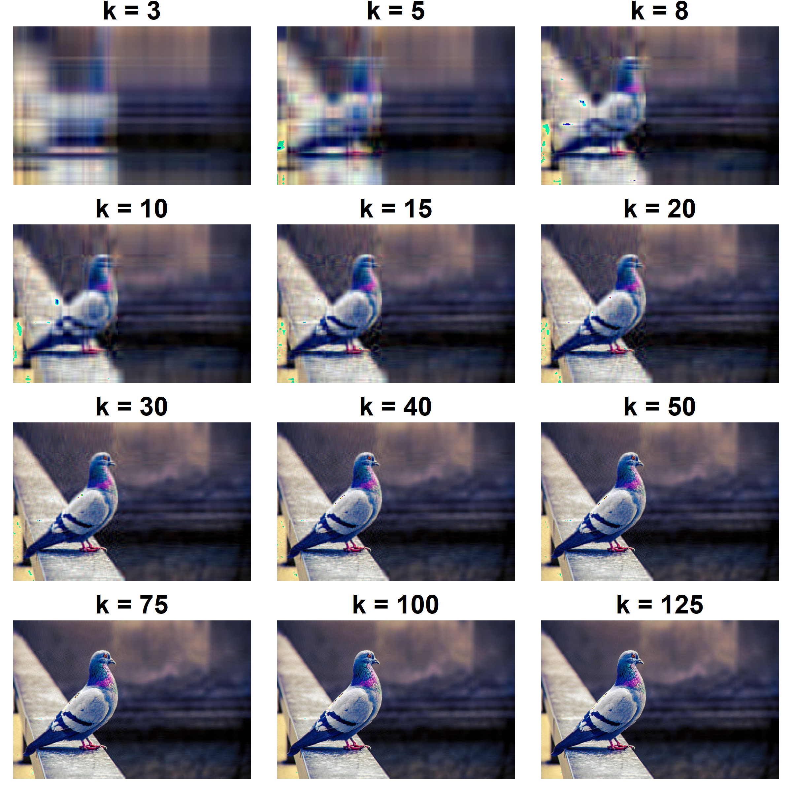

# Réduire

Comme mentionné d'entrée de jeu, l'analyse en composantes principales (ACP) n'est pas une technique de réduction des dimensions. S'il y a $p$ variables, l'ACP produit $p$ dimensions. Toutefois, comme les valeurs propres sont des indices de partage commun entre les variables, elle peut être utilisée de cette façon. Elle est presque toujours utiliser pour réduire la dimension d'un jeu de donnée. Il suffit d'ordonner les valeurs propres. 

La question devient alors à savoir combien de dimensions faut-il retenir pour rendre adéquatement compte des données? Dès lors, l'ACP devient une technique de réduction des dimension, comme [l'analyse factorielle exploire][Explorer], mais puisqu'elle ne répond pas explicitement à cette question, le statisticien use de techniques complémentaires, des **règles d'arrêts** (*stopping rules*) pour déterminer le nombre de dimensions.

Ces règles d'arrêt sont en général un *bricolage* du statisticien pour répondre à la question. Bricolage n'est pas à prendre péjorativement, mais seulement comme rappel à la réalité que ces techniques sont souvent créées sans dérivation analytique. Il n'est pas possible de leur faire aveuglément confiance (il ne faudrait jamais faire cela de toute façon). Elles ont une pertinence pratique, mais les conditions selon lesquelles elles flanchent n'est pas connue. Il existe probablement des centaines de techniques ayant leur avantage et inconvénients ou bien des scénarios dans lesquels elles sont plus efficaces que les autres. Il en apparaît des nouvelles chaque années depuis 1950. Comme ces techniques sont des bricolages et qu'elles sont taillées différemment, elles ne résultent pas toutes à la même conclusion. Faire l'étalage de ces règles d'arrêt serait bien inutile. Ainsi, les deux techniques les plus utilisées seront présentées, l'analyse parallèle (*parallel analysis*) et une deuxième méthode ayant montré un excellent rendement sera présentée, soit le test séquentiel de la prochaine valeur propre (*Next eigenvalue sequence test*).

## Illustration

Qu'est-ce que la réduction de dimension? La réduction de dimension ou la détermination du nombre de dimension se retrouvent dans tous les domaines, que ce soit en psychologie, en biologie, en informatique ou en physique. Cela peut être autant pratique que théorique. En psychologie, les chercheurs s'intéressent à déterminer le nombre de dimension d'un test psychométrique. En écologie, les chercheurs peuvent tenter de représenter la variabilité inter-espère d'un habitat. En ingénierie, les ingénieurs en télécommunication peuvent vouloir extraire informations pertinentes des capteurs électroniques.

La compression d'images, en informatique, est un exemple dont il est possible d'illustrer. La réduction de dimension permet de résumer l'information afin d'en réduire la taille pour ne conserver que le signifiant. Ainsi, les mêmes techniques permettant d'identifier les facteurs psychologiques peuvent être utilisées pour les images, mais l'identification des thèmes de films et bien d'autres.

La Figure \@ref(fig:Pigeon) montre un exemple de compression d'une image de pigeon^[Tirée de https://pixnio.com/fr/faune-animaux/des-oiseaux-fr/pigeons-photos/oiseau-pigeon-tumbler-pigeon-mouche-animal-animal, License CC0]. Elle montre à différents niveaux factoriels de compression la même image. À trois dimensions, le pigeon est difficilement perceptible. Progressivement, le pigeon est plus facilement reconnaissable, mais surtout, à un certain seuil (deuxième et troisième lignes de la Figure \@ref(fig:Pigeon), par exemple), l'image gagne en clarté. Trente dimensions conviennent, les plus difficiles désireront peut-être retenir 125 dimensions. L'image à ce stade est très bien. Nonobstant ces nombres, ce sera toujours mieux, en termes de compression, que les 526 dimensions possibles (de l'image original). Ainsi, à 23.764 % des dimensions, l'image est claire et le pigeon reconnaissable. Cette logique s'applique également pour les facteurs psychologiques.

<div class="figure" style="text-align: center">

<p class="caption">(\#fig:Pigeon)Pigeon compressé à divers niveaux de dimension $k$</p>
</div>

## Importance d'une dimension

Une technique pour connaître l'importance d'une dimension est d'afficher les valeurs propres. Les valeurs propres les plus élevées impliquent qu'elle sont les plus importantes (les premières) alors que de petites valeurs signalent les moins importantes (du bruit, des résidus, soit les dernières). Il est toutefois plus ardu de déterminer le seuil entre important et non important.

La structure factorielle et le jeu de données du chapitre [Explorer] est repris afin d'illustrer le propos.


```r
# Pour la reproductibilité
set.seed(33)

# Création de la matrice de recette de fabrication
phi = matrix(c(.9, .8, .7,  0,  0, .4,
               0,  0,  0, .6, .5, .4), 
             nrow = 6, ncol =  2)

# Identification des variables et facteurs
colnames(phi) = c("F1", "F2")
rownames(phi) = paste0(rep("i",6), 1:6)

R = phi %*% t(phi)
diag(R) <- 1

# Création du jeu de données
jd <- MASS::mvrnorm(n = 50, 
                    mu = rep(0, ncol(R)), 
                    Sigma = R)
```

Voici l'analyse en composante principale.


```r
# L'ACP
res <- eigen(cor(jd))

# Les valeurs propres
res$values
> [1] 2.333 1.423 0.877 0.566 0.531 0.269
```

Une façon d'illustrer les valeurs propres graphiquement est d’utiliser un graphique nommé *scree plot* ou *graphique des éboulis*. La Figure\ \@ref(fig:scree) peut être produite avec la syntaxe ci-dessous. Il s'agit de mettre en axe des $x$ la séquence (`idex`) des valeurs propres (leur ordre) par rapport à la valeur propre en axe des $y$. Ce graphique se produit simplement avec `plot()`. L'option `type = "b"` est simplement un type de graphique utilisé, dans ce cas-ci, la combinaison de points et de lignes.


```r
plot(res$values,
     type = "b",
     xlab = "Ordre",
     ylab = "Valeur propre")
```

<div class="figure">

<p class="caption">(\#fig:scree)Les valeurs propres en fonctions de la position de l'axe</p>
</div>

## L'analyse parallèle

Avant d'introduire l'analyse parallèle (PA), il est intéressant de présenter le test duquel il est inspiré, soit le *test de Kaiser* [@Kaiser]. C'est le test utilisé par défaut dans certains logiciel traditionnel, malgré qu'il soit discrédité depuis plusieurs années [@Turner98;@Achim20;@Beauducel01]. Ce test se fonde sur l'idée selon laquelle, si les variables ne sont pas corrélées entre elles, donc s'il n'y a pas de facteurs, les valeurs propres seront égales à 1. La logique du test est d'affirmer que, si une valeur propre est supérieure à 1, alors de l'information commune est nécessairement partagée entre deux ou plusieurs variables. Selon le test de Kaiser, le nombre de composantes à retenir correspond au nombre de valeurs propres supérieures à 1. 
Asymptotiquement parlant, si $n \to \infty$, le test est vraie. Par contre, l'ACP capitalise sur l'erreur et en inclut accidentellement dans les premières dimensions. Conséquemment, les premiers axes seront surestimés, alors que les derniers seront sous-estimées.   

La solution proposée par @Horn65 est alors de tenir compte de cette erreur d'échantillonnage accidentelle. Pour ce faire, il propose de rééchantillonner les valeurs propres d'un jeu de données sans aucun facteur (aucune corrélation entre les variables) et ayant les mêmes caractéristiques que le jeu de données cible (même nombre de variables et de participant). Le jeu de données cible correspond au jeu de données de l'expérimentateur. Même s'il n'y a pas de corrélation sur le plan de la population, il y aura accidentellement des corrélations dans un échantillon. Le rééchantillonnage est réitéré sur des milliers de jeu de données artificiel. À chaque fois, les valeurs propres sont enregistrées. Des moyennes en sont retirés à la toute fin. Il s'agit du critère auquel l'hypothèse nulle est rejetée. De la première à la dernière, chaque valeur propre cible est comparée à la valeur propre moyenne correspondante, si la cible est plus élevée, il s'agit d'une dimension à retenir. Dès que la cible est inférieur, le test est arrêté. Le nombre de valeurs propres supérieures aux valeurs propres artificielles correspond au nombre de dimensions à retenir. 

Dans la syntaxe ci-dessous, les mêmes caractéristiques que le jeu de données précédent sont utilisés, soit $p = 6$ et $n = 5000$. À la fin, il sera possible de comparer s'il y a effectivement deux facteurs selon l'AP. 


```r
# Pour la reproductibilité
set.seed(1019)
p = 6        # Nombre de variables
n = 500      # Nombre de participants 
reps = 1000  # Nombre d'itérations
valeurs.propres = matrix(0,           # Création d'une variable
                         nrow = p,    # vide pour enregistrer
                         ncol = reps) # les valeurs propres
# Création de la boucle                                        
for(i in 1:reps) {
  score = rnorm(n = n * p)             # Création de n * p valeurs 
  # aléatoires non corrélées
  D = matrix(score,                    # Formater en matrice le jeu
             nrow = n, ncol = p)       # de données 
  ACP = svd(cor(D))                    # Réaliser l'ACP 
  valeurs.propres[,i] = ACP$d          # Enregistrer les valeurs propres
}

# Une fois les valeurs propres obtenues,
# les moyennes et quantiles sont calculables
rowMeans(valeurs.propres)        # Une moyenne par ligne (valeur propres)
> [1] 1.150 1.077 1.022 0.973 0.920 0.858

# Ou si le 95e percentile était préféré
apply(X = valeurs.propres, 
      FUN = quantile,
      MARGIN = 1,
      probs = .95)
> [1] 1.211 1.118 1.056 1.004 0.957 0.904
```

Pour connaître le nombre de dimension, il suffit de tester les valeurs propres empiriques et les comparer aux valeurs propres simulées (moyenne ou 95^e^ percentile).  Le nombre de valeur propre empirique supérieur aux valeurs propres simulés correspond au nombre de composantes à retenir.


```r
# Les valeurs propres empiriques
res$values
> [1] 2.333 1.423 0.877 0.566 0.531 0.269

# La moyenne des valeurs propres simulées
rowMeans(valeurs.propres)
> [1] 1.150 1.077 1.022 0.973 0.920 0.858

# Nombre de valeurs propres empiriques supérieures aux simulées
sum(res$values > rowMeans(valeurs.propres))
> [1] 2
```

Ainsi, 2 facteurs sont à retenir. Une façon d'illustrer les résultats de l'analyse parallèle est d'utiliser le graphique de éboulis en y représentant les valeurs propres empiriques comparativement aux simulées. Le nombre de valeurs propres empiriques supérieures aux simulées est le nombre de dimensions à retenir. Ce graphique est produit à la Figure \@ref(fig:scree2). Voici la syntaxe pour produire ce graphique avec `ggplot2`. La première étape est de mettre en commun les résultats obtenus dans un jeu de données. La variable `Index` indique l'index de la valeur propres, `valeurs.propres` contient les valeurs propres et `Type` indique s'il s'agit de valeurs propres empiriques ou simulées de l'analyse parallèle. Pour le reste, il s'agit de recourir à `ggplot()`.


```r
data.frame(Index = rep(1:p, p),
           valeurs.propres = c(res$values, rowMeans(valeurs.propres)),
           Type = rep(c("Empirique","Simulées"), each = p)
) %>% 
  ggplot(mapping = aes(x = Index, y = valeurs.propres, color = Type)) +
  geom_line() + 
  geom_point() +
  theme(legend.position = c(0.8, 0.8))
```

<div class="figure">

<p class="caption">(\#fig:scree2)Comparaison des valeurs propres empiriques et simulées</p>
</div>

## NEST

Le *Next Eigenvalue Sequential Test* développé par Achim [-@Achim17;-@Achim20] est le dernier cri en termes d'estimations du nombre de composante à retenir.

<!-- Il est à mi-chemin entre MAP et AP  -->

*À terminer*


```r
NEST <- function(data, N=NULL, reps = 1000, 
                 alpha = .05, convergence = 1e-5, maxit = 500, ...){
  
  ns = dim(data)[1]
  nv = dim(data)[2]
  if(ns==nv){
    if(is.null(N)) stop("Error: 'N' is required") 
    ns = N
  }else{
    data = cor(data)
  } 
  E = eigen(data, symmetric=TRUE)$values
  
  for (nfact in 0:(nv-2)){
    rnk = rep(1, nfact + 1)
    if (nfact==0){
      model = diag(nv)
    }else{
      R = data
      pre = diag(data)
      for (jj in 1:maxit){
        res = eigen(R, symmetric=TRUE)
        if (nfact==1){
          ld = res$vectors[,1] * sqrt(res$values[1])
          co = ld*ld
        }else{
          ff = nfact
          while (res$value[ff] <= 0) {ff = ff - 1}
          ld = res$vectors[,1:ff] %*% diag(sqrt(res$values[1:ff]))
          co = rowSums(ld*ld)
        }
        
        if (max(co)>1){
          R = R + diag(pre - diag(R))
          break
        }
        
        diff = max(abs(pre - co))
        if (diff < convergence) break
        R = R + diag(co-pre)
        pre = co
      }
      
      if (jj >= maxit){
        nt<-paste("Warning! Convergence not achieved")
      }
      
      
      model = t(cbind(ld, diag(sqrt(1-co))))
    }
    nd = nfact + nv
    for (j in 1:reps){
      res = eigen(cor(matrix(rnorm(ns * nd), ns, nd) %*% model), 
                  symmetric=TRUE)$values[1:(nfact + 1)]
      rnk = rnk + (res >= E[1:(nfact + 1)])
    }
    if (rnk[nfact+1] > alpha*(reps+1)) break
  }
  
  return(OUT = list(name = "NEST", nfact = nfact)	)
}
```

Pour tester

```r
NEST(cor(jd5000), N = nrow(jd5000))
```


## Packages

La fonction `svd()` a été abordée, mais d'autres fonctions peuvent aussi réaliser l'analyse en composantes principales, soit `prcomp()` et `eigen()`. Les sorties et arguments seront légèrement différents, mais correspondent aux mêmes analyses.


