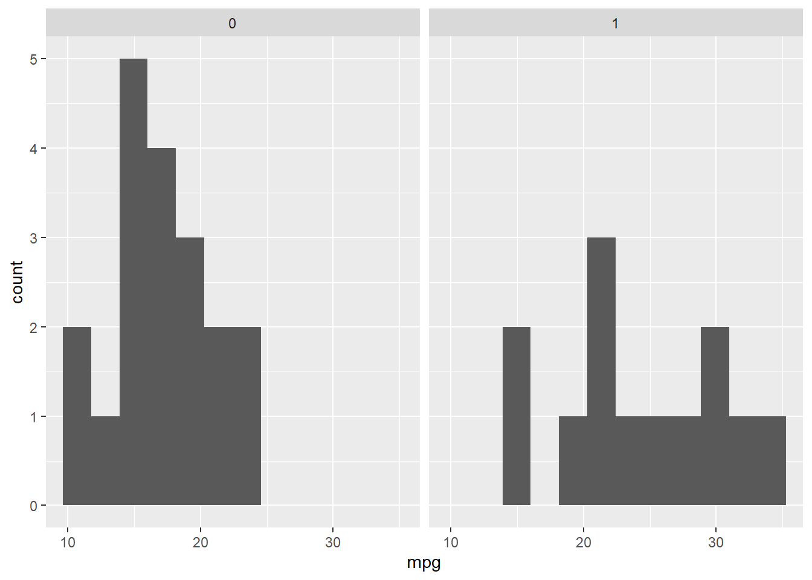

# (PART) Annexes {-}
# Solutions {-}

## Rudiments  {-}

### Question 1  {-}

1. Quel est le résultat de `mean <- c(1, 2, 3)`? Pourquoi?

Le résultat est $1, 2, 3$. Le fait d'assigner une valeur à une fonction (ou variable) écrase cette dernière.


```r
mean <- c(1, 2, 3)
mean
> [1] 1 2 3
```

Voir [Les variables] pour plus de renseignements.

### Question 2 {-}

2. Quelle est la différence entre `# Caractère` et `"Caractère"`?

Le premier est une commentaire (voir [Les commentaires]) alors que le second est une chaîne de caractère (voir [Les chaînes de caractère]).

### Question 3 {-}

3. Créer un vecteur contenant les valeurs $4, 10, 32$. Calculer la moyenne et l'écart type de ce vecteur.


```r
vecteur <- c(4, 10, 32)
mean(vecteur)
> [1] 15.3
sd(vecteur)
> [1] 14.7
```

Voir [Concaténer] pour créer un vecteur et [la moyenne] et [l'écart type] pour plus d'informations.

### Question 4 {-}

4. Créer un vecteur contenant les valeurs de $4$ à $11$. Sélectionner la deuxième valeur de ce vecteur, puis additionner 100 à cette valeur et remplacer la dans le vecteur.


```r
vecteur <- 4:11 # ou seq(4, 11)
vecteur[2] <- vecteur[2] + 100
```

Voir [Concaténer] pour créer un vecteur et [Référer à des sous-éléments] pour choisir un élément.

### Question 5 {-}

5. Générer 10 valeurs aléatoires distribuées normalement avec une moyenne de 50 et un écart type de 4. Calculer la moyenne, la médiane et la variance.


```r
# Pour la reproductibilité
set.seed(42)

# Créer
x <- rnorm(n = 10, mean = 50, sd = 4)

# La moyenne, la médiane et la variance
mean(x)
> [1] 52.2
median(x)
> [1] 51.5
var(x)
> [1] 11.2
```

Voir [Les graines] pour la fonction `set.seed()`, [Les distributions] pour la fonction `rnorm()` ainsi que son aide `?rnorm` pour les arguments spécifiques, et [la moyenne], [la médiane] et [la variance] pour plus d'informations.

### Question 6 {-}

6. Créer un jeu de données contenant quatre sujets avec, pour chacun, leur nom de famille, leur âge et un score d'appréciation tiré d'une distribution uniforme allant de 0 à 100.


```r
# Pour la reproductibilité
set.seed(1234)

# Créer
jd <- data.frame(nom = c("Eccleston", "Tennant", "Smith", "Capaldi"),
                 age = c(41, 35, 28, 55),
                 score = runif(n = 4, min = 0, max = 100))

# Imprimer le jeu dans la console
jd
>         nom age score
> 1 Eccleston  41  11.4
> 2   Tennant  35  62.2
> 3     Smith  28  60.9
> 4   Capaldi  55  62.3
```

Voir [Les graines] pour la fonction `set.seed()`, [Créer un jeu de données] pour `data.frame()` et [Concaténer] pour les vecteurs en arguments, [Les distributions] pour la fonction `runif()` ainsi que son aide `?runif` pour les arguments spécifiques. Les noms sont des [chaînes de caractère][Les chaînes de caractère].

### Question 7 {-}

7. Rédiger une fonction calculant l'hypoténuse d'un triangle rectangle. Rappel: le théorème de Pythagore est $c^2=a^2+b^2$.

En prenant `a` et `b` comme arguments.


```r
hypothenus <- function(a, b){
  sqrt(a^2 + b^2)
}
hypothenus(3, 4)
> [1] 5
```

Voir [Les fonctions] pour plus d'informations.

### Question 8 {-}

8. Rédiger une fonction calculant un score-$z$ pour une variable. Rappel: un score-$z$, correspond à $z=\frac{x-\mu}{\sigma}$.

Deux possibilités ici. Soit `x` est un vecteur contenant plusieurs nombres ou il est un nombre et il faut ajouter la moyenne ($\mu$) et l'écart type ($\sigma$).


```r
# Premier cas
score.z <- function(x) {
  (x-mean(x))/sd(x)
} 

# Deuxième cas
score.z <- function(x, mu, sigma) {
  (x-mu)/sigma
} 

score.z(130, mu = 100, sigma = 15)
> [1] 2
```

Le premier cas est l'équivalent de la fonction `scale()` qui rempliera la même tâche.

Voir [Les fonctions] pour plus d'informations. Les scores-$z$ sont abordés plus en profondeur à la section [Inférence avec la distribution normale sur une unité].

### Question 9 {-}

9. Rédiger une fonction calculant la médiane d'une variable (ne recopiez pas celle de ce livre).

Voici une autre fonction calculant une médiane d'un vecteur.


```r
mediane <- function(x){
  x <- sort(x)
  longueur <- length(x)
  if (longueur%%2) {
    # Si impair
    # Prendre la valeur centrale
    x[(longueur + 1)/2]
  } else {
    # Si pair
    # Faire la moyenne des deux éléments du centre
    mean(x[rep(longueur/2, 2) + 0:1])
  }
}
```
Encore une fois (il n'y a pas vraiment de façon de l'éviter), `%%2` permet de tester si pair (`FALSE`, car `0` si pair) ou impair (`TRUE`, car `1` si impair), puis de prendre la valeur à la position correspondante. Il y a plusieurs façons de tirer les éléments du vecteur.

Voir [Les fonctions], mais surtout [La médiane], pour plus d'informations. 

### Question 10 {-}

10. Rédiger une fonction qui pivote une liste de $k$ éléments par $n$. Par exemple, une liste de six ($k=6$ comme $[1,2,3,4,5,6]$) pivoté de deux ($n=2$) devient ($[3,4,5,6,1,2]$).

Plusieurs solutions possibles dont en voici une.


```r
pivot <- function(k, n){
  pivoter <- c((n+1):k, 1:n)
  pivoter
}
# Original
k <- 6
1:k
> [1] 1 2 3 4 5 6

# Pivoté
pivot(k = k, n = 2)
> [1] 3 4 5 6 1 2
```
### Question 11 {-}

11. Rédiger une fonction pour générer une séquence de Fibonacci (chaque nombre est la somme des deux précédents) jusqu'à une certaine valeur, soit $1, 1, 2, 3, 5, 8,...$.

Plusieurs solutions possibles dont en voici deux.


```r
fibonnaci1 <-  function(n){
  # n est le nombre d'éléments de la série demandée.
  # Création d'un vecteur de taille n ne contenant que des 1.
  serie <- rep(1, n)
  
  # Le premier test logique rapporte la (n = 1) ou 
  # les deux (n = 2) premières valeurs.
  if(n <= 2){
    serie <-  serie[1:n]
    
    # Le deuxième réalise les calculs pour les autres options.  
  }else{
    for(i in 3:n){
      serie[i] <-  serie[i-1] + serie[i-2]  
    }
  }
  serie
}
```

En voici une autre en utilisant la récursion (une fonction qui s’appelle elle-même).


```r
fibonnaci2 <- function(n){
  if(n <= 2){
    # Si n est plus petit que 2, alors retourne 1
    1
  } else {
    # Autrement, retourne les deux valeurs de Fibonncaci précédentes.
    fibonnaci2(n-1) + fibonnaci2 (n-2)
  }
}
```

Les voici comparées.


```r
n <- 8
fibonnaci1(n)
> [1]  1  1  2  3  5  8 13 21
fibonnaci2(n)
> [1] 21
```
## Jeux de données {-}

### Question 1 {-}

1. À l'aide de `data_edit()` du package `DataEditR`, créez un jeu données contenant trois participants ayant les caractéristiques suivantes, `nom = Alexandre, Samuel et Vincent` et `age = 20, 22 et 31`.


```r
# Installer et appeler le package DataEditR, si ce n'est fait
jd <- DataEditR::data_edit()
```

La Figure\ \@ref(fig:data_ed) montre le résultat dans le tableur.

<div class="figure" style="text-align: center">

<p class="caption">(\#fig:data_ed)Entrée des données</p>
</div>

### Question 2 {-}

2. Prendre le jeu de données `cars`, sélectionner la variable `dist` et transformer la en mètre, plutôt qu'en pieds. Rappel: un mètre égale 3.2808 pieds.

Avec le `tidyverse` de télécharger.


```r
cars %>%                               # Le jeu de données
  select(dist) %>%                     # Sélectionner
  mutate(dist_m = dist / 3.2808)  %>%  # Transformer
  head()                               # Montrer les 6 premières lignes
>   dist dist_m
> 1    2   0.61
> 2   10   3.05
> 3    4   1.22
> 4   22   6.71
> 5   16   4.88
> 6   10   3.05
```
La fonction `head()` permet d'afficher seulement les six premières lignes au lieu des 50 du jeu de données.


### Question 3 {-}

3. Dans le jeu de données `iris`, calculer la moyenne et l'écart type de la longueur de sépale (`Petal.Length`) en fonction de l'espèce (`species`). Représenter ensuite la moyenne à l'aide d'un diagramme à barre

Avec le `tidyverse` de télécharger.


```r
iris %>% 
  group_by(Species) %>% 
  summarise(M = mean(Petal.Length), ET = sd(Petal.Length))
> # A tibble: 3 × 3
>   Species        M    ET
>   <fct>      <dbl> <dbl>
> 1 setosa      1.46 0.174
> 2 versicolor  4.26 0.470
> 3 virginica   5.55 0.552
```
Voir [La moyenne], [L'écart type] et [Manipuler]. Il est aussi possible d'utiliser `psych::describeBy(iris, group = "Species")` (voir [Décrire]), mais cela offre plus que demandé.

Pour la figure, il faut prendre le résultat de la manipulation précédente et utiliser `ggplot2` avec la représentation géométrique `geom_col()` et la cartographie `mapping = aes(x = Species, y = M)`, ce qui donne l’espèce à l’abscisse et la moyenne (`M`) à l'ordonnée.


```r
iris %>% 
  group_by(Species) %>% 
  summarise(M = mean(Petal.Length), ET = sd(Petal.Length)) %>% 
  ggplot(mapping = aes(x = Species, y = M)) +
  geom_col()
```

<div class="figure" style="text-align: center">

<p class="caption">(\#fig:unnamed-chunk-16)M par Espèce (question 3)</p>
</div>

### Question 4 {-}

4. Prenez le jeu de données `mtcars` et produisez un diagramme de dispersion montrant la puissance brute (en chevaux) (`hp`) par rapport à consommation en km/l (basé sur `mpg`) tout en soulignant l'effet du nombre de cylindres (`cyl`). **Attention** la fonction `as_factor` permettra d'utiliser `cyl` en facteur et le rapprt mpg vers kml approximativement $.425$.


```r
mtcars %>% 
  mutate(kml = .425 * mpg,
         cyl = as_factor(cyl)) %>% 
  ggplot(mapping = aes(x = hp, y = kml, color = cyl)) + 
  geom_point()
```

<div class="figure" style="text-align: center">

<p class="caption">(\#fig:unnamed-chunk-17)Visualiation de kml par hp en fonction de cyl (question 4)</p>
</div>

### Question 5 {-}

5. Avec le même jeu de données et objectif que la question précédente, ajouter une droite de prédiction avec `geom_smooth()` selon un modèle linéare (`lm`) et sans erreur standard (`se`).


```r
mtcars %>% 
  mutate(kml = .425 * mpg,
         cyl = as_factor(cyl)) %>% 
  ggplot(mapping = aes(x = hp, y = kml, color = cyl)) + 
  geom_point() + 
  geom_smooth(method = "lm", se = FALSE)
> `geom_smooth()` using formula = 'y ~ x'
```

<div class="figure" style="text-align: center">

<p class="caption">(\#fig:unnamed-chunk-18)Visualiation de kml par hp en fonction de cyl (question 5)</p>
</div>

### Question 6 {-}

6. Avec le jeu de données `chickwts`, produire une boîte à moustache du poids des poulets en fonction de leur alimentation.


```r
chickwts %>% 
  ggplot(mapping = aes(x = feed, y = weight)) +
  geom_boxplot()
```

<div class="figure" style="text-align: center">

<p class="caption">(\#fig:unnamed-chunk-19)Visualiation de weight par feed (question 6)</p>
</div>


Dans cette question, l'utilisation du filtre `filter(feed %in% c("horsebean", "sunflower"))` pourra poser quelques difficultés, mais ne devrait arriver assez rarement en pratique.

### Question 7 {-}

7. Prenez le jeu de données `mtcars` et produisez un histogramme montrant la variabilité de la consommation `mpg` par rapport à la transmission (`am`). **Attention** la fonction `as_factor` permettra d'utiliser `am` en facteur.


```r
mtcars %>% 
  mutate(am = as_factor(am)) %>% 
  ggplot(mapping = aes(x = mpg, fill = am)) + 
  geom_histogram(bins = 12) # Pour éviter un avertissement
```

<div class="figure" style="text-align: center">

<p class="caption">(\#fig:unnamed-chunk-20)Histogramme de mpg par am (question 7-1)</p>
</div>
Noter que `bins = 12` ne sert qu'à éviter un avertissement.

Pour avoir les histogrammes dans des cadrans différents, la fonction `facet_wrap()` est utile. 


```r
mtcars %>% 
  mutate(am = as_factor(am)) %>% 
  ggplot(mapping = aes(x = mpg)) + 
  geom_histogram(bins = 12)+
  facet_wrap(~am)
```

<div class="figure" style="text-align: center">

<p class="caption">(\#fig:unnamed-chunk-21)Histogramme de mpg par am (question 7-2)</p>
</div>
### Question 8 {-}

8. Prendre le jeu de données `msleep` et produire un diagramme à barres pour observer la fréquence des régimes alimentaires.


```r
msleep %>% 
  ggplot(mapping = aes(x = vore)) + 
  geom_bar()
```

<div class="figure" style="text-align: center">

<p class="caption">(\#fig:unnamed-chunk-22)Diagramme à barre du régime alimentaire (question 8)</p>
</div>

### Question 9 {-}

9. Prendre le jeu de données `msleep` et produisez une boîte à moustache pour observer le temps total de sommeil (`sleep_total`) moyen par rapport aux régimes (`vore`). **Attention** aux données manquantes.


```r
msleep %>% 
  na.omit() %>% 
  ggplot(mapping = aes(x = vore, y= sleep_total)) + 
  geom_boxplot()
```

<div class="figure" style="text-align: center">

<p class="caption">(\#fig:unnamed-chunk-23)Diagramme à barre du régime alimentaire (question 8)</p>
</div>
### Question 10 {-}

10. Avec le jeu de données `chickwts`, produire un diagramme à barres du poids moyen des poulets par rapport à leur alimentation en ne conservant que les graines de tournesols et les fèveroles. 


```r
chickwts %>% 
  filter(feed %in% c("horsebean", "sunflower")) %>% 
  group_by(feed) %>% 
  summarise(poids = mean(weight)) %>% 
  ggplot(mapping = aes(x = feed, y = poids)) +
  geom_col()
```

<div class="figure" style="text-align: center">

<p class="caption">(\#fig:unnamed-chunk-24)Visualiation de weight par feed (question 10)</p>
</div>

## Statistiques {-}

TODO

<!-- Décrire -->
<!-- Inférer -->
<!-- Analyser -->
<!-- Simuler -->

<!-- 1. Créer une table de valeur-$t$ critique pour $dl = 1,2,3 ,... ,30$ et $\alpha=.05$ unilatérale. -->

<!-- 2. Comparer la puissance de la distribution-$t$ par rapport à une distribution normale centrée réduite. La différence par rapport à l'hypothèse nulle est 2 et l'écart type est 1, l'$\alpha = .05$ bilatérale. Tester pour différentes valeurs de $n$. -->


<!-- 1. Créer un jeu de données pour test-$t$ dépendant avec une corrélation de .3 entre les temps de mesure, des variances de 1, une différence de moyenne de 1 et une taille d'échantillon $n = 20$. Analyser ce jeu de données : vérifier la corrélation et la différence. -->

<!-- 2. Calculer la puissance d'une corrélation de $\rho = .30$ pour une taille d'échantillon $n=80$ et $alpha = .05$ bilatérale. -->

<!-- 3. Comparer l'erreur de type I du test-$t$ indépendant avec équivalence versus non-équivalence des variances pour une différence de moyennes de 1 et des variances de $.25$ pour le groupe 1 et $1$ pour le groupe 2 pour une taille d'échantillon de 30 séparé également entre les groupes. -->

<!-- # L'objectif de ce tp est de réaliser un bootstrap -->
<!-- # Pour cet exercice, vous utiliserez la base de données `cars` -->
<!-- #1. #### -->
<!-- # Calculer la corrélation entre `speed` et `dist` -->


<!-- #2. #### -->
<!-- # Calculer le coefficient de détermination (corrélation au carré) -->
<!-- # Enregister cette variable comme `R2` -->
<!-- # Faites attention de ne sortir que le coefficient et non toute la matrice! -->


<!-- #3. #### -->
<!-- # Créer une variable vide libellée `R2` avec `as.numeric()` -->


<!-- #4. #### -->
<!-- # Avec la fonction `dim()`, extrayer le nombre d'unités et -->
<!-- # enregister cette valeur dans une variable libellée `n`. -->
<!-- # Utiliser les crochets [] à la suite de la fonction pour -->
<!-- # indiquer la dimension -->


<!-- #5. #### -->
<!-- # Créer avec la fonction `sample()` un vecteur de nombre aléatoire -->
<!-- # de taille `n` avec remise et enregister ce résultats sous la variable -->
<!-- # `index` -->


<!-- #6. #### -->
<!-- # Avec `index`, sorter de `jd` les unités choisies avec toutes leurs colonnes. -->
<!-- # Vous aurez besoin des crochets [] -->
<!-- # Enregistrer ces valeurs dans une variable `D` -->


<!-- #7. #### -->
<!-- # Créer une variable libellée `reps` contenant le nombre d'itération (1000) -->


<!-- #8. #### -->
<!-- # Mettre le tout en commun -->
<!-- # Certaines étapes ont été faites précédemment, il reste à les mettre en commun -->
<!-- # Créer une variable libellée `reps` contenant le nombre d'itération (1000) -->
<!-- # Créer une variable libellée `n` contenant le nombre d'unité dans `jd` -->
<!-- # Créer une variable libellée `R2` vide avec `as.numeric()` -->
<!-- # Déclarer une boucle (for) où `i` prend les valeurs de 1 à `reps` -->
<!-- # Dans cette boucle, -->
<!-- ### Créer un vecteur de nombre aléatoire de taille `n` avec remise libellé `index` -->
<!-- ### Créer une variable libellée `D` contenant les unités de jd avec leur colonne choisies par index -->
<!-- ### Calculer le coefficient de détermination et enregister le dans la variable `R2` à la `i`e position -->
<!-- # Le bootstrap est terminé, vous pouvez rouler cette syntaxe -->


<!-- #9. #### -->
<!-- # Calculer la moyenne et l'écart type de la variable "bootstrapée" -->


<!-- #10. #### -->
<!-- # Réaliser un histogramme de la variable "bootstrapée" -->


<!-- #11. #### -->
<!-- # Avec la fonction `quantile(x = , probs = ), calculer les intervalles de confiance à 95% -->
<!-- # x correspond à la base de données et probs aux % désirés (dans un seul vecteur) -->


