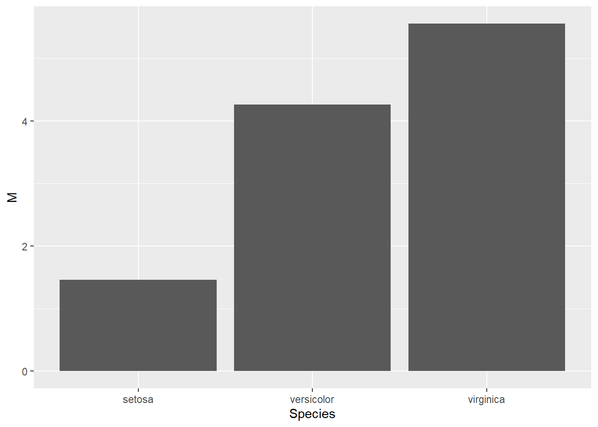

# (PART) Annexes {-}
# Solutions {-}

## Rudiments  {-}

### Question 1  {-}

1. Quel est le résultat de `mean <- c(1, 2, 3)`? Pourquoi?

Le résultat est $1, 2, 3$. Le fait d'assigner une valeur à une fonction (ou variable) écrase cette dernière.


```r
mean <- c(1, 2, 3)
mean
> [1] 1 2 3
```

Voir [Les variables] pour plus de renseignements.

### Question 2 {-}

2. Quelle est la différence entre `# Caractère` et `"Caractère"`?

Le premier est une commentaire (voir [Les commentaires]) alors que le second est une chaîne de caractère (voir [Les chaînes de caractère]).

### Question 3 {-}

3. Créer un vecteur contenant les valeurs $4, 10, 32$. Calculer la moyenne et l'écart type de ce vecteur.


```r
vecteur <- c(4, 10, 32)
mean(vecteur)
> [1] 15.3
sd(vecteur)
> [1] 14.7
```

Voir [Concaténer] pour créer un vecteur et [la moyenne] et [l'écart type] pour plus d'informations.

### Question 4 {-}

4. Créer un vecteur contenant les valeurs de $4$ à $11$. Sélectionner la deuxième valeur de ce vecteur, puis additionner 100 à cette valeur et remplacer la dans le vecteur.


```r
vecteur <- 4:11 # ou seq(4, 11)
vecteur[2] <- vecteur[2] + 100
```

Voir [Concaténer] pour créer un vecteur et [Référer à des sous-éléments] pour choisir un élément.

### Question 5 {-}

5. Générer 10 valeurs aléatoires distribuées normalement avec une moyenne de 50 et un écart type de 4. Calculer la moyenne, la médiane et la variance.


```r
# Pour la reproductibilité
set.seed(42)

# Créer
x <- rnorm(n = 10, mean = 50, sd = 4)

# La moyenne, la médiane et la variance
mean(x)
> [1] 52.2
median(x)
> [1] 51.5
var(x)
> [1] 11.2
```

Voir [Les graines] pour la fonction `set.seed()`, [Les distributions] pour la fonction `rnorm()` ainsi que son aide `?rnorm` pour les arguments spécifiques, et [la moyenne], [la médiane] et [la variance] pour plus d'informations.

### Question 6 {-}

6. Créer un jeu de données contenant quatre sujets avec, pour chacun, leur nom de famille, leur âge et un score d'appréciation tiré d'une distribution uniforme allant de 0 à 100.


```r
# Pour la reproductibilité
set.seed(1234)

# Créer
jd <- data.frame(nom = c("Eccleston", "Tennant", "Smith", "Capaldi"),
                 age = c(41, 35, 28, 55),
                 score = runif(n = 4, min = 0, max = 100))

# Imprimer le jeu dans la console
jd
>         nom age score
> 1 Eccleston  41  11.4
> 2   Tennant  35  62.2
> 3     Smith  28  60.9
> 4   Capaldi  55  62.3
```

Voir [Les graines] pour la fonction `set.seed()`, [Créer un jeu de données] pour `data.frame()` et [Concaténer] pour les vecteurs en arguments, [Les distributions] pour la fonction `runif()` ainsi que son aide `?runif` pour les arguments spécifiques. Les noms sont des [chaînes de caractère][Les chaînes de caractère].

### Question 7 {-}

7. Rédiger une fonction calculant l'hypoténuse d'un triangle rectangle. Rappel: le théorème de Pythagore est $c^2=a^2+b^2$.

En prenant `a` et `b` comme arguments.


```r
hypothenus <- function(a, b){
  sqrt(a^2 + b^2)
}
hypothenus(3, 4)
> [1] 5
```

Voir [Les fonctions] pour plus d'informations.

### Question 8 {-}

8. Rédiger une fonction calculant un score-$z$ pour une variable. Rappel: un score-$z$, correspond à $z=\frac{x-\mu}{\sigma}$.

Deux possibilités ici. Soit `x` est un vecteur contenant plusieurs nombres ou il est un nombre et il faut ajouter la moyenne ($\mu$) et l'écart type ($\sigma$).


```r
# Premier cas
score.z <- function(x) {
  (x-mean(x))/sd(x)
} 

# Deuxième cas
score.z <- function(x, mu, sigma) {
  (x-mu)/sigma
} 

score.z(130, mu = 100, sigma = 15)
> [1] 2
```

Le premier cas est l'équivalent de la fonction `scale()` qui rempliera la même tâche.

Voir [Les fonctions] pour plus d'informations. Les scores-$z$ sont abordés plus en profondeur à la section [Inférence avec la distribution normale sur une unité].

### Question 9 {-}

9. Rédiger une fonction calculant la médiane d'une variable (ne recopiez pas celle de ce livre).

Voici une autre fonction calculant une médiane d'un vecteur.


```r
mediane <- function(x){
  x <- sort(x)
  longueur <- length(x)
  if (longueur%%2) {
    # Si impair
    # Prendre la valeur centrale
    x[(longueur + 1)/2]
  } else {
    # Si pair
    # Faire la moyenne des deux éléments du centre
    mean(x[rep(longueur/2, 2) + 0:1])
  }
}
```
Encore une fois (il n'y a pas vraiment de façon de l'éviter), `%%2` permet de tester si pair (`FALSE`, car `0` si pair) ou impair (`TRUE`, car `1` si impair), puis de prendre la valeur à la position correspondante. Il y a plusieurs façons de tirer les éléments du vecteur.

Voir [Les fonctions], mais surtout [La médiane], pour plus d'informations. 

### Question 10 {-}

10. Rédiger une fonction qui pivote une liste de $k$ éléments par $n$. Par exemple, une liste de six ($k=6$ comme $[1,2,3,4,5,6]$) pivoté de deux ($n=2$) devient ($[3,4,5,6,1,2]$).

Plusieurs solutions possibles dont en voici une.


```r
pivot <- function(k, n){
  pivoter <- c((n+1):k, 1:n)
  pivoter
}
# Original
k <- 6
1:k
> [1] 1 2 3 4 5 6

# Pivoté
pivot(k = k, n = 2)
> [1] 3 4 5 6 1 2
```
### Question 11 {-}

11. Rédiger une fonction pour générer une séquence de Fibonacci (chaque nombre est la somme des deux précédents) jusqu'à une certaine valeur, soit $1, 1, 2, 3, 5, 8,...$. (Question difficile)

Plusieurs solutions possibles dont en voici deux.


```r
fibonnaci1 <-  function(n){
  # n est le nombre d'éléments de la série demandée.
  # Création d'un vecteur de taille n ne contenant que des 1.
  serie <- rep(1, n)
  
  # Le premier test logique rapporte la (n = 1) ou 
  # les deux (n = 2) premières valeurs.
  if(n <= 2){
    serie <-  serie[1:n]
    
    # Le deuxième réalise les calculs pour les autres options.  
  }else{
    for(i in 3:n){
      serie[i] <-  serie[i-1] + serie[i-2]  
    }
  }
  serie
}
```

En voici une autre en utilisant la récursion (une fonction qui s’appelle elle-même).


```r
fibonnaci2 <- function(n){
  if(n <= 2){
    # Si n est plus petit que 2, alors retourne 1
    1
  } else {
    # Autrement, retourne les deux valeurs de Fibonncaci précédentes.
    fibonnaci2(n-1) + fibonnaci2 (n-2)
  }
}
```

Les voici comparées.


```r
n <- 8
fibonnaci1(n)
> [1]  1  1  2  3  5  8 13 21
fibonnaci2(n)
> [1] 21
```
## Jeux de données {-}

### Question 1 {-}

1. À l'aide de `data_edit()` du package `DataEditR`, créez un jeu données contenant trois participants ayant les caractéristiques suivantes, `nom = Alexandre, Samuel et Vincent` et `age = 20, 22 et 31`.


```r
# Installer et appeler le package DataEditR, si ce n'est fait
jd <- DataEditR::data_edit()
```

La Figure\ \@ref(fig:data_ed) montre le résultat dans le tableur.

<div class="figure" style="text-align: center">

<p class="caption">(\#fig:data_ed)Entrée des données</p>
</div>

### Question 2 {-}

2. Prendre le jeu de données `cars`, sélectionner la variable `dist` et transformer la en mètre, plutôt qu'en pieds. Rappel: un mètre égale 3.2808 pieds.

Avec le `tidyverse` de télécharger.


```r
cars %>%                               # Le jeu de données
  select(dist) %>%                     # Sélectionner
  mutate(dist_m = dist / 3.2808)  %>%  # Transformer
  head()                               # Montrer les 6 premières lignes
>   dist dist_m
> 1    2   0.61
> 2   10   3.05
> 3    4   1.22
> 4   22   6.71
> 5   16   4.88
> 6   10   3.05
```
La fonction `head()` permet d'afficher seulement les six premières lignes au lieu des 50 du jeu de données.


### Question 3 {-}

3. Dans le jeu de données `iris`, calculer la moyenne et l'écart type de la longueur de sépale (`Petal.Length`) en fonction de l'espèce (`species`). Représenter ensuite la moyenne à l'aide d'un diagramme à barre

Avec le `tidyverse` de télécharger.


```r
iris %>% 
  group_by(Species) %>% 
  summarise(M = mean(Petal.Length), ET = sd(Petal.Length))
> # A tibble: 3 × 3
>   Species        M    ET
>   <fct>      <dbl> <dbl>
> 1 setosa      1.46 0.174
> 2 versicolor  4.26 0.470
> 3 virginica   5.55 0.552
```
Voir [La moyenne], [L'écart type] et [Manipuler]. Il est aussi possible d'utiliser `psych::describeBy(iris, group = "Species")` (voir [Décrire]), mais cela offre plus que demandé.

Pour la figure, il faut prendre le résultat de la manipulation précédente et utiliser `ggplot2` avec la représentation géométrique `geom_col()` et la cartographie `mapping = aes(x = Species, y = M)`, ce qui donne l’espèce à l’abscisse et la moyenne (`M`) à l'ordonnée.


```r
iris %>% 
  group_by(Species) %>% 
  summarise(M = mean(Petal.Length), ET = sd(Petal.Length)) %>% 
  ggplot(mapping = aes(x = Species, y = M)) +
  geom_col()
```

<div class="figure" style="text-align: center">

<p class="caption">(\#fig:unnamed-chunk-13)M par Espèce (question 3)</p>
</div>

### Question 4 {-}

4. Prenez le jeu de données `mtcars` et produisez un diagramme de dispersion montrant la puissance brute (en chevaux) (`hp`) par rapport à consommation en km/l (basé sur `mpg`) tout en soulignant l'effet du nombre de cylindres (`cyl`). **Attention** la fonction `as_factor` permettra d'utiliser `cyl` en facteur et le rapprt mpg vers kml approximativement $.425$.


```r
mtcars %>% 
  mutate(kml = .425 * mpg,
         cyl = as_factor(cyl)) %>% 
  ggplot(mapping = aes(x = hp, y = kml, color = cyl)) + 
  geom_point()
```

<div class="figure" style="text-align: center">

<p class="caption">(\#fig:unnamed-chunk-14)Visualiation de kml par hp en fonction de cyl (question 4)</p>
</div>

### Question 5 {-}

5. Avec le même jeu de données et objectif que la question précédente, ajouter une droite de prédiction avec `geom_smooth()` selon un modèle linéare (`lm`) et sans erreur standard (`se`).


```r
mtcars %>% 
  mutate(kml = .425 * mpg,
         cyl = as_factor(cyl)) %>% 
  ggplot(mapping = aes(x = hp, y = kml, color = cyl)) + 
  geom_point() + 
  geom_smooth(method = "lm", se = FALSE)
> `geom_smooth()` using formula = 'y ~ x'
```

<div class="figure" style="text-align: center">

<p class="caption">(\#fig:unnamed-chunk-15)Visualiation de kml par hp en fonction de cyl (question 5)</p>
</div>

### Question 6 {-}

6. Avec le jeu de données `chickwts`, produire une boîte à moustache du poids des poulets en fonction de leur alimentation.


```r
chickwts %>% 
  ggplot(mapping = aes(x = feed, y = weight)) +
  geom_boxplot()
```

<div class="figure" style="text-align: center">

<p class="caption">(\#fig:unnamed-chunk-16)Visualiation de weight par feed (question 6)</p>
</div>


Dans cette question, l'utilisation du filtre `filter(feed %in% c("horsebean", "sunflower"))` pourra poser quelques difficultés, mais ne devrait arriver assez rarement en pratique.

### Question 7 {-}

7. Prenez le jeu de données `mtcars` et produisez un histogramme montrant la variabilité de la consommation `mpg` par rapport à la transmission (`am`). **Attention** la fonction `as_factor` permettra d'utiliser `am` en facteur.


```r
mtcars %>% 
  mutate(am = as_factor(am)) %>% 
  ggplot(mapping = aes(x = mpg, fill = am)) + 
  geom_histogram(bins = 12) # Pour éviter un avertissement
```

<div class="figure" style="text-align: center">

<p class="caption">(\#fig:unnamed-chunk-17)Histogramme de mpg par am (question 7-1)</p>
</div>
Noter que `bins = 12` ne sert qu'à éviter un avertissement.

Pour avoir les histogrammes dans des cadrans différents, la fonction `facet_wrap()` est utile. 


```r
mtcars %>% 
  mutate(am = as_factor(am)) %>% 
  ggplot(mapping = aes(x = mpg)) + 
  geom_histogram(bins = 12)+
  facet_wrap(~am)
```

<div class="figure" style="text-align: center">

<p class="caption">(\#fig:unnamed-chunk-18)Histogramme de mpg par am (question 7-2)</p>
</div>
### Question 8 {-}

8. Prendre le jeu de données `msleep` et produire un diagramme à barres pour observer la fréquence des régimes alimentaires.


```r
# msleep fait parti du package `ggplot2`
msleep %>% 
  ggplot(mapping = aes(x = vore)) + 
  geom_bar()
```

<div class="figure" style="text-align: center">

<p class="caption">(\#fig:unnamed-chunk-19)Diagramme à barre du régime alimentaire (question 8)</p>
</div>

### Question 9 {-}

9. Prendre le jeu de données `msleep` et produisez une boîte à moustache pour observer le temps total de sommeil (`sleep_total`) moyen par rapport aux régimes (`vore`). **Attention** aux données manquantes.


```r
msleep %>% 
  na.omit() %>% 
  ggplot(mapping = aes(x = vore, y= sleep_total)) + 
  geom_boxplot()
```

<div class="figure" style="text-align: center">

<p class="caption">(\#fig:unnamed-chunk-20)Diagramme à barre du régime alimentaire (question 8)</p>
</div>
### Question 10 {-}

10. Avec le jeu de données `chickwts`, produire un diagramme à barres du poids moyen des poulets par rapport à leur alimentation en ne conservant que les graines de tournesols et les fèveroles. 


```r
chickwts %>% 
  filter(feed %in% c("horsebean", "sunflower")) %>% 
  group_by(feed) %>% 
  summarise(poids = mean(weight)) %>% 
  ggplot(mapping = aes(x = feed, y = poids)) +
  geom_col()
```

<div class="figure" style="text-align: center">

<p class="caption">(\#fig:unnamed-chunk-21)Visualiation de weight par feed (question 10)</p>
</div>

## Statistiques {-}

### Question 1 {-}

1. Avec le jeu de données `mtcars`, réaliser une analyse descriptive complète. Ne conservez que la moyenne, l'écart type, l'asymétrie et l'aplatissement.


```r
psych::describe(mtcars)[c("mean","sd","skew","kurtosis")]
>        mean     sd  skew kurtosis
> mpg   20.09   6.03  0.61    -0.37
> cyl    6.19   1.79 -0.17    -1.76
> disp 230.72 123.94  0.38    -1.21
> hp   146.69  68.56  0.73    -0.14
> drat   3.60   0.53  0.27    -0.71
> wt     3.22   0.98  0.42    -0.02
> qsec  17.85   1.79  0.37     0.34
> vs     0.44   0.50  0.24    -2.00
> am     0.41   0.50  0.36    -1.92
> gear   3.69   0.74  0.53    -1.07
> carb   2.81   1.62  1.05     1.26
```

Voir [Les variables à échelles continues] pour l'utilisation de `psych::describe()` et [Référer à des sous-éléments] pour l'extraction des colonnes `[c("mean","sd","skew","kurtosis")]`.

### Question 2 {-}

2. Avec le jeu de données `CO2`, faire une table de contingence entre `Treatment` et `Type`.


```r
table(CO2[c("Type","Treatment")])
>              Treatment
> Type          nonchilled chilled
>   Quebec              21      21
>   Mississippi         21      21
```

Voir [Les variables à échelles nominales] pour l'utilisation de `table()` et [Référer à des sous-éléments] pour l'extraction des colonnes `[c("Type","Treatment")]` du jeu de données.

### Question 3 {-}

3. Produire les valeurs-$t$ critiques pour $dl = 1,2,3 ,... ,30$ et $\alpha=.05$ unilatérale.


```r
alpha <- .05
qt(1 - alpha, df = 1:30) # ou qt(alpha, df = 1:30, lower.tail = FALSE) 
>  [1] 6.31 2.92 2.35 2.13 2.02 1.94 1.89 1.86 1.83 1.81 1.80
> [12] 1.78 1.77 1.76 1.75 1.75 1.74 1.73 1.73 1.72 1.72 1.72
> [23] 1.71 1.71 1.71 1.71 1.70 1.70 1.70 1.70
```

### Question 4 {-}

4. Comparer la puissance de la distribution-$t$ avec 20 degrés de liberté par rapport à une distribution normale centrée réduite avec une $\alpha = .05$ bilatérale. L'hypothèse alternative est distribuée normalement et fixée à une moyenne de 2 et l'écart type est de 1.


```r
# Fixer l'alpha
alpha <- .05

# Valeurs critiques pour t et z, bilatérale (alpha/2)
# Côté supérieur avec `lower.tail = FALSE`
crit.t <- qt(alpha/2, df = 20, lower.tail = FALSE)
crit.z <- qnorm(alpha/2, lower.tail = FALSE)

# Calculer la puissance pour les deux valeurs critiques
# Fixer la moyenne à 2
pnorm(c(crit.t, crit.z), mean = 2, lower.tail = FALSE)
> [1] 0.466 0.516
```

### Question 5 {-}

5. Calculer la puissance d'une corrélation de $\rho = .30$ avec 80 participants et un $alpha = .05$ bilatérale. Rappel : une corrélation peut se *standardiser* avec la tangente hyperbolique inverse, soit `atanh()`, et en multipliant par l'erreur type, $\sqrt{n-3}$^[Ce calcul est approximatif et non exact.]. (Question difficile)


```r
# Fixer les paramètres
r <- .30
alpha <- .05
n <- 80

# Standardiser la corrélation
r.std <- atanh(r) * (sqrt(n-3))

#trouver la valeur critique de rejet
r.crit <- qnorm(alpha/2, lower.tail = FALSE)

#Calculer la puissance
pnorm(r.crit, mean = r.std, lower.tail = FALSE)
> [1] 0.775
```

L'équation \@ref(eq:r2t) de la section sur [la corrélation] permet de transformer ,

### Question 6 {-}

6. Avec le jeu de données `ToothGrowth`, réaliser un test-$t$ afin de comparer les `supp` par rapport à la longueur des dents (`len`).


```r
t.test(len ~ supp, data = ToothGrowth)
> 
> 	Welch Two Sample t-test
> 
> data:  len by supp
> t = 2, df = 55, p-value = 0.06
> alternative hypothesis: true difference in means between group OJ and group VC is not equal to 0
> 95 percent confidence interval:
>  -0.171  7.571
> sample estimates:
> mean in group OJ mean in group VC 
>             20.7             17.0
```

### Question 7 {-}

7. Avec le jeu de données `sleep`, faire un test-$t$ permettant de comparer les deux temps de mesure nommés `group` par rapport à la variable dépendante `extra`. 


```r
t.test(extra ~ group, data = sleep, paired = TRUE)
> 
> 	Paired t-test
> 
> data:  extra by group
> t = -4, df = 9, p-value = 0.003
> alternative hypothesis: true mean difference is not equal to 0
> 95 percent confidence interval:
>  -2.46 -0.70
> sample estimates:
> mean difference 
>           -1.58
```

### Question 8 {-}
8. Réaliser une simulation. Calculer la probabilité de gagner au jeu du roche-papier-ciseau pour chacune des options. 

Plusieurs simulations sont possibles. Voici un exemple.


```r
# Énumérer les choix
choix <- c("roche", "papier", "ciseau")

# Créer la matrice de résultats possibles
Resultats <- matrix(c(.5, 0, 1,
                      1, .5, 0,
                      0, 1, .5), 
                    ncol = 3, nrow = 3,
                    byrow = TRUE,
                    dimnames = list(choix, choix))

# Initialiser les gains pour chaque choix
gain <- c(roche = 0, papier = 0, ciseau = 0)

# Paramètres de la u
set.seed(73)
nreps <- 10000

# La boucle

for(i in 1:nreps){
  # Les joueurs des joueurs
  joueur1 <- sample(choix, size = 1)
  joueur2 <- sample(choix, size = 1)
  
  # Enregistrer les gains
  gain[joueur1] <- gain[joueur1] + Resultats[joueur1, joueur2]
  gain[joueur2] <- gain[joueur2] + Resultats[joueur2, joueur1]
}
# Probabilités (en pourcentage)
gain / nreps
>  roche papier ciseau 
>  0.331  0.330  0.340
```


### Question 9 {-}

9. Réaliser une simulation. Trouver la valeur critique (`c.vrit`) pour un $alpha = .025$ unilatérale d'une distribution normale centrée sur $0$ et un écart type de $1/\sqrt{n}$. Le scénario : tirer aléatoirement un échantillon de $n=30$ participants à partir d'une distribution normale de moyenne $.5$ et un écart type de 1. Calculer la moyenne de cet échantillon. Pour chaque scénario, additionner chaque occasion où cette moyenne est plus élevée que la valeur critique. Répéter ce scénario 1000 fois. Calculer la probabilité (en pourcentage) d'occurrence selon laquelle la moyenne de l'échantillon est plus élevée que la valeur critique.


```r
# Fixer les paramètres
alpha <- .025
n <- 30
mu1 <- .5
v.crit <- qnorm(1 - alpha, sd = 1/sqrt(n)) # ou qnorm(alpha, lower.tail = FALSE)

# Initialiser
set.seed(101)
nreps <- 1000
somme <- 0

# La boucle
for(i in 1:nreps){
  # Créer un échantillon
  echant <- rnorm(n = n, mean = mu1)
  
  #Calculer la moyenne
  moyenne <- mean(echant)
  # Enregister si la moyenne est plus élevée que la valeur critique
  somme <- somme + (moyenne >= v.crit)
}

# Probabilités (en pourcentage)
somme/nreps
> [1] 0.792
```
Avec les renseignements précédents, calculer la puissance.


```r
pnorm(v.crit, mean = mu1, sd = 1/sqrt(n), lower.tail = FALSE)
> [1] 0.782
```

### Question 10 {-}
10. Réaliser un bootstrap la corrélation entre `sleep_total` (temps de sommeil total) et `bodywt` (poids du corps) dans le jeu de données `msleep` (du package `ggplot2`). Produire la moyenne et l'écart type des échantillons *bootstrapées* ainsi que l'intervalle de confiance à 95%.


```r
# Initialiser 
set.seed(2018)
nreps <- 1000
N <- nrow(msleep)
alpha <-  1-.95
correl <- numeric()

# La boucle
for(i in 1:nreps){
  idx <- sample(N, replace = TRUE)
  D <- msleep[idx, ]
  correl[i] <- cor(D$sleep_total, D$bodywt)
}

# Les statistiques
mean(correl)
> [1] -0.364
sd(correl)
> [1] 0.0694
quantile(correl, probs = c(alpha/2, 1-alpha/2))
>   2.5%  97.5% 
> -0.528 -0.255
```

## Modèles linéaires {-}
<!-- ### Question 1 {-} -->
<!-- faire une anova -->
<!-- ### Question 2 {-} -->
<!-- faire une régression -->
<!-- ### Question 3 {-} -->
<!-- créer un modèle -->
<!-- ### Question 4 {-} -->
<!-- créer un modèle -->
<!-- ### Question 5 {-} -->
<!-- créer un modèle -->
<!-- ### Question 6 {-} -->
<!-- mediaiton -->
<!-- ### Question 7 {-} -->
<!-- moderation -->
