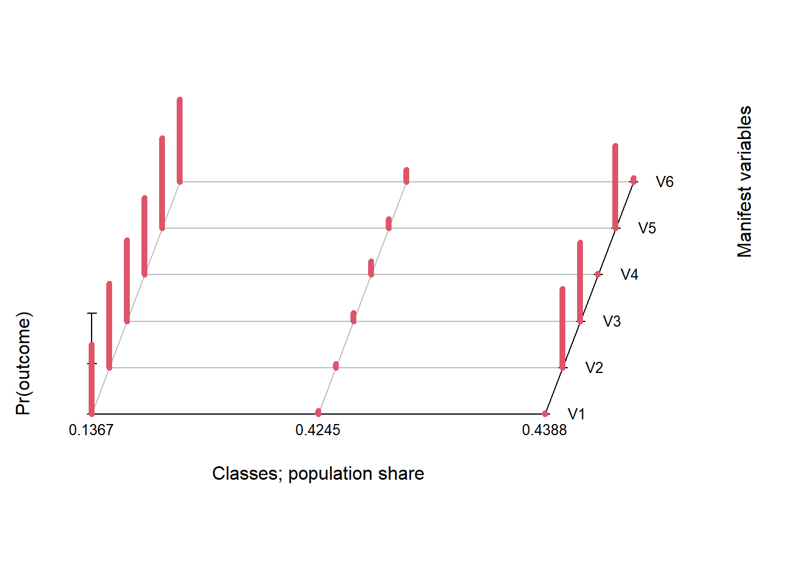
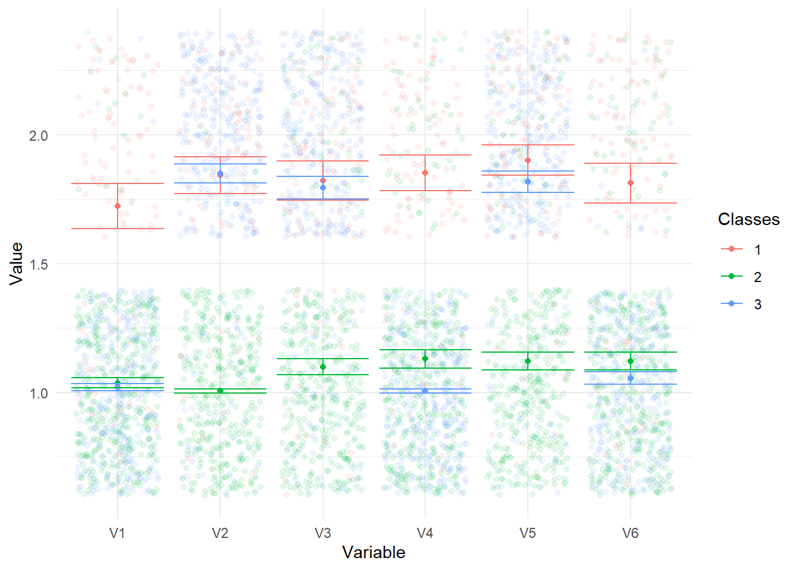
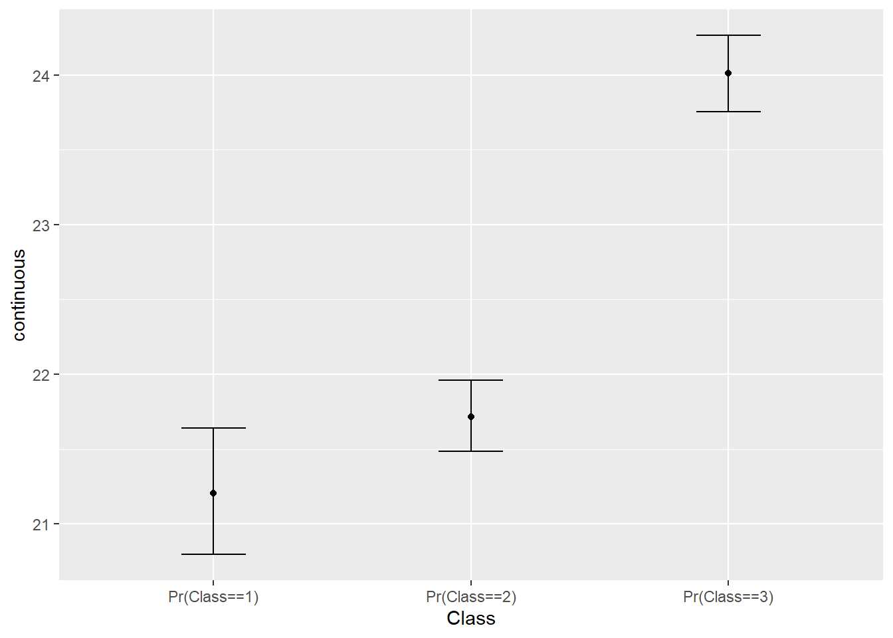
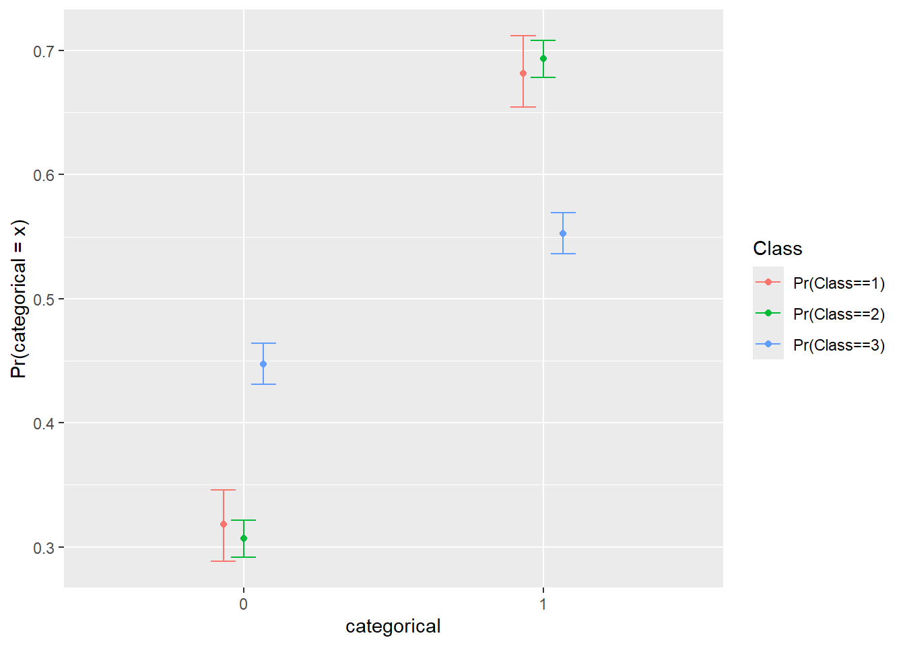
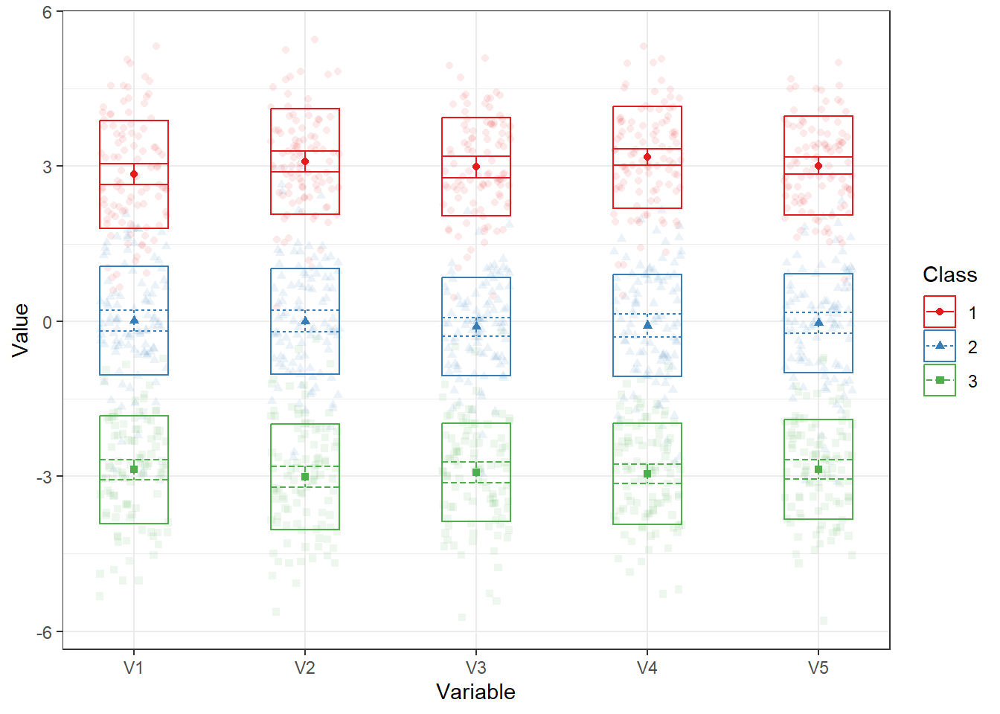

# Classer


## Classes latentes

L'analyse de classes latentes (ACL) permet de partager et de distinguer des sous-groupes non observables (latents) d'individus sur la base de leurs réponses à un ensemble d'indicateurs observables (manifestes) ordinales. 

La famille des *finite mixture modelling*.

exploratoire

L'objectif d'une analyse de structure latente est d'interpréter les relations entre différentes variables observables, en considérant celles-ci comme divers indicateurs d'un même concept, une variable latente 

Elle se distingue d'[analyse factorielle][analyse factorielle exploratoire] qui tente plutôt de regrouper les indicateurs en facteurs (ou groupe), alors que l'ACL tente plutôt de regrouper les participants en groupe.

LCA est plus robuste que d’autres méthodes de clustering

Intensif computationnellement

Estimation Bayesian ou par maximum likelihood

Le modèle sous-jacent présenté à la Figure\ \@ref(fig:cla1).

<div class="figure" style="text-align: center">

<p class="caption">(\#fig:cla1)Modèle de classes latentes</p>
</div>


### Installations

Il existe un package permettant de réaliser l'ACL avec **R**.

Ce package bien qu'excellent pour réaliser l'ACL demeure relativement incomplet et mérite quelques amélioration, ce pourquoi le package `poLCAExtra` est recommandé. Installer `poLCAExtra` installera du même coup le package `poLCA`.


```r
# Version en développement sur GitHub
remotes::install_github(repo = "quantmeth/poLCAExtra")
```

Comme toujours, il faut appeler le package.


```r
library(poLCAExtra)
```

### Déterminer le nombre de classes


```r
jd <- ex1.poLCA
f1 <- cbind(V1, V2, V3, V4, V5, V6) ~ 1
```


```r
LCA1 <- poLCA(f1, data = jd, nclass = 1, verbose = FALSE) 
LCA2 <- poLCA(f1, data = jd, nclass = 2, verbose = FALSE)
LCA3 <- poLCA(f1, data = jd, nclass = 3, verbose = FALSE)
LCA4 <- poLCA(f1, data = jd, nclass = 4, maxiter = 500, nrep = 4, verbose = FALSE)
```


Expliquer `maxiter` et `nrep`

Les comparer


```r
anova(LCA1, LCA2, LCA3, LCA4)
>   nclass df llike  AIC  BIC  Classes.size Entropy
> 1      1 57 -2688 5388 5416           800    3.36
> 2      2 50 -2365 4757 4817       373|427    2.96
> 3      3 43 -2196 4432 4525   101|345|354    2.75
> 4      4 36 -2190 4435 4561 49|73|324|354    2.74
>   Relative.Entropy     LMR      p
> 1                                
> 2            0.803 614.576 < .001
> 3            0.840 322.830 < .001
> 4            0.871  10.574  0.158
```

ou plus simplement (à l'aide de `poLCAExtra`)


```r
LCAE <- poLCA(f1, data = jd, nclass = 1:4, maxiter = 500, nrep = 4)
```


### Inspections


```r
poLCA.tech10(LCA3)
> 
> The 20 most frequent patterns
> 
>    pattern observed expected      z   chi llik.contribution
> 1   111111      200   201.26 -0.089 0.008            -2.504
> 23  122121      166   165.34  0.051 0.003             1.325
> 10  112121       48    47.67  0.048 0.002             0.662
> 17  121121       42    46.13 -0.608 0.369            -7.875
> 22  122111       39    37.76  0.202 0.041             2.520
> 3   111121       38    32.91  0.887 0.787            10.930
> 5   111211       32    30.69  0.236 0.056             2.669
> 50  222222       29    28.14  0.163 0.027             1.754
> 2   111112       25    27.20 -0.422 0.178            -4.219
> 8   112111       23    28.33 -1.001 1.001            -9.581
> 15  121111       22    18.61  0.787 0.619             7.373
> 26  122222       11    12.68 -0.473 0.224            -3.134
> 24  122122       10    10.90 -0.273 0.074            -1.724
> 27  211111       10     7.97  0.717 0.514             4.525
> 46  222122        9     8.92  0.026 0.001             0.159
> 25  122221        8     5.43  1.103 1.218             6.203
> 9   112112        7     2.99  2.320 5.382            11.914
> 42  221222        7     6.79  0.082 0.007             0.433
> 6   111212        6     4.25  0.848 0.720             4.135
> 14  112222        6     2.55  2.157 4.654            10.254
>        p check
> 1  0.465      
> 23 0.480      
> 10 0.481      
> 17 0.272      
> 22 0.420      
> 3  0.187      
> 5  0.407      
> 50 0.435      
> 2  0.337      
> 8  0.158      
> 15 0.216      
> 26 0.318      
> 24 0.393      
> 27 0.237      
> 46 0.489      
> 25 0.135      
> 9  0.010     *
> 42 0.467      
> 6  0.198      
> 14 0.015     *
> 
> Number of empty cells:  14
```


### Représentations graphiques


```r
plot(LCA3)
```

<div class="figure" style="text-align: center">

<p class="caption">(\#fig:lcaplot)Analyse visuelle des classes</p>
</div>


```r
#library(tidyverse)
#jdtest <- LCAE$LCA[[3]]$y
jdtest <- LCA3$y
v <- (colnames(jdtest))
jdtest$Classes <- as.factor(predict(LCA3)$Pred)

jdtest <- jdtest %>% 
  gather(key = "Variable", value = "Value", -Classes) 


jds <- jdtest %>% 
  group_by(Classes, Variable) %>% 
  summarise(y = mean(Value), 
            se = sd(Value)/sqrt(n()), 
            ymin = y - 1.96*se, 
            ymax = y + 1.96*se,
            Value = y)
> `summarise()` has grouped output by 'Classes'. You can
> override using the `.groups` argument.


jdtest %>%  
  ggplot(aes(x = Variable, y = Value, fill = Classes, group = Classes, color = Classes)) + 
  geom_jitter(alpha = .1) +
  geom_point(jds, mapping = aes(x = Variable, y = y)) + 
  geom_errorbar(jds, mapping = aes(ymin = ymin, ymax = ymax), alpha = 1) + theme_minimal()
```

<div class="figure" style="text-align: center">

<p class="caption">(\#fig:testjitter)Analyse visuelle supplémentaire des classes</p>
</div>


### Analyses supplémentaires


```r
res.r3 <- r3step("continuous", LCA3)
```


```r
plot(res.r3)
```

<div class="figure" style="text-align: center">

<p class="caption">(\#fig:r3step)r3step des classes</p>
</div>


```r
res.d3 <- d3step("categorical", LCA3)
```


```r
plot(res.d3)
```

<div class="figure" style="text-align: center">

<p class="caption">(\#fig:d3step)r3step des classes</p>
</div>


### Quelques fonctions utiles

Une fois l'analyse terminée, rouler une dernière fois avec une [graine][les graines] et les arguments `nrep` et `maxiter`.

## Profils latents

Les packages suivants sont nécessaires


```r
# install.packages('dplyr')
# install.packages('tidyLPA')
library(dplyr)
library(tidyLPA)
```


Effectuer l'analyse de profils latents. Pour ce faire, il faut sélectionner les variables pour l'analyse avec la fonction *select*. Dans la fonction *estimate_profiles*, spécifier combien de profils investigués. 


```r
jd <- ex3.tidyLPA

jd %>%
  select(V1, V2, V3, V4, V5) %>%
  estimate_profiles(1:5) 
> tidyLPA analysis using mclust: 
> 
>  Model Classes AIC     BIC     Entropy prob_min prob_max
>  1     1       7170.48 7207.52 1.00    1.00     1.00    
>  1     2       5949.93 6009.19 0.96    0.98     0.99    
>  1     3       4934.20 5015.68 1.00    1.00     1.00    
>  1     4       4936.30 5040.00 0.91    0.62     1.00    
>  1     5       4947.38 5073.31 0.82    0.39     1.00    
>  n_min n_max BLRT_p
>  1.00  1.00        
>  0.35  0.65  0.01  
>  0.33  0.33  0.01  
>  0.08  0.33  0.26  
>  0.06  0.33  0.96
```

Il est possible de générer des graphiques pour comparer certains indices d'ajustement, notamment l'AIC, le BIC et l'entropie à l'aide de la fonction *plot*. 

```r
lpa1_5 <- jd %>%
  select(V1, V2, V3, V4, V5) %>%
  estimate_profiles(1:5) 


plot(lpa1_5, statistics = 'AIC')
plot(lpa1_5, statistics = 'BIC')
plot(lpa1_5, statistics = 'Entropy')
```

Pour déterminer le nombre de participants (*n*) dans chaque profil, procéder ainsi. 


```r
LPA3 <- jd %>%
  select(V1, V2, V3, V4, V5) %>%
  estimate_profiles(3)
```


```r
get_data(LPA3) %>% 
  group_by(Class) %>% 
  count()
> # A tibble: 3 × 2
> # Groups:   Class [3]
>   Class     n
>   <dbl> <int>
> 1     1   100
> 2     2   100
> 3     3   100
```

Finalement, générer la représentation graphique du modèle choisi (et des autres modèles si besoin) à l'aide de la fonction *plot_profiles*.


```r
LPA3 %>%
  plot_profiles()
```

<div class="figure" style="text-align: center">

<p class="caption">(\#fig:lpaplot)Analyse visuelle des profils</p>
</div>

Différents type de modèles possibles


```r
LPAmodel <- data.frame(Model = 1:6,
                       Variance = c("equal","varying"),
                       Covariance = rep(c("zero","equal","varying"), 
                                        each = 2))


#LPAmodel


kbl(LPAmodel, align = "c", booktabs=TRUE, caption = "Différents type de modèles possibles") %>%
  kable_classic(full_width = FALSE)  %>%
  kable_styling(position = "center", latex_options = "HOLD_position")
```

<table class=" lightable-classic table" style='font-family: "Arial Narrow", "Source Sans Pro", sans-serif; width: auto !important; margin-left: auto; margin-right: auto; margin-left: auto; margin-right: auto;'>
<caption>(\#tab:unnamed-chunk-6)Différents type de modèles possibles</caption>
 <thead>
  <tr>
   <th style="text-align:center;"> Model </th>
   <th style="text-align:center;"> Variance </th>
   <th style="text-align:center;"> Covariance </th>
  </tr>
 </thead>
<tbody>
  <tr>
   <td style="text-align:center;"> 1 </td>
   <td style="text-align:center;"> equal </td>
   <td style="text-align:center;"> zero </td>
  </tr>
  <tr>
   <td style="text-align:center;"> 2 </td>
   <td style="text-align:center;"> varying </td>
   <td style="text-align:center;"> zero </td>
  </tr>
  <tr>
   <td style="text-align:center;"> 3 </td>
   <td style="text-align:center;"> equal </td>
   <td style="text-align:center;"> equal </td>
  </tr>
  <tr>
   <td style="text-align:center;"> 4 </td>
   <td style="text-align:center;"> varying </td>
   <td style="text-align:center;"> equal </td>
  </tr>
  <tr>
   <td style="text-align:center;"> 5 </td>
   <td style="text-align:center;"> equal </td>
   <td style="text-align:center;"> varying </td>
  </tr>
  <tr>
   <td style="text-align:center;"> 6 </td>
   <td style="text-align:center;"> varying </td>
   <td style="text-align:center;"> varying </td>
  </tr>
</tbody>
</table>


