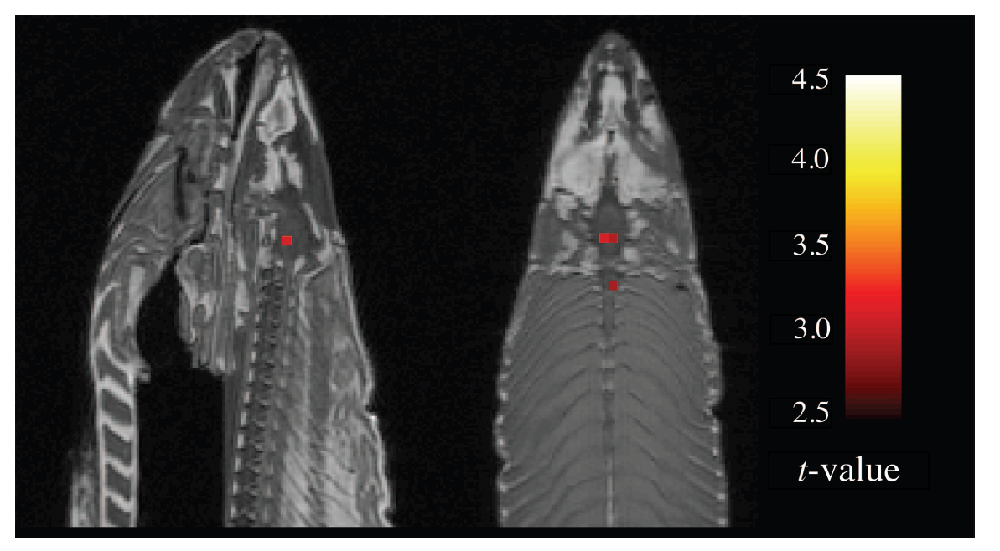

--- 
title: "Méthodes quantitatives avec R"
author: "P.-O. Caron"
date: "2023-04-20"
site: bookdown::bookdown_site
documentclass: book
bibliography: "ma.bib"
url: mqr.teluq.ca
# cover-image: path to the social sharing image like images/cover.jpg
description: |
 Bienvenue dans la version préliminaire et en ligne du livre *Méthodes quantitatives avec ****R*** de [P.-O. Caron](https://www.teluq.ca/siteweb/univ/pcaron.html). Le livre démystifie les mécanismes ésotériques derrière les logiciels statistiques et démocratise la programmation statistique avec R. 
biblio-style: "apa"
link-citations: true
csl: apa.csl
---

# Bienvenue! {-}

Bienvenue dans la version préliminaire et en ligne du livre *Méthodes quantitatives avec ****R*** de [P.-O. Caron](https://www.teluq.ca/siteweb/univ/pcaron.html). Le livre porte sur la programmation statistique en **R** et vise à démystifier les mécanismes ésotériques derrière les logiciels statistiques afin de les rendre plus accessibles. Son objectif est de faire le pont entre la statistique et la programmation afin que les lecteurs comprennent mieux et autonomisent leur pratique. L'approche permet à la fois une meilleure compréhension des statistiques à l'aide du logiciel, mais constitue également un motif pour débuter la programmation.

Il vise un public autant intéressé à s'initier à **R** qu'à en connaître davantage sur la statistique, mais surtout un lecteur qui souhaite maîtriser les deux à la fois.

Si vous avez des commentaires ou des suggestions, n'hésitez pas à me les partager. C'est ouvrage est en construction. Il est imparfait et contient malheureusement des erreurs. Vous pouvez m'écrire à l'adresse suivante : pier-olivier.caron[at]teluq.ca pour toutes suggestions d'amélioration. 

## Remerciements {-}

Les étudiants et étudiantes qui ont suivi des cours avec ce manuel et plus spécialement Catherine Meek-Bouchard pour ces commentaires.

# Préface {-}

La méthode scientifique impose aux expérimentateurs de tirer des conclusions avec minutie sur leur objet d'étude. Toutefois, ils font confiance à d'autres pour des tâches qui dépassent leur propre champs de compétence, et ce, avec raisons, car celles-ci peuvent être fort compliquées et nécessitées des formations académiques complémentaires. Les statistiques font parties de ces expertises extérieures en sciences humaines et sociales. Pour ne pas faillir de son esprit critique, ne serait-ce qu'un instant, il est nécessaire de comprendre les fondements et l'implantation logiciel. Trop souvent, les expérimentateurs n'ont qu'une brève introduction aux statistiques et font confiance à des logiciels commerciaux pour les calculs sophistiqués. Le tout se déroule sans tracas apparent. Toutefois, une expérience plus soutenue avec ces logiciels révéle qu'ils ont eux-aussi leurs lots de défauts, de bogues et d'erreurs de calcul. Ces erreurs se produisent parfois à l'insu de l'utilisateur. Sans connaître le résultat attendu, comment distinguer le vrai du faux des sorties statistiques?

Il faut être naïf pour croire que le code fonctionne tel que prévu.

Par exemple, que vaut l'expression $-9^{(.5)}$? Reconnaître qu'il s'agit de $\sqrt{-9}$ indique immédiatement que le résultat n'est pas réel (c'est un nombre complexe). Si ce calcul est demandé à **R**,


```r
-9^(.5)
> [1] -3
```
celui-ci retourne la réponse $-3$ à cause de la priorité des opérations, $-(9)^{.5}$. Était-ce la réponse désirée? 

Des idiosyncrasies computationnelles se retrouvent dans tous les logiciels. En pratique, le programmeur doit en avoir conscience et ce type de problème devrait rester trivial...
 
@Bennett10 montrent que les saumons de l’Atlantique décédés ont des cognitions sociales. Ils placent sous imagerie par résonance magnétique fonctionnelle (IRMf) le saumon pendant une tâche de reconnaissance des émotions chez les humains. La Figure \@ref(fig:saumon) montre le résultat de leur analyse. Soit ils sont tombés sur une découverte étonnante en termes de cognition ichtyologique post-mortem, soit quelque chose cloche en ce qui concerne l'approche statistique utilisée.

<div class="figure" style="text-align: center">

<p class="caption">(\#fig:saumon)Cognitions sociales d'un saumon atlantique décédé. Tirés de Bennett et al. 2010, p.4</p>
</div>

Les points rouges de la Figure \@ref(fig:saumon) indiquent les cognitions sociales du saumon. Plus sérieusement, ces chercheurs critiquent l'absence de contrôle de l'erreur de type I (faux positif) lors de comparaisons multiples. Ce problème est d'autant plus important avec des humains sous IRMf, car ces situations comportent beaucoup de bruits statistiques, contrairement au saumon décédé qui n'en produit pas du tout. Les auteurs montrent bien qu'en absence de ce contrôle, l'analyse peut fournir des résultats farfelus. Il revient à l'expérimentateur de bien utiliser les analyses statistiques et de savoir ce que le logiciel fait et ne fait pas.

L'étude de @Bennett10 n'est qu'un canular. Les auteurs ont remporté le prix Ig Nobel en 2012, un prix scientifique pour de vrais chercheurs ayant réalisé une vraie étude *faisant d'abord rire, puis réfléchir*. En pratique, ce type de problème devrait rester trivial...

@Eklund16 tentent de valider les méthodes statistiques derrière l'IRMf à l'aide de données réelles. Ils utilisent des données d'IRMf provenant de 499 personnes saines et en état de repos pour effectuer 3 millions d'analyses de groupes de tâches. En utilisant ces données nulles avec différents plans expérimentaux, ils estiment l'incidence des résultats significatifs (en théorie fixé à 5% de faux positifs pour un seuil de signification de 5%). Toutefois, ils constatent que les progiciels les plus courants pour l'analyse de l'IRMf entraînent des taux de faux positifs allant jusqu'à 70%. Ces résultats remettent en question la validité d'un certain nombre d'études utilisant l'IRMf et ont des conséquences importantes sur l'interprétation des résultats de neuro-imagerie.

Cette étude a fait un tollé dans la littérature scientifique. Bien que certains aspects de l'étude soient attaquables, il n'en demeure pas moins qu'elle met en lumière le danger de faire confiance aveuglément aux analyses statistiques.

L'objectif de ce court texte n'est pas de discrédité les analyses statistiques ou les chercheurs qui les emploient. Ce n'est pas non plus de concrétiser l'adage : *faire dire n'importe quoi à une statistique* (c'est plus facile de faire dire n'importe quoi à des mots, par ailleurs). Les statistiques sont très utiles et fournissent de l'information qu'il est impossible d'obtenir autrement. Il s'agit d'une mise en garde justifiant en partie l'approche pédagogique de ce livre.

Il est dit en partie, car le seconde, en filigrane de ce livre, repose sur la double approche d'apprentissage statistique et programmation. Il s'agit de la symbiose entre les deux. D'une part, rendre accessible et efficace des calculs parfois laborieux et ennuyants et, d'autre part, de fournir un objectif de programmation afin de susciter l'intérêt et l'engagement. En programmant des modèles statistiques, le lecteur a une plus grande emprise sur ceux-ci. Il peut mieux les utiliser, les étudier et les modifier. Il peut s'en servir pour connaître et apprendre davantage. Certaines boîtes noires resteront irrémédiablement des boîtes noires pour le lecteur, mais plus elles seront démystifiées, mieux il comprendra ce qui se cache derrière les algorithmes statistiques.

La première section de ce livre explique et justifie le logiciel **R**, montre comment l'installer ainsi que quelques rudiments statistiques qui seront fort utiles pour le reste de la lecteur. 

La seconde section couvre ce qui sera probablement le plus important pour l'utilisateur : , l'[entrer], l'importation ([Importer]), la gestion ([Manipuler]) et la visualisation ([Visualiser]) des données.

La troisième section commence par les analyses statistiques descriptives ([Décrire]), mais porte principalement sur l'inférence statistique avec les tests d'hypothèses ([Inférer]) pour par la suite développer les analyses de base ([Analyser]), comme le test $t$, l'ANOVA, la corrélation, et le test du $\chi^2$ carré. En parallèle, les méthodes pour créer des jeux de données propres aux analyses sont illustrées. La section se termine sur des exemples d'utilisation de R ([Simuler]) à des fins plus empiriques, soit développer une simulation Monte-Carlo, mais surtout, les techniques de rééchantillonnage (le *bootstrap*).

La quatrième section présente le modèle linéaire général, comme la régression ([Prédire]), la médiation ([Médier]) et la modération ([Modérer]). Comme auparavant, l'accent est mis sur la création de données correspondant à ces modèles, particulièrement au chapitre [Créer] qui montre en détails la création de modèle linéaire récursif.

La cinquième section montre les analyses factorielles, soit l'analyse en composantes principales ([Décomposer]), l'analyse factorielle exploratoire ([Explorer]). Un chapitre est dédier au sujet d'identifier le nombre de facteurs à retenir dans les analyses exploratoires ([Réduire]).


